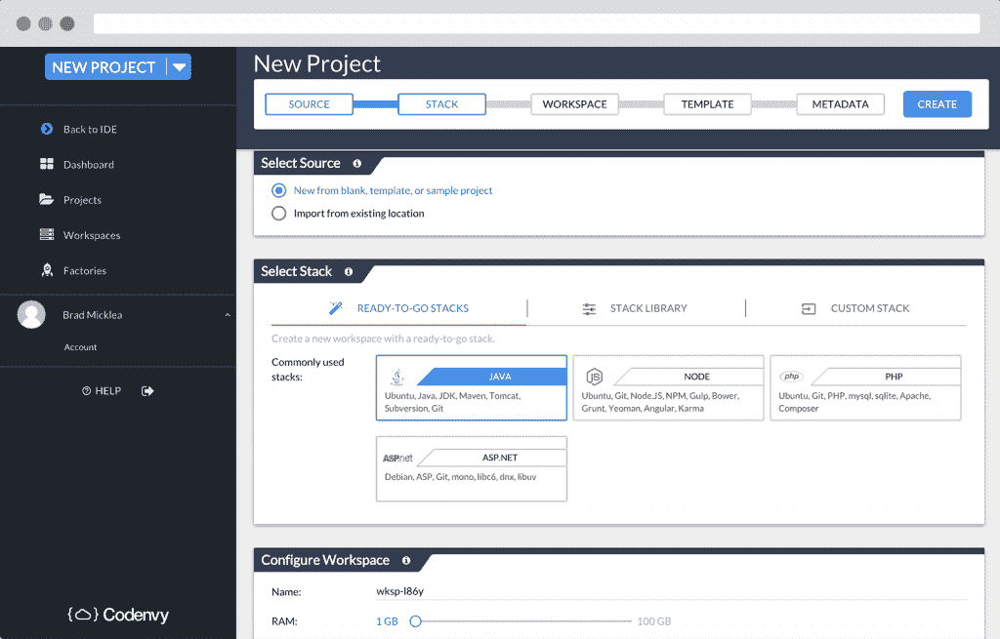
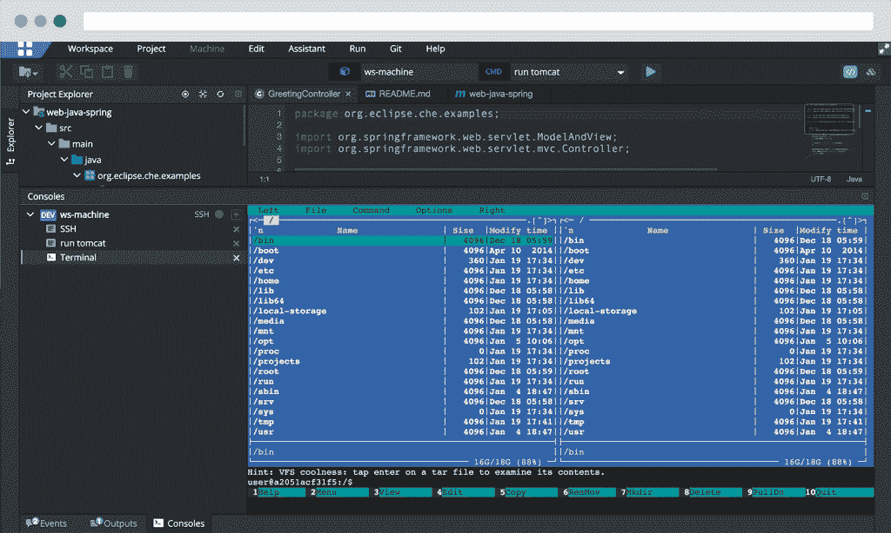

# Eclipse Che:带有内置运行时的可移植共享开发工作区

> 原文：<https://thenewstack.io/eclipse-che-provides-portable-shared-development-workspaces-built-runtimes/>

Eclipse Foundation 已经从其下一代 IDE 中脱颖而出，称为 [Eclipse Che](http://eclipse.org/che) ，该软件承诺为协作项目提供按需开发人员工作区。Che [通过容器结合了](http://www.screencast.com/users/codenvy-brad/folders/Default/media/3b77d397-0363-4963-9107-b1275111f571)云 IDE、工作区服务器、插件支持和可移植的运行时环境。

[Codenvy](https://codenvy.com/) 开发了该软件，它得到了一系列贡献者的支持，包括 IBM、微软、Red Hat 和 SAP，以及其他外部贡献者。

Eclipse 基金会的执行董事 Mike Milinkovich 在一份声明中说:“对 Eclipse Che 的初步反馈非常好。“下载和外部贡献的数量都表明 Che 是一个非常成功的开源项目，它带来了新一代的云 ide。”

通过使工作区可移植，Che 允许开发人员从任何地方进行更改。Che 处理完整的工作空间生命周期，编排项目状态，启动、暂停、映像、停止和销毁工作空间运行时环境。

“我们允许开发人员在代码融入主流之前进行协作，”Eclipse Che 项目负责人兼 Codenvy 首席执行官泰勒·朱厄尔说。“当你以自动化的方式完成时，你可以缩短反馈循环，允许开发者更频繁地发布。”

开发人员可以通过基于浏览器的 IDE、命令行界面、API(应用程序编程接口)或通过 SSH 连接到他们喜欢的 IDE 来访问工作区。“工作区是 RESTful 的，所以你可以在 REST 之上编程工作区，”朱厄尔说。

工作区由项目文件和基于 Docker 的运行时环境组成。接收系统使用配置文件创建一个相同的工作区状态，一个与源系统匹配的工作区状态。工作空间本身可以跨不同的云和内部环境移动。

Che 环境可以由 Docker 驱动的机器组成。

Eclipse Che 工作区由项目和 Docker 支持的运行时组成。项目被装载到工作空间中，或者如果是远程机器，则与长期项目存储同步。workspace 服务器软件托管由主机名标识的项目，并为客户端提供访问。该软件支持插件框架，允许开发人员创建自己的扩展。

Che 可以将一个 SSH 守护进程注入 workspace 机器，允许开发人员通过 SSH 同步点连接他们的 ide。

也许 Che 最激进的部分是它允许开发人员在他们自己的计算机上重新创建特定的运行时，通过从 DockerHub 或私有注册表中提取组件，或者通过用 Dockerfiles 构建自定义映像。项目被装载到工作空间中，或者使用 rsync 进行同步。

微软是一家正在填充 Che 生态系统的公司。Microsoft 与 Codenvy 合作创建了 Microsoft Visual Studio Team Services 扩展，该扩展可从 Microsoft 开发人员产品中激活 Codenvy 按需工作区。微软 Azure 云也增加了对 Che 的支持。

Codenvy、Docker、IBM 和 Red Hat 是新堆栈的赞助商。

<svg xmlns:xlink="http://www.w3.org/1999/xlink" viewBox="0 0 68 31" version="1.1"><title>Group</title> <desc>Created with Sketch.</desc></svg>