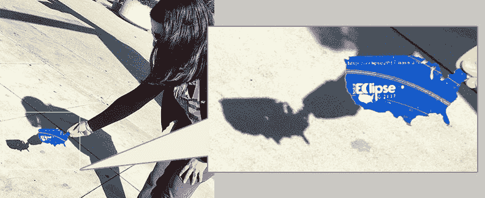
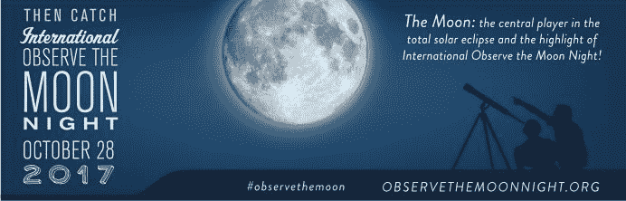

# Eclipse 2017 Mania:所有数据

> 原文：<https://thenewstack.io/eclipse-mania-data/>

日食结束了，但是数据科学才刚刚开始。

我们现在正在计算后果，数据点代表所有想看月亮掠过太阳的人，并对拒绝现实世界奇观的人数感到惊讶，因为他们有机会在网上观看。人类带来了一些尖端技术，以及一些久经考验的经典作品。

在许多方面，日食向我们展示了互联网真正的好处:信息共享，全球合作，以及一些衷心的公共庆祝活动。

这里有一些关于[的有趣元数据，8 月 21 日](https://thenewstack.io/geeks-guide-solar-eclipse/)到底发生了什么。

美国宇航局估计，成千上万的人[参加了现场日食观测活动](https://www.nasa.gov/feature/eclipsing-online-records-through-the-eyes-of-nasa-numbers)，称“节日气氛，有标志，吉祥物和欢呼。”但日食也在时代广场上的东芝大屏幕上播出，大部分兴奋情绪都在网上传播，Twitter 报道称，超过 600 万人分享了与日食相关的推文。

考虑到人们对网络日益增长的兴趣，Twitter 上的官方@NASAMoon 账户甚至“[屏蔽了“@NASASun](https://twitter.com/NASAMoon/status/899681358737539073) ”，这成为了 NASA 历史上分享最多的推文，有 192，960 次转发和 391，540 个赞。更不用说获得了@NASAMoon 的 27000 名新粉丝，增长了近 50%。

幸运的是，几分钟后，两个天体愉快地解决了他们的分歧。

## 远景

美国国家航空航天局现在也发布了从太空看到的美国大日食[的新视频，包括来自他们围绕月球两极的](https://www.space.com/37997-great-american-solar-eclipse-nasa-satellites-video.html)[月球勘测轨道飞行器](https://lunar.gsfc.nasa.gov/)、他们的[太阳动力学观测卫星](https://sdo.gsfc.nasa.gov/)以及来自[国际空间站](https://www.nasa.gov/mission_pages/station/main/index.html)的镜头。视频中的其他卫星显示，随着地球的旋转，北美上空的阴影逐渐变暗。对于一颗欧空局/美国国家航空航天局的卫星——太阳和日光层观测站(SOHO)——来说，月球显得太小，无法覆盖整个太阳。

然而，当这一重要时刻终于在 8 月 21 日到来时，“就连我们都有点被巨大的反响震惊了，”美国宇航局在一份声明中称之为“迄今为止美国宇航局测量的最大的在线事件”

在 DigitalGov.gov 的[，联邦数字分析项目宣布 NASA 在日食期间的网络直播是其自 2012 年成立以来最大的政府网络事件。多达 4000 万观众从 NASA.gov 观看了直播，或者通过 Twitch 和 Periscope 等各种社交媒体平台观看了直播。仅脸书一地就有 2700 万次*独特视角*(月食前后都有)，而美国宇航局的“月食直播”页面有 1210 万次独特视角，“峰值为 200 万到 300 万次同时观看。”](https://www.digitalgov.gov/)

“在 nasa.gov 和 eclipse2017.nasa.gov 有超过 9000 万的页面浏览量，我们超过了之前的网络流量记录大约七倍……一些最热门的观看区域不在日全食区域，这表明我们帮助全美国的人们分享了这种兴奋。”

美国国家航空航天局的网站提供了一个如何用有用和独特的信息欢迎在线访问者的案例研究，它的网络存在很好地利用了这种兴趣的激增。在他们的网站上，NASA 甚至分享了。STL 文件供 3D 打印机生成[一个形似美国](https://eclipse2017.nasa.gov/2d3d-printable-pinhole-projectors)的针孔投影仪相机。(或者是你选择的形状。)

看起来 NASA 不断想出新的方法让地球上的日食观测者分享他们的热情。

美国国家航空航天局的“[六次月食](https://eclipse2017.nasa.gov/eclipse-six)”页面仍在要求游客用六个词描述他们的经历，并将其放入将于 2024 年 4 月 8 日打开的时间胶囊中，这是 2024 年 4 月 8 日下一次全美日全食的日期。“我被它的美丽惊呆了，”美国宇航局网站上的一个例子写道。

除了网络表单，eclipse 粉丝还可以在 Twitter 上使用 [#Eclipsein6](https://twitter.com/hashtag/Eclipsein6?src=hash) 标签提交条目。该机构还邀请人们[在 Instagram(以及 Twitter 和脸书)上提交#EclipseDance 视频](https://eclipse2017.nasa.gov/dancing-along-path)——结果大部分是快乐的人上蹿下跳

https://twitter.com/Sutton_Dance/status/899697177013997568

美国国家航空航天局也正在创建一个大规模的合作文档——通过将每个人的日食照片收集到一个巨大的 Flickr 图库中。2109 人已经贡献了超过 3000 张照片。

现在，美国宇航局还在宣传即将到来的 10 月 28 日国际观察月亮之夜——“一年一度的世界范围的公共活动，鼓励观察和欣赏月亮”——提醒游客，月亮是日全食的“主角”。

但是并不是所有关于日食的数据都来自美国宇航局。音乐杂志 *Billboard* 杂志指出，在邦妮·泰勒发行《心之全食》34 年后，这首歌[人气飙升](http://www.billboard.com/articles/columns/chart-beat/7949097/total-eclipse-of-the-heart-bonnie-tyler-sales-streaming-gains)，一周内有 31000 次数字下载，首次登上 *Billboard* 的数字歌曲销售排行榜(排名第 13)。按照计划，66 岁的泰勒花了一个上午在皇家加勒比游轮上大声唱出她的主打歌，让人群加入到课程中来。

[https://www.youtube.com/embed/5sNh0BVXSSY?start=73&feature=oembed](https://www.youtube.com/embed/5sNh0BVXSSY?start=73&feature=oembed)

视频

据 Billboard 报道，曼弗雷德·曼(Manfred Mann)的地球乐队(Earth Band)的《[被光弄瞎](https://www.youtube.com/watch?v=Rpq35wyDi7I)》，以及其他与太阳有关的歌曲，如平克·弗洛伊德的《[日蚀](https://www.youtube.com/watch?v=n9xOl8qZ7tc)、【克里登斯清水复兴合唱团】的《[坏月亮升起](https://www.youtube.com/watch?v=UYnySGM9dQA)、【声音花园乐队】的《[黑洞太阳](https://www.youtube.com/watch?v=3mbBbFH9fAg)、[披头士的《太阳来了](https://www.youtube.com/watch?v=bgiQD56eWDk)》，下载量也大幅增加

[https://www.youtube.com/embed/n9xOl8qZ7tc?feature=oembed](https://www.youtube.com/embed/n9xOl8qZ7tc?feature=oembed)

视频

一些人找到了自己独特的方式来纪念这一时刻。例如，当国际空间站从太空观看日食时，地球上的粉丝们正在观看国际空间站。

我们最喜欢的一个视频展示了一队年轻摄影师在怀俄明州克劳哈特的一片 40 英亩的农田里拍摄时的兴奋——人口:141。它不仅会经历两分钟半的完全黑暗——而且他们已经计算出，当日食开始时，当国际空间站从太阳前面经过时，他们配备滤光器的相机镜头也可以发现它。

[https://www.youtube.com/embed/lepQoU4oek4?start=180&feature=oembed](https://www.youtube.com/embed/lepQoU4oek4?start=180&feature=oembed)

视频

“数学成功了，”其中一个在 YouTube 频道的视频中高兴地欢呼。自那以后，它已经获得了近 150 万次点击量。拍摄这张照片的有抱负的摄影师特雷弗·马尔曼现在正在出售他的照片，还有鼠标垫、手机壳、咖啡杯，甚至扑克牌。

美国宇航局分享了他们自己拍摄的同一时刻的电影——拍摄于怀俄明州班纳东北 243 英里处。

美国宇航局还分享了自己拍摄的国际空间站穿越太阳的照片，这些照片是在华盛顿的北喀斯喀特国家公园拍摄的，并指出国际空间站正在以每秒 5 英里的速度穿越太空——大约每小时 18000 英里——载有六名宇航员。

## 长久以来

也许这一切都在提醒我们，是人类让这一切发生的——是人类记录了数据，分享了数据，并把它传给了后代。也许历史会记住，最终，日蚀成为互联网共享的一个辉煌实例，将在未来几代人的时间里在网上流传——所有的信息和所有老式的人类热情。

YouTube 节目的主持人德斯坦对空间站的过境非常兴奋，以至于忘记了所有的摄影——甚至把镜头盖留在了两台相机上。“我完全搞砸了我所有的摄影，”他在视频中说，“我真的不在乎…我已经提前下定决心，不管摄影发生了什么，在 max eclipse，我要放下一切，去和我的家人共度时光。

“这正是我所做的，这真的很酷。”

* * *

# WebReduce

来自国家公园管理局的特写图片。

<svg xmlns:xlink="http://www.w3.org/1999/xlink" viewBox="0 0 68 31" version="1.1"><title>Group</title> <desc>Created with Sketch.</desc></svg>