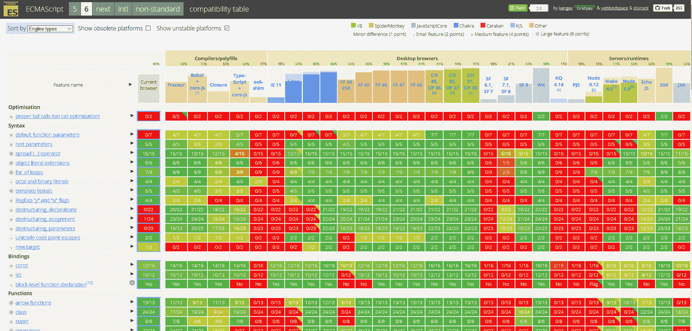

# JavaScript 6 带来了巨大的变化，并开始了一个加速的时间表

> 原文：<https://thenewstack.io/ecmascript-6-biggest-update-javascript-yet-start-rolling-annual-improvements/>

我们用来构建网络的语言可以像网络一样快速发展。

在 JavaScript 的第一个版本出现 20 年后，在它发展成为官方 ECMAScript 标准的最后一次更新 6 年后，我们终于得到了 JavaScript/ECMAScript 的新版本。ES2015 是 JavaScript 有史以来最大的更新。

ECMAScript 6——现在被称为 ES2015，因为当时委员会投票通过了该规范草案——不仅对于大量新功能来说很重要，而且因为它是 JavaScript 规范年度更新的开始。

乔纳森·特纳说，他最近刚从微软的 TypeScript transpiler 项目转到 Mozilla。这也是最长的开发时间。”ECMAScript 标准的编辑和微软 Edge 团队的高级项目经理 Brian Terlson 解释说:“虽然 ES5 是在 6 年前发布的，但 ES2015 是委员会在 2000 年左右开始致力于未发布的 ES4 规范的 15 年努力的结果。

随着更多的并发模式和更多用于模块化设计和代码组织的工具的出现，这意味着更大范围的改进。

两个最大的新特性可能是模块和类。

使用模块来组织代码是一个基本的编程特性，以前您需要使用额外的工具来利用 JavaScript。“之前，您必须决定要使用哪种模块格式；现在你有一个统一的语法，”特纳说。“新的模块语法为开发人员提供了粒度和灵活性；它为您提供了一种非常精细的导入方式，因为每个项目都是一个文件夹，每个文件都是一个模块，您可以只导入您想要的那些。”特纳认为这足够强大，值得改变。

“如果您来自其他模块系统，可能需要一点时间来适应语法。但是一旦你习惯了，你可以一次处理一个完整的模块，或者一次处理一个单独的导入，你可以用子模块构建一个模块。您可以有一个模块来扁平化该 API，也可以有多个模块来支持它成为一个扁平的 API。它允许你在如何模块化应用程序、如何模块化库或如何使用库方面有很大的灵活性，”特纳说。

“模块是我个人最引以为豪的特性，”Mozilla 在负责 JavaScript 标准化的 TC39 委员会的代表大卫·赫尔曼说，“我鼓励所有的 JavaScript 开发者都去看看。目前的技术水平是将它们与 Babel 这样的 transpilers 一起使用，但随着对 [WHATWG Loader](https://github.com/whatwg/loader) 规范的工作继续进行，以及 Node.js 制定出其[实现和互操作性策略](https://github.com/nodejs/node-eps/pull/3)，我们将开始看到原生实现在浏览器和 Node 中出现。不管怎样，多亏了 transpilers，开发人员现在可以开始学习并在真正的生产应用程序中使用模块了。”

Terlson 补充道:“类对于构建经典的 OOP 层次结构非常有用，以前这种层次结构需要更多的代码并且不太可靠。”。关于类应该如何在 JavaScript 中工作有很多争论，这导致了规范在最终确定之前的一些变化，但结果应该是 JavaScript 和 OOP 开发人员都熟悉的。

“JavaScript 的对象系统是基于原型的，这是出了名的，虽然通过原型来模拟类是可能的，但它需要大量的样板文件和混乱，”Herman 指出。“即使对于小的、一次性的抽象，我也发现将使用原型方法定义构造函数的古老模式升级到一个简单的类声明中是令人满意的。同时，ES2015 类是根据构造函数和原型定义的，因此它们完全兼容现有的对象系统，并可与现有代码互操作。”

泰尔森强调了许多其他新功能。“内置承诺为 DOM 和其他地方的异步 API 开始返回承诺铺平了道路，这对异步程序来说是一个巨大的福音。生成器也是某些异步编程技术的关键功能，是一个全面有用的特性。WeakMaps 特别赋予了图书馆作者强大的能力。”然后是一系列小而重要的改进；类型化数组，字符串、数组、数字、对象和数学的新方法，变量的新选项(“let”将变量限定在您定义它的块中)，最后！—支持常量。

ES2015 中也有许多新的“语法糖”，从使用键入 **= >** 的快捷方式定义函数到自动扩展数组的 spread 运算符。不要太快认为你所知道的风格是最好的。各种有趣的特性，如析构、模板文字、箭头函数、二进制和八进制文字、rest 和 spread、默认参数等。一起努力，让 ES2015 代码更加简洁、易读和可维护，”Terlson 声称，Herman 同意这一观点。

“我鼓励程序员尝试许多小便利和人体工程学的改进，使日常编程任务更加愉快，”特尔森说。例如，参数缺省表达式和 rest 参数使得定义函数签名的工作不那么单调乏味，更容易理解。对象语法缩写，如内联方法和默认属性是另一个很好的例子。这些便利性中的每一个听起来都很小，但是所有这些人体工程学的改进真的可以累积起来，在我看来，使 JavaScript 总体上成为一种更好的编写代码的语言，并且阅读起来更清晰。”

## **trans piler；工具和测试场地**

如果 ES2015 中的主要变化，以及自我们上次推出新的 JavaScript 标准以来的时间长度，让你期待一个颠覆性的变化，请记住，这实际上是对语言持续发展的认可。正如特纳指出的，“你不必一下子买下所有的东西，你可以挑选对你有用的。”甚至类实际上是带有语法糖的函数，使用熟悉的原型继承使继承更容易操作。

此外，即使是新功能对开发者来说也不是全新的。浏览器厂商还没有等到标准完成就开始工作。虽然没有一个 JavaScript 引擎已经实现了一切，“ES2015 的绝大多数都是在大型运行时环境中实现的(Chakra、SpiderMonkey、V8 和 JSCore)，”泰尔森说(在 GitHub 上有一个[特性兼容性矩阵](https://kangax.github.io/compat-table/es6/)，你可以在那里查看支持)。“只需要瞄准相当新的浏览器的开发人员现在就可以使用 ES2015，”他建议道。

那些不能这样做的人，仍然可以在 transpilers 中使用许多 ES2015 功能，如 TypeScript 和 Babel，它们将许多 ES2015 功能编译成在旧浏览器中工作的 ES5 代码；Herman 解释说:“ES2015 的绝大多数功能现在都可以在 Babel 中使用，只有代理等少数难以移植的功能除外。不像 transpilers 定义自己的语言，比如 CoffeeScript，或者让你使用 C 和 C++之类的语言，比如 Emscripten(它把 LLVM 字节码变成 asm.js 代码)，这些产生 JavaScript。TypeScript 生成模块化 JavaScript，具有显式接口，每个类一个文件，您可以导出名称空间并获得看起来像是由开发人员而不是机器编写的代码，一个文件用于 ES5，另一个文件用于 ES2015，另一个文件用于 ES2016，如果出现的话。

事实上，这些 transpilers 已经有 ES2015 功能很长时间了，许多新功能实际上已经在 transpilers 中实现了原型，所以它们已经经过了尝试和测试。

“Transpilers 极大地改进了 JavaScript 标准化过程，”Herman 声称。“从历史上看，很难从开发人员那里获得关于候选功能的真实反馈，因为存在一个棘手的先有鸡还是先有蛋的问题:浏览器供应商不愿意发布未经测试的功能，但开发人员负担不起花费时间使用浏览器中未发布的功能来构建真实的应用程序。”

“有了 transpilers，开发人员甚至可以在没有原生浏览器支持的情况下，在他们真正的生产应用中尝试新功能，这意味着标准可以在来不及改变之前获得宝贵的经验报告、错误报告和可用性反馈。开发人员不必担心他们的代码会无声无息地崩溃，因为他们可以决定何时准备好升级到 transpiler 的新版本。”

“随着时间的推移，运输工具等工具只会变得越来越重要，”特纳补充道。“如果 JavaScript 继续快速发展，那么每年都会有一个新版本，浏览器要跟上将是一个挑战，让用户进入能够以如此快的速度支持新 JavaScript 标准的新平台也将是一个挑战。”Transpilers 将填补这一空白，让开发人员能够更早地获得新功能，但允许他们处理没有单一代码库的最新版本 JavaScript 的浏览器。

Terlson 和 Herman 都相信，没有准备好迁移到新标准的 JavaScript 开发人员不会遇到突破性的变化和不兼容。

“ECMAScript 标准委员会将向后兼容性视为一项极其重要的责任，”Herman 说。“ES2015 经过精心设计，不会对现实世界的代码造成重大改变。泰尔森同意，浏览器厂商也是如此。TC39 和引擎实现者竭尽全力确保新的语言特性不会引入不兼容性。在过去，语言引入不兼容性的地方是在边缘情况下，我们有没有人或很少人受到影响的数据。在这种情况下，委员会成员或实施者将联系受影响的图书馆或网站来解决问题。知道 TC39 致力于不破坏他们的代码，开发人员可以高枕无忧了。"

但是，随着 JavaScript 现在进入年度更新周期，以及 ECMAScript 2016(具有更少的新功能)在 6 月份走向标准化，大多数开发人员都希望开始尝试新功能，并为保持最新的语言做好准备。

通过 Pixabay 的特征图像。

<svg xmlns:xlink="http://www.w3.org/1999/xlink" viewBox="0 0 68 31" version="1.1"><title>Group</title> <desc>Created with Sketch.</desc></svg>