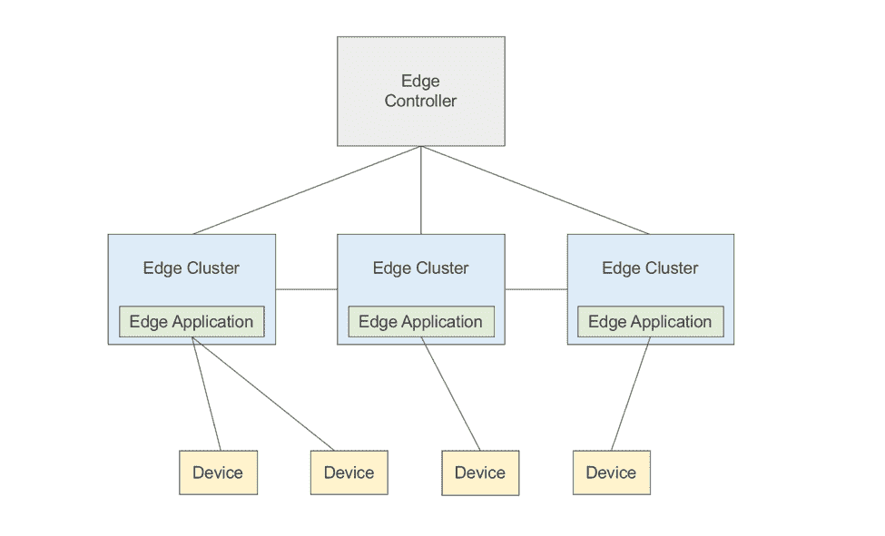
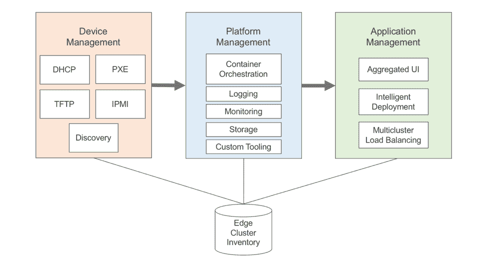
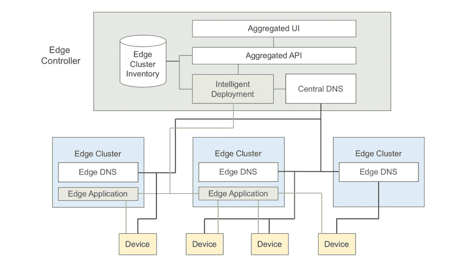

# 边缘计算和云原生生态系统

> 原文：<https://thenewstack.io/edge-computing-and-the-cloud-native-ecosystem/>

低延迟、减少带宽、减少回程——这些是[边缘计算](/category/edge-computing/) 、将密集型工作负载从云转移到网络边缘的过程的原则。最后，在 2018 年，从[移动](https://thenewstack.io/edge-replacing-cloud-mobile-making-happen/)和[物联网](https://thenewstack.io/azure-iot-edge-machine-learning-containers/)到[视频](https://thenewstack.io/content-delivery-networks-move-closer-network-edge/)和[机器学习](https://thenewstack.io/azure-cto-open-source-is-key-to-machine-learning-in-the-cloud-or-on-the-edge/)的用例正在围绕处理更接近终端设备的大量数据的需求而汇聚。

但是，随着一个围绕边缘的新行业的形成，随着服务提供商[试点](https://www.wirelessweek.com/news/2018/02/verizon-tests-virtualized-ran-technology-oklahoma-city) 5G 边缘平台，以及随着不同行业对“边缘”的不同定义，向一个真实世界边缘平台的愿景趋同是一个挑战。本文提出了一个依赖于开源的边缘平台的概念，[云原生技术](https://www.cncf.io/)。

## 作为多集群协调的边缘计算

图表:边缘编排一览

 [梅根·奥基夫，思科软件工程师

Megan 是思科的一名系统工程师，她在一个致力于云、视频和数据中心技术创新的快速原型团队工作。Megan 去年一直沉浸在边缘计算中，她与服务提供商合作，帮助构建一个面向云原生边缘应用的新平台原型。](https://www.cisco.com/) 

考虑边缘计算的一种方式是将其视为云的扩展，大多数关键的边缘用例都假设涉及到一些云。例如，企业可能会在云中训练一个机器学习模型，然后在边缘提供最新的模型。因此，边缘平台应该像云一样与工作负载无关，并利用现有的云平台技术，如 [Kubernetes](https://kubernetes.io/) 来确保云和边缘应用部署之间的一致性。一个边缘微数据中心——放置在云和终端设备之间的一组服务器——对应于一个 Kubernetes 集群。

在边缘使用 Kubernetes 是有利的，因为它支持[不同种类的](https://kubernetes.io/docs/concepts/api-extension/custom-resources/)工作负载，包括容器、[功能](https://www.openfaas.com/)和[虚拟机](https://github.com/Mirantis/virtlet)。但是，仅仅将 Kubernetes 安装到数千个这样的微数据中心并不能解决边缘计算面临的一系列独特的技术挑战。例如，存在如何大规模引导这些边缘设备，然后在所有站点安装 Kubernetes 和平台工具的问题。

然后，应用程序开发人员必须找到一种方法，一次性将不同的工作负载部署到许多边缘集群。开发人员还应该有一种方法来建立隐式部署(“将我的应用程序放在流量所在的地方”)，而不必担心数千个边缘微数据中心中的哪些实际运行该应用程序。还有跨集群负载平衡流量的挑战，以便每个请求解析到最近的边缘服务器。边缘集群还应该能够跨集群自主扩展工作负载；这需要边缘站点之间的一些“邻居意识”。边缘运营商可能还希望将这些微数据中心组织成复杂的拓扑结构，在区域和本地级别部署不同的工作负载。

最后，管理跨越广阔地理区域的边缘集群带来了一系列物流挑战，这与管理大量物联网设备没有什么不同。例如，需要担心物理安全问题、异构硬件和可变的网络设置。

## 走向端到端边缘平台

构建一个边缘平台来解决所有这些技术需求并不简单，没有人构建一个神奇的、统一的边缘平台，因为这很困难。但我认为，将 edge 平台生态系统统一在一些通用的开源工具之下，对于加速 edge 的创新至关重要。

图表:边缘设备、平台和应用管理

那么这个边缘平台会是什么样子呢？

首先，每个组件(设备、平台和应用管理)都必须利用相同的边缘库存。例如，像 [RackHD](https://github.com/RackHD) 这样的裸机配置工具可以从边缘清单中提取一组 MAC 地址，远程启动这些设备，然后将一些结果写回到清单中。然后，平台经理可以从边缘库存中获取这些结果，以及一些用户定义的关于如何集群设备的信息，然后安装 Kubernetes，以及其他平台工具，如用于日志记录和监控的 [Fluentd](https://www.fluentd.org/) 和 [Prometheus](https://prometheus.io/) 。一旦所有边缘站点集群化并准备好接受新的工作负载，这些边缘 Kubernetes 集群之上必须存在一些逻辑层，以处理隐式应用部署和跨集群负载平衡。

前两个组件，设备和平台管理，在很大程度上是可以围绕现有工具编写的已解决的问题。但是最后一个组件，应用程序管理，是一个尚未解决的问题:成千上万的 Kubernetes 集群如何在最少的监督下协同工作？

## 下一个障碍:边缘应用管理

边缘计算只是多集群 Kubernetes 的一个用例，管理多个 Kubernetes 集群的概念并不新鲜。2016 年，Kubernetes 推出了[集群联盟](http://blog.kubernetes.io/2016/10/globally-distributed-services-kubernetes-cluster-federation.html)，这是一个用于多集群工作负载部署和负载平衡的控制平面。从那以后，Kubernetes 内部的[多集群特殊兴趣小组](https://github.com/kubernetes/community/blob/master/sig-multicluster/README.md)已经脱离了集中控制平面方法，而转向一组更加分散的[API](https://github.com/kubernetes/cluster-registry)、[入口控制器](https://github.com/GoogleCloudPlatform/k8s-multicluster-ingress)和工具。然而，所有这些工具都倾向于云部署的 Kubernetes。例如，Federated Ingress 目前只支持 Google Cloud 中托管的集群。

因此，为了实现这一边缘平台愿景，必须创建新的工具来解决原始 Kubernetes 中的多集群编排问题。为此，我们来了解一下多集群应用管理器的高级架构。****

图表—边缘应用管理和多集群 DNS

edge app manager 的核心原则是，集群应该能够尽可能自主地行动，而不依赖于中央控制平面。也就是说，一定数量的逻辑必须集中运行。

例如，应该有一个聚合的用户界面和一个 API，允许应用程序开发人员将工作负载部署到边缘，而不必与单个集群进行交互。还可能有一个可以路由传入边缘流量的中央 DNS 服务器。例如，假设一个边缘集群正在运行一个应用程序，而另一个没有。终端设备向该应用发出请求，通过[任播](https://www.incapsula.com/blog/how-anycast-works.html)，DNS 请求路由到最近的边缘集群。这个边缘集群与中央 DNS 服务器对话，并获取运行相关应用程序的集群列表。通过这种方式，边缘 DNS 服务器可以将设备的请求转发到最近的运行应用程序的边缘站点，并告诉终端设备:“我没有运行您需要的程序，但我的相邻集群正在运行。”定制[核心域名](https://coredns.io/)插件在中心和边缘运行是实现这一点的一种方式。

该 edge 应用管理器的其他功能可能包括跨集群服务之间的负载平衡和流量控制(多集群 Istio)，以及跨集群纵向扩展和纵向扩展，统一的身份验证和安全策略以及云提供商集成。那么，这个 edge 应用管理器在未来可能会包括几种不同的工具，包括新的和现有的，以协调这些微数据中心之间的应用。

最后，对于边缘计算来说，这是一个激动人心的时刻，现在是创建工作负载无关的云原生平台来运行边缘应用的时候了。让我们团结在开源周围，帮助加速激动人心的边缘用例。

*梅根将谈论“[你准备好变得前卫了吗？—将云原生应用带到网络边缘](http://sched.co/Dqvk)，2018 年 5 月 2 日至 4 日在丹麦哥本哈根举行的 [KubeCon + CloudNativeCon EU](https://events.linuxfoundation.org/events/kubecon-cloudnativecon-europe-2018/attend/register/) 。*

本文由思科代表 KubeCon + CloudNativeCon Europe 提供，该会议将于 2018 年 5 月 2 日至 4 日在丹麦哥本哈根举行。

通过 Pixabay 的特征图像。

<svg xmlns:xlink="http://www.w3.org/1999/xlink" viewBox="0 0 68 31" version="1.1"><title>Group</title> <desc>Created with Sketch.</desc></svg>