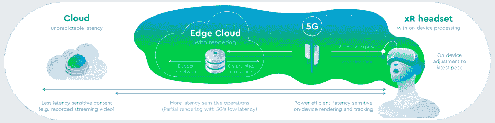

# 边缘计算及其对开发者的意义

> 原文：<https://thenewstack.io/edge-computing-and-what-it-means-for-developers/>

多年来，开发人员一直在探索在不牺牲安全性或增加成本的情况下最大化客户体验的方法。

边缘计算帮助开发人员构建更快、更可靠、更安全的应用，这甚至可以为他们的客户带来更高的投资回报。

如今，开发人员在运行和部署工作负载时有多种选择。

 [谢拉琳·巴塞尔米

谢拉琳是考克斯通信(Cox Communications)旗下边缘云初创公司 Cox Edge 的产品、营销和客户成功主管。在 Cox Edge，她专注于开发客户和开发人员赖以构建下一代 Edge 应用的工具和系统。](https://www.linkedin.com/in/sheraline-barthelmy-0625b870/) 

他们可以选择将它们部署在:

*   **设备本身:**比如增强现实(AR)耳机或者制造机。
*   **本地服务器:**位于客户场所或私有云中的服务器上。
*   **公共云:**由亚马逊和谷歌等公司运营的数据中心。
*   **边缘云:**最后一英里提供商运营着数百个大都市级别的数据中心。

对于要求低延迟、更低连接成本和可靠不间断连接的应用程序，合理的选择是边缘计算。

## 什么是边缘计算？

边缘计算使计算、存储和分析更靠近生成数据的设备和位置，而不是将数据移动到中央云，有时是数千英里之外。

例如，增强现实可以提高人们与关键现实世界情况交互的效率和生产力，如远程手术或现场设备维修。

使用 AR，指令可以覆盖在智能手机和智能眼镜等设备上，使工人更容易执行他们的任务，并消除了打电话或返回办公室寻求帮助或进一步指示的需要。

当谈到 AR 时，大多数用户都希望获得免提体验。然而，随着智能手机成为最广泛使用的设备，免提通常是不可能的。这是智能眼镜的理想用例。

## 4G 智能眼镜和边缘计算如何提供免提体验

智能眼镜和智能手机摄取的视频流可以发送到本地边缘服务器来分析这些内容。然后从这些信息中提取位置和方向信息，覆盖在用户的智能设备上。

4G 和在边缘而不是中心云上执行的计算将延迟减少到 10 毫秒到 25 毫秒之间。这高于 5G 承诺的超低延迟，潜在低于 5ms，但对于 AR/VR(虚拟现实)来说是可以接受的。

此外，将计算转移到边缘有助于消除用户设备进行计算的需求。这可能会使更便宜、更轻薄的设备具有更好的电池寿命，用户可以更舒适地佩戴更长时间。

未来，开发人员在运行工作负载时将有更多选择:

*   **设备边缘:**开发者可以在终端设备上部署软件的容器化版本，比如 AR 耳机。
*   **内部部署边缘:**在部署应用程序的客户端服务器上。
*   **网络边缘:**在 POP(存在点)或最后一英里提供商的数据中心的服务器上。
*   **区域边缘:**位于 IX(互联网交换)或二级 pop(一级运营商的下游)数据中心的服务器上。

在边缘部署应用程序可以带来许多性能优势:

**1。处理速度:**边缘计算的一个最大优势是显著提高了可实现的处理速度。通过将工作负载移至更靠近设备和终端用户的位置，数据可以通过更少的网络跳数传输更短的距离，从而加快响应速度并减少延迟。

**示例:**医院内患者监测需要近乎实时地将通知发送回从业者，警告他们趋势或患者行为的变化。

**2。更可靠的应用程序:**更少的网络跳数减少了互联网拥塞问题，从而减少了影响应用程序性能的网络问题。

**示例:**像石油和天然气站这样的设施使用分布式环境传感器来检查气体泄漏。与此同时，传感器会监控关键资产是否有可能导致爆炸或漏油的故障迹象，并在阈值被突破时触发警报。

像这样的关键用例要求处理和存储尽可能靠近设备。等待数据被处理并从云中的中央服务器发回可能是灾难性的。

**3。存在点:**在边缘过滤和缓存数据可以减少发送回云端的数据量，从而节省带宽和流量成本。

**例如:**内容交付网络(CDN)在边缘服务器上缓存数据，只有当缓存内容过时时，才会将请求发送回源服务器。

**4。数据主权和隐私:**数据存储在客户所在地的服务器上或由电信公司管理的服务器上。这可以提高数据的物理安全性，并有助于在数据必须保留在国内时遵守当地法律。

**例如:**需要将数据保存在某个位置或某个国家的服务器上的公司。例如，客户的健康或财务记录、个人身份信息，甚至是要求 ISP 在国内保留特定类型流量的政府信息。

**5。更好的安全实践:**随着公司寻求通过边缘应用提高效率和降低成本，他们需要确保这些应用受到保护。

领先的 edge 和 CDN 提供商为公司提供安全基础设施，可以减轻边缘攻击，降低业务中断的可能性。

**示例:**安全策略和防火墙配置可以根据 IP 地址、地理位置或传入流量的速率是否超过预定义的阈值来允许或阻止流量。显然，这只是这些安全平台所能实现的一小部分。

在 DDOS 攻击的情况下，传入流量被转移到清理数据中心，在那里流量被“清理”或清除。只有干净的流量才会转发到目标目的地。

**6。可扩展性:**开发人员可以动态增加工作负载，并根据需求增加或减少工作负载，从而在保持低延迟的同时控制成本。

**示例:**在大型体育赛事(如世界杯足球赛)或重大赛事(如总统选举)期间，可以随时扩展的工作负载。

## 5G 适合在哪里？

5G 有望大幅降低网络延迟，但开发人员不需要等待 5G 的完全推出，就可以探索他们的边缘计算选项。

边缘云、边缘计算和 4G 提供了其应用所需的移动性和速度。

对于那些主要使用固定应用的人来说，edge 和 4G 可以帮助他们构建高性能的应用，满足多样化的客户需求。

<svg xmlns:xlink="http://www.w3.org/1999/xlink" viewBox="0 0 68 31" version="1.1"><title>Group</title> <desc>Created with Sketch.</desc></svg>