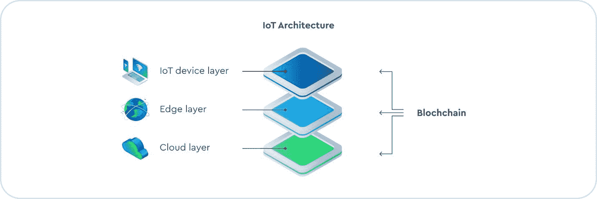
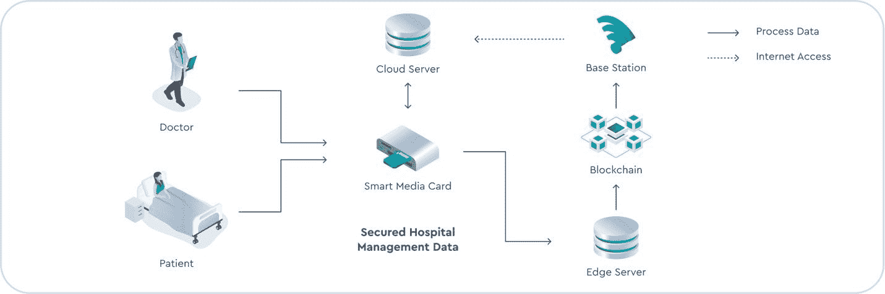

# 与区块链集成的边缘计算

> 原文：<https://thenewstack.io/edge-computing-integrated-with-blockchain/>

 [谢拉琳·巴塞尔米

谢拉琳是 Cox Edge 的产品、营销和客户成功主管，这是一家来自 Cox Communications 的边缘云初创公司。在 Cox Edge，她专注于开发客户和开发人员赖以构建下一代 Edge 应用的工具和系统。](https://www.linkedin.com/in/sheraline-barthelmy-0625b870/) 

物联网设备的指数级增长正在催生更新、更复杂的应用，这些应用需要实时结果。传统的云架构需要物联网设备将数据发送到中央存储库中的远程服务器，这带来了延迟，有时无法满足这些应用程序的服务质量要求。[边缘计算](https://thenewstack.io/edge-computing/)通过让计算、存储和分析更贴近用户和生成数据的设备来帮助解决这一问题。因此，数据传输的距离更短，这可以降低延迟并加快响应速度。

然而，边缘服务器的大量全球足迹引起了诸如访问控制、隐私、认证和入侵检测等安全问题，这些问题必须得到解决。区块链凭借其分布式、去中心化、不可变、共享的交易分类账，有可能解决与边缘计算相关的安全和隐私问题。

[物联网设备](https://thenewstack.io/6-project-ideas-to-get-started-with-iot/)也容易受到网络攻击。数以百万计的互联设备产生大量数据，然后通过互联网传输。区块链的共识算法验证每一笔交易，确保物联网设备传输的数据经过验证和有效，并且在传输过程中没有被篡改。

然而，挖掘和共识过程是资源密集型的，而受资源限制的物联网设备不具备处理这种计算过载的能力。将处理交给云并不是一个选项，延迟是一个明显的原因。边缘计算是从物联网节点卸载计算密集型任务的一种解决方案。

与区块链一起，边缘计算看起来是为物联网构建安全、可扩展和分布式平台的完美组合的一部分。

虽然[区块链有助于解决边缘计算和物联网固有的安全问题](https://thenewstack.io/shared-security-for-interconnected-blockchains/)，但边缘计算提供了物联网应用所依赖的低延迟、分布式、可扩展的网络。

## 近距离观察区块链

在区块链中，数据存储在称为块的组或区块中。当一个块被填满时，它被追加到前一个块。区块链是一个不可变的数据库，并使数据的时间线不可逆。写入数据块的数据成为该时间线的一部分，无法修改。每个节点都有自其开始以来存储在区块链上的数据的完整记录。所有块都存储自己的哈希、前一个块的哈希及其时间戳。如果攻击者试图以某种方式篡改区块链，或者试图改变他自己节点中的信息，那么他的散列就会改变，从而导致攻击者的节点被标记为非法。

为了让攻击者得逞，他需要修改 51%的节点上的信息，使这些节点上的信息与他的信息相匹配。考虑到区块链网络不断增长的规模，这将是一项不可能完成的任务。

像工作证明(POW)这样的共识协议验证每一笔交易。在 POW 中，矿工们竞相解决一个涉及计算散列函数的任意数学难题，获胜的一方可以向链中添加一个新块。POW 在计算上是昂贵的，并且随着更多的矿工加入网络而消耗大量的电力。哈希与非对称密钥加密和智能合同一起确保了存储在区块链上的数据的可靠性和不变性。智能合约是在满足特定条件时在区块链上运行的一段代码。它用于执行一项协议，无需使用中介或损失时间。

例如，物联网中的智能合同可以用于向物联网设备分发安全软件更新。有了这样的背景，让我们来看看如何将区块链和边缘计算集成到现实世界的应用中。

## 建筑

物联网架构可以分为三层:物联网设备层、边缘层和云端层。区块链可以集成在这些层中的每一层。

【T2

### 物联网设备层

这一层的每台边缘服务器以及与之相连的设备构成了它们自己的本地网络。在设备信任向其提供的 CA(证书颁发机构)证书后，本地边缘服务器管理并注册物联网设备。物联网设备之间、设备与边缘服务器之间或边缘服务器之间的通信被记录为事务，并存储在边缘服务器区块链上。每个边缘服务器是一个区块链管理器，负责事务的创建、验证和存储。

这一层的设备间通信可以分为两类。同一本地网络中的设备到设备通信和不同本地网络中的设备到设备通信。在第一种情况下，物联网设备将源请求转发给它们的管理器，即边缘服务器。管理器验证请求，然后将其广播到整个网络。在第二种情况下，物联网设备之间的交易由其各自的边缘管理器进行认证。

所有事务都被挖掘并存储在边缘服务器上的块中。[边缘服务器处理实时请求](https://thenewstack.io/7-edge-computing-uses-you-should-know/)并将数据存储在它们的区块链中。对时间不敏感且需要进一步聚合或分析的数据被发送到云层。

### 边缘层

维护边缘区块链的边缘服务器位于这一层。物联网设备缺乏挖掘和共识过程所需的计算能力、内存和存储。边缘层从物联网设备卸载这种计算开销，并存储物联网设备之间以及物联网设备和区块链上的边缘服务器之间的所有事务。

区块链的加密服务通过对物联网设备进行加密并在每笔交易中附加数字签名来保护物联网设备的交易。作为区块链管理器工作的边缘服务器使用一致的算法，如工作证明或存储证明，来验证事务并将其写入块中，之后它们将该块广播给其他边缘服务器进行验证。

### 云层

该层由云服务器组成，这些云服务器拥有自己的分散式区块链。它存储对延迟不敏感并且可能需要进一步深入分析的数据。例如，传感器数据可以与来自其他来源的数据相结合，以获得更详细的见解。

## 区块链和边缘计算的现实应用

尽管区块链最常与比特币和以太坊联系在一起，但它的用途远不止加密货币。受益于区块链的安全功能和分散性质的其他行业包括医疗保健、工业物联网、智能城市和智能家居自动化。

让我们快速了解一下边缘计算和区块链如何在医院环境中增强患者病历的安全性。可穿戴设备可以从患者那里获取健康数据，并将其存储在电子医疗卡中。然后，这些数据可以被加密并发送到边缘服务器。边缘服务器将这些数据存储在边缘区块链上，以提高数据安全性和保密性。

与从云中访问数据相比，患者和授权的医院员工可以更快地从边缘访问数据。边缘服务器将实时分析不需要的任何数据发送到云。

【T2

与区块链集成的边缘计算有助于我们构建一个分布式的安全边缘计算架构，该架构可以在物联网数据的整个生命周期中提高其安全性和完整性。随着应用数量及其对安全、实时数据访问需求的增长，基于[区块链的边缘计算](https://www.revelo.com/blog/blockchain-cloud-computing)用例的采用也将增长。

<svg xmlns:xlink="http://www.w3.org/1999/xlink" viewBox="0 0 68 31" version="1.1"><title>Group</title> <desc>Created with Sketch.</desc></svg>