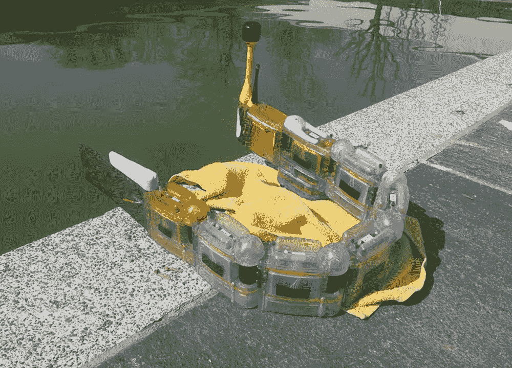
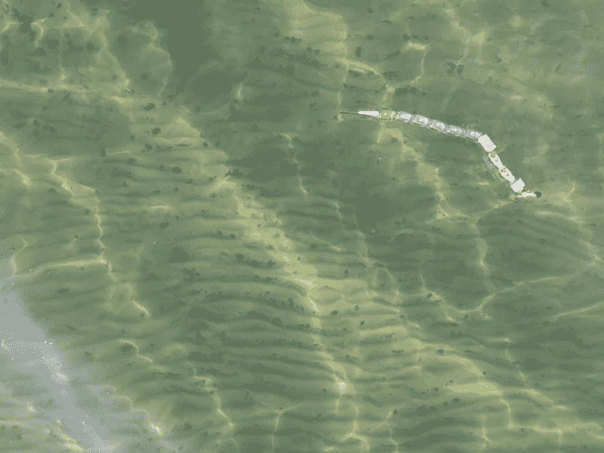
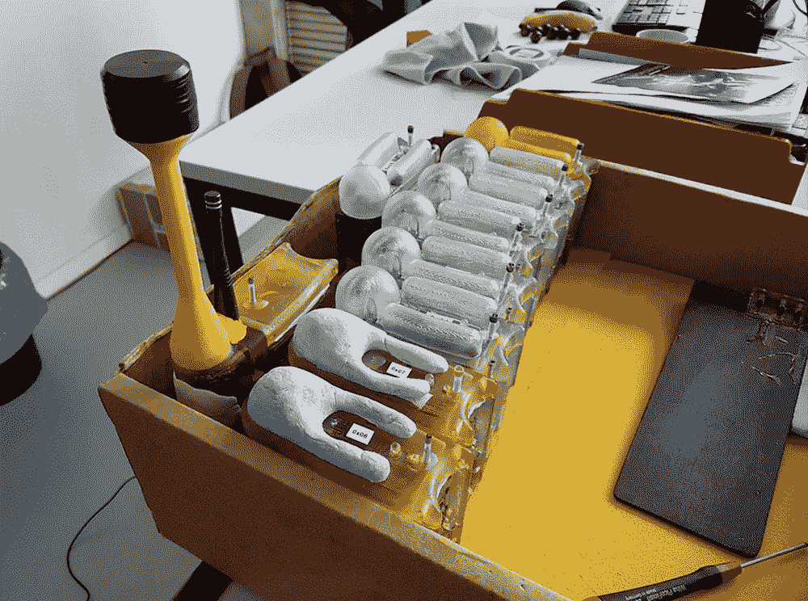
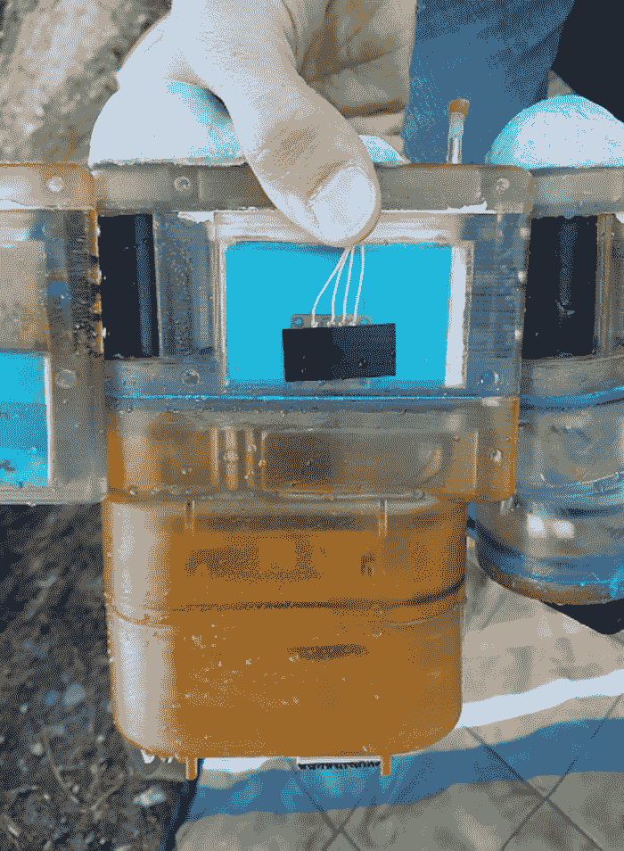
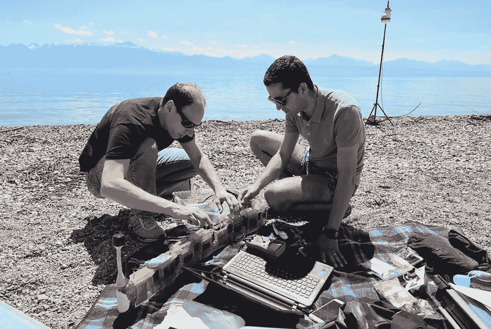

# 鳗鱼状的水上机器人使用活体传感器来定位水污染

> 原文：<https://thenewstack.io/eel-like-aquatic-robots-use-living-sensors-zero-water-pollution/>

新技术把我们带到了一个闪电般快速通信和只需点击一下鼠标就能获得即时信息的时代。但它也引领我们进入了一个新的科学时代，特别是当它涉及到理解正在影响我们更大的生物圈的大规模影响时。科学、技术和自然之间的新平衡可以表现为[使用机器学习](https://thenewstack.io/machine-learning-deciphers-howling-dialects-endangered-wolves/)更有效地帮助保护濒危物种，或者使用[机器人监测野生动物或跟踪石油泄漏](https://thenewstack.io/swarms-robotic-plankton-help-scientists-track-marine-wildlife-oil-spills/)，部署无人机作为[非常规野生动物疫苗交付计划的一部分](https://thenewstack.io/glorified-gumball-machine-drones-airdrop-vaccine-pellets-endangered-ferrets/)。

这些新的技术解决方案还可以帮助我们保持我们的自然环境更清洁，首先获得一些关于污染物水平等硬的、可量化的数据。受鳗鱼和蛇的形态和生物力学功能的启发，这种智能机器鳗鱼可以在受污染的水域中游泳，收集有用的数据，同时锁定污染源。

由[洛桑联邦理工学院](https://www.epfl.ch/) (EPFL)开发的 [Envirobot](https://biorob.epfl.ch/envirobot) 是一种水生机器，配备了一系列传感器，使其能够检测各种有毒物质以及水温或电导率等测量变量。它收集所有这些数据，并以无线方式发送给地面上的研究人员，而不需要从底部拖出沉积物，也不需要搅动当地的植物和野生动物。

“使用游泳机器人有很多好处。他们可以进行测量，并向我们发送实时数据——比我们在湖边设立测量站要快得多，”EPFL 生物机器人实验室主任 Auke Ijspeert 在一份声明中解释道。“与传统的螺旋桨驱动的水下机器人相比，它们在移动时不太可能被海藻或树枝卡住。更重要的是，它们产生的尾流更少，因此它们不会像以前那样分散污染物。”

另一个优点是，这种光滑的机器人既可以远程操作，也可以按照预先设定的变量进行操作。“环境机器人可以遵循预编程的路径，也有可能做出自己的决定，并独立追踪污染源，”Ijspeert 补充说。

## 模块化和生物报告

鳗鱼状机器人的模块化设计意味着它可以很容易地拆卸，运输到偏远地区，并与定制配置的传感器快速组装，以在新的位置测试水域。它可以变得更长或更短，这取决于任务。为了帮助它移动，机器人的每个模块都配备了一个小型电动马达来改变它的曲率。

但最有趣的特征之一是机器人的传感器阵列，其中一些是人工的，测量温度和电导率等东西。这些传统组件与创新的生物传感器相结合，这些传感器可以包含细菌、微小的甲壳动物甚至鱼类细胞等有机体。这些生物传感器被设计成类似小室的容器，当机器人滑行时，容器中会装满水，促使其中的生物对水中的某些毒素做出反应，从而提供任何水体中毒性水平的可见线索。

这些微生物中的一些被称为[生物报告基因](https://en.wikipedia.org/wiki/Bioreporter)，它们经过基因工程改造，可以产生可测量的信号，以响应其环境中特定化学或物理变化的存在。

“例如，我们开发了一种细菌，当暴露于非常低浓度的汞时，它会发光。我们可以使用光度计检测这些变化，然后以电信号的形式传输数据，”微生物学家 Jan Roelof van der Meer 解释道，他是该项目的协调员，也是洛桑大学(T4)基础微生物学系的负责人。

在另一种基于生物的传感器中，使用了一种叫做*水蚤*的小型移动甲壳类动物。这些有机体被放在一个双室容器中，一个装有被测试的水，另一个装有干净的水。“T2 水蚤 T3 的移动受到水毒性的影响，”范德梅尔说通过比较它们相对于对照组的运动变化，我们可以了解水的毒性有多大。"

另一种传感器使用成簇培养在电极上的鱼细胞。当这些细胞与毒素接触时，它们会相互脱离，明显扰乱电流。

到目前为止，研究人员已经在日内瓦湖测试了 Envirobot，向一小块区域添加盐来模拟水污染。游泳机器人在这些测试中表现良好，它自己机动到受影响的区域，并收集了足够的数据来生成水温和电导率的地图。

虽然该团队尚未在实地测试生物传感器，理由是希望不要用测试毒素污染水，但传感器在实验室测试中表现良好。因此，虽然我们在野外看到这种污染检测机器人还有一段时间，可以跟踪我们水域中不想要的污染物的痕迹，但它让我们看到了机器人如何与生物有机体交互以创造更有效的工具的未来。

在[洛桑联邦理工学院(EPFL)](https://biorob.epfl.ch/envirobot) 了解更多信息。

图片:EPFL

<svg xmlns:xlink="http://www.w3.org/1999/xlink" viewBox="0 0 68 31" version="1.1"><title>Group</title> <desc>Created with Sketch.</desc></svg>