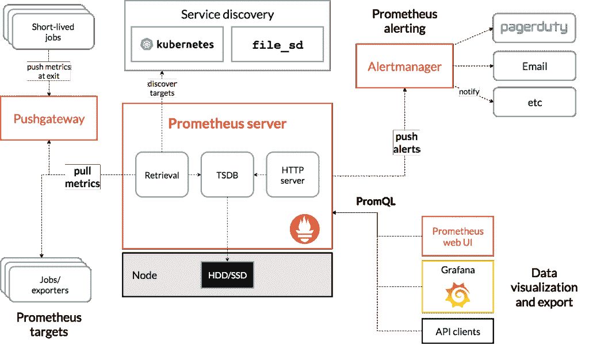
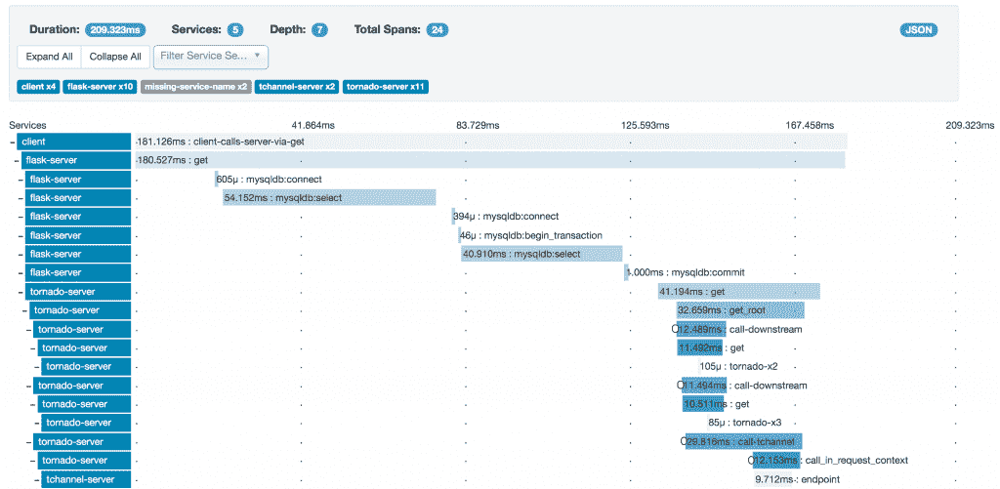

# 云环境中的有效监控

> 原文：<https://thenewstack.io/effective-monitoring-in-a-cloud-native-world/>

[CloudBees](https://www.cloudbees.com/) 赞助了这个故事，作为正在进行的“云原生 DevOps”系列的一部分请在本月查看更多版本。

 [罗布·斯科特

Rob Scott 是 ReactiveOps 的一名现场可靠性工程师，他在查塔努加的家中工作。他帮助为多个客户构建和维护高度可扩展的、基于 Kubernetes 的基础设施。自 2016 年以来，他一直与 Kubernetes 合作，一路为官方文档做出贡献。当他不建设世界一流的基础设施时，Rob 喜欢与家人共度时光，探索户外，并就 Kubernetes 的所有事情发表演讲。](https://www.reactiveops.com/) 

向新的云原生技术(如 Kubernetes)的过渡极大地改变了应用程序的架构和部署方式。在相当长的一段时间里，单一的应用程序被部署到一组长期存在的服务器上，在它们的生命周期内很少收到增量更新。随着云原生技术的兴起，在快速发展的基础设施上运行临时容器的微服务架构也随之兴起。更复杂的是，这些应用程序经常被部署到多个可用性区域、地区甚至多个云中。

这种应用程序架构的方法有很多优点，但它也需要在支持技术(如监控)方面进行重大转变。云原生系统通常更加稳定和高度可用，通常包括某种自动故障转移组件。不幸的是，随着这些架构变得越来越复杂，潜在的故障模式也越来越多。涉及的组件越多，事情就越容易出问题。考虑到这一点，拥有一个有效的监控策略比以往任何时候都更加重要。

在云原生世界中，我们已经习惯的传统监控根本无法跟上这些更现代的架构。它无法提供我们全面了解发生了什么所需的对应用程序的深入了解。

最有效的监控策略将采用多方面的方法，涵盖四个不同的领域:外部轮询、集中式日志记录、自定义指标收集和请求跟踪。虽然不是每个体系结构都需要这些组件，但是它们中的每一个都可以提供独特的、互补的洞察力。最佳监控策略依赖于多种方法的组合来提供全面的系统概述。

## **外部投票提供高水平的可见性**

有一大类监控通常被称为“黑盒”监控。这是指从外到内轮询系统以测量其健康状况。例如，每分钟轮询一次 web 端点，以确保应用程序的正常运行时间。这是最传统的监控形式之一，可能在监控策略中仍有一席之地。这种监控方法对于检测用户已经发现的问题非常有效。

> 要完全理解您的系统，传统度量标准的基本集合通常是不够的。通过自定义指标收集，应用程序可以公开更好地衡量应用程序健康状况的指标。

与黑盒监控相比，许多较新的方法被称为“白盒”监控。这涉及到由内而外的监控，可以提供黑盒监控通常无法提供的洞察力。这种方法通常可以在问题从外部可见之前检测到它们，并且可以为深入调试提供有价值的信息。以下每种方法都是白盒监控的一种形式。

## **集中记录提供有价值的调试数据**

日志记录并不是什么新鲜事。就像民意测验一样，它已经存在了相当一段时间。但是，云原生架构不仅仅需要本地日志记录，它们确实需要某种集中式日志记录系统。对于运行在长期服务器上的传统整体架构，日志有时永远不会离开它们所源自的服务器。集中式日志记录并不总是被认为是必要的。调试有时意味着登录到一个特定的服务器，并通过筛选日志来发现问题。

当然，对于云原生基础设施，容器和服务器是短暂的，将日志传送到某种集中式日志记录系统变得比以往任何时候都更重要。ElasticSearch 经常与 Logstash 和 Kibana 一起部署，组成一个“ELK”堆栈，已经成为最流行的集中式日志记录开源解决方案之一。ELK 堆栈的组件组合起来提供了一组非常引人注目的开源工具，分别简化了日志存储、收集和可视化。

将所有系统和应用程序日志放在一个地方是监控系统的一个非常强大的组件。当出现问题时，集中式日志记录允许您快速查看该时间点系统中发生的一切，并过滤特定应用程序、标签或消息的日志。

此外，这些集中式日志记录系统可以配置为针对异常行为发出警报。这可能很简单，比如日志量显著增加，或者可能出现意外的错误消息。

## **自定义指标支持细粒度报告**

要完全理解您的系统，传统度量标准的基本集合通常是不够的。通过自定义指标收集，应用程序可以公开更好地衡量应用程序健康状况的指标。与从系统外部轮询数据获得的指标相比，这些指标可以提供更精确的信息。

像普罗米修斯这样的开源工具已经改变了这个领域。其核心是一个监控和警报工具包，通过多维时间序列数据库存储指标。每个时间序列都由一个键-值对来标识，并随着时间的推移跟踪该指标的值。这种模型的简单性使得能够有效地收集各种各样的指标。

【T2

Prometheus 在云原生生态系统中变得特别受欢迎，与 Kubernetes 进行了很好的集成。使用 Prometheus 跟踪新指标的便利性已经导致许多应用程序公开各种各样的自定义指标以供收集。这些通常远远超出了我们传统上在监控时会想到的标准资源利用率指标。作为这种情况的一个例子，流行的 Kubernetes nginx-ingress 项目公开了上游延迟、进程连接、请求持续时间和请求大小等指标。当 Prometheus 在同一个集群中运行时，它可以轻松地收集许多应用程序(如 nginx-ingress)公开的指标，这些应用程序支持 Prometheus 开箱即用。

除了所有内置 Prometheus 支持的工具之外，为您自己的应用程序导出定制的指标也是相当简单的。为您的应用程序监控这些类型的定制指标可以提供对您的应用程序如何运行的大量洞察，并在任何潜在问题变得更加明显之前将其暴露出来。

## **请求跟踪提供端到端可见性**

对于云原生架构，请求通常会触发一系列对支持微服务的额外请求。在查看单个请求时，查看对其他微服务的所有相关请求会很有帮助。传统的监控解决方案无法找到这些信息。这导致了一种新的监视形式，即请求跟踪，这是一种将所有相关请求连接在一起以获得更好的系统可见性的方法。

有一些很棒的专注于请求追踪的开源工具，包括 [Jaeger](https://www.jaegertracing.io/) 和 [Zipkin](https://zipkin.io/) 。这些工具允许您查看从初始请求产生的所有请求的详细信息，提供跨微服务的端到端可见性。当试图诊断系统中的任何瓶颈时，这种洞察力是非常宝贵的。

监控技术取得了一些令人难以置信的进步，帮助我们更好地了解我们在云原生世界中的系统。随着系统架构的发展，监控策略也必须发展。像 Jaeger 和 Prometheus 这样的开源工具可以为传统的监控解决方案提供一个很好的补充，所有组件一起工作，提供一个有凝聚力的监控方法。随着监控的加强，系统会变得更好、更可靠，这是一项值得的投资。

通过 Pixabay 的特征图像。

<svg xmlns:xlink="http://www.w3.org/1999/xlink" viewBox="0 0 68 31" version="1.1"><title>Group</title> <desc>Created with Sketch.</desc></svg>