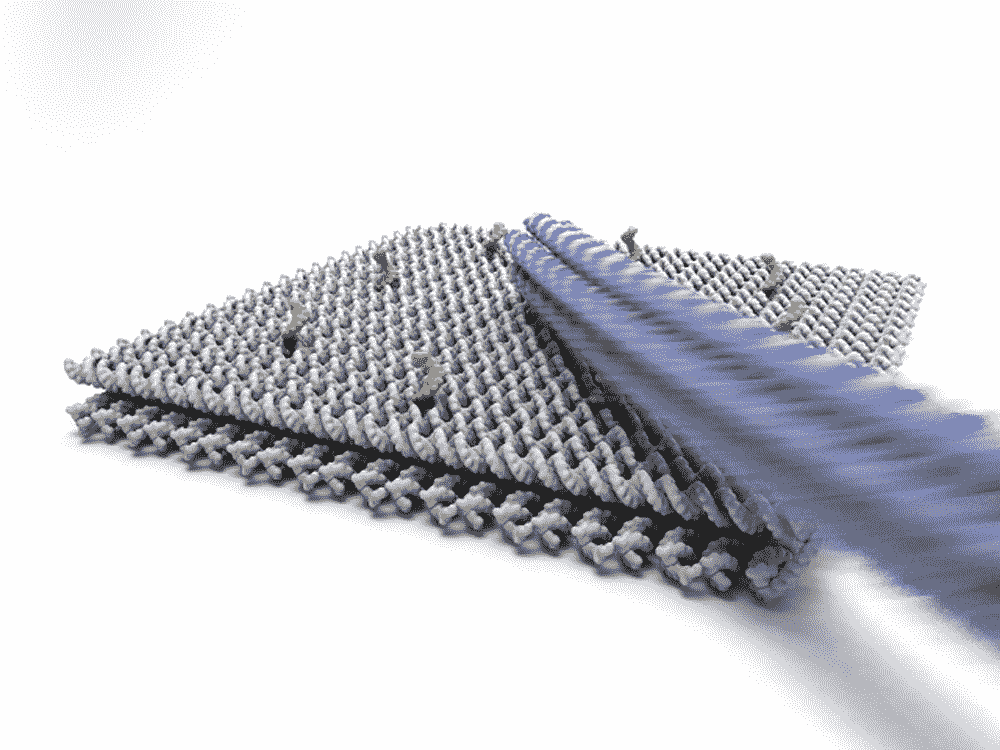
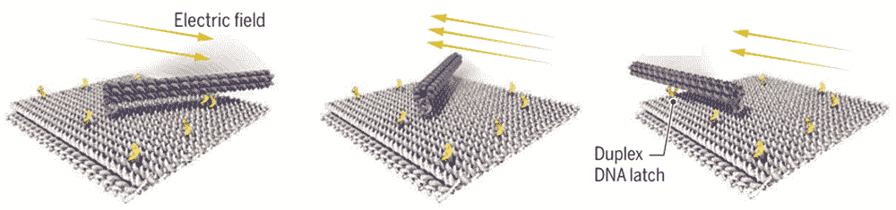

# 这些电控 DNA 机器人将使纳米工厂成为可能

> 原文：<https://thenewstack.io/electrically-controlled-dna-robots-will-make-nano-factories-possible/>

纳米技术正在各个领域取得引人入胜的飞跃，从[自折叠纳米手术](https://thenewstack.io/self-folding-mini-origami-robots-are-the-nanosurgeons-of-tomorrow/)，到[货物分拣 DNA 纳米机器人](https://thenewstack.io/cargo-sorting-dna-nanorobot-can-deliver-drugs-accurately-inside-body/)和[纳米机器人](https://thenewstack.io/personalized-drugs-delivery-may-super-fast-light-powered-nanosubmarines-will-deliver-drugs-quickly/)的潜在用途，它们可以将药物输送到体内的精确位置。但是在这项技术广泛应用之前，还有许多障碍需要克服，比如如何给纳米机器人提供动力、控制或推进。

现在，慕尼黑工业大学(TUM)的德国研究人员开发了一种创新方法，利用电场推动和远程控制小型折纸机器人，这些机器人是使用 DNA 链建造的。根据该团队发表在最近一期 [*科学*](http://science.sciencemag.org/content/359/6373/296) 上的发现，这种新方法使这些 DNA 纳米机器人的移动速度比传统生化技术快 10 万倍，这将使所谓的[纳米工厂](https://en.wikipedia.org/wiki/Molecular_assembler#Nanofactories)中的分子规模制造成为可能。

“建立一条纳米技术装配线需要一种不同的推进技术，”该论文的作者之一、TUM 研究员 Friedrich Simmel 教授说。“我们想出了完全放弃生化纳米机器转换的想法，以利于 DNA 结构和电场之间的相互作用。”

这些结果意义重大，因为传统的 DNA 纳米机器人推进方法速度很慢。由于这些机器人是用生物材料制造的，通过使用生物酶激活它们通常需要几分钟甚至几小时，这使得这种方法对于建立分子工厂来说太耗时了。但随着团队使用电场作为超快速推进的方法，这一障碍不再是一个问题。

“实验证明分子机器可以移动，因此也可以用电力驱动，”Simmel 说。“由于电子控制过程，我们现在可以在毫秒的时间尺度上启动运动，因此比以前使用的生物化学方法快 10 万倍。”

该团队的测试使用了一个 55 纳米乘 55 纳米的基于 DNA 的分子平台，该平台包含一个可扩展的机器人手臂，由带负电荷的 DNA 制成，尺寸为 25 纳米(或当完全扩展为纳米起重机时为 400 纳米)，并通过一个旋转的分子关节连接到基板，这使得手臂可以沿着水平面移动。

当完全伸展时，纳米机器人手臂成为纳米起重机，在电场的推动下，移动速度可以加快 10 万。

纳米机器人臂通过柔性接头连接到基座平台，并由电场控制。短的单链 DNA(黄色)充当“闩锁”，可以将手臂暂时锁定在预定的位置。

为了观察这些微小的手臂在电场的影响下可以移动多快，该团队使用了一种称为[fr ster 共振能量转移](https://en.wikipedia.org/wiki/F%C3%B6rster_resonance_energy_transfer) (FRET，也称为荧光共振能量转移)的技术，其中能量在两个光敏分子(也称为[发色团](https://en.wikipedia.org/wiki/Chromophore))之间转移。能量从电激发的“供体”分子转移到“受体”分子，驱动附着在平台上的短单链 DNA 之间的机器人附件，这些 DNA 起到“闩锁”的作用，从而将手臂限制在一定的运动范围内。为了保持臂在插销之间的连续运动，电场被反复切换。机器人手臂的尖端已经用染料分子做了标记，使科学家能够使用荧光显微镜观察手臂的运动。

在荧光显微镜下，机械臂在两个停靠点(红色和蓝色)之间的移动，带有紫色染料标记。

根据研究人员的说法，这种 DNA 纳米机器人可以加速执行各种任务，如分析生化样本，医学诊断或帮助创建个性化医疗或化学中的活性物质。

“纳米机器人既小又经济。Simmel 解释说:“数以百万计的传感器可以并行工作，在样品中寻找特定的物质，或者合成复杂的分子——这与装配线没有什么不同。”

该团队还认为，该系统可以扩大规模，并纳入结合微制造和自组装的混合系统，以创建真正的纳米工厂。此外，大量的这些 DNA 纳米机器人可以用于数字存储器的新创新，在纳米尺度上转移分子或纳米粒子，以及 3d 打印分子。这是一个令人兴奋的发展，可能对医学和其他领域产生巨大影响，也使微型纳米工厂的可能性——能够从分子水平上生产各种东西——更近了一步。

更，结束于*。*

 *图片:慕尼黑工业大学

<svg xmlns:xlink="http://www.w3.org/1999/xlink" viewBox="0 0 68 31" version="1.1"><title>Group</title> <desc>Created with Sketch.</desc></svg>*