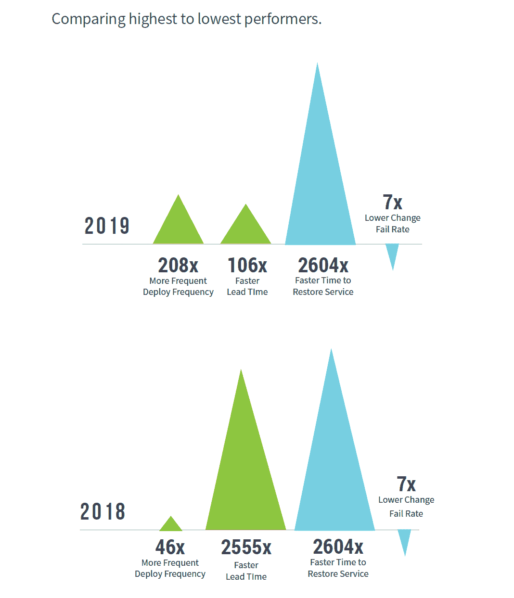
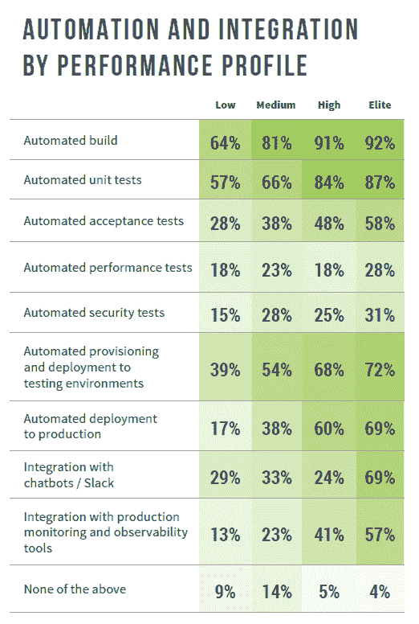

# 精英 IT 商店和低绩效 IT 商店之间的差距有多大？

> 原文：<https://thenewstack.io/elite-vs-low/>

由[的 Nicole Forsgren](https://www.linkedin.com/in/nicolefv/) 制作的最新 DORA DevOps 报告显示，表现最好和最差的公司之间的差距正在扩大。该报告对一个所谓的精英群体大做文章，该群体代表了在采用持续交付和其他最佳实践的公司工作的 21%的受访者。然而，如果你看看精英和高绩效者，这一群体实际上在该研究的受访者中下降了 55%至 44%。或许这种表现差距并不像报告得出的结论那样引人注目？

该报告使用聚类分析对受访者进行细分。当逐步比较低、中、高和精英群体时，一些指标似乎逐渐改善。然而，统计方法实际上并没有预测到这种改善，而只是表明这些公司有一套共同的特征。

来源:2019 年 DevOps 加速状态。

当比较组时，两种吞吐量的测量被证明是有问题的。对于许多部署来说，精英和低绩效者之间的差异急剧上升。这一指标的相关性可能正在下降。相反，从提交到生产部署的交付时间可能会更好，因为它实际上会影响与稳定性相关的指标。然而，从 2018 年到 2019 年，最差和最好的公司之间的差距急剧下降。没有实际的数据，我们无法确定，但这是最有可能的，因为即使是表现最差的公司也已经开始使用持续集成技术。此外，能够自动恢复到先前版本的能力似乎比快速部署新版本更有价值。在这方面，自去年以来恢复时间没有改善，因为“自动”可以改善多少？

我们注意到，当集群从低水平向精英水平发展时，其自动化和集成流程的采用发生了显著变化。如前所述，一些度量标准逐渐改进，但是没有改进的方法也很有趣。这些组与自动化性能或安全性测试的存在之间几乎没有关联，这表明这些实践并不像一些 DevSecOps 支持者让我们相信的那样与 DevOps 有太多关联。69%的精英执行者使用聊天机器人和/或 Slack 与 DevOps 工具的集成，但在其他所有人中只有不到三分之一的人使用。对我们来说，这表明 chatbot 集成更多地与一般技术最佳实践相关，而不是与实现 DevOps 相关的目标相关。

来源:2019 年 DevOps 加速状态。

通过像素的特征图像。

<svg xmlns:xlink="http://www.w3.org/1999/xlink" viewBox="0 0 68 31" version="1.1"><title>Group</title> <desc>Created with Sketch.</desc></svg>