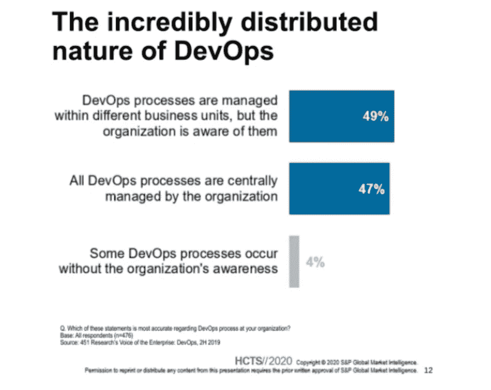
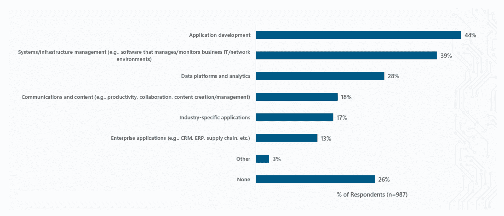

# ELK 和开源在企业中的作用

> 原文：<https://thenewstack.io/elk-and-the-role-of-open-source-in-the-enterprise/>

 [乔纳·科沃尔

乔纳·科沃尔是 Logz.io 的 CTO，他拥有超过 15 年的终端用户经验，横跨初创公司和企业，专门从事安全和运营工作。2011 年，他加入 Gartner，担任研究副总裁，专注于可观察性研究，并为 IT 领导者和首席信息官提供建议。2015 年加入 AppDynamics 领先产品战略。思科收购 AppDynamics 后，Jonah 加入 Kentik 担任首席技术官，负责制定和执行产品愿景和战略。](https://www.linkedin.com/in/jkowall/) 

我总是很好奇企业中开源的触发器是什么。我们都有想法，我每天在讨论中从开源的客户和用户那里听到很多事情。作为一名分析师，它总是感觉像一个工程师对技术的有机吸收，然后继续扩展。正如我们所说的“工程师希望开源”，但这更像是工程师更喜欢使用开源来解决他们遇到的问题。

作为一名工程师，我发现当使用最容易访问的工具时，解决一个特定的问题更容易，这些工具可以很容易地从社区中下载。例如，它经常迫使从事系统工作的人使用古老的编辑器，比如“vi”(我们越来越喜欢它)。DevOps 的激增和当今团队运作的分散化方式通常会在技术选择上给予单个团队成员很大的自主权。最近的 451 项研究调查数据显示了集中化方法和分散化方法之间的斗争:

这些团队使用大量的工具和技术。一些正在使用的工具是标准化的，但是许多团队会使用他们想要的工具来解决手头的问题。企业标准的创建和设计是为了避免将来出现问题，但它们也进展缓慢，常常跟不上应用程序或基础架构堆栈的变化水平。许多团队将利用和支持用于监控、自动化和其他组件的开源工具来解决问题。虽然自动化本身是一个完整的主题，但正如 451 Research 调查显示的那样，监控工具是开源的热门选择。

来源:451 Research，企业之声:数字脉搏，2018 年供应商评估

最受欢迎的开源工具包括 ELK search stack、Grafana、Prometheus、Jaeger 和许多其他工具，它们是可观测性生态系统的一部分。

在典型的组织中，这些独立的实例会带来许多挑战和浪费。这是低效的，但是无论有没有集中的 IT 团队，团队都必须前进。当出现安全问题、收购、人才流失或需要将精力投入到构建新事物时，这个问题就变得更大了。开源堆栈的质量可能会受到影响，这导致了一些重大问题。

这在 ELK 堆栈中最为常见，该堆栈自 2012 年左右开始使用，并被迅速采用，以减少使用昂贵的专有软件来进行日志聚合。ElasticSearch 已经成为一个流行的数据库和后端来索引各种内容，包括日志文件。可以理解的是，当 Jaeger 开源时，第一个添加的东西就是弹性搜索支持。

这允许用户运行一个单一的数据库来满足日志、跟踪和其他搜索需求。不久之后，ElasticSearch 成为 Jaeger 最受欢迎的后端。然而，Elastic 为增加收入而做出的令人困惑的许可变更将导致社区转向新的 Apache 2.0 许可分叉。这些开源工具的用户不会支持使用限制性的非开源许可，尤其是 SSPL。

索引数据与构建更聪明的方法来召回数据之间的平衡和需求一直是大数据平台中的一个不断变化的趋势。例如，ElasticSearch 中的数据提供了快速和广泛的数据搜索和检索，但如果使用其他有针对性的方法来查询数据，如 Loki 等技术，速度可能会更快。ElasticSearch 的新分支将专注于优化运营成本，这意味着更低的内存消耗和更低的存储消耗。这种关注将使该技术对构建该技术的人以及操作该技术的人更具吸引力。

另一个缺点是 ElasticSearch 与 Kibana 紧密耦合。这意味着您必须同时升级两者，并且版本之间存在突破性的变化，这给部署和维护这些伟大技术的人带来了许多挑战。Kibana 的新分支将解决这一问题，为工程师提供更多自由来使用他们想使用的工具。

我们使用 ElasticSearch 作为核心技术来交付 [Logz.io](https://logz.io/) ，我们已经这样做了好几年。我们的许多用户试图在内部运行或缩放 ELK、Grafana 和 Jaeger，但他们经常遇到复杂的问题。毕竟，即使对于拥有杰出工程人才的组织来说，检测和故障排除也是一项挑战。监控系统的正常运行时间必须比它所监控的服务和基础设施长，这一点非常重要。如果监控系统不可用，而您的系统也不可用，故障排除就会变得很困难，甚至不可能。另一个挑战是，当被监控的系统出现问题或受到攻击时，它们通常会发送大量数据，尤其是日志，这反过来会加重无法适应需求的可观测性系统的负担，通常会导致可观测性系统中断。

让我们来看看我们经常从自己管理 ElasticSearch 的用户那里听到的一些担忧。这些挑战也与 ElasticSearch 的许多云服务相关，因为它们通常需要您管理集群、数据管理或其他技术的各个方面，这些技术是堆栈的一部分:

*   第一步是将数据输入可观测性系统。ElasticSearch 可能是一个巨大的挑战，因为它必须将数据映射成后端支持的格式和模式。如果字段不匹配，数据将被丢弃，或者群集的性能可能会很差。由于这个问题，许多组织丢失了他们的大部分数据。我们采取了一种独特的方法来重新摄取和重新格式化 Kafka 层中的数据，但这都是定制开发的软件来处理这个问题。
*   维护任务包括保持系统最新，升级 Kibana 和 ElasticSearch 以及 Kafka 和其他组件。升级对于安全补丁和软件改进至关重要。通常，您需要一个测试系统来确保升级工作。这会占用其他任务更多的时间。
*   数据平衡任务包括出于归档目的将索引从较快的节点迁移到较慢的节点，或者通过将数据移动到旋转磁盘或其他成本较低的存储节点来节省集群中的成本。
*   常见的性能问题首先通过实现指标收集(最常用的是 Prometheus)来识别。那么，ElasticSearch 和 Kafka 的监测会让你对这些问题有所洞察。Logz.io 基础设施监控也是收集这些数据的绝佳选择！
*   性能问题的第一个迹象是当 Kibana 变得迟缓。这通常是因为没有用于查询或数据访问的正确的 ElasticSearch 节点。它还可以显示磁盘 IO 中的瓶颈。这些硬件变化和集群变化通常很难隔离和修复。
*   集群可能状态良好，但数据没有以正确的方式剥离。即使使用 SaaS 服务，调整分片和复制通常也是您必须做的事情，这可能会导致性能问题或查询问题。
*   在 Kafka 层，队列可能开始建立，显示对 ElasticSearch 的写入延迟。有时，由于资源限制或数据可访问时的大量延迟，数据可能会被丢弃。

正如您所知，这些类型的性能和维护问题非常耗时，并且难以解决。运行多个监控系统来相互监控对于团队来说是一项艰巨的任务，这也是 SaaS 服务越来越受欢迎的原因。尽管如此，使用开源软件自己做是解决可观察性和监控需求的最常见方式。

我们希望新的 fork 和我们联合起来的社区大脑能够纠正和改善这些挑战。亚马逊网络服务(AWS)已经在 [OpenDistro](https://opendistro.github.io/for-elasticsearch/) 中做了很多这方面的工作，但是有一个更好的基础将会有很大的帮助。

同样，在开源 Grafana、Jaeger 和其他正在使用的组件上也有其他问题需要排除，特别是需要维护的任务。这可能会让工程师和开发人员远离为业务增加价值的任务。随着时间的推移，开源监控的管理可能会成为主要的干扰和资源消耗。

在 Logz.io，我们确保用户不必处理这些问题，我们为我们的客户管理所有开销，从免费用户到我们最大的客户。我们通过运行多租户系统来实现这一点，从而避免了数据激增带来的规模挑战。

建立和运行这个系统是困难的。我们每天都在学习，并为客户提供高质量的服务。这一直是我们的关注点和目标，同时我们也在不断改进我们使用的开源工具和服务。我们期望开源变得越来越好，越来越容易，但是当处理规模的时候，它总是一个学习的过程。我们将与您一起不断学习，并在任何地区的任何云上向市场提供最好的开源解决方案。

通过 Pixabay 的特征图像。

<svg xmlns:xlink="http://www.w3.org/1999/xlink" viewBox="0 0 68 31" version="1.1"><title>Group</title> <desc>Created with Sketch.</desc></svg>