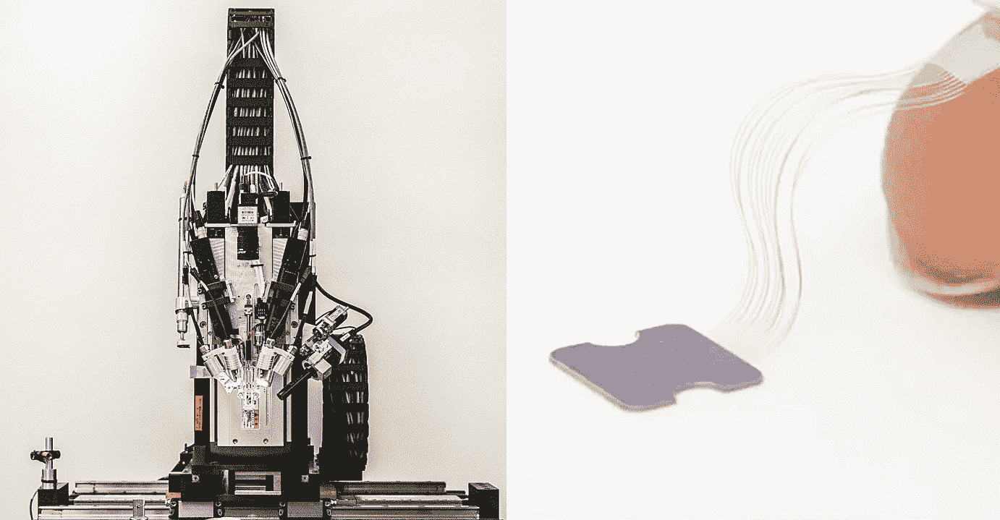
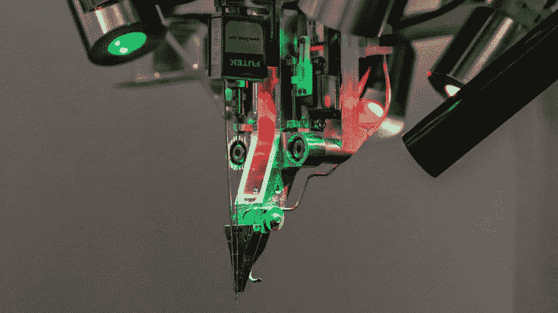
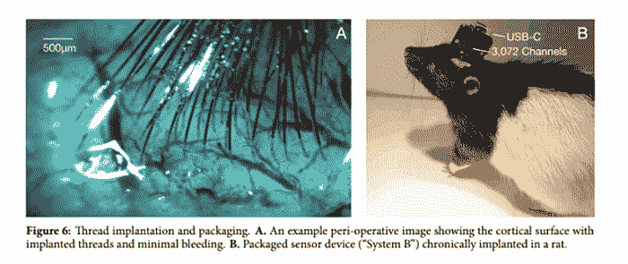

# 埃隆·马斯克的 Neuralink 大脑读取“线程”将被机器人植入

> 原文：<https://thenewstack.io/elon-musks-neuralink-brain-reading-threads-will-be-robotically-implanted/>

用人工智能增强自己或用自己的思想控制机器是主要局限于科幻小说领域的想法。然而，随着越来越先进的人工智能的出现和脑机接口的发展，这些异想天开的梦想正在成为截然不同的可能性。但是目前大多数脑-计算机接口的问题是，它们通常需要侵入性手术来植入相关设备。虽然有[非侵入式脑机接口](/control-robotic-arm-mind-using-machine-learning/)正在开发中，但它们仍有缺点，如数据传输量低和信号准确率不理想。

希望解决这些挑战的是神经技术初创公司， [Neuralink](https://www.neuralink.com/) ，它的目标是在未来几年内开发微米级的大脑-机器植入物。本周早些时候，该公司公布了他们的最新进展:超薄、灵活的神经“线”，不仅可以传输大量数据，还可以减少大脑被目前用于类似接口的更坚硬的电极针损坏的机会。哦，我们有没有提到 Neuralink 还开发了一种专门的机器人，可以通过手术插入这些神经线？

## 治疗脑部疾病并跟上人工智能

在本周早些时候发布的一份直播声明中，Neuralink 联合创始人埃隆·马斯克首次公开概述了由神经线、微芯片和传感器组成的系统背后的一些细节。马斯克是一位连续创业者，他因对人工智能横行的潜在危险持谨慎态度而闻名于世。他表示，该设备可能会治疗神经障碍，并帮助残疾人在没有帮助的情况下操作他们的设备。

根据 Musk 和 Neuralink 团队的[白皮书](https://www.documentcloud.org/documents/6204648-Neuralink-White-Paper.html)的说法，这里的主要进步是神经线的灵活性，以及“高带宽”脑机接口系统的前景，该系统可以很容易地扩大规模，减少数据失真，降低脑组织炎症反应的风险。

到目前为止，该团队的技术包括构建“小型柔性电极‘线’阵列”，每个阵列有多达 3072 个电极分布在 96 条线上。”除了增加可以插入人脑的电极数量，这些导电聚合物线的宽度在 4 到 6 微米之间，比其他可植入电极更有效地读取神经活动。这些神经线将在一个特殊设计的手术机器人的帮助下被编织到脑组织中，该手术机器人能够插入六根线(即 192 个电极),精度达到微米级——比标准程序相对更快。因此，尽管仍然需要一些手术，但这些线的灵活性意味着它们更具生物相容性，不会像其他电极那样容易降解，而且颅骨中灰质的任何移动都不会撕裂线，也不会伤害脑组织——所有这些都是传统脑机接口的问题。

左图和下图:Neuralink 专门设计的手术机器人。右图:附着在指尖的神经“线”。

除了这些线程，该团队还计划进一步完善该系统，以包括一个微型外部接收器，使该系统能够在系统的嵌入式微芯片(用于放大和数字化大脑信号)与外部设备和应用程序之间进行无线通信。目前，该系统通过 USB-C 使用有线连接，到目前为止，该团队在动物身上进行的 19 次手术实验已经在记录神经活动的动态峰值方面提高了 85.5%。

当然，仍有一些问题需要解决，因为该公司希望在 2020 年前开始在人类患者身上测试他们的系统，称他们将专注于患有严重医疗问题的对象，如脊髓损伤导致的瘫痪。然而，这是一个相当雄心勃勃的目标，因为 Neuralink 尚未经历获得 FDA 批准进行此类试验的漫长过程，他们的论文也有待该领域其他专家的同行评审。

无论如何，这个原型指出了一种可能性，即有一天人类可能真的会发现自己与机器处于一种无缝的共生关系中，在这种情况下，仅仅一个想法就可以让我们控制机器——或者有可能被它们控制。尽管如此，马斯克坚信人机共生是唯一的选择:“我认为这在整个文明范围内都很重要。即使在良性的 AI 下，我们也会被甩在后面。有了高带宽的脑机接口，我们就可以选择顺其自然。[..]这有一个非常好的目的，那就是治愈疾病，并最终确保人类的未来。”

在团队的[论文](https://www.documentcloud.org/documents/6204648-Neuralink-White-Paper.html)中阅读更多内容，在这里观看 Neuralink 的直播活动[。](https://youtu.be/r-vbh3t7WVI)

图片:Neuralink

<svg xmlns:xlink="http://www.w3.org/1999/xlink" viewBox="0 0 68 31" version="1.1"><title>Group</title> <desc>Created with Sketch.</desc></svg>