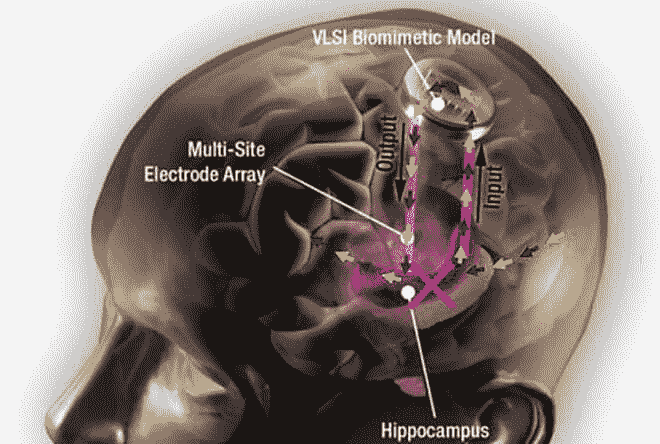
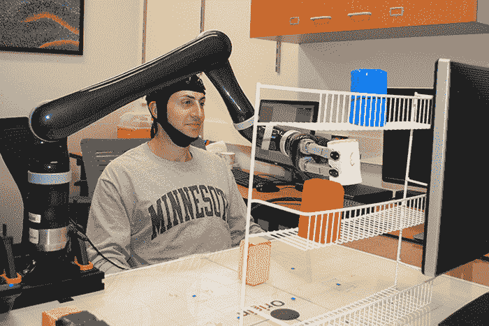
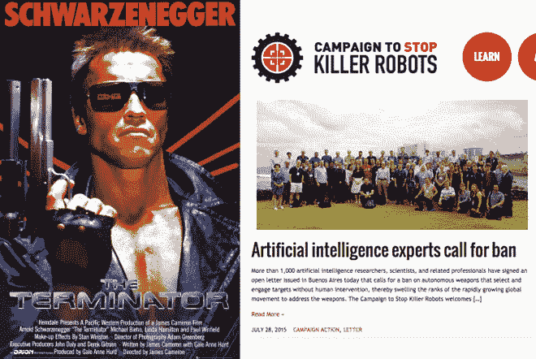

# 埃隆·马斯克的 Neuralink 希望用超智能人工智能来增强人类

> 原文：<https://thenewstack.io/elon-musks-neuralink-wants-enhance-humans-symbiosis-superintelligent-ai/>

你可能听说过 [SpaceX](http://www.spacex.com/) 和[特斯拉](https://www.tesla.com/)首席执行官埃隆·马斯克最近推出了 [Neuralink](https://www.neuralink.com/) ，这是一家旨在开发植入式脑机接口(BCIs)的神经技术初创公司。这些界面不仅有助于在未来治疗大脑疾病，还可以提高人类的智能，使其不会被人工智能甩在身后——正如我们所见，人工智能在过去几年中发展迅速，在曾经被认为对机器来说过于复杂的任务上击败了人类。更大胆的是，马斯克表示，该计划是在未来四年内将“微米级”脑机接口推向市场。

此前，这位企业家表达了对开发人工超级智能的危险的担忧，这种智能可能会变得肆无忌惮并毁灭人类。马斯克认为，人工智能是我们“最大的生存威胁”，为了应对这一威胁，人类的智能也必须得到增强，以平衡胜算。

“人工智能显然将大大超过人类的智力，”马斯克在 Neuralink 上发表了一篇冗长但内容丰富的 3.8 万字[帖子](http://waitbutwhy.com/2017/04/neuralink.html)，告诉博客作者蒂姆·厄本*等等，但为什么要这么做。“在那一点上有一些风险，一些不好的事情发生了，一些我们无法控制的事情，人类在那一点之后无法控制——要么是一小撮人垄断了人工智能的权力，要么是人工智能变得流氓或类似的事情。”*

## 欢迎来到巫师时代

Urban 应 Musk 的邀请与 Neuralink 团队坐在一起，撰写并阐释了这篇深入(有时是半开玩笑)的文章，探讨了围绕该问题的一些文化、科学和伦理背景，并调查了 BCIs 领域已经做了什么，从本地场电位工具到基于 EEG(脑电图)的方法。

Urban 将 Neuralink 项目比作创造一个“巫师的帽子”，它将迎来一个几乎神奇的新“巫师时代”，在这个时代，我们可以即时访问人类的集体知识，并通过这些接口在大脑或机器之间直接交流，而不需要口语或书面语。

用于刺激学习和长期记忆保持的内核脑假体

## “我们已经是电子人了”

丰富多彩的夸张？也许吧。但是为了说明为什么脑机接口仅仅是正在进行的人类进化的延伸，人类进化已经产生了“神奇”的东西，如语言、文字、印刷文字、电、电话、无线电等等，Urban 指出，我们的生物大脑由“层”组成，如脑干和小脑、边缘系统和皮层。

今天，我们的学习和决策能力已经被我们所掌握的现代工具放大了:一个新的智能设备和服务“层”赋予了我们超人的力量，这是过去的人无法想象的。因此，增加另一个接口——尽管是在大脑中——实际上并不那么遥不可及。通过增强我们的大脑并将其与计算机融合，它们成为我们使用的另一种设备，就像我们的智能手机一样。

“从某种意义上说，我们已经有了数字第三层，你有你的电脑或手机或你的应用程序，”马斯克说。“你可以通过谷歌问一个问题，然后立刻得到答案。你可以阅读任何书籍或音乐。[..]我认为，人们现在没有意识到的一点是，他们已经是一个电子人……(如果)你把手机落下，就像患了缺肢综合症。我认为人们——他们已经和他们的手机、笔记本电脑、应用程序和一切东西融为一体了。”

使用 EEG(脑电图)和机器学习来控制机械臂的非侵入式脑机接口。

## 跨栏和巨魔

但是有相当多的障碍。忘掉创造一个能够连接人类进行完全直接的脑对脑交流的 BCI 的希望吧。首先，创造一种具有足够带宽的设备来记录足够多神经元的“高分辨率”活动，以实现超越串连一行文本的重要内容甚至还不可能。植入这些东西需要侵入性手术是另一个原因；除非我们找到一种方法来解决不得不打开你的头骨来插入这些设备的问题，否则许多人是否会广泛采用这种改进是值得怀疑的。设备的生物相容性和使其无线化的需要是 Neuralink 团队和其他组织必须解决的其他大问题。

但即使克服了这些障碍，Urban 仍在推测未来“全脑接口”的一些黑暗可能性，这将促进与云的直接无线通信，以及与其他接口个人的思想和情感传输:“一如既往，当巫师时代到来时，世界上的阴茎将尽最大努力破坏一切。巨魔可以有一个公平的外野手日。电脑会崩溃。[通常]这不是世界末日，[但]你不能得到一个新的头。[..]电脑可以被黑。除了这次他们可以接触到你的思想、感官输入和记忆。”

一想到有人可以侵入你的电脑空间，这种想法的确令人恐惧。如果政府可以通过大脑攻击另一个国家的网络集体，就没有必要使用炸弹。对许多人来说，这种未来的可怕迹象足以呼吁暂停出于军事目的的自主人工智能研究——这正是马斯克和其他名人如斯蒂芬·霍金和比尔·盖茨几年前所做的事情。

## 为什么共生是下一个最好的东西

尽管有这些令人担忧的场景，人工智能的进化仍然在飞速前进。今天的 AI 可能是[在围棋](https://thenewstack.io/alphagos-win-human-go-champion-means-ai/)或者[扑克](https://thenewstack.io/computers-can-now-bluff/)上击败人类；明天，它可能会在总体智力上超越人类，并以意想不到的方式自主进化，这可能会威胁到人类的生存。因此，马斯克认为人类和人工智能之间需要一种更加共生的关系。

“我们越分离——人工智能越‘另类’——它就越有可能攻击我们，”他警告说。“如果人工智能都是独立的，比我们聪明得多，你如何确保它们没有违背人类最佳利益的优化功能？…如果我们实现了紧密的共生关系，人工智能就不会是“其他人”——它将是你，并且与你的大脑皮层的关系类似于你的大脑皮层与你的边缘系统的关系。”

想到人类在这个问题上可能没有太多选择，这很可怕，尽管在这种共生关系成为可能之前，研究和工程还有很长的路要走。马斯克似乎确信，既然超级智能人工智能的创造几乎是有保证的，那么下一个最佳策略就是影响这个过程，以便它不会被那些意图可疑的人劫持。

因此，我们看到马斯克参与非营利人工智能研究实验室 [OpenAI](https://www.openai.com/) 以创造“友好”的人工智能，以及 SpaceX 的长期愿景是建造将人类带到火星的火箭——以防我们需要逃离地球。话虽如此，但如果有平衡因素和意外事件发挥作用，事情可能不会像他们可能的那样可怕，正如马斯克显然试图做的那样。

马斯克说:“我试图在人工智能领域真正敲响警钟有一段时间了。”“但这显然没有任何影响(笑)，所以我就想，‘哦，好吧，好吧，那我们必须努力以一种好的方式来帮助开发它。’"

图片:[on innovation](https://flic.kr/p/7B4Ufs)([CC BY-ND 2.0](https://creativecommons.org/licenses/by-nd/2.0/))，Kernel，明尼苏达大学，[终结者](https://www.imdb.com/title/tt0088247/)，[阻止黑仔机器人的战役](http://www.stopkillerrobots.org/)。

<svg xmlns:xlink="http://www.w3.org/1999/xlink" viewBox="0 0 68 31" version="1.1"><title>Group</title> <desc>Created with Sketch.</desc></svg>