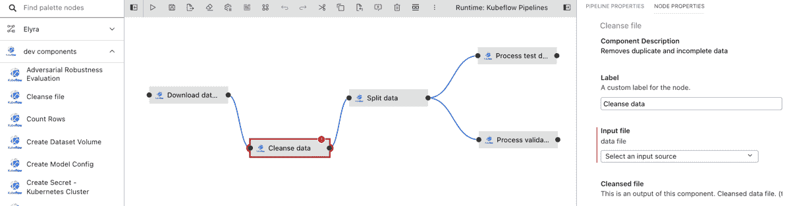

# Elyra 的 Jupyter AI 管道现在支持定制组件

> 原文：<https://thenewstack.io/elyras-jupyter-ai-pipelines-now-support-custom-components/>

[Elyra](https://github.com/elyra-ai) ，人工智能(AI)工具包，由 [IBM](https://www.ibm.com/cloud?utm_content=inline-mention) 于 2020 年初首次发布，帮助数据科学家完成构建 AI 管道的艰难过程。正如他们在该工具的[介绍文章](https://developer.ibm.com/blogs/open-source-elyra-ai-toolkit-simplifies-data-model-development/)中所写的，“为一个模型建立人工智能管道是困难的。分解和模块化管道更加困难。”数据管道可以包括许多步骤，有些步骤依赖于其他步骤，创建这个管道可能超出了数据科学所需的核心技能。Elyra 通过提供可视化界面解决了这一问题，该界面将创建和更改数据管道变成了一种熟悉的体验。

[https://www.youtube.com/embed/Nj0yga6T4U8?feature=oembed](https://www.youtube.com/embed/Nj0yga6T4U8?feature=oembed)

视频

IBM 开源数据和人工智能技术中心的开发者倡导者 Patrick Titzler 解释说，Elyra 允许用户将基本的构建模块(Jupyter 笔记本、Python 脚本和 R 脚本)组装到一个管道中，让他们依次、并行或以其他方式执行任务。

“如果你经历一个机器学习工作流，你可能必须加载数据，分析数据，清理数据，然后建立模型，训练模型，调整模型。然后，当结果没有真正达到你的期望时，你可能不得不回去。“使用管道编辑器，您可以使用简单的拖放操作来创建这些管道，然后配置该管道中的节点。因此，它加快了您的开发，因为您不必编写任何自定义代码来运行管道中的所有组件或节点。此外，它使人们能够实际做这些事情，而不需要有深厚的领域专业知识。”

这可以说是该项目的最重要的特性，但是构建模块仍然局限于这三种类型。然而，随着[最近发布的 Elyra 3.3](https://medium.com/ibm-data-ai/elyra-3-3-pipelines-custom-components-and-catalogs-74cf198fdf48) ，用户可以使用定制组件创建管道，Titzler [写道](https://medium.com/ibm-data-ai/elyra-3-3-pipelines-custom-components-and-catalogs-74cf198fdf48)这一功能是“我们路线图上的一个重要里程碑。”

以前，Elyra 用户可以将他们自己的 Jupyter 笔记本或脚本连接在一起，但他们无法访问外部组件，例如那些在 [Kubeflow Pipelines](https://www.kubeflow.org/docs/components/pipelines/) 或 [Apache Airflow](https://airflow.apache.org/) 中可用的组件，这两个平台用于运行 Elyra 目前支持的管道。例如，下图显示了 Elyra 中 Kubeflow 管道现在可用的组件，包括创建数据集卷或计算行数等内容。

可以通过这些更改添加到 Elyra 的一组组件的另一个例子是[机器学习交换](https://github.com/elyra-ai/examples/blob/master/component-catalog-connectors/mlx-connector)，它为 Kubeflow 管道提供了开源数据和 AI 资产目录和执行引擎。Titzler 还指出了用于人工智能、机器学习、ETL 和数据科学的[组件库(已声明)](https://community.ibm.com/community/user/datascience/events/event-description?CalendarEventKey=41e789d8-0a20-4c30-83f6-b6964771bc4a&CommunityKey=f1c2cf2b-28bf-4b68-8570-b239473dcbbc&Home=%2Fcommunity%2Fuser%2Fibmcommunity%2Fhome)作为一个例子。要求保护的是一套 Jupyter 笔记本电脑，可以执行数据加载、数据转换或模型训练等任务，并且可以在 Elyra 中使用。现在可以通过简单地克隆声明的存储库来使用声明的，然后可以在管道编辑器中打开该存储库中的管道以供立即使用。

Titzler 警告说，定制组件在几个方面不同于 Elyra 中的其他组件。首先，它们是运行时特定的，通常使用运行时特定的机制与其他组件交换数据，而不是通用组件使用的 S3 兼容存储。它们也需要单独管理，是黑箱。虽然可视化管道编辑器可以公开它们的输入和输出，但它不一定能够访问功能本身。

目前，就管道编排而言，Elyra 只支持本地执行、Kubeflow 管道和 Apache Airflow，但是 Titzler 说，整个社区正在增加其他管道。他说他听说了对《雷》和《逃离德黑兰》的兴趣，但是目前这些方向的任何进展都取决于社区的努力。

展望未来，Titzler 说，该项目有“一个来自各种来源的愿望清单”，但改进可视化编辑器和增加可用性是当前的愿望之一。

<svg xmlns:xlink="http://www.w3.org/1999/xlink" viewBox="0 0 68 31" version="1.1"><title>Group</title> <desc>Created with Sketch.</desc></svg>