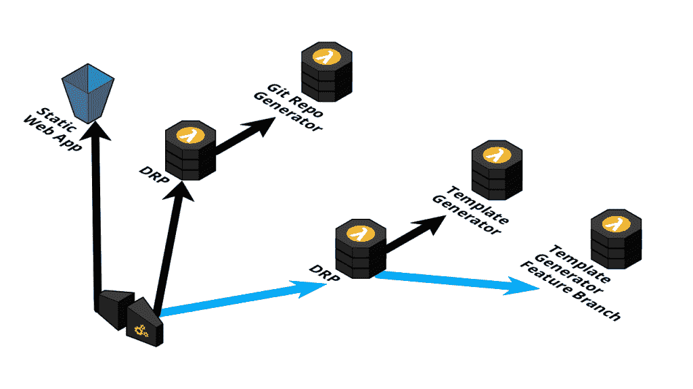
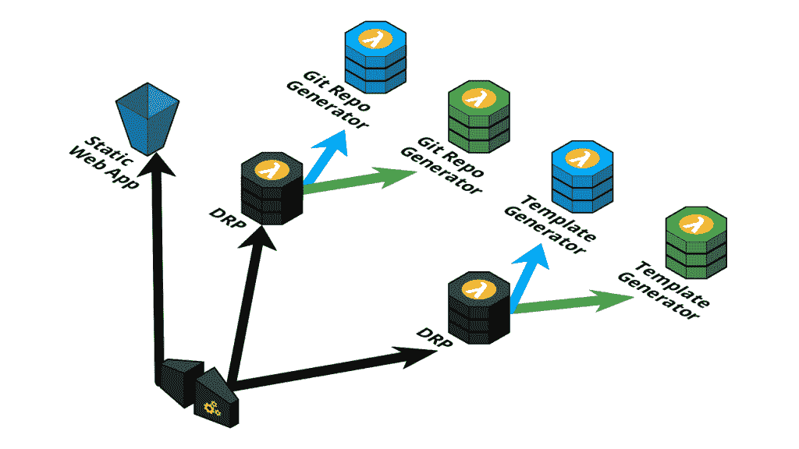
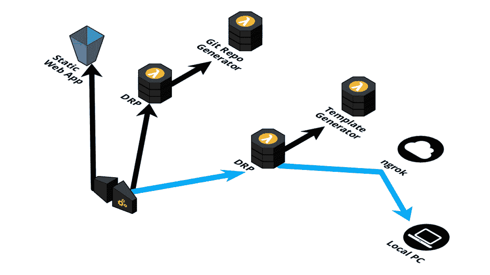

# 在生产中接受测试

> 原文：<https://thenewstack.io/embracing-testing-in-production/>

在 Octopus，我们最近开始了一项新的计划，提供构建固执己见的 [GitHub Actions 工作流](https://githubactionsworkflowgenerator.octopus.com/#/)和 [Jenkins Pipelines](https://jenkinspipelinegenerator.octopus.com/#/) 的工具，以帮助客户实施他们的持续集成和持续交付(CI/CD)工作流。

团队很小(我)，期限很紧，工具被设计用来构建定制的脚本和模板，它们自己构建更多的脚本和模板来在被证明不切实际的本地仿真平台上执行。

 [马特·卡斯帕森

从我的第一台 Commodore 64 开始，我就爱上了技术，这种激情一直延续到今天。作为首席内容工程师，我每天都在用 Octopus 集成企业平台，为 Kubernetes 等平台编写指南和书籍，写博客，培训我的同事，测试前沿开源项目，并为各种博客投稿。](https://www.linkedin.com/in/mattcasperson/?originalSubdomain=au) 

我发现写代码是一种非常令人沮丧的经历。Linters 和编译器只对最终输出有用，但对我的原始模板没有什么帮助，因为它们充满了标记语法，这通常使它们成为最终输出的无效示例。我也不清楚最终结果应该是什么样子，而是快速连续地迭代测试许多小的变化。

使问题更加复杂的是，执行模板的目标平台 GitHub Actions 没有健壮的离线选项。一些[有趣且活跃的开源项目](https://github.com/nektos/act)涌现出来填补了这一空白，但我更喜欢直接在 GitHub 中验证我的模板。

最后一个障碍是开发这些工具的微服务架构。模板生成器前面是方便且经过良好测试的基于 web 的界面和服务，它们代表最终用户将文件推送到 GitHub。当然，我可以在一个隔离的测试循环中自动化输入 git push 的过程，但是我确实想知道是否有更好的方法来重用已经实现了这个过程的服务。

不出所料，互联网上的大多数建议都恳求我隔离、记录、重放、模仿、替代和自动化我的测试和开发工作。Mitchell Hashimoto 最近的一篇 Twitter 帖子很好地总结了这一点:

> 我经常向更多的初级工程师推荐:在不运行软件的情况下构建特性 X。打开一个公关，自信地说“这有效”，而不必看到它的效果。这有助于建立理解、信心，并迫使编写可测试的代码。

我完全同意这种说法。与此同时，我真正想做的是利用部署到共享环境中的现有微服务堆栈，同时在本地运行我正在调整和调试的微服务。这一过程将消除为了孤立的本地开发而重新实现实时集成的需要，这是很有吸引力的，因为无论如何，这些实时集成将是任何自动化测试中第一个被测试副本取代的东西。它还会在我正在处理的代码和验证输出的外部平台之间创建一个紧密的反馈循环，这对于那种“*糟糕，我用错了引号，让我来修复一下我发现自己所处的“*工作流”是必要的。

## **寻找灵感**

我在谷歌上搜索到“[为什么我们在优步的微服务架构中利用多租户](https://eng.uber.com/multitenancy-microservice-architecture/)”，这让我对优步如何发展其微服务测试策略有了深入的了解。

这篇文章描述了并行测试，包括创建一个与生产环境隔离的完整测试环境。我怀疑大多数开发团队都熟悉测试环境。然而，这篇文章继续强调了测试环境的局限性，包括额外的硬件成本、同步问题、不可靠的测试和不准确的容量测试。

另一种方法是在生产中测试。该职位确定了支持此类测试的要求:

生产测试中出现了两个基本要求，这也是多租户架构的基础:

*   流量路由:能够根据流经堆栈的流量类型来路由流量。
*   隔离:能够可靠地隔离测试和生产之间的资源，从而不会对业务关键型微服务产生副作用。

将测试流量路由到特定的隔离微服务的能力正是我所寻求的。它消除了在本地重新创建整个微服务堆栈和支持平台以进行测试的需要，同时不会影响任何生产流量。

唯一的问题是如何用 AWS Lambdas 实现这一点，它托管我们的微服务。

## **寻找现有解决方案**

不幸的是，虽然 Kubernetes 平台可以通过服务网格等高级工具将这种路由视为理所当然，但 Lambdas 却没有这样的生态系统。 [Lambda 扩展](https://aws.amazon.com/blogs/compute/introducing-aws-lambda-extensions-in-preview/)非常接近，但专注于收集指标或修改执行环境[，而不是像 Kubernetes 使用 sidecars 那样拦截和修改网络流量](https://acloudguru.com/blog/engineering/aws-lambda-is-winning-but-first-it-had-to-die):

你可以部署多功能 Lambda 层来管理大型二进制文件，或者(现在在预览版中)部署 Lambda 扩展来插入第三方代理，我被告知这些代理绝对不应该被认为是“Lambda 的辅助工具”

[AWS 应用程序 Mesh FAQ](https://aws.amazon.com/app-mesh/faqs/) 没有提到 Lambdas，虽然在 StackOverflow 这样的网站上有许多关于 Lambda 流量动态路由的问题，例如[这里](https://stackoverflow.com/questions/64341967/aws-api-gateway-routing)和[这里](https://stackoverflow.com/questions/69250798/api-gateway-forward-request-to-the-right-endpoint)，但回应总是“*你只能靠自己了*”

## **定义问题**

我试图解决的问题传统上属于反向代理的领域。然而，与具有丰富的、静态的、服务器端规则的传统反向代理不同，我需要的是一个相当笨的反向代理，它实现嵌入在测试请求中的路由规则。

这种愚蠢的反向代理(DRP，或者更好的说法是“derp”)需要作为 Lambda 部署，并且需要能够将流量转发到上游 HTTP 服务器、Lambda 甚至亚马逊简单队列服务(SQS)队列。展望未来，如果 DRP 可以与其他平台(如 Azure 或 Google Cloud)集成，那也不错。

Go 是构建 DRP 的最佳选择。它已经有了一个包含在标准库中的 HTTP 反向代理(HTTP reverse proxy )( HTTP reverse proxy )( HTTP reverse proxy )( HTTP reverse proxy )( HTTP reverse proxy )( HTTP reverse proxy )( T18 ),可以在很短的冷启动时间内编译成本地二进制文件，并且非常受欢迎，足以为主要的云提供商提供一流的 SDK。

## **决定路由规则**

假设路由规则包含在每个测试请求中，那么将它们包含在 HTTP 头中是有意义的。当然可以在 HTTP 头中发送复杂的对象，比如 JSON blobs，但是更好的解决方案是允许将路由规则定义为一个简单的字符串。

规则采用 route `[/path/to/resource:METHOD]=destination[destinationname]`的形式，其中:

*   `/path/to/resource`是一个 HTTP 路径，可选地支持 Ant 路径语法，例如`/path/**/resource`
*   `METHOD`是 HTTP 方法，如`GET`、`POST`、`DELETE`、`PATCH,`等
*   `destination` 是将流量重定向到的上游服务，例如`sqs`、`lambda`或`http`
*   `destinationname`标识上游服务，可以是 Lambda 名称、SQS 队列或 HTTP 服务器

多个这样的规则用分号连接在一起，形成类似于`route[/api/audits:GET]=http[https://1198-118-208-16-252.ngrok.io];route[/api/customers:DELETE]=lambda[CustomerLambda-MyFeatureBranch]`的头。

该字符串在`Routing`报头中被传递给每个微服务，并且每个微服务被期望与每个呼出一起传递该报头。在没有任何路由规则的情况下，DRP 将流量路由到默认的上游服务。

## **启用高级部署和测试模式**

这些路由规则提供了一些有趣的部署和测试场景。

通过部署具有唯一名称的特性分支 Lambda 来支持特性分支，例如`TemplateGenerator-MyFeatureBranch`，并将测试请求路由到特性分支 Lambda。

蓝/绿部署通过以下方式实现:将新的绿色微服务与现有的蓝色微服务并行部署，通过经由 DRP 路由测试请求来测试绿色堆栈，一旦测试通过，重新配置 DRP 以将默认上游服务设置为绿色堆栈中的服务。

也许最令人兴奋的是将测试流量从云网络路由回本地 PC 的能力。使用类似 [ngrok](https://ngrok.com/) 的服务，通过公共主机名或标准[客户端 VPN](https://docs.aws.amazon.com/vpn/latest/clientvpn-admin/what-is.html) 将本地端口暴露到 AWS VPC，可以将单个微服务的流量路由回您的桌面环境。很像 Kubernetes 提供的[网真](https://www.telepresence.io/)或[桥到 Kubernetes](https://docs.microsoft.com/en-us/visualstudio/bridge/overview-bridge-to-kubernetes) ，这有效地允许本地运行的微服务参与通过远程微服务栈传递的请求。

## **思考安全问题**

允许任何人基于众所周知的报头将流量路由到任何地方存在明显的问题，因此 DRP 被配置为仅检查`Routing`报头，如果请求伴随有 OAuth JavaScript Web Token (JWT)承载令牌，表明发送者是已知认知组的成员。如果 JWT 缺失或无效，则忽略`Routing`报头。这确保了只有受信任的团队成员才能路由生产流量。

## **生产中测试的 DevX 影响**

这种当地的发展经验非常有价值。它允许我使用稳定的生产环境，无需在本地重新创建完整的微服务堆栈和支持平台，同时还允许我在接收测试流量但在其他方面与生产流量相同的单个微服务上进行本地迭代。所有这些都是安全完成的，因为我们知道生产流量不会受到影响。

一个额外的好处是 API 网关中实现的所有逻辑都得到尊重。API Gateway 是一个复杂的平台，在流量到达上游服务之前，它提供了几乎无限的流量操纵选项。有可能[运行一个本地测试 API 网关](https://docs.aws.amazon.com/serverless-application-model/latest/developerguide/serverless-sam-cli-using-start-api.html)，但是现在没有必要进行设置。

然而，这种方法确实需要每个微服务公开一个 Lambda 事件处理程序来响应来自 API 网关的流量，并公开一个 HTTP 服务器来公开服务，同时进行本地调试。不过这并不是一个负担，因为所有现代框架都使得启动 HTTP 服务器变得很容易。实际上，这意味着那些沿着 DDD 层构建代码的人将拥有一个暴露 HTTP 和 Lambda 接口的[应用层](https://docs.microsoft.com/en-us/dotnet/architecture/microservices/microservice-ddd-cqrs-patterns/ddd-oriented-microservice#the-application-layer)，而较低层不知道流量是如何被接收的。

## **结论**

我完全期望我们将来部署的所有 Lambdas 都将在 DRP 后面托管。相对于稳定的生产微服务堆栈，本地开发和调试单个微服务的能力所带来的生产力提升是不可否认的。虽然生产中的测试不能替代全面的单元和集成测试，但它确实允许您快速重现和观察古怪的行为，并试验新的想法和解决方案。

DRP 源代码可在 [GitHub](https://github.com/OctopusSamples/content-team-apps/tree/main/go/reverse-proxy) 上获得。如果你觉得有用，请告诉我们！

<svg xmlns:xlink="http://www.w3.org/1999/xlink" viewBox="0 0 68 31" version="1.1"><title>Group</title> <desc>Created with Sketch.</desc></svg>