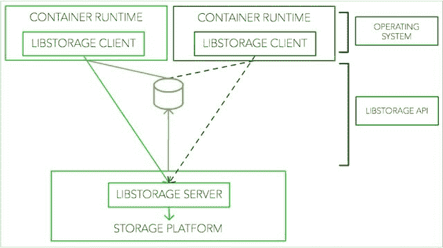
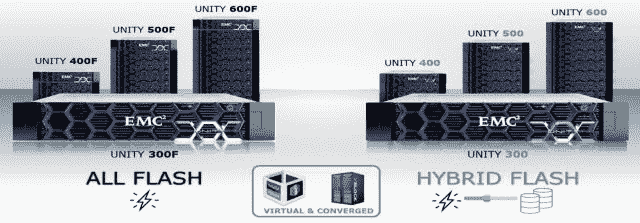
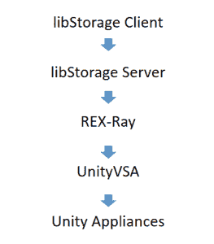

# 凭借 libStorage，EMC 为 Docker 的永久存储卷提供了一种替代方案

> 原文：<https://thenewstack.io/emc-pushes-alternative-dockers-persistent-storage-volumes/>

EMC 希望让存储成为容器世界的一等公民。

当 Docker Inc .去年推出其插件生态系统时，它为开发人员吹嘘的直接好处之一是启用持久存储容器的机制——以便托管活动数据库和其他必须无限期留在某个位置的服务。这是对一个由解决方案本身引入的问题的解决方案:无状态服务，根据定义，它不会留下任何东西，不会为在队列中占据其位置的服务提供活动上下文。这使得开发人员无法构建像基于容器的内容管理系统这样常见且必要的东西。

持久卷解决了这个问题，令 Docker 合作伙伴高兴的是，像 [ClusterHQ](https://clusterhq.com/) 似乎完全解决了有状态问题。有一段时间，存储系统市场似乎接受了这个想法。一旦 ClusterHQ [通过 Docker 插件提供了持久存储的工作模型](https://thenewstack.io/clusterhqs-new-dvol-start-something-bigger-stateful-apps/)，该公司和存储领导者 EMC 就宣布了一项交易，该交易将使 ClusterHQ 的 Flocker 数据卷管理器(在该报告中拼写错误)与 EMC 设备集成。在 Docker 容器看来是持久内存的东西，实际上可能是持久存储。

但是，EMC 周三向社区发布了专为容器设计的存储资源调配框架，这似乎是一个巨大的转变。它包括在容器中包含一个新的客户端库[**libStorage**](https://github.com/emccode/libstorage)——一个完全消除插件需求的库。

## 修剪树

在周三晚些时候发布的一篇博客文章中，EMC 负责新兴技术的副总裁 Josh Bernstein 认为，容器需要一种更集中的方法来访问存储卷，这种方法将消除“体系结构依赖性”，并将“使容器运行时能够直接与存储平台通信”

换个说法；Bernstein 重新提出了一个老问题，即一个需要插件的架构，从设计上来说，不能被认为是真正“开放的”

“容器和开源平台都在独立应对存储挑战，围绕存储建立一个健康的生态系统至关重要，”伯恩斯坦写道。“因此，随着将存储引入这些平台的其他方法的出现，可持续性受到质疑。EMC 推出了 libStorage 来推动销售。”

浏览一下 libStorage 的初步文档 可以发现一个不可否认的简单明了的操作。其主要目的是识别、连接和管理网络上的可用存储卷。它绝不是某种 EMC 存储系统驱动程序。相反，它希望无论连接到哪个卷，都能够自我维护。因此，从容器的角度来看，存储卷的角色不会成为容器的某种奴隶，因为数据的连接和交换都是被动的。可以想象，在这种模型下，卷可以是任何看起来像卷的东西——至少初看起来，没有什么会禁止某种持久存储容器或虚拟卷符合条件。

数据量容器现在是 Docker 的一个永久部分，从去年就开始了。正如 Docker 文档的当前版本所解释的，“如果您想要在容器之间共享一些持久性数据，或者想要从非持久性容器中使用这些数据，那么最好创建一个命名的数据卷容器，然后从其中挂载数据。”

与此同时，CoreOS 一直在维护[自己从 Docker 或 **rkt** 容器中挂载附加存储卷](https://coreos.com/os/docs/latest/mounting-storage.html)的方法——这种方法被描述为实现容器映像的扩展容量。就在周三，[该公司发布了一个原型版本，它称之为 Torus](https://thenewstack.io/coreos-launches-kubernetes-friendly-storage-system-torus/) ，它被描述为一个分布式、池化的块存储系统，在未来的版本中，可能会被用于对象存储。Torus 依靠 Kubernetes，通过一个名为 **flex volume** 的库，根据需要将新的持久卷附加到它的 pod(容器集群)上。但是这种库的另一个词是“插件”

在 **libStorage** 中有直接的 API 指令用于获取卷的快照。这是一个引人注目的使用案例，尤其是如果任何种类的存储卷都可以利用它的话。去年， [Rancher Labs 发布了一个名为 concorn](https://thenewstack.io/tns-makers-aws-reinvent-appcito-sysdig-rancher-runscope/)的存储驱动程序，它允许在一个容器内通过 API 命令直接创建和停止存储卷。该 API 还包含一个命令，用于创建卷快照并将它们存储在容器本身中。但是这里的“存储卷驱动程序”实际上是指“插件”

这是 EMC 正在竞争的存储体系结构的一部分。GitHub 上的 **libStorage** 的初步文档表明，尽管是外交辞令，任何插入基础设施系统的东西都会产生依赖性。而且，由于其他东西也可能被插入到该系统中，系统之间的可移植性和统一代码的承诺被吹得粉碎。

EMC 本周确定将 Rancher Labs 作为支持者记录在案。EMC 博客引用了 Rancher Labs 首席执行官 Sheng Liang 在一份显然有意在新闻稿中发表的声明中的话:“libStorage 解决了存储环境中容器最关键的问题之一:通信，消除了用户的主要障碍，使他们能够更高效、更快速地从多个容器平台中获取更多价值。”

## 连接到 EMC 和其他公司

加强 EMC 案例的是，它已经创建了一种与供应商无关的接口，用于将运行时(包括 Docker 容器和 Mesos 包)连接到存储提供商服务，不仅包括 EMC 自己的软件定义的数据块存储系统 ScaleIO 及其全闪存存储阵列 XtremIO，还包括 Amazon 的云服务。

libStorage 库将使用这个名为 REX-Ray 的接口来提供一种双重抽象:对容器隐藏存储卷的细节，对存储卷屏蔽容器的规范。这样，连接在 X 和 Y 之间，任何人都可以填空。这是一个令人信服的开放模型，与任何依赖于某人品牌插件的替代模型形成鲜明对比。

就在上个月，EMC 推出了它标榜为新一代存储硬件平台[PDF]的伞状品牌 Unity(从“VNX3”演变而来)，它看起来最不像是一个虚拟存储设备，而不是你见过的任何连接到机架的设备。这是一套全闪存和混合闪存存储设备，每一系列都有四种外形规格，包括一个 2U 单元。

但这些设备的驱动力是 EMC 称之为 UnityVSA 的东西。“VSA”部分代表“虚拟存储设备”，该公司将其定义为“作为虚拟机而不是在专用硬件上运行的存储节点”

“EMC UnityVSA 将软件堆栈从物理硬件中分离出来，”另一份专门介绍其新驱动程序软件的 EMC 白皮书这样说道[PDF]。“这使得软件堆栈能够部署在商品、现成的硬件上。UnityVSA 提高了敏捷性和灵活性，实现了更快的部署，同时减少了对硬件的依赖，支持硬件整合，并提供了对重新调整用途的阵列的有效利用。”

## 长长的、分离的链条

从本质上说，EMC 正在采取不寻常的步骤，即生成一个驱动程序，从它向世界其他地方提供的存储卷映像中提取任何 EMC 特色。这可能带来的一个好处是，企业存储经理能够重新利用现有的各种硬件，并将其与 Unity 硬件放在同一个池中。当然，你必须有 Unity 硬件来实现这一点。

根据文档，UnityVSA 文件和数据块存储驱动程序可以在任何支持 VMware ESXi 的服务器上运行。与驱动程序的专业版不同，容量限制为 4 TB 的社区版最多可连接 19 个虚拟磁盘。但其中每个磁盘都可以是物理硬件的分离形式，如 EMC Unity 或 EMC ScaleIO。

这个驱动程序将产生一个虚拟存储池。它不一定都是 EMC 品牌的，当然前提是任何其他存储应用装置都可以通过 VSA 寻址。但是，看起来 EMC 正在推进 REX-Ray 接口作为一个存储引擎，可以想象，它可以直接链接到代表 Unity 设备抽象池的 VSA。目前，GitHub 上的 [REX-Ray 文档在其支持的存储平台列表中显示了“其他”](https://github.com/emccode/rexray)

这似乎打开了链接 Docker 容器和 Unity 存储设备的接口链的大门，而无需使用 Docker 插件。该链看起来像这样:

虽然其他存储设备供应商利用这一链条作为连接其产品的桥梁可能是可行的，但目前尚未回答的问题是，存储市场的其他供应商是否准备让 EMC 来决定“开放”应该是什么样子。

Docker 是新堆栈的赞助商。

标题图片链节"[在埃塞克斯郡曼宁特里](https://www.flickr.com/photos/howardlake/4517566848/in/photolist-7TcHeA-2Ud29-dfZ2dL-eJ1rH2-e8ZVCc-a5WNwW-61nzBn-6vGDMg-FzVzh-nd6E3i-99Grtr-pe5oQ9-5daSpD-aFGnFH-dMn5jX-4ZMSwA-98DXbk-4zDVJC-aYkaVv-rYAX7j-dRzdRS-7QJEy6-fsBHu-7E3Det-6o9Ewx-6412CW-rYzMdw-9b1Nt8-rjnqYF-6i3v26-bkBJCZ-6K1tMh-7P59LV-5xdrYo-sg2iEw-6jCnvK-6HTreP-oLps-9Bv1Lj-7ExNxK-5kLGvp-FiVK3C-6KBZvs-LLwz-9sdi3o-czHgYY-eTr6YJ-ek1uzu-qf1tEK-mxPMqT)的前滨，由霍华德·莱克创作，经知识共享许可。

<svg xmlns:xlink="http://www.w3.org/1999/xlink" viewBox="0 0 68 31" version="1.1"><title>Group</title> <desc>Created with Sketch.</desc></svg>