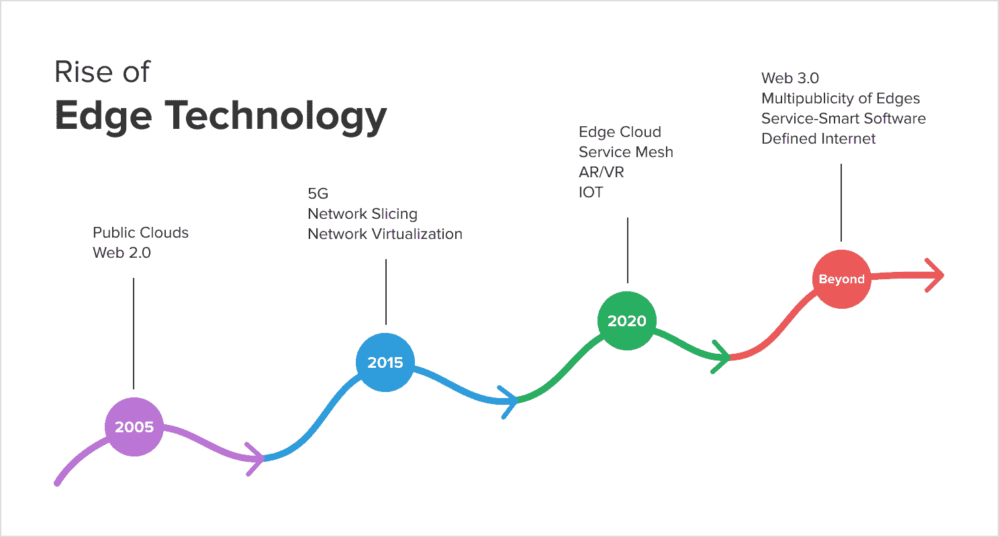
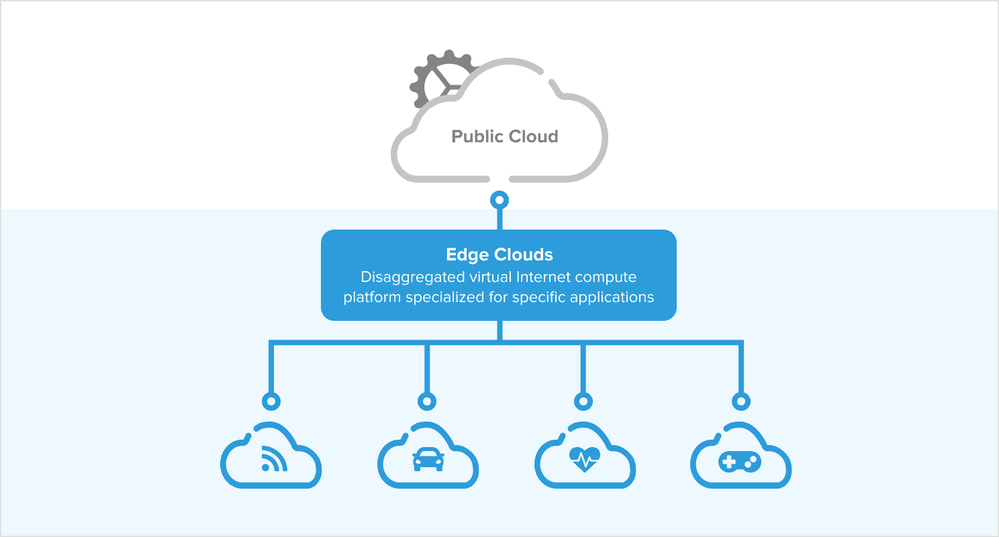

# 新兴边缘云和计算基础设施

> 原文：<https://thenewstack.io/emerging-edge-cloud-and-computing-infrastructure/>

 [程吴

程是一位成功的连续创业者，也是广受好评的行业元老。目前，程是台湾投资公司的普通合伙人。他创立了志那都红豆(acq。由爱立信)、箭点(acq。思科以 57 亿美元的价格收购了 Acopia。F5 Networks)和 Arris (acq.by Lucent)。程是 Avesha 的投资者和董事会成员。](https://www.linkedin.com/in/cheng-wu-4614a8a/) 

如今，全球网络服务主要由公共云提供。当它们到达云边缘时，它们被移交给电信有线和移动无线接入网络，以交付给最终用户。

虽然这种交付方法足以作为最佳服务交付，但任务关键型服务——具有毫秒级或更低的严格延迟要求——不能以这种方式工作，因为云到客户端的平均延迟很容易超过几十毫秒，并且可能会根据网络负载而大幅波动。要求超低延迟的新兴服务(如自动驾驶、智能基础设施和制造业的大规模机器类型通信以及物联网(IOT))导致了边缘云和相关计算基础设施的出现，以提供具有机器学习智能的加速交付。

虽然有很多共识认为云边缘是需要更多智能处理的地方，但对于在哪里建立这些边缘基础设施以及它们是否是 5G**M**mobile**E**dge**C**computing(**MEC**)的同义词，几乎没有共识。此外，虽然 5G 预计将在将边缘和客户端设备连接到云方面发挥关键作用，但许多形式的有线和无线无线电技术预计将在广泛的内容中发挥作用。

## 云重塑了互联网

web 2.0 的出现导致了消费者到服务和服务到服务交付覆盖范例的产生，这是在上面的节点到节点物理传输互联网络之上的。然而，web 2.0 在很大程度上是基于公共云基础设施构建的，公共云基础设施在单个管理域(如 AWS)内拥有全球足迹。随着 5G 的到来，公共互联网的角色已经被转移到新的“接入网络”中。这是云边缘的起点。

单独和独立地，5G——凭借其低延迟、网络切片和 **N** 网络 **F** 功能 **V** 虚拟化(**NFV**)——旨在创建一个与公共云同等智能的新的动态移动接入网络，其边缘网络在物理上更靠近客户端。移动边缘扮演内容或数据缓存的角色，并充当客户端和原始云源之间的代理。

从概念上讲，边缘云可以被视为一个专门针对特定应用的分解虚拟互联网计算平台，其中边缘节点扮演着互联网“背板”和云“核心”的缓存角色可以受益于边缘节点的应用的例子包括 VR/AR。IOT 和医疗保健设备。

## **边缘云的兴起和边缘推论**

边缘云不仅仅是公共云的边缘。相反，它们是自己的云，目的是创建全方位服务的边缘智能。虽然从应用和运营的角度来看，公共云已经成熟，成为企业数据中心的延伸，但边缘云很可能作为第三方服务构建在移动运营商的移动边缘基础设施上，或传统电信公司的接入网络和中央办公室上。此外，边缘云在概念上是小型边缘数据中心，它们之间可能具有对等连接和服务漫游(或联盟)协调，它们可能不是独立运行，而是一起运行，以提供未来的复杂网格服务，具有机器学习推理智能。

这导致了集成两个不同的云架构的巨大挑战，以实现无缝的端到端服务，同时优化端到端流量。从流量管理的角度来看，将两个截然不同的自治系统分别与边缘云和公共云分离开来，使得优化真正的端到端流量优化成为一个巨大的挑战，这主要是由于每个云内缺乏跨云流量可见性和智能。此外，每种云的流量特征也大不相同。虽然公共云可以承担准静态的云内流量，不受边缘和客户端相关流量激增的影响，但边缘云必须处理所有按需闪存流量和服务多样性，这需要具备应用 QoS 感知能力的复杂边缘推理智能。

## **分散的 Web 3.0 服务和源(源)的多样性**

与 Web 2.0 不同，Web 2.0 催生了可以通过聚合处理数十亿用户的超大型集中式网站，Web 3.0 承诺创建一个新的去中心化的互联网服务秩序，同时平衡隐私和数据货币化的需求。这是通过将万维网从基于地址的方案发展为基于名称的服务和资源绑定方案而成为可能的，使用了新的标准，例如 I T3 因特网 T5 lanetary T6 F T7 文件 T8 S T9 系统(允许点对点内容传输)、区块链(分散事务执行)和固网 T13

Solid 是模块化的，可扩展的；并且它尽可能地依赖现有的 W3C 标准和协议。它允许将内容从应用程序中分离出来，并实现与内容无关的应用程序基础架构，例如上述的边缘云。也许这些新技术带来的最深刻的变化是，对象将通过名称来访问和解析，并且可以驻留在多个位置上——这实际上造成了源的多样性。

从流量管理的角度来看，Web 3.0 带来了一系列新的挑战。首先，去中心化将把当前的中心辐射式内容分发范式转变为分布式参与者作为辐条向作为中心的请求者发送流量。第二，从操作的角度来看，分布式事务的所有成员将被逻辑地分组在一起，尽管它们的数据不同，因为分布式事务直到所有子事务都完成或已经达到共识配额才完成。

此外，更接近请求源的云边缘将成为信息融合的中心，而不是 Web 2.0 中的核心，伴随着 TLS/证书、DNS 安全性、负载平衡等方面的扩展挑战。

## **边缘的多重性**

如果不了解 5G 移动边缘服务漫游的全部含义，考虑云边缘将是不完整的。

实时 5G 应用，如无人机和自动驾驶汽车，要求移动边缘支持的服务可以从一个 MEC 漫游到另一个，而不会丢失状态信息或导致边缘到云的连接。随着 5G MEC 可能位于中程位置，MEC 站点之间的连接是假设的-在城域以太网、DWDM 光纤环路或 MPLS 电路等支持下。

为了在数据和状态共享方面保持最大的灵活性，除了计算节点虚拟化之外，MECs 的边缘存储虚拟化可能是不可避免的。

## **各种各样的边缘**

虽然预期客户端到 MEC 的延迟保持在低毫秒范围内，但是某些应用可能需要非常短的延迟——在几十微秒的范围内，或者在高达 10 毫秒或更长的范围内的延迟。因此，微秒级延迟可能只能在 DU 本身中提供，或者通过具有 ML 能力的 RU 直接增强，而可以承受更长延迟的边缘可能不需要 5G 的 uLLC 支持，从而使部署其他无线和有线接入技术成为可能。

不管边缘连接和资源共享的具体情况如何，可以确定的一点是，各种边缘虚拟数据中心设计和连接选项将必须共存，这使得灵活且经济高效的虚拟数据中心体系结构成为必要。

## **服务-智能软件定义的互联网**

不可避免的是，去中心化的 Web 3.0 和现代云时代互联网基础设施的交叉将在未来十年为消费者和电子商务催生一系列新的 Web 服务，其速度前所未有。这部分是因为现在，由于软件定义的网络和按需虚拟化技术在过去十年中不断进步，互联网将首次成为软件可定义的，控制粒度达到每个服务级别。

在接下来的时代，我们设想自组织互联网络将成为一种新的服务范式，其中新服务可以构建为互联网上的完整覆盖层，由软件定义的交付和传输服务层实现，每个服务层在其各自的层面内具有水平边缘推理智能。我们设想基于意图构建逻辑服务互连是可能的；并根据您的 SLA 要求，自动、无缝地由底层执行意图。我们设想公共云和移动边缘将桥接成一个无缝的端到端逻辑网络域，其中包含的服务覆盖将成为可能。我们设想 SOI 覆盖网络将是服务特定的和动态的，取代今天的 VPN、CDN 和任何种类的专门构建的增值网络。

*要了解更多关于边缘云和其他云原生技术的信息，请参加 5 月 4 日至 7 日在[T2 举行的 kube con+CloudNativeCon Europe 2021 虚拟大会。](https://events.linuxfoundation.org/kubecon-cloudnativecon-europe/)*

<svg xmlns:xlink="http://www.w3.org/1999/xlink" viewBox="0 0 68 31" version="1.1"><title>Group</title> <desc>Created with Sketch.</desc></svg>