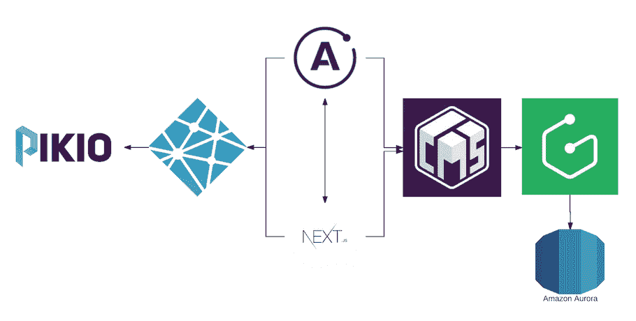

# 用于构建静态网站的新兴 GraphQL 和无服务器堆栈

> 原文：<https://thenewstack.io/emerging-graphql-serverless-stack-building-static-web-sites/>

较新的 JavaScript 库，如 Next。JS 和 Gatsby 发现单页应用和静态网站开发者越来越感兴趣，他们在大规模建立新网站时寻求速度和低成本。初创公司正在构建下一代栈，结合 GraphQL、基于云的存储和边缘服务提供商来交付他们的网站。下一个目标？让整个架构模型无服务器化。

Blazity 的创始人兼首席技术官 Hugo Meissner 经营着许多波兰新闻网站，如 Pikio，每天都有超过百万的 API 调用。他热衷于利用速度作为竞争优势，将现有的技术堆栈从当前的服务器迁移到新的架构方法，该方法利用 GraphQL、无服务器和内容交付网络来减少加载时间并大规模提供内容。

Meissner 目前与他的主机提供商的合同还剩三四个月，他希望他使用 GraphQL 重建原型网站的工作可以在今年晚些时候进行。与此同时，他正在使用的 JavaScript 框架——Next。JS——刚刚进入其[版本 3.0](https://zeit.co/blog/next3) 的稳定发布，现在可以将整个项目导出为静态站点。这消除了任何服务器端呈现的需要，并使得在内容交付网络上以 HTML/CSS 文件和 JS 文件的形式托管站点成为可能(像 Now.sh 或 Netlify)。一旦这一切就绪，Meissner 可以考虑利用 AWS Lambda 来自动化整个网站向读者的交付，只需在读者实际查看网站时支付计算费用。

## 新的静态站点架构模型

所有内容都存储在 Graph.cool 使用的 AWS Aurora 数据库中，graph . cool 是整个 Pikio 网站的 API 提供者和主要数据源。

GraphQL 正在迅速获得广泛采用，尤其是在出版商中，并且它越来越多地被用作通过无服务器架构交付单页面应用和静态网站的补充。预计会有更多的工具——特别是围绕不断发展的内容交付网络(cdn)成为功能更加丰富的“边缘服务提供商”——支持出版商利用这种架构模型。

[Graphcool](https://www.graph.cool/) 使用 GraphQL 模式在 Aurora 上构建数据模型，通过单一 API 端点公开内容。

Graphcool 端点然后被 GraphCMS 使用来创建一个无头 CMS，并为发布者提供更多的工具来定义他们的内容模型。

GraphCMS 的首席执行官和联合创始人 [Michael Lukaszczyk](https://github.com/mlukaszczyk) 表示，开发人员对利用 GraphQL 开发基于内容的网站越来越感兴趣。Lukaszczyk 说:“开发人员不喜欢开发 CRUD 接口和 GraphQL 服务器。“我们的产品抓住了这两个痛点并解决了它们。好处是开发速度快:您可以获得比 REST 更高性能的 GraphQL，尤其是当您查询大量关系数据时。而且对于开发者来说，更好玩。在某些情况下，REST 完全可以做到，但如果你有一个复杂的数据结构，我们会看到开发人员使用 GraphQL。”

一旦建立了内容管理系统，就可以使用下一个。JS 框架。“下一个。JS 拥有我所需要的一切，并且很容易上手。它可以进行页面路由，有一个很酷的样式系统，预取，以及所有内置的东西，”迈斯纳说。“初始负载由服务器处理，因此你可以光速获得一个渲染的 HTML，而路由预取使它在你单击一个链接时，浏览器已经处理了它的 JavaScript，因此有了即时响应。”

迈斯纳指出，预取功能是竞争新闻内容网站的一项特殊需求，当读者点击登录页面时，它可以预取网站的其他页面，以便未来的网站链接可以即时发送。虽然接下来。JS，为了保持其作为一个专注于应用基础设施的通用框架的目标，它不预取数据(或内容)。预取仅限于网站的结构，而不是实际的内容。为此，迈斯纳使用 [Apollo 包](https://www.apollodata.com/)通过 GraphQL API 将数据从 GraphCMS 拉入 Next.JS。随着版本 3.0 的迁移和导出静态站点的能力，迈斯纳希望这项任务不再是必要的。

Lukaszczyk 说，在 GraphCMS，他很少看到开发人员在他们的开发项目中使用 Angular 框架。下一个。JS 和 [Gatsby framework](https://www.gatsbyjs.org/) 正在成为当前网站建设的领跑者。

使用 3.0 版本的 Next。Meissner 说网站将被导出为一个 HTML/CSS 文件，一个 Javascript 文件和一个静态资产的文件夹(比如图片和 robots.txt 文件)。这些文件可以放在边缘服务提供商的网络上，如 [Netlify](https://www.netlify.com/) 或 [Now.sh](https://zeit.co/now) 。

" [Now.sh](https://zeit.co/now) 真的很酷，深入研究 API 可以让你在部署中做更多更强大的事情，但你必须自己实际设置 CDN 发行版。在我看来，Netlify 是一个无限可扩展的全球 CDN，配置要少得多。目前，最大的可扩展问题是服务器端渲染。我们使用带有 SSR 缓存的服务器端渲染，但它仍然很昂贵，”Meissner 说。“一旦我们转向无服务器的静态站点方法，将不再有服务器端的渲染。然后我们可以看看网站自动化，可能通过 AWS。”

迈斯纳说，Pikio 原型的加载时间测试更快，更容易维护，而且价格也相当便宜。

“最理想的是即时加载，但对于一个拥有超过 60，000 篇文章的新闻网站来说，最小化包大小和压缩照片并不容易，因此自动化本身就是一个问题。目前，我们依赖于 WordPress，它依赖于他们的模板语言，我们希望转移到一个现代的堆栈。WordPress 的成本很高，而且你还必须负责扩展整个网站和管理 SQL 数据库。借助我们的新架构模型，您可以将其导出为静态站点，并且您只需要一个 API 端点，这是唯一需要扩展的东西。”

与此同时，GraphCMS 正致力于导入工具来帮助他们的客户从 WordPress 迁移到他们的 headless CMS。之后，他们需要为更习惯于使用 WordPress 界面上传内容的出版商建立一个干净的界面。

<svg xmlns:xlink="http://www.w3.org/1999/xlink" viewBox="0 0 68 31" version="1.1"><title>Group</title> <desc>Created with Sketch.</desc></svg>