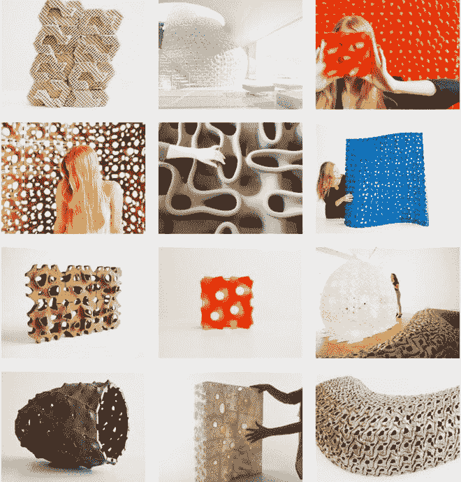
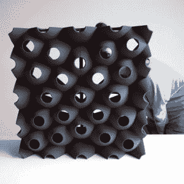
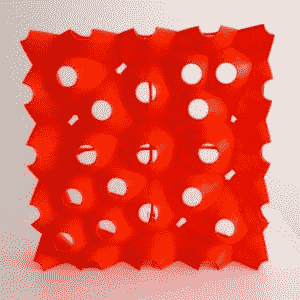
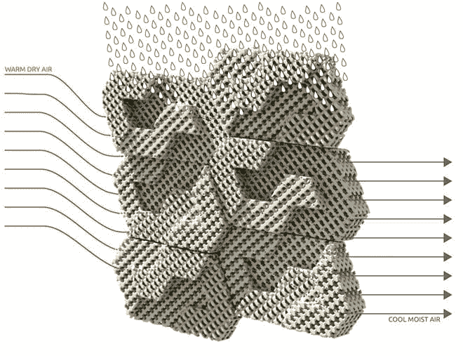
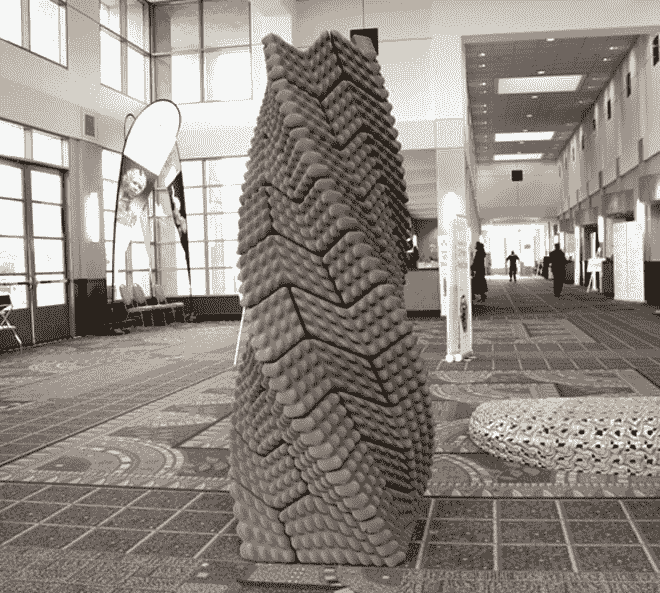
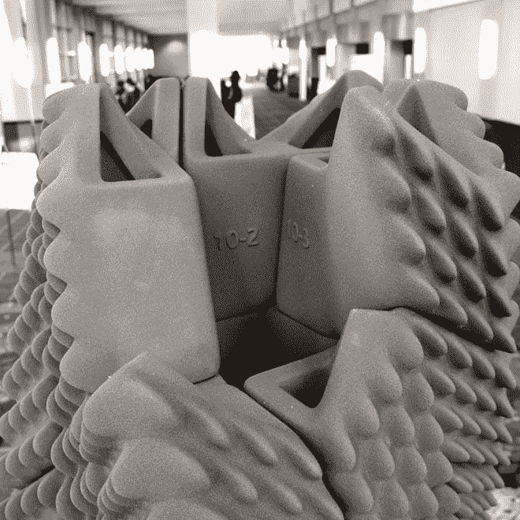
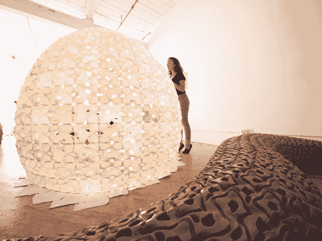
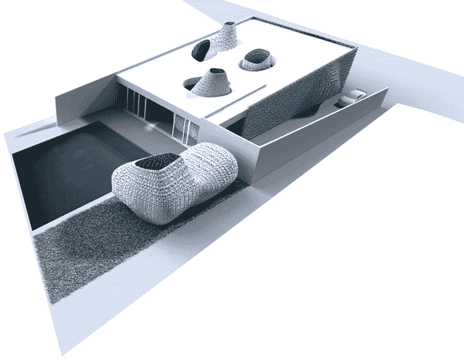
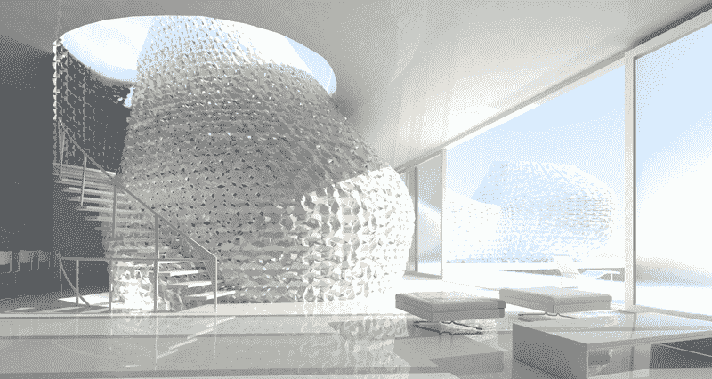

# 新兴物体:3D 打印先锋将用盐建造房屋

> 原文：<https://thenewstack.io/emerging-objects-3d-printing-pioneers-will-build-houses-salt/>

几千年来，木材、砖块和石头等材料一直被视为建造坚固结构的最明智材料，可以抵御各种因素。然而，数字制造的最新进展正在挑战这些古老的想法——无论是让人们在建造自己的开源可持续住宅时避免耗时的建筑惯例，还是让人们习惯于这样的想法:有一天，结构合理的住宅可能会由不熟悉的材料 3D 打印出来，如超强轻质水泥聚合物，甚至是盐。

## 采用模块化方法的 3D 打印

但它正在发生:总部位于奥克兰的[新兴物体](http://www.emergingobjects.com/)——自称是一家初创公司，兼做定制瓷砖公司——正在开发非传统的建筑材料，有朝一日可能被用于打印可居住的结构。创始人 Ronald Rael 和 Virginia San Fratello 都是教授，也是设计集体 [Rael San Fratello](http://www.rael-sanfratello.com/) 的主要建筑师，他们以模块化的方式处理 3D 打印建筑，专注于开发可以打印的材料——一片一片地打印——以建造可以抗震的建筑，不需要加热和冷却能源，也不吸收污染。这些是超级材料“新堆栈”的一部分，可以显著提高建筑的性能，并推动建筑在更大环境中的功能限制。

首席执行官 Rael 解释了公司模块化方法的重要性:

> 仅在美国，就有超过 10 亿平方英尺的瓷砖和表面需要覆盖。不同之处在于，我们可以制作不仅仅是二维而是三维的瓷砖，并且可以有许多不同的形状。它们可以自我支撑，因此可以成为墙壁、屏风和隔断，甚至可以用作外墙。这让我们完全重新思考 21 世纪的建筑和施工。

模块化设计并不新鲜，但将它与新的制造方法结合起来，并用令人惊讶的材料来实施，确实有一些有趣的含义。传统的、正交的砖块从平淡无奇的砖块升级为基本可变的元素，为许多可能的形式和材料变形或实用用途而成熟。例如，以新兴物体的 [Picoroco Block](http://www.emergingobjects.com/projects/picoroco/) 为例，它可以在聚合[砂](http://www.emergingobjects.com/projects/picoroco/)或 PLA(一种可生物降解的热塑性脂肪族聚酯，来自可再生资源)中进行 3D 打印。当这些独特的瓷砖放在一起时，它形成了一面墙，但仍然允许光线和空气通过，而且由于其夹式格式，也易于组装和拆卸。

 

## 一个 3D 打印机农场，由文化决定

新兴对象的可扩展方法还扩展到他们的生产模式，材料以粉末形式加工，并使用粘合剂喷射技术打印。他们采用了一种“打印机农场”的设置，通过打印许多小尺寸的砖块和瓦片，然后这些砖块和瓦片被用来建造更大的东西，消除了对比房子还大的巨型 3D 打印机的需求。这与 3D 打印领域的其他支持者有明显的不同，其中一些人正在制作用于建筑的巨型打印机的原型。雷尔解释说，这是关于解决最基本的单元，而不是浮夸的姿态:

> 我们都是建筑师，我们都是建筑学教授，我们相信建筑在文化上是复杂的。在这一领域的其他努力有一个基于工程的方法，并基于按比例放大的机器的发展。我们希望 3D 打印建筑，而不是通过创造一个基本的建筑组件:3D 打印砖。

它本质上是一点一点地思考，而不是整体地创造。增材制造提供的现代转变是定制化的机会，但是是在工业水平上的大规模生产。这可能意味着建筑具有超本地适应性，使用技术来满足环境需求，比如为炎热干燥的气候量身定制的砖块，可以在没有电的情况下为建筑遮阳和降温。新兴物体的凉砖就是一个例子:受沙漠中传统蒸发冷却技术的启发，该团队用多孔陶瓷打印出格子状的砖，这种砖可以被动地冷却建筑物，只使用水和风。

【T2

他们的[地震柱](http://www.emergingobjects.com/projects/quake-column/)是当地建筑传统如何被技术更新的又一个例子。受古代印加人如何在不使用砂浆的情况下用大块石头建造抗震结构的启发，该团队开发了一种互锁的沙砖，这种沙砖抗震，但重量轻且中空。

除了在木材、水泥、陶瓷、塑料和沙子上打印的实验外，新兴物体公司还在探索如何将盐用于建筑。再一次，即使这个看似前卫的步骤也有其传统根源；二人组受到了中东建筑中使用盐块的影响。他们的 [Saltygloo](http://www.emergingobjects.com/projects/saltygloo/) 展馆和 [3D 打印盐屋](http://www.emergingobjects.com/projects/3d-printed-house-1-0/)设想材料在当地收获——就像 Saltygloo 的情况一样，它的盐是从旧金山湾收获的——然后用胶水加工，使其适合 3D 打印。

到目前为止，该工作室已经试验了任何可以转化为粉末形式并从喷嘴中喷出的材料——从咖啡、纸张、橡胶甚至血液。但圣弗拉特罗和雷尔的目标并不是成为“材料科学家”，而是解决目前困扰建筑行业的紧迫问题，无论是效率、可持续性还是地点和历史的相关性，甚至是数字设计。San Fratello 说:“建筑仍然响应独特的地点和环境，3d 打印实际上促进了定制在建筑中的作用，以及我们作为设计师可以应对的问题的数量。”雷尔同意；它是一砖一瓦地建设未来的城市，与周围环境和谐共存:

> 未来的城市可能看起来不同，但更重要的是，它们的表现和感觉会不同。它们可能会更凉爽，因为建筑物的表面将限制热岛效应。建筑砌块的形状和作用将最大限度地减少污染的影响，收集水，创造阴凉，以新的方式通风，保持包覆，或包含传感器，可以告诉我们何时建筑物生病或何时城市生病。

以这种方式创建的结构将会是有反应的，为文化和地点定制，甚至可能是动态适应的，考虑到目前在 4D 印刷的自我组装、自我转化材料的发展——最终创建的建筑将不仅仅是庇护所。在[新兴物体](http://www.emergingobjects.com/)和[雷尔·圣弗拉特罗](http://www.rael-sanfratello.com/)有更多。

所有图像[通过](http://www.emergingobjects.com/)显现物体。

<svg xmlns:xlink="http://www.w3.org/1999/xlink" viewBox="0 0 68 31" version="1.1"><title>Group</title> <desc>Created with Sketch.</desc></svg>