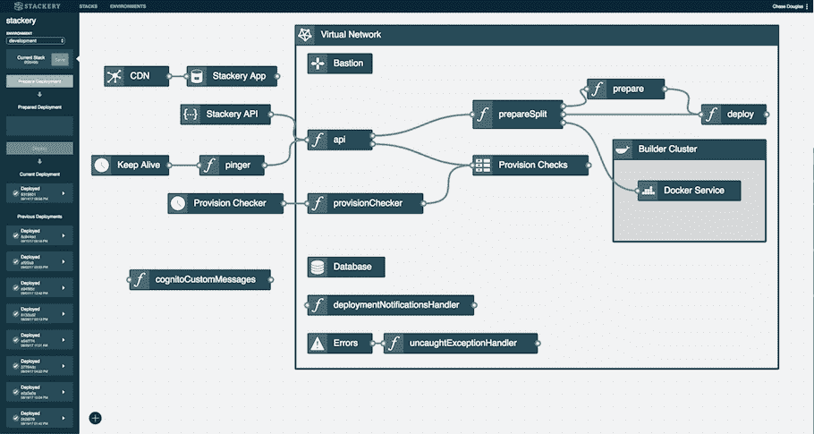

# Stackery 和无服务器的新兴采用途径

> 原文：<https://thenewstack.io/emerging-ops-tooling-serverless-reveals-two-adoption-paths/>

在过去的几个月里，一系列新的无服务器监控工具已经开始全面上市，这是无服务器生态系统走向成熟的有力标志。

例如， [Honeycomb](https://thenewstack.io/dev-ops-doesnt-matter-need-observability/) 、 [IOpipe](https://thenewstack.io/iopipe-launches-lambda-monitoring-tool-aws-summit/) 和 [Dashbird](https://dashbird.io/) 都为无服务器架构的黑盒子提供了新的可观察性。本周在纽约举行的 Serverlessconf 会议上，很多讨论都围绕着管理无服务器部署的工具、安全和其他方面。

现在 [Stackery](https://www.stackery.io/) ，一个无服务器基础设施监控工具，已经宣布了其产品的第 1 版(正式发布),该版本以前只提供给测试版用户。

Stackery 由 New Relic 前员工[内特·塔加特](https://www.linkedin.com/in/nathantaggart/)和[蔡斯·道格拉斯](https://twitter.com/txase)创建，他们负责 [New Relic 浏览器](https://newrelic.com/browser-monitoring)，stack ery 提供了一个操作控制台，旨在提供对无服务器架构的企业级监控洞察力，并为新的生产环境提供部署自动化。

“AWS Lambda 很棒，但就无服务器的生产价值而言，它还有很多需要改进的地方，”现任 Stackery 首席执行官的塔加特说。

“在生产级企业级别，除了应用程序性能管理(APM)监控之外，您还需要某种构建自动化和监控。比如底层基础设施上的错误跟踪和日志记录，”塔加特说。他解释说，这种可观测性的缺乏会产生问题，因为 lambda 的寿命很短。“在 Lambda 消失之前，你必须从中获取度量标准，”塔加特警告说。

## Stackery 的监控重点

塔加特表示，Stackery 旨在解决三个痛点:架构设计、部署自动化和基础设施监控。

### 建筑设计

无服务器范式鼓励基础设施即代码的方法。映射来自多个事件源(包括数据库、客户端输入、数据管道和外部 API)的数据流和业务逻辑会很快变得复杂。Stackery 附带了一个架构映射工具来帮助开发人员澄清和可视化事件源。可视化由 [AWS CloudFormation](https://aws.amazon.com/cloudformation/) 模板支持，因此生成的基础设施可以存储在 GitHub repos 中，并使用 git 进行更新。

### 部署自动化

塔加特说，目标是帮助开发人员轻松部署自动绘制的架构。Stackery 处理所有的应用构建过程，安装依赖项并将其存储在 S3 中，并在错误处理中包装代码。塔加特说，这使用户能够建立自我修复的应用程序。例如，如果一个 Lambda 超时，就会写入一个日志，并“监听”未来的错误。如果很明显超时是定期发生的，这可以触发另一个应用程序来管理超时滞后。

使用 Stackery，日志存储在 [AWS CloudWatch](https://aws.amazon.com/cloudfront/) 中，用户可以跳转到任何资源(例如，数据存储或 Lambda)并查看该应用程序的特定日志。塔加特说，在传统的应用程序部署模型中，开发人员交付一个应用程序，并在连接到外部数据库的单一服务器上运行。但是在无服务器模式下，复杂性总体上增加了，因为应用程序可能会收到一个请求，该请求会进入一个事件流，该事件流会触及十几个或更多的外部资源。“我们监控调用的数量，有多少是异步启动的，它们是冷启动的吗……洞察所有的底层架构，”塔加特说。

## 分割无服务器应用市场

了解采用新技术后会发生什么具有挑战性。Lawrence Hecht 最近的一份 TNS 分析显示，无服务器的采用与集装箱相当，但是关于这项技术的实际采用和使用仍然存在问题。“我们预计，许多人将无服务器基础设施等同于提供服务的能力，任何由实时事件触发的服务。这是一项重要的能力，但至少在我们看来，这不是无服务器啦啦队员心目中的计算彻底变革，”Hecht 警告说，同时还分享了数据，表明调查受访者正在使用与容器同等的无服务器技术(无论是在静态还是动态云环境中)。

### 基础设施监控

 [Serverlessconf:现在谈谈工具

在最近于纽约市举行的 Serverlessconf 上，我们可以看到无服务器在实际应用中的快速优势。一年前在拥挤的布鲁克林空间举行的上一次纽约 Serverlessconf 完全是为了定义“无服务器”这个术语。在本周的活动中，我们看到对话从什么是无服务器的基本解释转移到了仪器和工具。正如红帽公司的瑞安·斯科特·布朗在活动中向我们指出的那样，这是技术成熟和被接受的积极迹象。

Amazon Web Services 的 Randall Hunt 演示了 AWS 的 Rex-Ray，一个分布式跟踪系统，如何在不同的 AWS 服务中跟踪动作，包括 Lambda。CloudReach 的 Linda Nichols 认为，无服务器的自然发展是朝着可以用于多个无服务器提供商的框架发展。PureSec 首席技术官 Avi Shulman 展示了尽管无服务器部署占用空间减少，但该技术仍然有很大的表面积，攻击者可以利用它来破坏系统。-约阿布·杰克逊](http://www.thenewstack.io/tag/Serverlessconf-New-York-2017) 

容器和无服务器并不相互排斥，但是对于某些人来说，在这两种技术选项之间进行选择无疑是采用决策的一部分。来自斯里兰卡创业公司[的 Asanka Nissanka](https://getshoutout.com/) 今年 6 月在无服务器博客上写了[关于使用容器作为他们的消息平台的挑战。“大声喊出来”的一个特别关注的问题是，他们有不可预测的交通高峰和空闲时间，可能会受到客户广告活动、季节性商业或其他驱动因素的影响。“我们本可以通过添加更多的容器实例和多个服务容器来扩展我们的 ECS 环境，我们也确实尝试过……我们的主要障碍是我们在 SaaS 开展业务，这使得成本成为一个关键因素。这种解决方案没有吸引力，”尼桑卡写道。](https://serverless.com/blog/why-we-switched-from-docker-to-serverless/)

塔加特认为，或多或少，那些将转向集装箱的人已经这样做了。“容器和无服务器不是不兼容的。如果需要超过 512MB，您正在处理大批量数据，或者您需要运行计算超过五分钟，那么无服务器不是最适合的，”塔加特解释道。“你认为处于领先地位的公司，它们已经在集装箱上了。但无服务器有一个更容易的切入点，它不一定是更好的老师，但无服务器非常适合其他人，它不需要一群可靠性工程师来管理集群。”

现在，塔加特看到了基于容器和基于服务器的采用和行业架构选择的更清晰的描述，但也承认有一些重叠(主要是由于任务的规模，正如塔加特所阐述的)。

塔加特指出了那些无服务器正在迅速成为首选的行业领域。他列举道:“在无服务器领域发展迅猛的四个行业是:

*   零售，尤其是电子商务
*   物流、运输和拼车
*   金融、银行和一些贸易，以及
*   媒体。"

塔加特发现，从他的观点来看，那些采用无服务器架构的人和那些选择容器架构的人之间的分歧变得越来越明显。他认为，主要的分歧将越来越取决于企业的运营团队中是否有一个长期的替补。

塔加特指着 Capital One 和 Nordstrom 说:“我们在市场上看到的是，做无服务器的人，他们都建立了自己的内部工具，以便取得成功，满足他们的运营要求。“他们看到了无服务器的巨大价值。标题是付费基础设施的成本和更好的利用率，但还有其他令人信服的原因:性能改进、上市时间、开发人员的功效和效率，以及架构的事件驱动性质。”

塔加特说，除了这些技术采用的领导者，市场的大部分是没有动机投资“成千上万的工程建设工具。”他认为，随着企业中无服务器和生产级采用的不断成熟，这就是为什么 Stackery 和其他初创公司如 [IOpipe](https://read.iopipe.com/) 将是必需的。

“在企业中，开发人员想要使用它的程度和他们能够使用它的程度之间存在差异。”塔加特质疑，如果只有有限的协作和监控工具，开发人员是否能获准在企业中引入无服务器。

随着无服务器生态系统中监控工具的出现，这使得更广泛的企业采用变得尤为诱人。

*TNS 执行主编 Joab Jackson 对本文有贡献。*

专题图片:内特·塔加特(左)和蔡斯·道格拉斯，2017 年。

<svg xmlns:xlink="http://www.w3.org/1999/xlink" viewBox="0 0 68 31" version="1.1"><title>Group</title> <desc>Created with Sketch.</desc></svg>