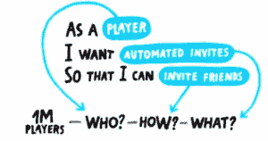
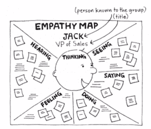

# 为什么同理心是优秀软件开发的秘方

> 原文：<https://thenewstack.io/empathy-secret-sauce-good-software-development/>

“通常我们会为其他人创造工具。”

我们知道同情是一种必要的人类情感。但是好的软件有必要吗？如果你是为人类开发软件，或者甚至是和其他人一起开发软件，那么，是的。

作为一名软件顾问和敏捷教练，丹尼尔·布莱恩特(Daniel Bryant)经常在事情出错时被请来——他说，通常人类互动是他被支付解决的问题的核心。他处在技术和团队之间的关键位置，但通常需要优化的是人与人之间的互动。

在最近伦敦的一次聚会上，科比展示了他的移情案例。但他打趣说，当他提到“同理心”时，开发人员经常会问这是不是一种热门的新编程语言。

“人们如此专注于技术，我不得不说，不，不，想想你正在开发的实际客户，你的队友，你的老板，甚至那个互联网巨魔——我敢这么说吗？能够站在他们的角度思考和感受他们的想法和感受是非常重要的。”

换位思考是用户体验测试人员的逻辑起点，但是开发者呢？真的吗？

> “我们通常为其他人开发软件，与其他人一起创造体验。”

布莱恩特说发展过程是而且应该是一个情感的过程。“即使你正在开发一个标准的商业应用程序，从根本上来说，你希望你的用户喜欢——或者至少不讨厌——使用你的软件，”他说

对他来说，同理心是涵盖所有优秀软件开发的秘方。那么到底什么是共情软件开发呢？如何将它应用到我们服务客户和同事的方式中？它如何适应敏捷开发过程的整个世界？

提示:快速迭代和持续反馈总是很重要的。

## 总之，代码中的同理心在哪里？

Bryant 说，移情软件开发来自所有移情的来源——理解人们的经历和感受。与同情或怜悯不同，它涉及到能够在情感上与某人互动，并设身处地地为他们着想。

这也归结到一个核心原则，先了解自己，才能了解别人。然后，你可以努力了解他人，并通过敏捷、精益或 DevOps 实践或三者的结合，利用快速反馈向他们学习。

> 毕竟，一个 28 岁的小伙子不可能独自开发一个适合 70 岁老太太的设备。

科比提出的一个关键点是，冷漠是同理心的自然对立面。所以如果你想开发好的软件，你必须关心你在做什么，你在为谁服务。

他提供了三个例子来说明移情增强了任何软件开发过程。

### 1:需求收集

需求收集就是问为什么。对你有什么影响？对您的业务有什么影响？你的团队想要什么？

Bryant 说，设计思维和理解驱动的原因是做出有意识的决定，不仅仅是一个接一个的功能，有时甚至是为了更好的用户体验而配对。

得出这些结论的一个方法是创建一个[影响图](http://impactmapping.org)，它提出了以下问题:

*   为什么？定义一个商业目标。 
*   谁啊。说出你要建立的关键人物角色。
*   怎么会？描述期望的行为变化。
*   什么？查找允许这些所需更改的用户。

在这个世界里，同理心成为了一种宝贵的财富。您可以尝试遵循创建用户角色的营销实践，作为一种表示大型用户组及其各自需求和期望的方式。

他说，这是发现普遍想要的特征的特别好的方法。

获得这些资料最准确的方法是采访你不同的客户，这是建立共鸣的好方法。然而，通常情况下，它们是从您对用户的了解中总结出来的。你也可以通过使用应用分析工具和谷歌分析找到很多，以了解你的用户来自哪里，他们在什么技术上使用你的工具。

“移情需要努力，但这是值得的，”他说，尽管承认用户角色可能很耗时。

Bryant 认为移情映射是一种在更短时间内创建人物角色的更具成本效益的方法。 

这个练习首先在一本关于培养创新的书《游戏风暴》中谈到，首先把一个已知客户的名字、头衔甚至照片贴在墙上。让房间里的每个人标记出你认为该人物角色所看到的、感觉到的、听到的等等。

不太了解你的客户？是时候走出你的小隔间到野外去了！

当你积极地与你的顾客联系时，这就是人种学的一部分。Bryant 举了[不在高街](https://www.notonthehighstreet.com/about/team)的例子，这是英国对 Etsy 的回应，Etsy 竭尽全力同情他们的软件合作伙伴，包括仓库和运输。

“他们可以认同消费者，因为他们曾在那里购物，但他们无法认同合作伙伴。所以他们去仓库呆了一天，学习人们做什么以及如何使用软件，”布莱恩特说。

他说这是你可以亲眼目睹高潮和低谷的方式。由于它刚好赶上假期交付高峰，开发商真正开始了解这些小事情在旺季会造成多大的混乱。

随着我们走向互联设备的世界，我们正在创建的软件将更加个性化，甚至在我们的最终用户身上或内部。在物联网中，这种与用户的联系将变得更加重要。毕竟，一个 28 岁的小伙子不可能独自开发一个适合 70 岁老太太的设备。

在你做一些他们会拒绝的东西之前，这一切都是关于原型设计，甚至只是勾画想法，进入实际环境，与那些未来的用户交谈，获得他们的想法和反馈。

这一切都回到了敏捷的快速实践“构建、测量、学习”——你必须接近客户才能有效地做到这一点。

### 2:建筑与发展

对于 Bryant 来说，架构从根本上讲是关于与开发人员的共同理解和适当的风险管理。

首先，他说团队领导也必须编码，以便了解你自己的团队。

“正确的约束可以让我们自由，但你必须能够同情你设置约束的人，”他说。

他说所有的风险管理都包括与利益相关者的认同。

“我们都喜欢微服务和容器等闪亮的新事物，但这一切都取决于它是否适合我们和我们的情况。”

这就是为什么降低风险比跳进一个闪亮的新架构框架更重要。布莱恩特推荐[马特·雷布尔](https://twitter.com/mraible)的[比较矩阵](http://blog.websitesframeworks.com/2013/03/web-framework-comparison-matt-raible-opinion-138/)通过对每件事情按照自己的标准打分来消除一些主观性。

比较矩阵将决策记录放在适当的位置。当他走进软件公司时，“我来的时候就这样了”是最常见的推理。

发展的速度非常快。有时候，六个月到一年后，我们甚至不记得那些为什么。这就是为什么 Bryant 提倡以一种同情你未来的自己和未来的同事的方式编码。如果所有代码都是过去和未来之间的一种交流形式，是我们这一代人的重要遗物，那么我们需要努力获得更干净的代码，拥有适当的文档、阅读材料和维基。

然后，他分享了[编程恐怖](https://blog.codinghorror.com/)创始人[杰夫·阿特伍德](https://twitter.com/codinghorror)那句令人难忘的台词:“永远要把维护你代码的人当成一个知道你住在哪里的暴力精神病患者。”

这肯定会让我们更多地考虑文档，不是吗！

移情建筑还涉及系统思维，这鼓励自我组织，并让那些更多的管理角色专注于检查系统组件之间的相互作用。理解用户的旅程通常是这个系统中被忽视的部分。

同理心系统思维也意味着左移，这样 QA 和测试人员就可以与最终用户互动，他们也是早期规范的一部分。这有时被称为三个朋友——在任何产品团队中，至少要有一个开发人员、一个 QA 和一个产品经理。

“我发现在 QA 工作的人比开发人员更有同情心，”Bryant 指出。

这当然导致了[行为驱动设计](https://inviqa.com/blog/bdd-guide) (BDD)和[测试驱动设计](http://agiledata.org/essays/tdd.html) (TDD)。Bryant 建议从外到内进行工作，关注大局，然后深入到具体特征。

最后，他说成功的架构和开发的核心主题是:

1.  了解你自己并检查你的沟通技巧:我的代码有意义吗？
2.  了解他人:了解整个系统，关注解决方案，由外向内思考。
3.  通过原型寻求快速反馈。

### 3:运营

Bryant 说，运营是软件团队的一部分，在同理心方面往往受到最糟糕的指责，但每个人都必须对他们生产的产品负责。这意味着打破孤岛，而不是将软件扔过围墙投入运营。而是分享痛苦

Bryant 还分享了 Mary Poppendieck 的监管契合理论，该理论认为开发者更关注推广和功能，而开发者更关注预防。

网飞特别擅长分担痛苦——或者像他们的开发人员所说的那样穿着痛苦服——每个人都有责任，并对他们复杂的微服务架构有一个整体的了解。

“我们想实时了解在混沌实验中，一个变量对请求流量的子集有什么影响，”网飞“流量团队”在公司博客上集体分享[。](http://techblog.netflix.com/2015/10/flux-new-approach-to-system-intuition.html)

同意网飞的观点，布莱恩特谈到了一种理论，即安全气囊和安全带这样的安全设施当然可以挽救生命，但它们也让一小部分人变得更加鲁莽。如果安全气囊旁边有道钉，他们就不会这么鲁莽了。他说，偶尔出现的让开发人员觉醒的情况是，开发人员“随叫随到”,对部署负责并分担责任。“你造吧。你来经营吧。”如果它在生产中倒了，你应该负责修理它。

也许这不是最受欢迎的想法，但科比保证会发生。

为了让更多的开发人员赶上众所周知的高峰，你需要确保[开发团队](/category/devops/)不是一个独立的部门。将开发人员与运营人员配对，将运营人员视为利益相关者，他们甚至会参加您的日常会议和计划会议。尽可能多的面对面交流是很重要的。

然后自动化测试中最重要的部分，给任何在代码中开发的人一个警告，这样第一个发现它的人——通常是开发人员——应该修复它。语义监控是应用程序在生产过程中不断运行的应用程序测试。

布莱恩特说，为了避免警觉疲劳，要把注意力放在对你的客户来说最重要的事情上。数据库可能关闭，但实际上可能对客户没有影响。同情你的用户就是能够识别什么是问题，什么不是。

例如，在一个电子商务网站中，只有三件事对成功至关重要——你能浏览产品，你能在你的篮子中添加物品，你能结账。其他问题——比如你能注册一个邮件列表——很重要，最终需要解决，但不是底线。

软件开发中的同理心是关于自由和责任之间的平衡。

<svg xmlns:xlink="http://www.w3.org/1999/xlink" viewBox="0 0 68 31" version="1.1"><title>Group</title> <desc>Created with Sketch.</desc></svg>