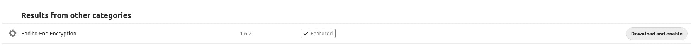
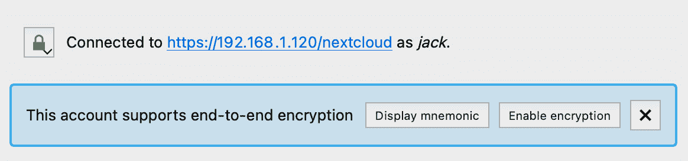
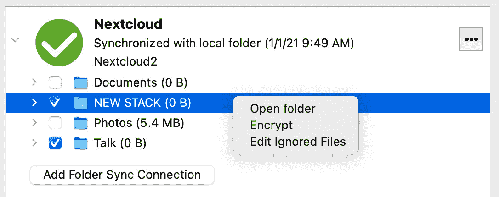
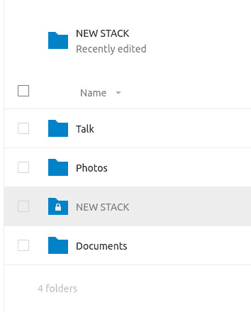

# 在 Nextcloud 和您的桌面客户端之间实现端到端加密

> 原文：<https://thenewstack.io/enable-end-to-end-encryption-between-nextcloud-and-your-desktop-client/>

[Nextcloud](https://nextcloud.com/) 已经成为我的首选私有云服务器。我从各种设备同步数据，并像使用我的个人 Google Drive 一样使用它。我主要用它来存储和备份。另外，我有时会使用内置的文档编辑器。有了这个平台，我几乎可以做任何我需要的事情，而不必依赖第三方来防止我的数据被窥探。

Nextcloud 可以托管在你喜欢的云服务提供商(如 AWS、Google Cloud、Rackspace 或 Linode)上，也可以托管在你自己的服务器上。无论哪种方式，您都会发现它符合私有云解决方案的所有条件。

当前版本是 20.0.4。从 Nextcloud 19 开始，可以在服务器和客户端应用程序之间添加一层加密(无论是[桌面](https://nextcloud.com/install/#install-clients)还是[安卓](https://play.google.com/store/apps/details?id=com.nextcloud.client) / [iOS](https://apps.apple.com/us/app/nextcloud/id1125420102#:~:text=The%20Nextcloud%20iOS%20app%20allows,previews%20of%20images%20and%20videos.) 移动)。不幸的是，这个特性并不是开箱即用的，要实现它，你必须经历一些困难。这并不难，但是需要几分钟的时间来启动和运行。

我将告诉你如何做到这一点。

## 下一代云 E2E 加密的功能

Nextcloud 实现这种加密的方式非常迷人。实际上，一旦启用，加密文件或文件夹只能在移动应用程序或桌面客户端上访问，而不能在服务器上访问。正因为如此，有人能够查看文件的唯一途径就是从你的手机或桌面上。如果攻击者访问您的 Nextcloud 服务器，他们将无法查看加密的文件/文件夹。另外，你在互联网上来回移动的任何数据也会被加密。

这是一个非常有效的技巧。

让我们实现它。

## 要求

为了实现端到端加密，您需要以下内容:

*   Nextcloud 的运行实例(版本 19 或更新版本)。
*   无论是桌面应用还是移动应用。
*   拥有 sudo 权限的用户。

我将用安装在 [Ubuntu 服务器](https://ubuntu.com/download/server)(版本 20.04)上的 Nextcloud 和运行在 [Pop 上的桌面客户端进行演示！_OS](https://system76.com/pop) 。

## 步骤 1:在 Nextcloud 中启用加密

首先要做的是在 Nextcloud 中启用加密。使用管理员帐户登录 Nextcloud，单击您的个人资料图标，然后单击设置。在“设置”窗口中，找到并单击左侧边栏中的“安全性”。在出现的窗口中，选中服务器端加密框(图 1)。

您将收到以下警告:

*   启用加密后，从那时起上传到服务器的所有文件都将在服务器上进行加密。只有在活动加密模块支持加密功能，并且满足所有先决条件(例如设置恢复密钥)的情况下，才能在以后禁用加密。
*   仅仅加密并不能保证系统的安全性。有关加密应用如何工作以及支持的使用情形的更多信息，请参见文档。
*   请注意，加密总是会增加文件大小。
*   创建数据的定期备份总是好的，如果加密，请确保将加密密钥与数据一起备份。

单击警告下方的启用加密。

接下来，我们需要安装并启用加密模块。再次点击您的个人资料图标，这次点击应用程序。在搜索栏中键入 encryption，当出现端到端加密条目时，单击相关的 Download and Enable 按钮(图 2)。

图 2:为 Nextcloud 安装和启用端到端加密应用。

## 步骤 2:启用 HTTPS

你如何处理下一步将取决于你的需求。因为我使用 Nextcloud 作为一个私有的、仅用于局域网的实例，所以我不需要走完整的 HTTPS 证书路线。相反，我只是为 Apache 启用 SSL 模块，这样我就可以利用端到端的加密特性。如果您需要走成熟的 SSL HTTPS 路线，您需要获取您的证书，将它们加载到您的服务器上，并将 Apache Nextcloud 配置文件指向这些证书。

或者，为了使它更容易，您可以:

1.  通过 snap 安装 Nextcloud。
2.  使用`nextcloud.enable-https` lets-encrypt 命令安装 SSL 支持。
3.  按照提示操作。

以上仅在通过 snap 安装 Nextcloud 时有效。这是启动和运行 Nextcloud 最简单、最快速的途径，当然也是将 SSL 支持融入平台的最简单方式。

为了简单起见，让我们走简单的路线。

登录到您的 Nextcloud 服务器(通过 SSH)并运行以下命令来启用 SSL:

`sudo a2enmod ssl`

`sudo a2ensite default-ssl.conf`

`sudo systemctl restart apache2`

现在，您应该能够使用 HTTPS 访问 Nextcloud 了，因此将您的浏览器指向 https://SERVER/nextcloud(其中 SERVER 是托管服务器的 IP 地址)。

## 步骤 3:在客户端启用加密

现在，您可以在客户端上启用加密了。打开桌面上的 Nextcloud 应用程序。如果您尚未将客户端连接到服务器，请现在连接。当您连接到支持 E2E 加密的 Nextcloud 服务器时，您将看到应用程序中列出的支持(图 3)。

图 3:我们的连接支持端到端加密。

单击显示助记符按钮显示您的加密助记符，它将是 12 个随机单词。将该助记符复制下来，因为您将需要它来向您的帐户添加更多设备(如果您需要这样做)。

## 步骤 4:加密文件夹

现在我们可以加密一个文件夹。Nextcloud 有一个很好的内置安全功能，只允许你加密空文件夹(这样你就不会有丢失数据的风险)。要加密文件夹，右键单击桌面客户端应用程序中的条目，然后单击 encrypt(图 4)。

图 4:在 Nextcloud 上加密我的新 Stack 文件夹。

就是这样。有问题的文件夹现已加密。如果您在浏览器中查看文件夹列表，您会注意到图标有一个锁(图 5)，这表明它是加密的。

图 5:我的新 Stack 文件夹被加密了。

有一点需要注意的是，你现在只能在桌面或移动应用程序中使用这个加密的文件夹。如果您试图从 web 浏览器创建或上传新文件，您会发现您没有权限这样做。当您将新文件和文件夹添加到加密的父文件夹时，它们将在 web 浏览器中被列为加密的，因此您甚至无法查看它们(除非您从桌面或移动客户端工作)。

Nextcloud 端到端加密是添加到您的私有云的一个很好的功能，尤其是如果它包含敏感性质的数据。试一试，看看你是否最终加密了大多数可以通过桌面或移动应用程序使用的目录。

由[马克西姆·日古列夫](https://unsplash.com/@jemjoyrussia?utm_source=unsplash&utm_medium=referral&utm_content=creditCopyText)在 [Unsplash](https://unsplash.com/s/photos/lock?utm_source=unsplash&utm_medium=referral&utm_content=creditCopyText) 上拍摄的特写图片。

<svg xmlns:xlink="http://www.w3.org/1999/xlink" viewBox="0 0 68 31" version="1.1"><title>Group</title> <desc>Created with Sketch.</desc></svg>