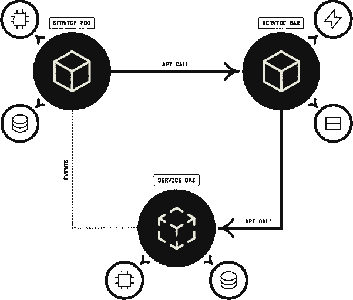

# Encore 模型，构建你头脑中设计的后端

> 原文：<https://thenewstack.io/encore-models-builds-the-backend-designed-in-your-head/>

当 [Encore](https://encore.dev/) 创始人 [André Eriksson](https://www.linkedin.com/in/erikssonandre/?originalSubdomain=se) 成为 Spotify 的一名开发人员时，他发现[为云应用程序构建后端](https://encore.dev/blog/fun-back-into-software-development)的工作平凡而重复，远没有他十几岁时与《魔兽世界》制造商暴雪合作时的那种匆忙。

瑞典后端制造商在其网站上提到那些重复性的后端任务，至少对开发者来说，就像是轮子上的仓鼠。他在 Encore 背后的想法是让人们更容易、更快地进入软件开发的有趣部分。

“作为一名工程师，我个人花费了大部分时间，只是一遍又一遍地做同一类型的工作，管理基础设施，配置东西，你知道，所有那些重复和无差别的任务只是这些天来构建云后端的日常生活，”他说。“然后环顾四周，我注意到每个团队都在这么做。然后看看公司外部，其他所有公司也在做同样的事情。”

他说，该公司正在探索可用的工具，但没有发现它们提供了那么多好处。在对这个问题进行了长时间的思考后，他认为核心问题是工程师花了太多时间来构建系统，却不知道他们在做什么。

因此，他着手建立一个系统，实际上，可以读取你的想法。算是吧。

“为了帮助开发人员更有效地工作，我们需要真正理解开发人员试图做什么的工具，”他说。“我们都习惯了这些完全不知道你在做什么的工具；他们根本不理解你在搭建一个后端。

“即使是后端特定的，他们也不理解你的后端是什么；他们不明白它是如何组合在一起的。当你没有这种理解时，你实际上帮助开发人员完成工作的能力就非常有限。这就是安可的不同之处。”

## 基于规则的引擎

写出来就是，Encore 的设计符合工程师头脑中的设计，这种方法被称为 [Encore 应用模型](https://encore.dev/docs/application-model)。

对于任何编程语言，您都有一个编译器和一个解析器来分析您的代码，然后构建一个二进制文件，然后在服务器上运行。

“Encore 本质上是在此基础上的另一层，我们为如何表达后端概念添加了额外的规则，比如‘这就是如何定义 API。这就是你如何查询数据库，这就是你如何定义你需要一个缓存或其他东西的队列。因此，在构建分布式系统的过程中，所有这些真正重要的概念都会反复出现，我们会将它们转化为以某种方式表达的本地概念，”他解释道。

本质上，Encore 在你的云账户上运行一套固执己见的规则，它的[后端开发引擎](https://github.com/encoredev/encore)要求你遵守这些规则。

“我们有一个解析器，它的工作方式就像编程语言的常规编译器一样，然后解析代码并执行那些规则:‘哦，你试图查询数据库，但你没有遵循 Encore 的规则。’所以在某种程度上，它是一种建立在 Go 之上的编程语言，它不是将其编译成二进制文件，而是将其编译成分布式系统的描述…这就像，这里是所有的服务，这里是所有不同的端点，这里是请求和响应模式，这里是您在这个服务和那个服务之间进行 API 调用的地方。这是定义数据库或键值存储的地方。这是您查询数据库的地方。

“所以它变成了对你的整个系统如何组合在一起的非常非常丰富的描述。它在很大程度上模拟了建造该系统的工程师的思维模式，因为他们就是这么想的，”他说。

使用元数据的静态分析，它会创建一个您的系统的图表，就像您在白板上绘制一样，用方框和箭头表示系统和服务，以及它们如何与基础架构通信和连接。

它提供了以下能力:

*   调配和配置云基础架构以及在提供商之间移植的能力
*   自动生成例行样板文件
*   用分布式跟踪检测您的应用程序
*   生成交互式 API 文档并保持更新
*   实施惯用的秘密管理方法。

[https://www.youtube.com/embed/cU4SnD0jc28?feature=oembed](https://www.youtube.com/embed/cU4SnD0jc28?feature=oembed)

视频

## 托管在您的云帐户上

Encore 不想托管你的软件。虽然它确实提供托管服务来帮助初创公司和业余爱好者快速起步和运行，但对于生产来说，它运行在亚马逊网络服务、Azure 或谷歌云平台上的云账户之上。

它充分利用其开源根源和你对云账户的控制，强调如果你出于任何原因想要离开 Encore，你仍然拥有数据和对这些账户的访问权。

埃里克森说，这是一个成熟的编程工具，只是在略高的抽象层次上，专门用于构建基于云的后端。

“大多数使用 Encore 的工程师实际上都非常有经验。他们来自这样一个世界，在那里他们知道如何利用云基础设施和可扩展的分布式系统来完成所有这些事情。他们只是受够了。他们实际上想制造产品，而不是浪费所有的辛劳。他们真的很喜欢安可让他们做到这一点，”他说。

## 前进

2021 年，埃里克森和同样是 Spotify 校友的马库斯·科尔伯格(Marcus Kohlberg)一起推出了 Encore。它吹捧一个拥有谷歌和英国在线银行 Monzo 经验的工程团队。该公司去年在 Mozilla 公共许可证 2.0 下开源了 Encore Go 框架。它是后端开发引擎的基础，最近宣布了由 Crane Venture Partners 牵头的 300 万美元种子轮。

Crane Venture Partners 的联合创始人 [Krishna Visvanathan](https://www.linkedin.com/in/krishnavisvanathan/?originalSubdomain=uk) 说:“Encore 极大地改变了开发人员在云中构建分布式系统的体验。“它之所以与众不同，是因为它能够深入理解源代码，并自动处理否则会导致开发和业务停滞的问题，同时让开发人员能够自由开发任何应用程序或云环境。Encore 显然是这一领域的领导者和先行者。”

凭借其在大规模分布式系统方面的经验，它正在寻求解决这些问题，同时也为初创公司提供一款引人注目的产品。

“我认为这种方法非常固执己见，并且真正专注于一种非常集成的方法，在这种方法中，我们实际上可以投资解决大型工程组织永远没有时间解决的问题。埃里克森说:“我认为，对于企业来说，对系统如何配合和工作进行真正复杂的分析有很大的价值。

他指出，如果你从事游戏开发，你会使用像 Unity 或 Unreal Engine 这样的游戏引擎。但是要构建一个后端，传统上，你只需要打开一个文件并开始输入。

“因此，游戏行业和后端行业在体验和整合方面存在巨大差异。这就是我们想要实现的目标，提供一个真正强大的集成体验，不仅可以改善单个开发人员的体验，还可以改善协作方式、团队协作方式以及整个组织的工作方式。

“然后超越开发者，进入洞察、分析、机器学习和数据，”他谈到长期愿景时说。

“从更直接的角度来看，更重要的是我们如何利用这种体验……并让希望将其与现有系统和后端集成的大型公司更容易获得这种体验，能够将它与现有基础架构无缝集成，等等。

“然后只是添加更多的云原语，我们称之为分布式系统的构建块，如缓存、队列和对象存储，以及所有这些你在其中构建的东西。”

微软的云开发者倡导者布莱恩·科特森是他的粉丝。他在邮件中滔滔不绝地说:

“我现在已经用 Encore 做了几个项目了，完全爱上了。第一个项目是一个雄心勃勃的会议管理平台，由 Go 社区的一些志愿者承担。在短短的几周内，我们就能够组装一个完整的会议管理系统，包括会议所需的一切:票务、日程安排、论文征集、房间管理等等。招募新的志愿者来帮助编写代码真的很容易，每个人都对我们的开发速度印象深刻。这个项目是一年多以前的，所以它是使用旧版本的 Encore 平台构建的。

“最近，我受邀为墨西哥发展周做主题演讲。我知道 Encore 大约在同一时间计划推出 1.0，他们刚刚发布了 Azure 支持。我在微软工作，是一名 Azure 云开发者倡导者。所以我决定做一个生活 API，作为 keynote 的演示应用。

“我的目标是创建一个 API，涵盖我作为开发人员倡导者需要手动完成的所有事情。我家里有一个新生儿，有一些严重的医疗问题，我们最终花了很多时间在重症监护室和小家伙一起写我的演讲和应用程序。我们周五到家，我的主题演讲是周一。我能够构建出整个 API，并在周末的几个小时内构建一个新的网站来使用它。

“说我对安可印象深刻是一种保守的说法。从功能上看，Encore 是为开发者打造的。安装了`encore`命令行应用程序并创建了一个帐户后，开发体验几乎是零摩擦的。Encore 平台允许我只为我的应用程序编写业务逻辑，而不是花无数的时间来设置托管、持续集成、自动化部署以及其他会在一开始拖新项目后腿的操作性工作。对于像我这样的小项目来说，这可能总共节省了我 15-20 个小时的时间。

“操作上，安可确实大放异彩。因为 Encore 的工具分析我写的代码，它们能够注入所有我讨厌写的无聊的样板文件。是的，我想要分布式跟踪；不，我不想用几十行重复的代码注释每一个函数来实现它。一旦我的代码被部署，我就可以进入 Encore 仪表板，查看分布式跟踪和详细的日志。这种“单一窗格”的运营方法是一个非常好的简化，它不同于团队用来管理已部署应用程序的 5-8 种不同工具。

“将 RPC 调用视为代码中的本地函数调用是另一个令人愉快的节省时间的方法。我没有把我的 API 写成一个大块头，而是决定把每个功能区域分解成独立的微服务，以探索 Encore 在一个有许多服务通过公共和私有(内部)端点公开的环境中工作得如何。整个过程尽可能的平稳和枯燥。Encore 管理数据库连接、机密、数据库迁移、日志和基础设施。我没写的代码太多了。

“每一个像 Encore 这样旨在加速开发的工具都有其利弊。作为开发人员，您有责任理解工具代表您做出的决策所带来的权衡。

Encore 显然是由既了解开发人员需求又了解运营团队需求的人构建的。在他们的平台上没有任何我不能接受和拥护的决定。众所周知，锦上添花的是能够在我自己的 Azure 订阅上托管应用程序，因此我不依赖于其他人的云。"

<svg xmlns:xlink="http://www.w3.org/1999/xlink" viewBox="0 0 68 31" version="1.1"><title>Group</title> <desc>Created with Sketch.</desc></svg>