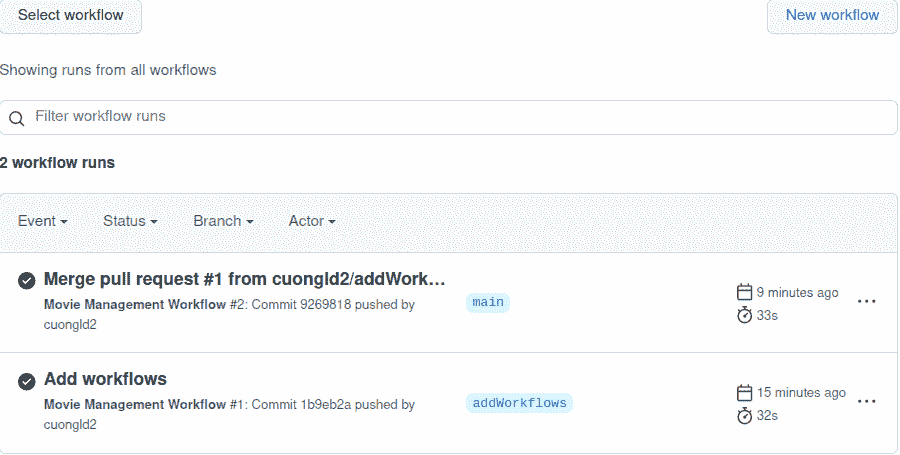
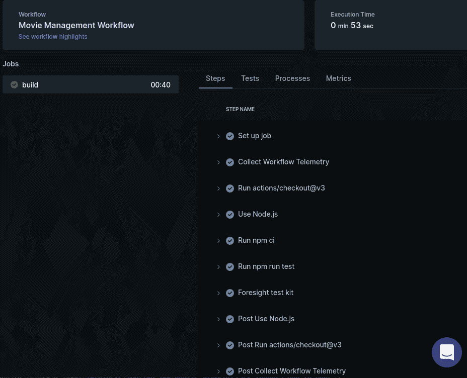
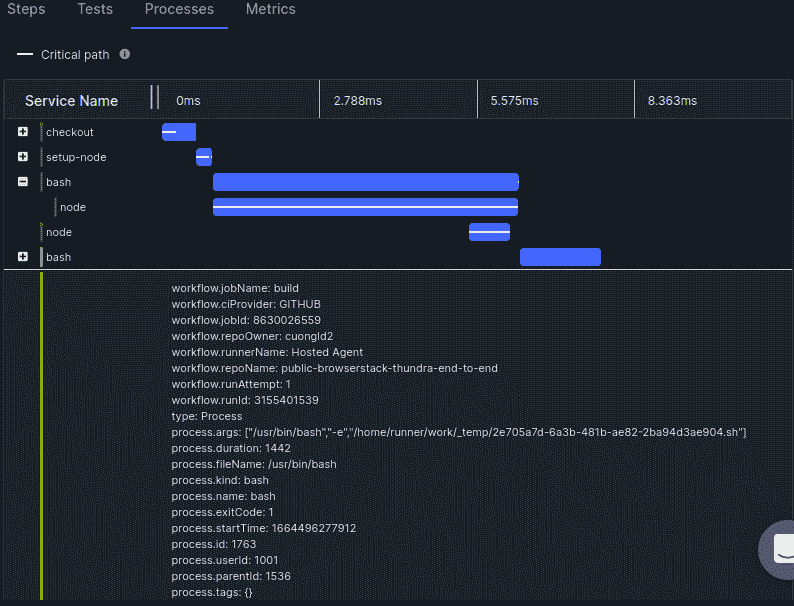
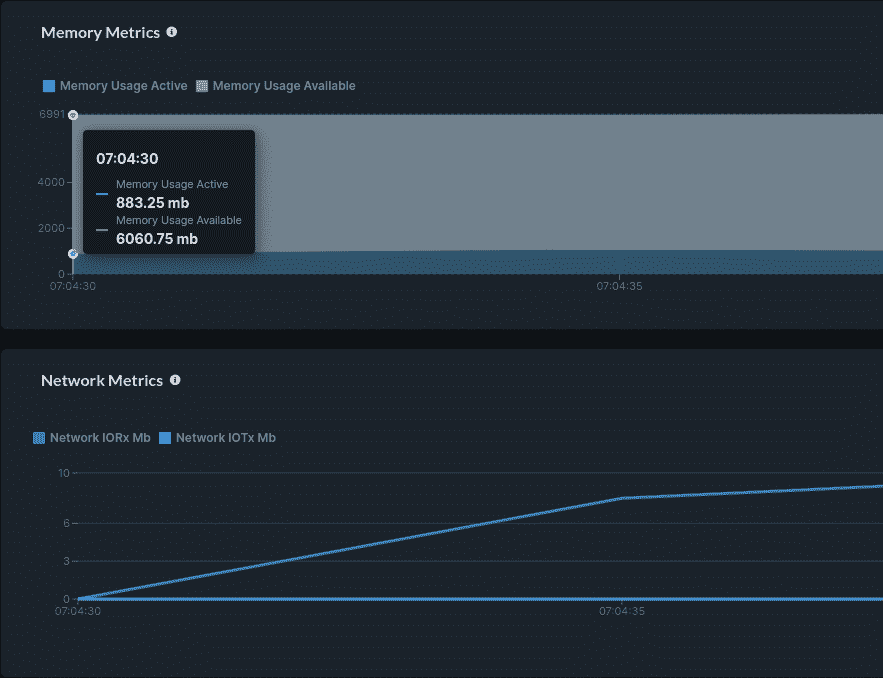
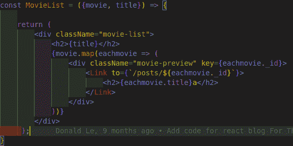

# 端到端测试故障排除

> 原文：<https://thenewstack.io/end-to-end-test-troubleshooting/>

在今天的软件海洋中，是什么让用户选择你的产品而不是另一个？是因为你填补了一个空白吗？还是因为伟大的产品设计？也许是你的营销策略。

所有这些都是吸引客户的重要因素，但当你需要留住他们时，就要归结到产品质量上了。产品质量与您运行的测试直接相关。

为了保持质量，我们经常实现 CI/CD 管道，并在每次构建产品代码后运行自动化测试。为了证明产品符合用户期望，我们还添加了端到端测试。

在本文中，我们将创建 GitHub 工作流，然后用它来构建应用程序。接下来，我们将为应用程序运行端到端测试。最后，我们将应用 Foresight，它提供了对工作流进行监控和故障排除的功能，确保我们可以快速地找出问题，并在调试过程中节省时间。

## 实现应用程序

让我们构建一个应用程序，使用户能够管理他们喜欢的电影。我们的服务将能够创建新用户并验证他们，以及添加新电影，更新电影，获取电影内容和删除电影。

我们将使用 MongoDB 作为存储数据的数据库。为了确保服务可以扩展，我们将使用 [MongoDB Atlas](https://www.mongodb.com/atlas/database) 中的云 MongoDB 服务，并且我们将创建一个自由层集群。注意，为了能够从任何地方访问数据库，我们需要为 MongoDB 集群设置入站规则。

你可以在这个 [GitHub 库](https://github.com/cuongld2/thundra-movie-management-backend)中找到这个应用程序如何工作的全部细节。

现在，我们准备使用以下命令启动我们的服务:

`node index.js`

默认情况下，该服务将使用端口 3000 启动。让我们测试一下这个应用程序，看看我们的服务是否能够创建新用户，并使用 [Postman](https://www.postman.com/) 向系统中添加一部新电影。

在我们创建了一部电影之后，看起来我们的应用程序工作正常。现在我们可以移到前端了。

## 构建前端服务

为了让普通用户能够使用我们的应用程序并与之交互，我们需要创建一个前端服务。我们将借助 JavaScript 中的 React 来实现用户界面。应用程序前端的细节可以在[这个 GitHub 库](https://github.com/cuongld2/thundra-end-to-end-application)中找到。

实现 UI 后，我们可以使用以下命令触发前端:

`npm run start`

为了更好地管理整个应用程序，并使用户能够访问应用程序及其 API，我们需要更多的特性。

### 设置 NGINX 转发请求

我们将定义`nginx.conf`,以便当用户访问我们的 web 应用程序时，请求将被转发到前端呈现和后端请求的正确位置。

设置好之后，你应该可以在主页上看到电影列表。

### 为应用程序的公共地址设置 Ngrok

现在我们将设置 [Ngrok](https://ngrok.com/) 为我们的本地 IP 地址创建一个公共地址。首先，我们创建用于定义要公开的端口的`ngrok.yml`文件，以及我们的 Ngrok 令牌。然后，我们准备向世界公开我们的本地地址端口。

`./ngrok start all`

## 为应用程序编写端到端测试

既然应用程序已经启动并运行，我们可以在 BrowserStack 平台中使用 Jest (Node.js)和 Selenium 编写我们的端到端测试。

BrowserStack 是一个云解决方案，支持多种环境的自动化测试。为了方便起见，我们将使用它的服务进行端到端测试，我们将使用 Selenium，因为它很流行，也很成熟。我们还需要一个试跑者。我们会选择 Jest，因为它对结构化测试很有帮助，也因为它是 Node.js 测试解决方案的流行选择。

本[要点](https://gist.github.com/cuongld2/c75a73c3608b4a17c8ab8c4065c83275)中概述了我们的端到端测试示例，测试的[完整代码可在 GitHub 上获得。](https://github.com/cuongld2/public-browserstack-thundra-end-to-end)

在我们成功地执行了应用程序的端到端测试之后。让我们继续创建 GitHub 动作工作流来运行我们的应用程序的持续集成管道。

## 创建 GitHub 操作工作流程

为了构建应用程序并自动运行每个新变化的测试，我们需要为应用程序创建 GitHub 动作工作流。工作流还与 Foresight 集成在一起，以确保我们能够在未来高效地监控我们的应用。我们的应用程序需要三个工作流:一个用于后端服务，一个用于前端服务，一个用于执行端到端测试。让我们开始创建今天的后端服务。(关于[前端服务](https://github.com/cuongld2/thundra-end-to-end-application)和[端到端测试](https://github.com/cuongld2/public-browserstack-thundra-end-to-end)的工作流程细节可以在他们的 GitHub 仓库中找到。)

注意:为了简化演示，让我们假设我们已经创建了永久的 web 域，而不是使用 ngrok 随机生成的域。

GitHub 动作的工作流文件是 YAML 格式的，位于我们应用程序的`.github`目录中。

将更新后的工作流推送到 GitHub 存储库将自动为我们的后端工作流触发一个新的 GitHub 动作。工作流现已成功运行。

我们的工作流程是自动运行的。

当我们查看 Foresight 仪表板时，我们可以看到我们的应用程序工作流的一个新的更新仪表板。通过单击“最近的工作流运行”，我们可以看到有关最近工作流运行的更多详细信息，例如工作流中已执行的“步骤”。

工作流中已执行的步骤

导航至“流程”选项卡。在这里，我们可以看到关于流程的详细信息，比如哪些流程参数已经被执行。

关于进程的信息，如参数及其持续时间

在“Metrics”选项卡中，我们可以检查工作流中使用了多少内存或网络。

关于进程的信息，如参数及其持续时间

通过 Foresight 提供的所有这些信息，我们可以轻松地发现工作流失败的原因，或者调试工作流中的性能问题。

## 使用预见调试失败的测试

在现实世界的项目中，我们经常需要更新前端代码来为我们的应用程序实现新的特性。让我们看看，如果在为新特性更新前端代码之后，我们的一个端到端测试失败了，会发生什么。

在检查了 GitHub Action 中的信息后，我们仍然不知道测试失败的原因。让我们转到 Foresight 登录页面，了解发生了什么。

从 Foresight 的日志中，我们可以看到测试失败是因为一个不匹配的标题:“神秘河”在我们的应用程序中被错误地渲染为“神秘河”。让我们检查应用程序的 GUI，看看电影标题是如何显示的。

我们注意到所有的标题后面都加了字母“a”，很奇怪。让我们检查一下前端存储库的源代码。

关于进程的信息，如参数及其持续时间

我们注意到标题中有一个多余的“a”字符。去掉这封信，我们的测试又成功了。

使用预见，我们很容易发现并修复了中断的工作流。

## 高效的工作流程

监控和修复交付管道不是一项简单的任务，因为部署过程中有许多步骤，而且应用程序的复杂性往往会随着时间的推移而增加。借助 Foresight 的功能，我们可以看到精心选择的指标和日志，以便我们可以快速识别有问题的工作流，发现失败的原因并开始修复问题。

[报名参加 Foresight](https://www.runforesight.com/) 自己去试试吧。

<svg xmlns:xlink="http://www.w3.org/1999/xlink" viewBox="0 0 68 31" version="1.1"><title>Group</title> <desc>Created with Sketch.</desc></svg>