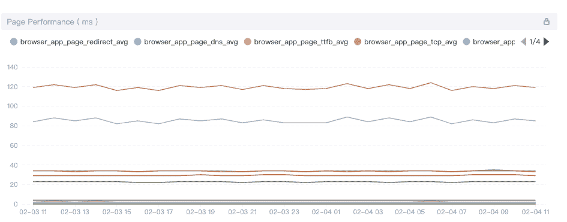

# 空中漫步观察浏览器中的终端用户跟踪

> 原文：<https://thenewstack.io/end-user-tracing-in-a-skywalking-observed-browser/>

 [夏秋球迷

夏秋是 Tetrate 工程师，前端开发人员和阿帕奇天行者 PMC。她领导了 SkyWalking RocketBot UI，并创建了 SkyWalking 浏览器代理项目。](https://www.linkedin.com/in/qiuxia-fan-65ba09151/) 

Web 应用性能影响用户留存率。如果一个页面加载时间太长，用户就会放弃。因此，我们需要监控 web 应用程序以了解性能，并确保服务器稳定、可用且健康。 [Apache SkyWalking](https://github.com/apache/skywalking) 是一款应用性能监控(APM)工具，专为云原生和基于容器的架构而设计。它的 [skywalking-client-js](https://github.com/apache/skywalking-client-js) 是一个轻量级的客户端 JavaScript 异常、性能和跟踪库。

本文描述了 skywalking-client-js 如何将其监控扩展到浏览器，为 skywalking 后端提供性能指标和错误收集。

## **绩效指标**

skywalking-client-js 使用 [window.performance](https://developer.mozilla.org/en-US/docs/Web/API/Window/performance) 来收集性能数据。从 MDN 文档中，性能界面提供了对当前页面的性能相关信息的访问。它是高分辨率时间 API 的一部分，但由[性能时间线 API](https://developer.mozilla.org/en-US/docs/Web/API/Performance_Timeline) 、[导航计时 API](https://developer.mozilla.org/en-US/docs/Web/API/Navigation_timing_API) 、[用户计时 API](https://developer.mozilla.org/en-US/docs/Web/API/User_Timing_API) 和[资源计时 API](https://developer.mozilla.org/en-US/docs/Web/API/Resource_Timing_API) 增强。

在 skywalking-client-js 中，所有的性能指标都是根据[W3C 规范](https://www.w3.org/TR/navigation-timing/?spm=a2c4g.11186623.2.12.2f495c7cmRef8Q#sec-navigation-timing-interface)中定义的[导航计时 API](https://www.w3.org/TR/navigation-timing/?spm=a2c4g.11186623.2.12.2f495c7cmRef8Q#sec-navigation-timing-interface) 来计算的。我们可以使用[window . performance . timing](https://developer.mozilla.org/en-US/docs/Web/API/Performance/timing)属性获得一个描述页面的 PerformanceTiming 对象。PerformanceTiming 接口包含为加载和使用当前页期间发生的各种事件提供性能计时信息的属性。

当我们在下图中从 [W3C](https://www.w3.org/TR/navigation-timing/?spm=a2c4g.11186623.2.14.2f495c7cmRef8Q#processing-model) 看到这些属性时，我们可以更好地理解它们:

下表包含 skywalking-client-js 中的性能指标。

Skywalking-client-js 收集这些性能指标，并将其发送到 [OAP(可观察性分析平台)服务器](https://skywalking.apache.org/docs/main/latest/en/concepts-and-designs/backend-overview/)，后者在后端聚合数据，然后在 UI 端以可视化方式显示。用户可以根据这些数据来优化页面。

## **异常指标**

在 skywalking-client-js 中可以捕获五种错误:

1.  资源加载错误被`window.addeventlistener ('error ', callback, true)`捕获。
2.  `window.onerror`捕捉 JS 执行错误。
3.  `window.addEventListener('unhandledrejection', callback)`用来捕捉诺言的错误。
4.  Vue 错误由`Vue.config.errorHandler`捕获。
5.  Ajax 错误由发送回调中的`addEventListener('error', callback); addEventListener('abort', callback); addEventListener('timeout', callback);` 捕获。

Skywalking-client-js 跟踪错误数据到 OAP 服务器，最后在 UI 端可视化数据。对于应用程序的错误概述，有几个基本统计数据和错误趋势的指标，包括以下指标:

*   App Error Count，所选时间段内的错误总数。
*   App JS 错误率，所选时间段内出现 JS 错误的 PV 占总 PV 的比例。
*   所有应用程序错误计数，前 N 名应用程序错误计数排名。
*   所有应用程序的 JS 错误率，前 N 名应用程序的 JS 错误率排名。
*   所选应用中版本的错误计数，所选应用排名中版本的前 N 个错误计数。
*   所选应用中版本的错误率，所选应用排名中版本的前 N 个 JS 错误率。
*   所选应用的错误计数，所选应用排名的前 N 个错误计数。
*   所选 App 错误率，所选 App 排名前 N JS 错误率。

对于页面，我们使用几个指标来衡量错误的基本统计数据和趋势，包括以下指标:

*   最不稳定页面/错误率，所选版本排名的前 N 个错误计数页面。
*   前不稳定页面/错误计数，所选版本排名的前 N 个错误计数页面。
*   页面错误计数布局，显示一段时间内不同错误的数据。

## **用户指标**

天巡浏览器监控还提供关于访问者如何使用被监控网站的指标，例如 PV(页面浏览量)、UV(独立访问者)、top N PV(页面浏览量)等。

在 SPAs(单页应用程序)中，页面只刷新一次。传统方法只在页面加载后报告一次 PV，无法统计每个子页面的 PV，也无法将其他类型的日志按子页面进行汇总。

天行浏览器监控为 SPA 页面提供了两种处理方法:

1.  启用 SPA 自动解析。这种方法适用于大多数以 URL 哈希为路由的单页面应用场景。在初始化的配置项中，将 enableSPA 设置为 true，这将打开页面的 hashchange 事件监听器(触发重新报告 PV)，并在其他数据报告中使用 URL hash 作为页面字段。
2.  人工报告。如果第一种方法不可用，则此方法可用于所有单页应用程序场景。以下示例提供了一个 set page 方法，用于在报告数据时手动更新页面名称。调用该方法时，默认会重报页面 PV:[https://gist . github . com/fine 0830/53d 36508671882 e 210 D7 FCA 861555 ce 9](https://gist.github.com/Fine0830/53d36508671882e210d7fca861555ce9)

让我们看看下图中的结果。它显示了最流行的应用程序和版本，以及一段时间内 PV 的变化。

【T2

## **让浏览器成为分布式跟踪的起点**

SkyWalking 浏览器监控拦截 HTTP 请求以跟踪段和跨度。它支持跟踪以下模式的 HTTP 请求: [XMLHttpRequest](https://developer.mozilla.org/en-US/docs/Web/API/XMLHttpRequest) 和 [fetch。](https://developer.mozilla.org/en-US/docs/Web/API/Fetch_API)还支持基于 XMLHttpRequest 和 fetch 的跟踪库和工具——比如 [Axios](https://github.com/axios/axios) 、 [SuperAgent](https://github.com/visionmedia/superagent) 、 [OpenApi](https://www.openapis.org/) 等等。

让我们看看天行浏览器监控如何拦截 HTTP 请求:

之后，使用`window.addEventListener('xhrReadyStateChange', callback)`并将请求头中的 readyState 值设置为`sw8 = xxxx`。同时，报告向后端请求信息。最后，我们可以在跟踪页面上查看跟踪数据。下图来自“跟踪”页面:

为了查看我们如何监听获取请求，让我们看看[获取](https://github.com/github/fetch/blob/90fb680c1f50181782f276122c1b1115535b1603/fetch.js#L506)的源代码。

如您所见，它创建了一个承诺和一个新的 XMLHttpRequest 对象。因为获取的代码内置在浏览器中，所以它必须首先监控代码的执行。因此，当我们添加监听事件时，我们无法监控获取中的代码。刚刚监控完代码执行，我们来重写 fetch: `import { fetch } from 'whatwg-fetch'; window.fetch = fetch;`这样就可以通过上面的方法拦截 fetch 请求了。

## **其他资源**

从[官方网站](https://skywalking.apache.org)、Tetrate [博客](https://www.tetrate.io/blog/category/open-source/apache-skywalking/)和电子书[中阅读更多关于空中漫步的内容，可免费下载](https://www.tetrate.io/apache-skywalking-ebook-tetrate/)。

通过 Pixabay 的特征图像。

<svg xmlns:xlink="http://www.w3.org/1999/xlink" viewBox="0 0 68 31" version="1.1"><title>Group</title> <desc>Created with Sketch.</desc></svg>