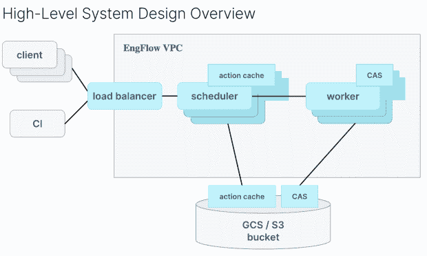
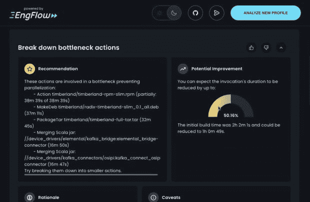

# EngFlow 利用 Google Bazel 加快 Monorepo 构建

> 原文：<https://thenewstack.io/engflow-bazel-and-more-for-faster-builds/>

在谷歌于 2015 年开源了其内部构建系统 Blaze 的一个版本 [Bazel](https://github.com/bazelbuild/bazel) 之后，它开始起飞，并在 GitHub 上发展成为一个有 20，000 个启动的项目。然而，它的一些创造者意识到，并不是每个公司都像谷歌一样，这个项目需要其他 99%的人来领导。

因此， [EngFlow](https://www.engflow.com/) 的创立，一家专注于[让构建更快](https://thenewstack.io/linkedin-yarn-workspaces/)的公司，对那些可能不得不中断咖啡时间的开发人员毫无歉意。

“我们从不同公司那里听到的越多，就越清楚地表明，需要大力关注构建和利用这些概念，但在谷歌之外，因为不是每个公司看起来都像谷歌，也不是每个公司都面临同样的挑战。

“因此，虽然谷歌向世界开放了 Bazel，但采用 Bazel 和在 Bazel 基础上构建工具生态系统的方式需要与谷歌内部的方式不同，”EngFlow 首席执行官海伦·阿尔特舒勒[说，她当时正在与采用 Bazel 的谷歌客户合作。她的联合创始人 Ulf Adams 是谷歌 Bazel 的首席开发人员。](https://www.linkedin.com/in/helen-altshuler/)

## 多语言建筑系统 Bazel

正如 Bazel 在关于新堆栈的早期帖子中解释的那样，[使用大规模共享代码库或 monorepo 来加速构建](https://thenewstack.io/bazel-googles-open-source-build-system/)，尽管它也处理微服务架构。它使用缓存和并行优化构建。[6.0 版本](https://www.buildbuddy.io/blog/whats-new-in-bazel-6-0/)12 月发布。

Bazel 是多语言的，而不是每种语言都需要不同的构建系统——例如，Maven for Java 或 CMake，如果你使用 C++。它会说 Java、C++、Go、Android、iOS、 [Ocaml](https://thenewstack.io/the-fastest-programming-language-daves-garage-seeks-the-answer/) 和许多其他语言，可以在 Windows、macOS 和 Linux 上运行。该工具本身使用 Starlark，这是一种源自 Python 的声明式编程语言。

根据 Altschuler 的说法，随着代码库的增长，构建时间不需要增加。有了 Bazel 的依赖分析和依赖图方法，它可以在你进行的过程中计算出发生了什么变化，所以你只需要重新编译和重新运行代码中发生变化的部分。这导致更高效的处理和更快的构建。它提供了一致的再现性，与 Docker 和 Kubernetes 的集成，以及可伸缩性。

它已经被优步、T2、Spotify 和 T4 的 Dropbox 所采用。当 Elon Musk 接手时，Twitter 正在将其 Pants build 系统迁移到 Bazel，这是社交网络中显然不再支持的许多开源项目之一。

然而，Bazel 是为大型工程组织设计的，它被批评需要大量的配置，因此需要提供更多的帮助。

## 并行构建

EngFlow 基于 Bazel 编写了自己的产品，该产品将并行化操作，并将它们分布在一个计算节点集群上。

使用远程执行，EngFlow 在一个机器集群上分发构建和测试，并远程缓存结果以使它们更快。它可以在云中或内部进行完全管理或自我管理。

“因此，您可以将构建提交到数百个内核的云中，而不是在 32 内核的机器上本地运行构建。Altshuler 说:“我们的许多客户都在并行运行数万个内核，以分配大量的源文件编译时间和测试执行时间。

远程执行集群由调度器和工作器组成。调度程序实例是集群的“大脑”,它协调和分配工作并执行维护。工作实例是集群的存储和执行单元。

例如，在[亚马逊网络服务](https://aws.amazon.com/?utm_content=inline-mention) (AWS)上，EngFlow 的[远程执行软件](https://aws.amazon.com/blogs/startups/fast-reliable-and-cost-efficient-builds-tests-at-scale-with-engflow-remote-execution-on-aws/)将构建和测试操作分布在数百或数千个工作实例上，这些工作实例运行在安装了 EBS 卷的 EC2 实例上。它使用 AWS 自动扩展来扩展所需的计算能力。远程执行与 EngFlow 的远程缓存解决方案相结合，以防止工作重复。由于所有的构建/测试工件都缓存在组织的本地存储上，团队可以下载以前的工件，而不是自己重新执行操作。构建/测试工件然后被同步到 Amazon 简单存储服务(Amazon S3)用于持久访问。

该公司已经开发出了分析和观察工具。它最近发布了它的[调用分析器](https://github.com/EngFlow/bazel_invocation_analyzer)，这是一个开源工具，帮助用户识别诸如速度慢等问题的原因。它提供了一些建议，例如并行化可以在哪些方面提供更高的效率来提高性能。

“Bazel 配置文件是提高绩效的强大资源，但理解它们并从中提取行动项目很难。EngFlow 创始工程师兼 Bazel Invocation Analyzer 负责人 [Sara Adams](https://www.linkedin.com/in/saraeadams/) 表示:“Bazel Invocation Analyzer 会自动执行流程，并根据档案中的数据给出具体建议。

该公司的支持不仅限于巴泽尔。它支持所有使用开源[远程执行 API](https://github.com/bazelbuild/remote-apis) 的客户端，包括 BuildStream、Goma Server (Chromium)、Pants、Please、Recc 和 Soong (Android 开源项目。)

## 巴泽尔才华横溢

EngFlow 成立于 2020 年初，就在新冠肺炎关闭之前，是一家全远程公司，尽管团队成员最近在冰岛会面。

继 2021 年 10 月 370 万美元的种子轮之后，它最近宣布了 1800 万美元的 A 轮融资。Andreessen Horowitz 的投资人 Martin Casado 在种子期指出，70%的 EngFlow 员工来自谷歌最初的 Bazel 项目，或者是该项目的贡献者。自那以后，它一直宣称要在巴泽尔生态系统中雇佣更多的人才，包括[杰伊·康罗德](https://www.linkedin.com/in/jayconrod/)、[科尔宾·麦克尼利-史密斯](https://github.com/restingbull)、[本杰明·皮特森](https://github.com/benjaminp)和[奥拉·罗森菲德](https://www.linkedin.com/in/ola-rozenfeld-23738816/)。

其客户包括私人搜索引擎 [Brave](https://brave.com/building-brave/) ，农业软件厂商[蓝河科技](https://www.engflow.com/caseStudies/bluerivertechnology?r=menu)和网络代理[特使移动](https://www.engflow.com/caseStudies/envoymobile?r=menu)。

[https://www.youtube.com/embed/G8UMhFS8esc?feature=oembed](https://www.youtube.com/embed/G8UMhFS8esc?feature=oembed)

视频

## '建筑加速公司'

Bazel 和 EngFlow 有一系列的替代品，尽管许多是特定于语言的，如 GNU Make、Maven、Ninja Build 和 SCons。

例如， [Turborepo](https://thenewstack.io/turborepo-speedy-builds-for-javascript-monorepos/) 是一个受 Bazel 启发的开源 mono repo JavaScript 构建工具。Angular 团队成员和前谷歌员工创建了 Narwhal ，这是一家开源 Nx 构建 JavaScript 系统的公司。

移动 DevOps 公司 Bitrise 最近[收购了 Flare Build Systems](https://devops.com/bitrise-acquires-flare-build-to-provide-companies-of-any-size-an-integrated-solution-for-bazel/) ，试图为移动 DevOps 生态系统提供 Bazel 后端服务。

在 EngFlow 继续构建 Bazel 生态系统的同时，它也在寻找超越它的东西。它将自己描述为一家“构建加速公司”

“我们从 Bazel 开始，因为这是我们团队最深层次的专业知识。我们有多名核心工程师，他们构建了 Bazel，并且一直是当今开源项目的积极贡献者。我们也有 Chromium 和 Goma 项目的贡献者，这是 Chromium 的开源项目，”Altshuler 说。

“我们开始考虑如何扩展这些功能，并真正继续改变开发者的思维模式，让他们不必等待构建。你的构建系统应该是水平可伸缩的，就像你的 CI 系统一样，就像整个开发生命周期的许多其他部分一样。”

<svg xmlns:xlink="http://www.w3.org/1999/xlink" viewBox="0 0 68 31" version="1.1"><title>Group</title> <desc>Created with Sketch.</desc></svg>