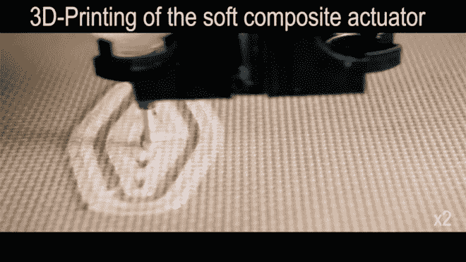
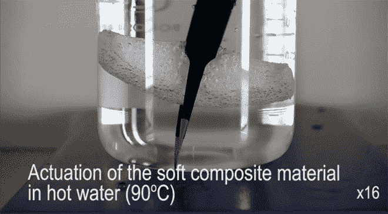
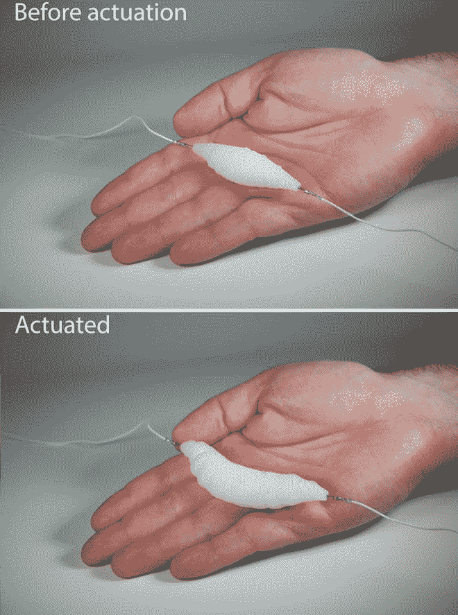
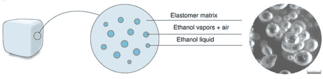
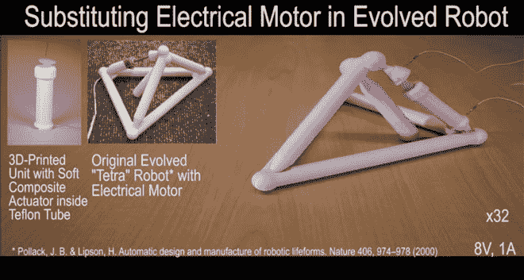
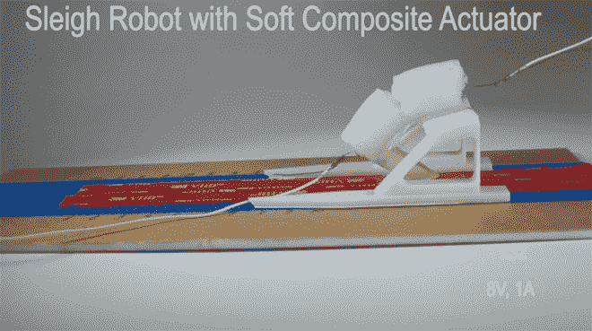
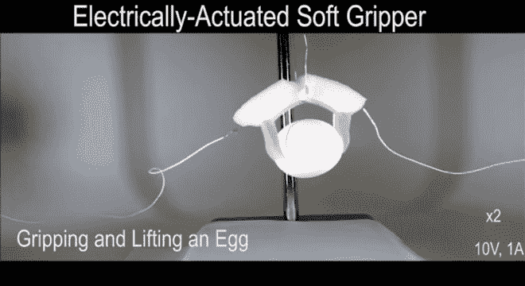

# 工程师的 3D 打印软致动器肌肉使机器人看起来更真实

> 原文：<https://thenewstack.io/engineers-3d-printed-soft-actuator-muscle-makes-robots-look-realistic/>

机器人的经典形象是僵硬的锡罐人，一台笨重而不失优雅的机器。但是今天的机器人专家正致力于创造更多受自然生物学启发的栩栩如生的机器人；感觉和运动像真东西一样的人造有机体或软机器人。这些看起来更自然的机器人在人类周围操作会更安全，特别是在协作机器人的新兴时代，这些机器人可能会在办公室和工厂里与人类并肩工作。

到目前为止，这意味着使用大量的机械手段来模仿生物真实性的一些表象。目前用于软机器人的软致动器技术通常涉及弹性皮肤下笨重的气动或液压充气，这些充气用于扩展或收缩这些人造“肌肉”以提升和操纵物体。但也有缺点:这些系统需要某种压力调节机制和外部压缩机来运行，所以总体来说，它看起来仍然不太自然。

但是哥伦比亚大学 T2 创意机器实验室的研究人员可能已经找到了解决方案:一种 3D 打印的合成软肌肉，其外观和功能与其生物类似物相似，并且能够举起自身重量 1000 倍的重量。它至少比人类肌肉强壮三倍之多*，可以被操纵来推、拉、扭和执行精细的任务，而无需任何外部机制。*

“我们已经在制造机器人思维方面取得了很大进展，但机器人的身体仍然很原始，”机械工程教授 Hod Lipson 说，他是发表在《自然通讯》杂志上的论文的作者之一。“这是一个很大的难题，就像生物学一样，新的致动器可以以一千种方式塑造和重塑。我们已经克服了制造逼真机器人的最后一个障碍。”

[https://www.youtube.com/embed/1J47difr3oo?feature=oembed](https://www.youtube.com/embed/1J47difr3oo?feature=oembed)

视频

## 近乎天然的肌肉——对机器人而言

那么是什么将这块柔软的肌肉与其他肌肉区分开来呢？首先，该团队使用了一种能够在低密度和低电压下进行高应变、高应力应用的软致动器肌肉材料。这种新肌肉使用充满乙醇的微气泡的硅橡胶材料，将弹性与体积的极端变化的可能性相结合。

这种材料可以从 3D 打印机中挤压出任何想要的形状，并在内部嵌入一根金属线来携带低电流通过材料，以使其移动。当在实验中进行测试时，该团队的肌肉显示出令人印象深刻的收缩和扩张能力，仅用 8 伏电压，就可以将其加热到 80 摄氏度(176 华氏度)。

该研究的主要作者阿斯兰·米里耶夫(Aslan Miriyev)说:“我们的软功能材料可能会成为强健的软肌肉，可能会彻底改变今天设计软机器人解决方案的方式。”。“它能推、拉、弯、扭和举重物。这是我们拥有的最接近天然肌肉的人造材料。”

该团队指出，肌肉的效率将在很大程度上取决于加热和冷却的速度，以及机器人专家可能如何在他们的设计中指定这些组件。例如，人们可以设计一种设置，通过使用更高的电流或分布式热源网络来加快肌肉扩张。或者，快速冷却设计可以采用[珀耳帖效应](https://en.wikipedia.org/wiki/Thermoelectric_effect#Peltier_effect)或某种携带冷却剂的网络通道。

更有趣的是，在仿生设计的大好机会中，该团队还提议向自然本身寻求发展一种“使用激动剂-拮抗剂肌肉对的生物学启发的解决方案。”就像真实的肌肉在现实世界中是如何成对进行工作的一样，手臂上成对的肌肉——二头肌和三头肌——协同工作，以便我们能够举起东西。当这对肌肉中的一块肌肉收缩时，另一块肌肉放松。类似地，这种配对的概念可以适用于软机器人设计，以减少去驱动时间——当一个机器人肌肉弯曲手臂时，另一对肌肉开始发挥作用，使手臂迅速回到中立位置，而不是等待第一个肌肉冷却下来并去驱动。

正如你在上面的图片中所看到的，该团队的各种设计实验显示了这种复合材料的广泛可能性:它可以用来取代电机，用来抓东西，或用于自我推进。这种用于软致动器肌肉的新材料不仅易于制作，而且环保，也是一种相对低成本的选择。该团队现在计划使用这种材料进一步完善他们的设计，目的是加快响应时间，提高耐用性，并探索人工智能如何用于控制这样的肌肉系统。

通过 Pixabay 的特征图像(不是实际的机器人)。哥伦比亚大学的其他图片。

<svg xmlns:xlink="http://www.w3.org/1999/xlink" viewBox="0 0 68 31" version="1.1"><title>Group</title> <desc>Created with Sketch.</desc></svg>