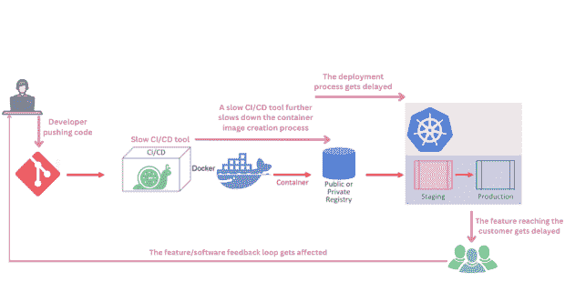
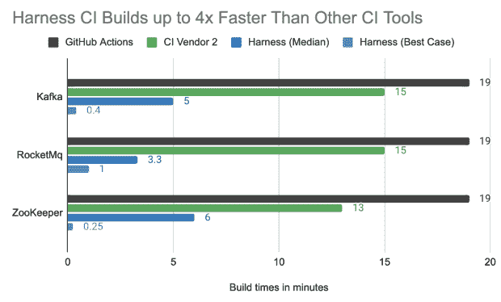

# 通过快速持续集成丰富开发体验

> 原文：<https://thenewstack.io/enriching-dev-experience-with-speedy-continuous-integration/>

事实证明，持续集成加速了软件交付，同时提高了代码质量。有了 CI，组织可以自动化他们的测试过程，更快地发现问题，更频繁地发布他们软件的新版本。

您选择的 CI 类型将取决于您作为一个组织或团队的特定需求和目标。有效的持续集成平台通过自动化流程、减少错误和提高效率来简化您的软件开发流程。因此，快速持续集成平台应该是您的首要考虑因素之一。在本文中，我们将讨论在选择正确的 CI 工具/平台时要考虑的一些重要特征和事实。

## 连续累计

持续集成要求开发人员每天数次将代码集成到共享存储库中。CI 系统的目标是在软件交付生命周期(SDLC)过程的早期发现错误。这有助于检测和减轻问题，即使问题很小，也有助于团队跟上最新的变化。

当一个开发人员完成他的代码/软件的工作，并将其签入一个像 GitHub 这样的源代码控制管理系统时，CI 服务器将构建项目并运行任何相关的测试。

如果构建或测试失败，将会立即通知开发人员。这种实践允许团队在独立的特性和模块上工作，而不会踩到彼此的脚趾或者因为等待其他人完成工作而受阻。这也使得开发者更容易从他们的家用电脑上贡献补丁。这促进了始终拥有最新代码库的想法，并提供了清晰的变更历史。

在您的工作流程中实现持续集成有很多好处。一个主要的好处是，它减少了检测代码库中的错误并在错误发生之前找到它们所花费的时间。它还可以提高开发人员的生产力，因为更多的时间可以花在实际工作上，而不是修复 bug。

持续集成鼓励团队成员之间的交流，因为他们可以看到彼此的变化，并在早期识别潜在的冲突。

为了能够实现持续集成，必须具备以下条件:

*   DevOps 文化和心态
*   版本控制系统到位
*   建筑自动化系统/服务器
*   计划的测试框架
*   开发人员频繁提交代码的意愿和能力

## 为什么选择快速持续集成？

我们处于一个快节奏的云原生世界，每天都有新的工具和流程出现。所有这些工具都旨在提供快速的软件交付和更好的开发者体验。当谈到云原生工具和平台时，开发人员关心的是速度和简单的设置。当开发人员第一次尝试任何工具/平台时，他们希望它易于理解，能够快速设置，能够足够快速地完成工作。任何阻碍他们工作的事情都会导致他们离开并转向另一个工具/平台。

随着 CI 成为实用 DevOps 方法的第一块垫脚石，CI 供应商提供开发人员正在寻找的功能(如速度、设置的简易性、良好的文档和教程)至关重要。

一个出色的 CI 工具/平台可以为您在 DevOps 管道中的后续阶段提供初步的推动力。因此，拥有快速可靠的 CI 工具对于您组织的 DevOps 成功至关重要。使用脚本来做 CI 不是一个选项，现在我们应该明白 Jenkins 不再是一个现代和合适的 CI 工具了。

并非所有 CI 解决方案都是平等的。有些比其他人更快，有些更有效。因此，您将希望确保您的持续集成解决方案快速而准确。否则，如果效率低下，你试图加速过程所节省的时间可能会被挫败。

使用缓慢的 CI/CD 工具，一切都会延迟，如下图所示。

## 选择竞争情报平台

由于 CI/CD 是 DevOps 生命周期不可或缺的一部分，因此选择正确的工具至关重要。以下是一些需要考虑的事项:

*   **成本:**每个解决方案的相关成本是多少？每个解决方案的长期成本是什么样的？
*   **可扩展性:**当您的团队或组织成长时，扩展每个解决方案有多容易？您添加新服务器或员工以满足需求的速度有多快？
*   构建速度:解决方案构建代码的速度有多快？CI 平台接受变更、编译代码和部署新版本需要多长时间？
*   **部署速度:**CI 解决方案部署代码的速度有多快？向客户推出新版本的软件需要多长时间？
*   **托管还是本地:**您的 CI 解决方案将在哪里托管？一些平台是在线托管的，而另一些则是在内部安装的。
*   **多种语言和框架:**您的 CI 解决方案是否支持所有语言和框架？或者，如果您需要支持特定的东西，您是否必须切换到不同的解决方案？
*   **生态系统和应用集成:**CI 解决方案是否与您用来支持您的公司或团队的其他应用或工具相集成？如果有，是哪些？
*   **SCM 集成:**CI 解决方案如何与不同的源代码控制管理系统(SCM)集成，如 GitHub、BitBucket、GitLab 等？它是否允许您通过可定制的触发器来自动化项目的构建和发布过程？
*   **可靠性:**确定 CI 工具的可靠性变得至关重要，这样测试和构建阶段可以快速一致地执行，部署也变得快速。CI 工具不应停机，因为它将开始影响您的业务。

## 持续集成工具:注意事项

### 从简单的开始，慢慢升级

首先，您必须确保持续集成工具/平台是可靠和快速的。这将决定你的团队测试和构建软件的效率。遵循产品文档、指南和教程，让开始变得简单。你不想一开始就让你的 CI 系统过于复杂。随着您对这个过程越来越熟悉，您可以添加更多的工具和集成来使它变得更好。

### 自动化您的软件测试过程

让我们假设您的 CI 系统已经设置好，并且您的环境已经准备好。您开始构建和测试您的代码，但是您注意到您的 CI 过程花费了很长时间——有时甚至比您预期的还要长。除了手动测试和验证您的代码，您可以使用测试自动化和工具，它们将在 CI 阶段为您运行您的测试，并向您提供结果。这可以节省很多时间，因为它执行测试的速度比人快得多，而且每次都是一致的。如果您想要加速您的 CI 过程并确保您的代码准备好被部署，这是非常重要的。

### 使用自动化和测试智能来加速

有一种新的测试方法，您的 CI 平台/工具可以只选择需要运行的相关测试，而不是为所有作业运行所有测试。一个足够智能的工具可以为特定的工作选择运行的测试，这可以节省开发人员的大量时间，而不是让开发人员等待所有的测试都通过。

### 执行与代码相关的验证检查

您的 CI 工具应该能够在第三方工具的帮助下检查与代码相关的错误和漏洞，并且这些工具的集成应该尽可能平滑。

*   **代码质量检查** **—** 代码格式和代码质量检查有助于提高团队的生产力，并保持代码库的一致性。这就是为什么许多 CI 系统都有现成的代码格式化和质量检查工具。您可以将它们集成到您的 CI 系统中，让它们自动运行。
*   **代码分析****——**代码分析帮助你识别模式并对你的代码做出预测。您可以将代码分析工具作为 CI 流程的一部分来运行，以确保您的代码遵循一定的标准，并准备好进行部署。
*   **依赖管理—** 依赖管理对于构建和部署软件是必不可少的。通过将依赖关系管理工具集成到您的系统中，您可以加快 CI 流程。这样，该工具将在您运行构建之前解决任何依赖关系。

### 缓存和并行

CI 工具应该有一个缓存机制，因为缓存通过重用以前作业中昂贵的获取操作数据来确保更快的作业执行。此外，该工具应该能够以相同的速度处理并行作业，而不会降低性能。运行的测试越多，如果按顺序运行，完成测试所需的时间就越长。为了减少测试周期时间，您可以将您的测试分开，同时在多个组中运行它们。测试智能加上缓存和并行性为任何 CI 产品/平台提供了很好的功能组合。

### 选择最快的 CI 平台

请记住，没有“完美”的 CI 解决方案。从识别你正在寻找的关键特征开始，然后你可以开始根据你的需求比较不同的 CI 平台。

最近，Harness 宣布了针对 Harness [持续集成](https://harness.io/products/continuous-integration) (CI)模块的几项[新速度增强](https://harness.io/blog/announcing-speed-enhancements-and-hosted-builds-for-harness-ci)，并声称 Harness CI 构建速度比其他领先 CI 解决方案快四倍。

Harness 的工程师设计了这些测试，以便在 Apache Kafka、Apache RocketMQ 和 Apache Zookeeper 存储库中使用 [Harness CI](https://harness.io/products/continuous-integration) 、GitHub Actions 和另一个流行的 CI 工具运行相同的构建。

上图显示了几分钟后的结果。(注意:Harness“最佳情况”的结果是在代码变化最小，并且没有测试用例运行的情况下获得的(这是开源 repo 中的实际代码变化，其中很少确定要运行的测试用例)。中间测试结果显示，Harness CI 比最接近的竞争对手快 2 到 5 倍，比 GitHub Actions 快 3 到 4 倍。尝试[这个样本](https://github.com/harness-community/kafka/blob/trunk/.harness/README.md)来重现结果并亲自查看。)

<svg xmlns:xlink="http://www.w3.org/1999/xlink" viewBox="0 0 68 31" version="1.1"><title>Group</title> <desc>Created with Sketch.</desc></svg>