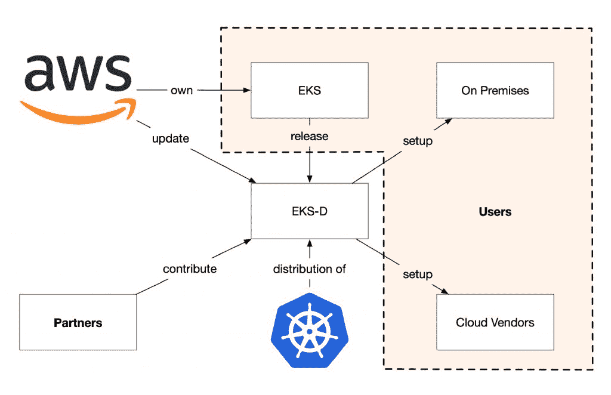
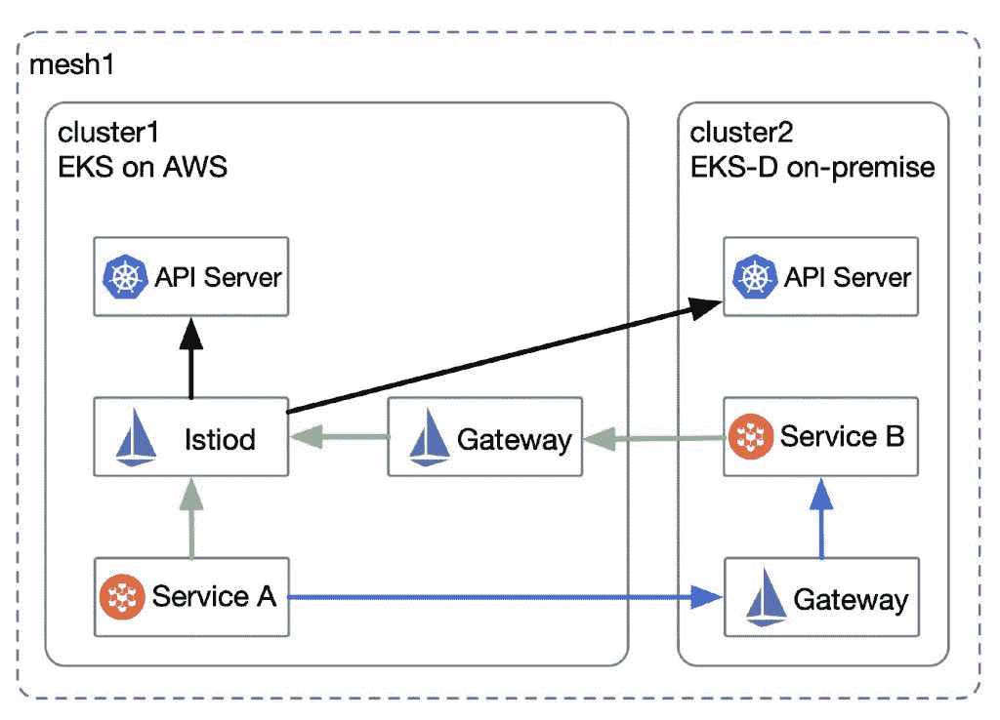

# 使用亚马逊网络服务的 EKS-D 和 Istio 确保混合云中的一致性

> 原文：<https://thenewstack.io/ensure-consistency-in-hybrid-clouds-with-amazon-web-services-eks-d-and-istio/>

亚马逊网络服务最近发布了亚马逊 EKS 发行版( [EKS-D](https://distro.eks.amazonaws.com/) )，这是一项帮助用户在混合云场景中实现一致的 Kubernetes 体验的服务。

## 什么是 EKS-D？

EKS-D 是[亚马逊网络服务](https://aws.amazon.com/?utm_content=inline-mention)弹性库本内特服务(EKS)的发行版。您可以在本地、云中或您自己的系统上运行 EKS-D。EKS 发行版发布 Kubernetes 版本的速度与 EKS 相同。在不久的将来，EKS-D 的受支持的打包产品和安装方法将以 EKS Anywhere (EKS-A)的名称推出。

下图说明了 AWS、EKS-D、Kubernetes 和用户之间的关系。

EKS-D 对 AWS、其合作伙伴和用户来说有着不同的意义。

*   对于 AWS:增加 AWS 的市场份额，
*   对于合作伙伴:整合 AWS 渠道和客户资源以接触更多用户，
*   对于用户:确保 Kubernetes 在异构环境中的一致性，并简化操作和维护。

当今的企业在决定选择哪些云提供商时有许多因素要考虑，而许多其他企业在将其 IT 迁移到云中时遇到了困难，并继续依赖久经考验的传统 IT 架构来开展业务。

当转向云时，客户希望在内部和云中获得一致的迁移或混合云设置体验。并非所有应用程序都适合跨云迁移，因此出于各种原因，例如合规性和数据安全性，多集群和混合云使用场景将很常见。

## 为什么需要多集群和混合云？

我们在许多情况下使用多个集群、混合云等进行部署。例如:

*   以避免供应商锁定并促进应用程序的跨集群迁移。
*   实现应用程序的高可用性。
*   当一个集群的规模过大，导致性能瓶颈时。
*   合规性和数据安全性。
*   对于邻近部署，减少网络延迟并改善用户体验。
*   进行一些测试。
*   适用于需要集群扩展的突发操作。

Kubernetes 是容器编排的标准，有望成为云原生应用的底层 API。但是，这为如何在多集群和混合云环境中管理集群带来了新的挑战。

## 使用 Istio 服务网格管理混合云

 [吉米·宋

Jimmy 是 Tetrate 的开发者倡导者，CNCF 大使，ServiceMesher 和 Cloud Native Community(中国)的联合创始人。他主要关注 Kubernetes、Istio 和云原生架构。](https://www.linkedin.com/in/jimmysongio/) 

Istio service mesh 作为云原生应用的网络基础层，既可以管理 Kubernetes，也可以管理[虚拟机](https://thenewstack.io/how-to-integrate-virtual-machines-into-istio-service-mesh/)等非容器工作负载。Istio 可以部署在[多个平台](https://istio.io/latest/docs/setup/platform-setup/)，支持多种[部署模式](https://istio.io/latest/docs/ops/deployment/deployment-models/)，管理多个集群和混合云。部署需要充分考虑区域和分区分布、网络隔离、多租户和控制平面的高可用性。

如果我们同时使用部署在私有数据中心的 EKS 和 EKS-D，我们如何通过统一的控制平面管理这两个集群？如下图所示，集群 1 和集群 2 分别代表部署在 EKS 和 EKS 特区的 Kubernetes 集群。这两个集群的网络是隔离的，现在，因为它们适合使用上述混合云场景，所以我们采用了主-远程多网络部署模式，以便将它们整合到同一个服务网格中，并使用一个控制平面进行管理。

*   图中的黑色箭头表示控制平面中获取服务和端点配置的请求。
*   图中的蓝色箭头表示服务 A 访问服务 b 的路由。
*   图中绿色箭头表示服务 A/B 从控制平面获取服务端点的路径。

在这种模式下部署 Istio 时，需要确保控制平面与 Kubernetes 的 API 服务器的连接性。详细安装过程请参考 [Istio 文档](https://istio.io/latest/docs/setup/install/multicluster/primary-remote_multi-network/)。

## 摘要

EKS-D 确保了混合云环境中 Kubernetes 集群的一致性，降低了集群运营和维护的成本。Istio 固有的多集群感知功能进一步增强了服务级别的用户体验一致性，帮助我们将多个集群中的服务置于统一的控制平面下。EKS-D 的发布得到了众多[合作伙伴](https://www.tetrate.io/blog/tetrate-expands-aws-partnership-to-bring-enterprise-grade-istio-for-eks-and-eks-distro/)的响应，其中 [Tetrate](https://www.tetrate.io/?utm_content=inline-mention) 作为 Istio 服务网格的解决方案提供商，提供了 [Tetrate 服务桥(TSB)](https://www.tetrate.io/tetrate-service-bridge/) 来实现 EKS 和 EKS-D 上跨工作负载的统一应用连接和安全性

通过 Pixabay 的特征图像。

<svg xmlns:xlink="http://www.w3.org/1999/xlink" viewBox="0 0 68 31" version="1.1"><title>Group</title> <desc>Created with Sketch.</desc></svg>