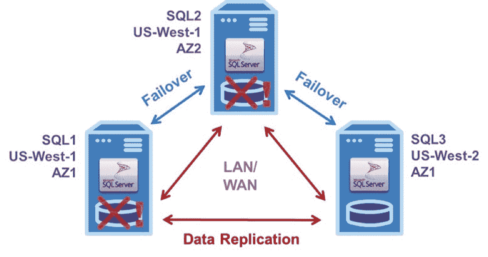

# 确保 Amazon Web Services 上 SQL Server 的高可用性

> 原文：<https://thenewstack.io/ensure-high-availability-for-sql-server-on-amazon-web-services/>

 [大卫·伯明罕

大卫·伯明罕是 SIOS 科技公司的技术传道者。他是技术社区公认的高可用性专家，并在过去八年中荣幸地当选为微软 MVP:六年当选为集群 MVP，两年当选为云和数据中心管理 MVP。David 拥有多项技术认证，并拥有三十多年的 IT 经验，包括在金融、医疗保健和教育领域。](https://us.sios.com/) 

长期以来，数据库和系统管理员有多种选择来确保任务关键型数据库应用程序保持高可用性。公共云基础设施，如 Amazon Web Services 提供的基础设施，提供了自己的附加高可用性选项，这些选项由服务级别协议提供支持。但是，在私有云中运行良好的配置可能无法在公共云中运行，并且所使用的 AWS 服务和/或这些服务的配置方式选择不当可能会导致在实际需要时故障转移供应失败。本文概述了确保 AWS 云中高可用性的各种选项。

对于数据库应用程序，AWS 为管理员提供了两种基本选择，每种选择都有不同的高可用性(HA)和灾难恢复(DR)规定:亚马逊关系数据库服务(RDS)和亚马逊弹性计算云(EC2)。RDS 是一项完全托管的服务，适合任务关键型应用程序。RDS 提供了六种不同数据库引擎的选择，但它对 SQL Server 的支持不如对 Amazon Aurora、My SQL 和 MariaDB 等其他选择的支持那样健壮。以下是管理员对于将 RDS 用于任务关键型 SQL Server 应用程序的一些常见顾虑:

*   仅支持单个镜像备用实例，
*   代理作业不会被镜像，因此必须在备用实例中单独创建，
*   没有检测到由数据库应用软件引起的故障，
*   不支持性能优化的内存数据库实例，
*   根据可用性区域分配(客户无法控制),性能可能会受到不利影响，
*   SQL Server 更昂贵的企业版是数据镜像功能所必需的，该功能仅适用于始终在线可用性组。

另一个基本选择是弹性计算云，它具有更强大的功能，在高可用性和灾难恢复至关重要时，它是首选。EC2 的一个主要优势是它让管理员可以完全控制配置，并为管理员提供了一些额外的选择。

也许最重要的选择是使用哪种操作系统:Windows 还是 Linux。Windows Server 故障转移群集是 Windows 标配的一项强大、成熟且受欢迎的功能。但是 WSFC 需要共享存储，而这在 EC2 中是没有的。因为强大的 HA/DR 保护需要多 AZ 甚至多区域配置，所以需要单独的商业或定制软件来跨服务器实例群集复制数据。微软的 Storage Spaces Direct (S2D)在这里不是一个选项，因为它不支持跨可用性区域的配置。

对于 Linux 来说，对额外的 HA/DR 配置的需求甚至更大，因为它缺乏像 WSFC 那样的基本集群功能。对于高可用性，Linux 给管理员提供了两个同样糟糕的选择:要么花更多的钱购买更贵的 SQL Server 企业版，以实现永远在线可用性组；或者使用开源软件努力使复杂的自己动手的 HA Linux 配置工作良好。

这两种选择都削弱了在公共云服务的商用硬件上使用开源软件节省成本的理由。从 2017 年开始，SQL Server for Linux 仅适用于更新(也更贵)的版本。对于大多数组织来说，DIY HA 替代方案的成本可能高得惊人。事实上，在所有可能的故障场景下，使分布式复制块设备、Corosync、Pacemaker 以及可选的其他开源软件在应用程序级别按预期工作可能会非常困难。这就是为什么只有非常大的组织才有必要的资金(技能和人员)来考虑承担这项任务。

由于在 Linux 上实施任务关键型 HA/DR 配置存在困难，AWS 建议结合使用弹性负载平衡和自动扩展来提高可用性。但是这些服务有自己的限制，类似于托管关系数据库服务中的限制。

所有这些都解释了为什么管理员越来越多地选择使用专门为确保云环境中的高可用性和灾难恢复保护而设计的故障转移群集解决方案。

## 专门为云构建的故障转移群集

私有、公共和混合云的日益流行导致了专门为云环境构建的故障转移集群解决方案的出现。这些 HA/DR 解决方案完全在软件中实施，顾名思义，该软件创建了一个具有自动故障转移功能的服务器和存储集群，以确保应用程序级别的高可用性。

这些解决方案大多提供完整的 HA/DR 解决方案，包括实时块级数据复制、连续应用程序监控和可配置的故障切换/回切恢复策略的组合。一些更复杂的解决方案还提供了一些高级功能，如在更便宜的 SQL Server Standard Edition for Windows 和 Linux 中支持始终在线故障转移群集实例，WAN 优化以最大限度地提高多区域性能，手动切换主服务器和辅助服务器分配以促进计划内维护，包括在不中断应用程序的情况下执行定期备份的能力。

大多数故障转移群集软件与应用程序无关，使组织能够拥有一个通用的 HA/DR 解决方案。这一功能还为整个 SQL Server 应用程序提供保护，包括数据库、登录、代理作业等。，所有这些都以集成的方式实现。虽然这些解决方案通常也是与存储无关的，使它们能够与共享存储区域网络一起工作，但无共享无危险故障转移群集通常是首选，因为它能够消除潜在的单点故障。

在不影响可用性或性能的情况下，在较便宜的 SQL Server 标准版中支持始终在线故障转移群集实例(fci)是一个主要优势。在 Windows 环境中，大多数故障转移群集软件通过利用内置的 WSFC 功能来支持 fci，这使得实现对于数据库和系统管理员来说都非常简单。对于在 SQL Server 和许多其他企业应用程序中越来越受欢迎的 Linux，一些故障转移群集解决方案现在通过提供特定于应用程序的集成，使实施 HA/DR 配置与 Windows 一样简单。

图中的 EC2 配置示例显示了一个典型的三节点无 San 故障转移群集，配置为虚拟专用云(VPC ),所有三个 SQL Server 实例位于不同的可用性区域。为了消除在影响整个区域的局部灾难中断电的可能性，其中一个 az 位于不同的 AWS 区域。

这种三节点无 San 故障转移群集具有一个活动服务器实例和两个备用服务器实例，可以在最短的停机时间内处理两个并发故障，并且不会丢失数据。

三节点无 San 故障转移群集提供电信级高可用性和灾难恢复保护。对于 Windows 或 Linux，基本操作在 LAN 和/或 WAN 中是相同的。服务器#1 最初是将数据连续复制到服务器#2 和#3 的主要或活动实例。它遇到了一个问题，触发了到服务器#2 的自动故障转移，该服务器现在成为向服务器#3 复制数据的主服务器。

如果故障是由基础设施中断引起的，AWS 工作人员将立即开始诊断和修复导致问题的原因。修复后，它可以恢复为主服务器，或者服务器#2 可以继续以该身份将数据复制到服务器#1 和#3。如图所示，如果在服务器#1 恢复运行之前，服务器#2 发生故障，那么在手动故障转移之后，服务器#3 将成为主服务器。当然，如果故障是由应用软件或配置的某些其他方面引起的，则应由客户来查找并解决问题。

当然，无 San 故障转移集群只能配置一个备用实例。但是这样的最小配置需要第三个节点作为见证节点。见证服务器需要达到法定人数来确定主服务器的分配，这一重要任务通常由独立 AZ 中的域控制器执行。将所有三个节点(主节点、辅助节点和见证节点)保留在不同的 az 中，可以消除任何区域离线时丢失一个以上投票的可能性。

出于 HA 和/或 DR 目的，也可以在混合云配置中使用两个和三个节点的无 San 故障转移群集。一种这样的三节点配置是位于企业数据中心的双节点高可用性集群，它将数据异步复制到 AWS 或其他云服务以实现灾难恢复保护，反之亦然。

在单个区域内的集群中，数据复制是同步的，故障转移通常配置为自动发生。对于具有跨越多个区域的节点的群集，其中数据复制是异步的，故障转移通常是手动控制的，以避免数据丢失的可能性。三节点群集，无论使用哪个区域，还可以促进所有三台服务器的计划内硬件和软件维护，同时为应用程序及其数据提供连续的灾难恢复保护。

通过提供分布在 18 个地理区域的 55 个可用性区域，AWS 全球基础架构通过配置具有多个地理上分散的冗余的无 San 故障转移集群，提供了最大化可用性的巨大机会。这种全球覆盖还使所有 SQL Server 应用程序和数据能够位于最终用户附近，从而提供令人满意的性能。

借助专门构建的解决方案，运营商级的高可用性并不意味着支付运营商级的高成本。由于专门构建的故障转移群集软件能够有效且高效地利用 EC2 的计算、存储和网络资源，同时易于实施和操作，因此这些解决方案最大限度地减少了任何资本和所有运营支出，从而使高可用性比以往任何时候都更强大、更经济实惠。

这个故事已经更新了亚马逊网络服务关于其数据库服务的更准确的信息。

通过 Pixabay 的特征图像。

<svg xmlns:xlink="http://www.w3.org/1999/xlink" viewBox="0 0 68 31" version="1.1"><title>Group</title> <desc>Created with Sketch.</desc></svg>