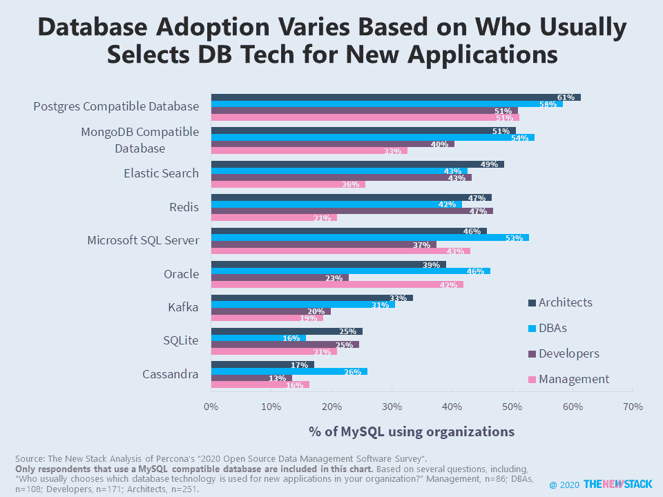
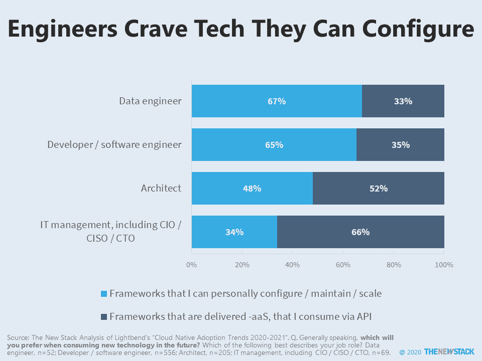
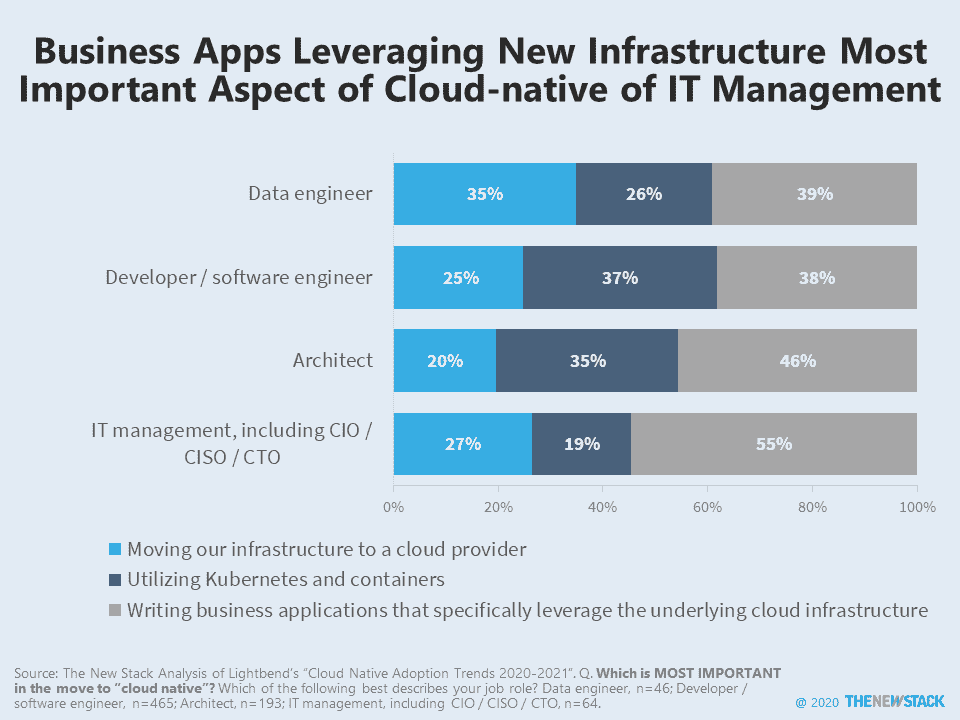
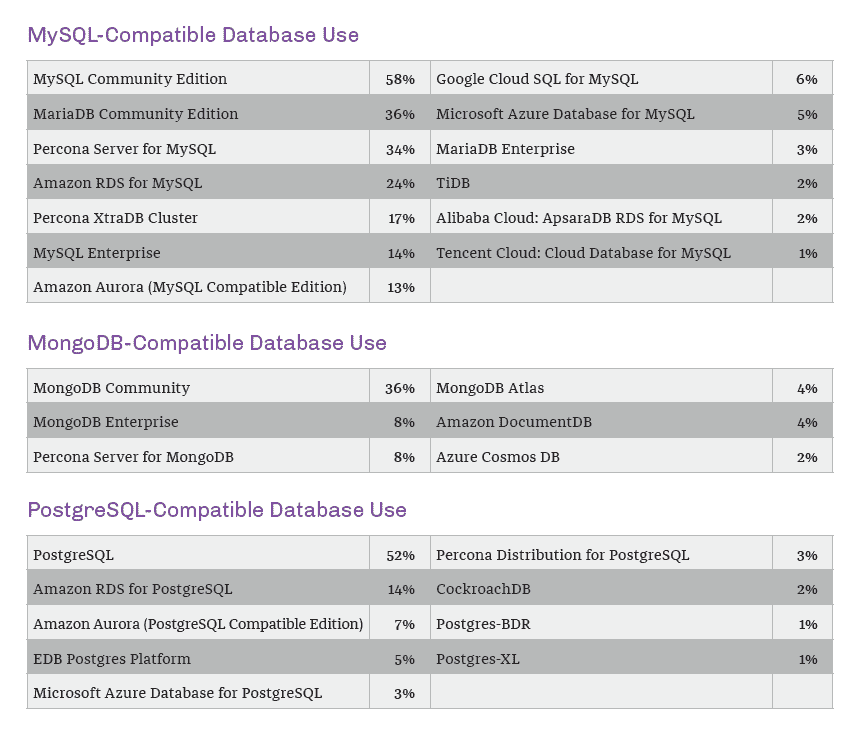

# 企业数据库选择通常由系统架构师领导

> 原文：<https://thenewstack.io/enterprise-database-selection-most-often-led-by-system-architects/>

忘记[开发者](https://thenewstack.io/developers-are-in-charge-again/)，今天的拥王者被称为架构师，研究继续表明，如果遵循架构师的偏好，就会采用不同的技术。

一个主要的例子是数据库。根据 [Percona 的“2020 年开源数据管理软件调查”，41%的组织通常选择数据库技术用于新的应用程序](https://www.percona.com/open-source-data-management-software-survey)在 26%的组织中，开发人员做出这些决定，而只有 16%的数据库管理员(DBA)有责任。人们可以执行多种工作职能，因此一些开发人员设计他们管理的相同数据库，一些具有编程技能的数据库管理员正在转变为所谓的数据工程师。随着职业生涯的变化，也许人们会认同架构师这个职位，因为这些人是决策者。

新的堆栈对 Percona 研究的数据集进行了定制分析，以了解不同的工作角色更喜欢哪些数据库。Percona 长期以来一直提供 MySQL 的商业版本，因此毫不奇怪，91%接受调查的组织使用 MySQL 兼容数据库。出于这个原因，我们根据这些标准进行了筛选，以创建一个图表，显示数据库的采用如何根据谁倾向于负责为新应用程序选择数据技术而变化。

Oracle 和 Microsoft SQL Server 在开发人员通常选择数据库技术的组织中使用较少。以 DBA 为中心的组织最有可能使用这两个非开源选项，但是许多架构师似乎也在有这些遗留足迹的地方工作。有趣的是，DBA 似乎更倾向于 Cassandra，但这可能是大量 Cassandra 开源社区贡献者参与调查的结果。

在管理层制定技术决策的组织中，采用多个数据库的情况要少得多。在考虑数据库时，这部分受访者可能不会考虑数据存储 Redis、Elastic Search 和 Kafka。另一个解释是这些技术不在他们的雷达上。

对于开发者和卡夫卡来说可能就是这样。尽管 Kafka 在许多数据流堆栈中很流行，但只有 20%的组织在使用它，在这些组织中，开发人员为新的应用程序选择数据库技术。这可能是一个机会，让开发人员了解已经在许多数据流应用程序中使用的内容。

来自调查的数据还表明，当架构师负责为新的应用程序选择技术时，组织不太愿意使用一种开源数据库技术。一个原因可能是受开发人员和 DBA 影响的机会减少了，他们可能更喜欢自己参与的开源项目。

在更宏观的层面上， [Lightbend 的“2020-2021 年云原生采用趋势”](https://info.lightbend.com/Cloud-Native-Adoption-Trends-Report.html)提供了关于架构师需要什么的线索。与开发人员相比，架构师认为他们的组织优先考虑性能和弹性，而不是新的应用程序特性。虽然架构师需要可互操作的技术框架，但他们总是在寻找可以通过 API 消费的服务。相比之下，三分之二的软件和数据工程师更喜欢他们可以亲自配置和维护的技术。

[数据工程师](https://thenewstack.io/data-scientists-get-the-glamour-but-there-is-also-a-need-for-data-engineers/)是下一代云原生数据基础设施的核心。在不试图准确定义工作角色所包含的内容的情况下，让我们来看看 50 多名 Lightbend 受访者在工作角色方面的更多数据。55%的数据工程师将其云原生基础架构战略描述为“积极采用”，相比之下，普通受访者的这一比例为 39%。有趣的是，数据工程师也更有可能将他们的大多数主要应用程序或系统托管在私有云中，这一比例为 31%，而普通受访者为 17%。

似乎许多数据工程师已经在使用 Hadoop 和其他在私有云中运行的大数据系统。他们专注于将基础架构迁移到云提供商，35%的人表示这是迁移到“原生云”的最重要方面，相比之下，只有 20%的架构师持相同观点。

敬请关注新堆栈自己的研究结果，该结果强调了云架构师对新云服务的 IT 要求的独特观点。

## 

## 

## **奖金分析**

*   Amazon Web Services 客户更有可能利用其数据库即服务(DBaaS)解决方案。在使用 AWS 云服务的组织中，59%的组织还使用其 DBaaS 产品。相比之下，研究中只有 45%的谷歌云和 41%的微软 Azure 用户也使用这些公司的 DBaaS。
*   MongoDB Atlas 有发展的机会。在使用 MongoDB 兼容数据库的 296 个组织中，21%使用 MongoDB Enterprise 或 MongoDB Atlas。此外，这些客户中有 81%正在使用 Atlas，这表明如果有机会，可能会采用 DBaaS 服务。

来源:per ConA《2020 开源数据管理软件调查》。

<svg xmlns:xlink="http://www.w3.org/1999/xlink" viewBox="0 0 68 31" version="1.1"><title>Group</title> <desc>Created with Sketch.</desc></svg>