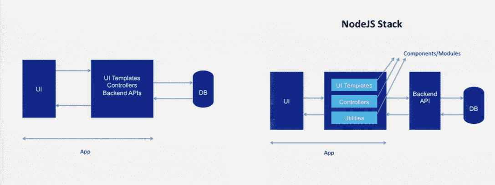
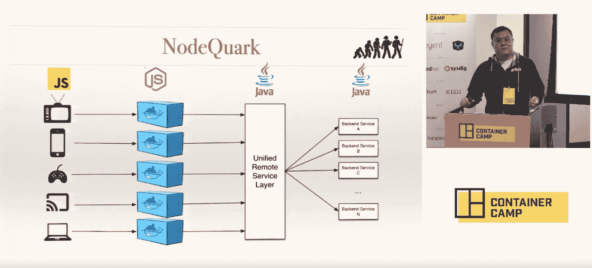

# 为什么企业正在采用微服务和 Node.js

> 原文：<https://thenewstack.io/enterprises-embracing-microservices-node-js/>

这篇文章来自一位演讲人

[Node.js Interactive Europe](http://events.linuxfoundation.org/events/node-interactive-europe)

，该活动由推动代码发展的开发人员深入探讨 Node.js 的未来，于 2016 年 9 月 15 日至 9 月 18 日在阿姆斯特丹举行。

 [Peter Marton，RisingStack 联合创始人兼 CTO

Peter Marton(@ slashdotpeter)是 RisingStack 的联合创始人兼 CTO，目前正在从事 Trace——一款 Node.js 性能监控和调试工具，旨在了解基于微服务的应用程序并对其进行故障排除。](https://risingstack.com/) 

大多数软件项目从解决一个问题开始。然后又来了一个，项目继续增长，而工程团队却无法应对。

这就是巨石柱的建造方式。每一个新的特性都会被添加到现有的应用程序中，使其变得越来越复杂。扩展变得困难且浪费资源，因为一切都必须一起扩展。由于每次都有数百万行代码等待投入生产，部署变成了一场噩梦。与此同时，管理层将会遇到协调相互干扰的大型孤立团队的严峻挑战。

达到一定的复杂性后，在企业环境中处理哪怕是最小的变化都会变得很困难。开发人员开始努力为他们的产品添加新功能，这些功能在竞争激烈的市场中很容易过时。

## 微服务拯救世界

为了解决这些问题，大胆创新的企业转向了一种称为微服务的新型架构。

在面向微服务的架构中，软件可以由多个较小的部分共同构建，但也可以单独开发。通过定义技术不可知的通信通道，任何语言都可以实现使用。这意味着开发人员不再局限于某些技术，他们可以自由地进行实验。

如果做得好，一个微服务应该足够小，可以由一个小团队在大约两周内重写。如果质量或性能不够好，不需要很长时间就可以更换服务，这大大降低了开发风险和与基础设施运营相关的成本，因此公司最终可以用更少的钱获得更好的性能。

但是是什么让 Node.js 成为构建小型服务的最佳选择呢？让我们来了解一下！

## Node.js 和微服务:天作之合

在过去的几年里，Node.js 成为决定采用微服务的初创公司和企业的首选技术。为什么会这样？使用 Node 的吸引力在哪里？

嗯，有些人认为 Node.js 提高了他们团队的生产力，有些人会说他们的应用程序变得非常快，或者他们的开发人员更喜欢 Node。

事实上，所有这些说法都是正确的，原因如下:

**生产力:**node . js 的包管理器， [npm](http://npmjs.org/) 拥有大量可以立即使用的模块，这节省了大量的开发工作。此外，由于 Node.js 应用程序是使用 JavaScript 编写的，前端开发人员可以很容易地理解正在发生的事情，并在必要时进行更改。由于开发人员可以在整个堆栈上使用相同的语言，在前端和后端使用完全相同的模块，因此可以节省大量的时间。

**性能:** Node.js 是创建高性能、实时 web 应用程序的最佳解决方案之一，这要归功于它的非阻塞、事件驱动的 I/O 模型。结合基于微服务的应用程序，它可以在较短的响应时间内处理大量负载。GoDaddy 的高级软件工程师 Stephen Commisso 表示，通过正确利用微服务和 Node.js，可以只用 10%的硬件来处理相同的负载。

**开发者快乐:** Node.js 像不可阻挡的病毒一样传播，根据 [Node Foundation](https://nodejs.org/en/blog/announcements/nodejs-foundation-survey/) 的数据，它拥有 350 万用户和 100%的年增长率。它的模块系统——NPM——更受欢迎，并且比企业环境中常用的其他语言的包管理器发展得更快。为什么？因为开发者喜欢。还值得注意的是，Node.js 在下一代开发人员中非常受欢迎，他们不再真正想使用静态类型的语言，如#C 或 Java。

多亏了 Linux 基金会，Node.js 从 2015 年 4 月起就有了[长期支持](https://github.com/nodejs/LTS/)，这意味着每个主要版本的维护期都是 18+12 个月。这是确保它与微服务一起为企业采用做好准备的最后一步。现在让我们来看几个通过 Node.js 使用微服务的企业成功案例。

## 贝宝永远摆脱了它的垄断

Paypal 从单一 Java 堆栈向基于微服务的节点环境的迁移始于 2013 年初的一个原型项目。当时，他们的工程团队被分成开发浏览器层(HTML、CSS、JS)和应用层的小组。根据 UI 工程架构的领导者 Jeff Harrell 的说法，在引入全栈工程师之后，浏览器和服务器之间的人工边界开始消失。

由于 Node 作为原型平台表现良好，PayPal 决定将其作为他们账户概览页面的平台进行尝试，这是他们最受欢迎的应用程序之一，同时保留 Java 应用程序作为万一出现问题的备用选项。

对于 PayPal 工程部门来说，迁移的结果令人震惊。他们的 Node.js 应用程序用更少的人构建了两倍的速度，同时，代码减少了 33%的行和 40%的文件。关于性能，也达到了预期:单核心节点应用能够像五核心 Java 应用那样处理双 rps。响应时间减少了 35 %,页面处理速度提高了 200 毫秒。从这一点来说，没有回头路。

还值得注意的是，Node.js 本身并不是成功的唯一原因——没有微服务，过渡不会如此成功。根据 PayPal 高级商业产品工程经理 Sameera Rao 的说法:“Node.js 和全 Javascript 开发堆栈帮助 PayPal 提高了工程效率，并帮助重新思考和重新启动了产品、设计和运营思维。”

当 PayPal 使用单一架构时，一个应用程序可以做所有的事情。重复是常见的，而团队一直在复制粘贴和调整代码——开发就像在流水线上工作。没有做多少事情。

在转向微服务思维模式后，他们能够模块化他们的堆栈，全球团队可以更快地推出新功能。为此，他们创建了一个开源模型和一个带有适当指南的核心 GitHub 库。通过更好地组织团队的工作方式和代码的编写方式，PayPal 能够为其全球组织扩展 Node.js，使多个团队能够轻松地在同一个项目上工作。

## 网飞通过 Node 缩短了 40 分钟的启动时间

早在 2013 年，据 UI 平台工程总监 [Kim Trott](https://www.youtube.com/watch?v=p74282nDMX8) 称，网飞运行了一个大型单片应用程序，启动时间长达 40 分钟，构建速度非常慢。以这种方式开发并不能让他们有足够的生产力和快速创新。Java 在服务器上，JavaScript 在客户端，所有的东西都要写两遍。

解决方案是简化他们的堆栈，将网站转移到单页应用程序，并选择一种通用语言来编写相同的代码:Node.js，其理念是编写一次，在任何地方运行。他们还能够通过利用 Docker 和 Node 作为其基于单块 JVM 的系统的数据访问层来访问和改变数据，从而解决垂直扩展的问题。

正如平台架构师肖在 Node Foundation 的企业对话系列中所说的那样，由于将整体分解成更小、更易管理的部分，并使用容器化在本地机器上运行代码，开发人员的工作效率迅速提高。能够在本地运行代码使开发人员能够密切反映将在生产中运行的内容，这是非常有益的。

但是他们现在在做什么，他们是如何利用 Node.js 和微服务的？如今，网飞使用 Apache Mesos 进行云原生分布式资源调度，用于各种用例，包括实时异常检测、培训和模型构建批处理作业、机器学习编排和基于 Node.js 的微服务，根据他们最近的博客文章。

## GoDaddy 从切换到 Node.js。网

GoDaddy UX 平台工程总监 Charlie Robbins 在 JSConf 上看到 [Ryan Dahl 的传奇 Node.js 演示](https://www.youtube.com/watch?v=ztspvPYybIY)后，于 2009 年开始使用 Node.js，因此难怪他是 go daddy 技术的主要倡导者之一。

他让我们知道，在 Node 和微服务之前，GoDaddy 主要用的是。NET，并采用了 Java 和。NET 开发人员拥有 10 多年的整体堆栈经验。不幸的是，他们在构建产品时遇到了几个问题:

他们看到了。NET 没有像 Node.js 那样活跃的模块发布者社区，他们也不得不太依赖微软发布的东西。GoDaddy 的高级开发人员 Stephen Comissio 说，他们也知道这不是敏捷公司的未来，所以他们发起了企业级文化转变，并在 2013 年开始原型开发 Node.js 应用程序。

但是他们为什么选择 Node 呢？因为使用它可以轻松地构建、单元测试、集成测试和部署应用程序。当他们面临最大的规模挑战之一时，他们的期望实现了，一个敦促 1 亿人访问他们网站之一的超级碗广告。得益于 Node.js 和一个由 12 台服务器组成的集群，他们能够在不停机的情况下每秒处理 10，000 个请求。多亏了 Node.js，GoDaddy 现在只需 10%的硬件就可以处理与以前相同的负载，同时每月处理 170 万个请求。

GoDaddy 还能够通过实施持续集成管道来实现敏捷性，并且由于过渡到微服务，他们现在能够在不到一分钟的时间内部署到生产中，[go daddy 的 OpenStack 工程高级总监 Shaheeda Nizar](https://thenewstack.simplecast.com/episodes/86-how-godaddy-streamlines-provisioning-with-openstack-and-microservices) 表示。他们的架构是一个建立在“无共享”架构上的分布式系统，因此部署简单且灵活。

## 结论

高度创新的企业已经知道，Node.js 和微服务是实现高性能、提高生产率、降低成本和让开发人员满意的绝佳组合。这就是社区期待 Node Interactive 的原因，Node Interactive 让我们开发者可以交流在微服务中使用 Node.js 的最佳实践和经验。如果你对这个话题有任何疑问，请在阿姆斯特丹联系我，听听我的演讲“[打破巨石](https://eventmobi.com/nieu16/agenda/176233/928517)”或[在 Twitter 上给我发短信](https://twitter.com/slashdotpeter)。

如果你想了解更多关于 Node.js 企业成功的信息，我推荐你去看看 Node.js 官方 YouTube 频道上的“企业对话”系列。

<svg xmlns:xlink="http://www.w3.org/1999/xlink" viewBox="0 0 68 31" version="1.1"><title>Group</title> <desc>Created with Sketch.</desc></svg>