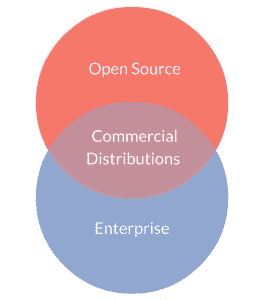

# 企业和开源:商业发行版的重要角色

> 原文：<https://thenewstack.io/enterprises-open-source-important-role-commercial-distributions/>

编者按:在这篇文章中，ActiveState 首席执行官 Bart Copeland 解释了使用开源软件商业发行版的价值。

我最近与 451 Research 的研究经理 Jay Lyman 进行了一次网络研讨会，讨论了企业采用开源编程语言的趋势以及它们如何影响整体业务。很高兴看到近年来大公司对开源技术的采用持续加速。开源已经有一段时间了，但是为什么现在的企业比以前更多的使用开源呢？

## 企业为什么要开源？

企业为什么要开源？在网上研讨会中，Jay 谈到了许多不同的观点，但我想更深入地探讨一下企业选择开源的一些具体原因。
T3

1.  **真的很容易获得。**没有冗长的采购流程，从这个意义上说，Shadow IT 使用开源软件非常容易。你可以很容易地把它带到你的组织中，用它进行实验和做事。(虽然开源很容易获得，但是组织通常不希望将开源引入他们的任务关键型或业务关键型应用程序，除非他们遵循企业内部的适当程序。但是，很容易获得。)
2.  拥有自己的代码。企业开源的第二个原因是你可以拥有自己的代码。开源的美妙之处在于你可以获取代码，修改它，添加功能，定制它，现在你就拥有了任何修改或衍生。
3.  软件质量一直在提高。你在改进软件代码，社区也在改进，所以你在社区中产生了这种波动效应。代码总是越来越好；它不会变味。有了它，你就有了代码稳定性，因为你有一个全球开发者社区，他们经常在代码库上工作。
4.  **向开源社区寻求帮助。**当您遇到与准则相关的问题、挑战或具体事情时，您可以联系社区。

也就是说，考虑到开源的所有好处，为什么还要考虑开源技术的商业发行版或商业供应商呢？

## 商业发行的重要性

开源是伟大的，但是仍然有一些企业犹豫要不要实现它。以下是公司会(也许应该)考虑商业发行版而不是直接使用开源技术的一些原因:

*   获得有质量保证的版本。您可以获得为企业测试和验证的有质量保证的构建。从事特定开源项目的开发人员有很多热情。但是那些从事项目工作的人对与企业和他们的需求相关的具体问题不感兴趣。这就是商业供应商通常提供的附加值，使开源真正为企业服务。商业发行版的质量得到保证，经过测试和验证。
*   **SLA**。考虑商业发行版的下一个原因是你从他们那里得到的服务水平协议(SLA)。虽然您可以去开源社区获得支持，但如果您正在运行一个任务关键型应用程序，您可能需要在 2 小时、4 小时或 24 小时内获得支持。在开源社区你可能得不到这些，这也是你为什么要与商业发行合作的原因。
*   **预编译，随时可用。**另一个我认为非常重要的原因是，商业发行版是一个预先编译好的、易于使用的、现成的、开箱即用的一键式解决方案。通常使用开源软件，您可以找到存储库，但是对于您的项目来说，有许多不同信息的分支需要消化和包含。消费并不容易，通常企业需要一种真正简单的方法来消费开源软件。这就是商业发行所做的。旧版本的支持和维护。
*   **随着开源语言的发展，支持和维护旧语言版本**——特别是 Perl、Python 和 Tcl——是我们为客户提供的重要帮助。通常，企业不想使用最新和最棒的语言——可能他们所有的其他机器都在使用旧版本，所以添加新版本只会使事情复杂化。他们可能落后一个、两个或三个(或更多)版本，因为他们需要标准化。他们不想像社区那样快速更新到最新最好的版本。因此，商业发行版将在旧版本上提供这种支持。例如，当 HeartBleed 漏洞来袭时，许多企业都在使用旧版本的 ActivePerl、ActiveTcl 和 ActivePython。我们能够在不到 24 小时的时间内迅速处理，让客户“高枕无忧”。开源的 Perl、Python 和 Tcl 社区也解决了这个问题，但是时间更长。最后，大公司有大量的服务器，他们希望在一个单一的发行版上实现标准化，这个发行版可以在他们使用的各种平台上工作；另一个原因是想要旧版本的发行版。
*   **顺从。**选择商业发行版的另一个原因通常是因为许多企业都有合规性要求——如果他们在企业中使用开源软件，他们必须有第三方商业供应商提供支持。金融、医疗保健、政府…这些行业中的许多都有相关的强制性法规。如果没有第三方的支持，他们就无法在任务关键型应用程序或业务关键型应用程序上开源。
*   **赔偿。**使用商业分销的另一个普遍原因是补偿；获得商标和知识产权侵权的保险。商业供应商可以在背后支持并保护您的组织。
*   **OEM(原始设备制造商)权利。**如果一家公司打算发布包含开源语言的产品，获得重新发布该语言的商业支持版本的权利可以让你放心。在他们的产品中嵌入商业语言发行版可以帮助他们更快地进入市场，并提供客户所需的无风险可靠性。忽视开源许可条款可能是危险的。这可能会让你陷入知识产权侵权诉讼、高额律师费和名誉受损。与商业供应商合作有助于他们获得交钥匙再分发许可证并消除法律风险。

商业发行版在开源领域有着非常重要的地位。在 ActiveState，我们让开源为企业服务——自 1997 年以来，我们就一直在利用开源和[构建面向企业的产品](http://www.activestate.com/dynamic-languages)。但是，除了让它为我们的客户服务之外，我们还认为通过回馈社区和确保保持这些项目的质量来支持社区也很重要。了解更多关于开源的好处或挑战——观看网上研讨会的录像！

这篇文章最初出现在 ActiveState 的 ActiveBlog 上。

ActiveState 是新堆栈的发起人。

由 [Patrick Michael Chin](https://www.instagram.com/iampatrickchin/) 通过[死亡库存摄影](http://deathtothestockphoto.com/)拍摄的特写图片。

<svg xmlns:xlink="http://www.w3.org/1999/xlink" viewBox="0 0 68 31" version="1.1"><title>Group</title> <desc>Created with Sketch.</desc></svg>