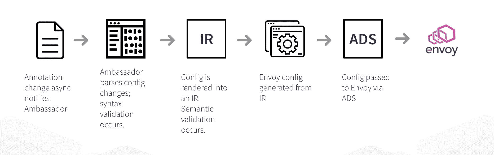

# Envoy 和可编程边缘:边缘代理和开发者体验

> 原文：<https://thenewstack.io/envoy-and-the-programmable-edge-edge-proxies-and-the-developer-experience/>

在去年 12 月与 KubeCon+CloudNativeCon 同时举行的首届 [EnvoyCon](https://envoyconna18.sched.com/) 大会上，一些大型组织讨论了他们最近如何开始使用 Envoy 作为边缘代理，如 [【易贝】](https://www.infoq.com/news/2018/12/envoycon-ebay-edge)[Pinterest 和 Groupon](https://www.infoq.com/news/2018/12/envoycon-service-mesh) 。从基于硬件的负载平衡器和其他边缘设备转向由[Envoy proxy](https://www.envoyproxy.io/)提供的基于软件的“可编程边缘”显然有许多好处，尤其是在动态性和自动化方面。然而，提出的核心挑战之一是需要创建一个有效的控制平面，与现有的工程工作流或开发人员经验很好地集成。本文将更深入地探讨这一挑战。

## 在开发人员体验的前沿

 [丹尼尔·布赖恩特

Daniel Bryant 是一名独立的技术顾问，目前专门从事通过识别价值流、创建构建管道和实施有效的测试策略来实现组织内的持续交付。Daniel 的技术专长侧重于 DevOps 工具、云/容器平台和微服务实现。他还参与了几个开源项目，为 InfoQ、O'Reilly 和 Voxxed 撰写文章，并定期在 OSCON、QCon 和 JavaOne 等国际会议上发表演讲。](https://twitter.com/danielbryantuk) 

在之前的 New Stack 文章“ [Kubernetes 和 PaaS:开发人员体验和工作流的力量](https://thenewstack.io/kubernetes-paas-force-developer-experience-workflow/)，”中，我总结了最近在 Datawire 团队及其社区和客户中进行的一些对话，并提出工程组织需要更多地关注创建有效的工程工作流，通常称为“开发人员体验”，而不是简单地在 Kubernetes 上构建平台，并让其决定工作流。目前这个领域中有许多有趣的工具在发展，比如 [【花园】](https://garden.io/)[倾斜](https://tilt.build/) 和 [Skaffold](https://github.com/GoogleContainerTools/skaffold) (仅举几个例子)，我希望在以后的文章中重点介绍这些工具。然而，对于这篇文章的主旨来说，我想把重点放在编程优势是如何影响开发者体验的。

过去，由于边缘设备是基于硬件的，它们通常由运营团队负责，有时由特定的网络运营控制(NOC)或边缘团队负责，他们拥有相关的供应商技能和证书，例如由 F5、Cisco 和 Citrix 等公司开发的技术。当开发团队想要部署一个新的域、TLS 证书或防火墙规则时，这通常涉及到在问题跟踪系统中创建一个票证。

我记得在 DevOps 之前的几个咨询项目中就是这样做的，当时我们正在部署 WebLogic 上托管的 greenfield monolithic Java 应用程序。当时，向运营团队提出请求对开发团队来说并不是什么大事，因为我们只部署了一个新的域(将所有端点都路由到一个 WebLogic 实例)和一个产品。我们可以提前几周安排必要的负载平衡器和防火墙修改，因为我们在试运行环境中进行所有的质量保证(QA )(通过“强化冲刺”预发布！)我们在发布应用程序的方式上不需要太多的控制——域和相关的配置将在我们选择的发布日期下班后被激活。

### 现代工作流程使边缘更加动态

现在，快进 15 年，不仅部署技术发生了变化，而且(可能更重要的是)业务需求和相关的软件架构也发生了变化。这显然会对与边缘交互的工程要求产生连锁反应。

现代的以产品为中心的(微)服务开发团队现在也希望访问边缘，这种访问通常比以前更加动态。例如，开发人员想要为一个新的 API 配置路由，或者通过流量跟踪或金丝雀释放来测试或发布一个新的服务。在这里，控制通常是分散的，因为产品团队彼此独立工作(松散耦合)，也是“高度接触”，因为开发人员希望根据计划的增量展示或可观察的指标(或警报)不断调整流量路由。

为运营团队提供控制平台也同样重要。来自您信任的网络之外的任何通信都可能来自不良行为者，其动机可能是故意的(例如网络犯罪分子)或其他(移动应用程序中的客户端库被破坏)，因此您必须防范这种情况。在这里，运营团队将指定合理的系统默认值，并根据外部事件实时调整这些默认值。除了速率限制，您可能还希望能够配置全局和特定于 API 的负载削减，例如，如果后端服务或数据存储变得不堪重负，还需要实施 DDoS 保护(这也可能是时间或地理上指定的)。

### 探索大使控制平面

如上所述，集中运营或 SRE 团队可能希望为所有入口流量指定全局合理的默认值和安全措施。然而,(多个)分散的产品开发团队现在也工作在第一线并发布功能，他们将希望对他们的服务进行细粒度的控制，并且潜在地(如果他们接受“自由和责任”模型)能够在本地覆盖全局保护。

> 一般来说，使用 kubectl 直接部署到集群并不是一个好的做法。

大使社区做出了一个有意识的选择，即大使控制层的主要目标人物是 [开发人员](https://www.getambassador.io/user-guide/developers) 或应用工程师，因此控制层的重点是分散配置。Ambassador 是为特定于 Kubernetes 而构建的，因此指定 edge 配置的合理选择接近于 Kubernetes 服务规范，这些规范包含在 YAML 文件中，并通过 kubectl 加载到 Kubernetes 中。

指定大使配置的选项包括使用 [Kubernetes 入口](https://kubernetes.io/docs/concepts/services-networking/ingress/) 对象，编写自定义 [Kubernetes 注释](https://kubernetes.io/docs/concepts/overview/working-with-objects/annotations/) 或定义 [自定义资源定义(CRDs)](https://kubernetes.io/docs/concepts/extend-kubernetes/api-extension/custom-resources/) 。最终选择了注释，因为它们很简单，并且为最终用户提供了最小的学习曲线。使用入口似乎是最显而易见的首选，但不幸的是，入口规范一直停留在永久的测试阶段，除了管理入口流量的“最低公分母”功能外，其他方面没有达成一致。

这里可以看到一个大使注释的例子，它简单地演示了 Kubernetes 服务上的端点到服务路由:

`kind: Service`

``apiVersion: v1``

 ``metadata:`

`  name: my-service`

`  annotations:`

`    getambassador.io/config: |`

`      ---`

`        apiVersion: ambassador/v0`

`        kind:  Mapping`

`        name:  my_service_mapping`

`        prefix: /my-service/`

`        service: my-service`

`spec:`

`  selector:`

`    app: MyApp`

`  ports:`

`  - protocol: TCP`

`    port: 80`

`    targetPort: 9376`

对于以前配置过边缘代理、反向代理或 API 网关的人来说，**getambassador.io/config**中的配置应该是相对简单明了的。发送到前缀端点的流量将被“映射”或路由到 my-service Kubernetes 服务。由于本文主要关注 Ambassador 的设计和实现，我们不会涵盖所有可以配置的功能，例如高级路由(包括流量阴影)、canarying(与 Prometheus 集成以进行监控)和速率限制。

尽管 Ambassador 侧重于开发人员角色，但它也广泛支持 [操作符](https://www.getambassador.io/user-guide/operators) ，并且可以为身份验证、TLS/SNI、跟踪和服务网格集成指定集中配置。

### GitOps 的大使和开发人员工作流程

关于将 Ambassador ingress/edge 配置的创建和更新合并到您的开发人员工作流中，我是“[【GitOps】](https://www.weave.works/blog/gitops-operations-by-pull-request)，”的忠实粉丝，这是 [Weaveworks](https://www.weave.works) 团队为他们如何使用开发人员工具来驱动运营和实现持续交付而给出的名称。GitOps 是通过使用 Git 分布式版本控制系统(DVCS)作为声明性基础设施和应用程序的单一事实来源来实现的。团队中的每个开发人员都可以针对 Git 存储库发出 pull 请求，当合并时,“差异和同步”工具会检测到系统的预期状态和实际状态之间的差异。然后可以触发工具来更新和同步基础设施到预期的状态。

使用容器和 Kubernetes 进行部署的 weaver works GitOps 实现的指南 的 [Datawire 解释包括:](https://www.getambassador.io/user-guide/gitops-ambassador/)

1.  软件系统中所有可以描述为代码的东西都必须存储在 Git 中。通过使用 Git 作为事实的来源，可以观察一个集群并将其与期望的状态进行比较。目标是描述和版本控制系统的所有方面:代码、配置、监控/警报——在大使的情况下，还有路由、安全策略、速率限制等
2.  不应该直接使用“kubectl”Kubernetes CLI 工具:一般来说，使用 kube CTL 直接部署到集群并不是一个好的做法(同样，不建议手动将本地构建的二进制文件部署到生产环境中)。
    1.  Weaveworks 团队认为，许多人让他们的 CI 工具驱动部署，通过这样做，他们没有实践好的关注点分离，
    2.  通过管道部署所有更改(代码和配置)允许验证和确认，例如，管道可以检查潜在的路由命名冲突或无效的安全策略
3.  自动化 git 中编码的所需状态的“区分和同步”,以及系统的相关实际状态:一旦连续执行的“区分”过程检测到自动化过程合并了工程师的变更集或者集群状态偏离了当前的规范，就应该触发“同步”,以将实际状态收敛到基于 git 的单一事实来源中指定的状态。
    1.  Weavework 使用遵循“ [操作符模式](https://coreos.com/blog/introducing-operators.html) ”的 Kubernetes 控制器:通过扩展 Kubernetes 提供的功能，使用遵循操作符模式的定制 [控制器](https://kubernetes.io/docs/concepts/extend-kubernetes/api-extension/custom-resources/) ，集群可以被配置为始终与基于 Git 的“事实的来源”保持同步。
    2.  Weaveworks 团队使用“diff”和“sync”工具，如开源的[【kube diff】](https://github.com/weaveworks/kubediff)以及内部工具，如“terradiff”和“ansiblediff”(分别用于 Terraform 和 Ansible)，它们将预期状态集群状态与实际状态进行比较。
    3.  [AppDirect 工程团队](https://blog.getambassador.io/fireside-chat-with-alex-gervais-accelerating-appdirect-developer-workflow-with-ambassador-7586597b1c34) 在每个团队的 Kubernetes 服务 YAML 清单中编写大使配置。这些代码存储在 git 中，遵循与任何其他代码单元相同的审查/批准过程，CD 管道监听 git repo 的更改，并将差异应用于 Kubernetes

由于所有的大使配置都是通过 Kubernetes YAML 文件中的服务注释来描述的，所以实现“GitOps”风格的工作流非常容易——事实上，如果一个团队已经按照这种方式部署应用程序和配置，就不需要额外的机器或设置。

当工程团队开始与 Datawire 讨论将 Ambassador 配置集成到 GitOps 工作流中时，有两个问题反复出现:首先，随着 Envoy 的发展并开始提供功能更丰富的“v2”配置，许多工程师希望访问它；第二，随着大使配置变得越来越复杂，部署规模越来越大，工程师们需要额外的验证和一种方法来支持在高负载下运行时的配置更新。

### 向 v0.50 演进的大使:特使 v2 和 ADS

在与 [大使社区](http://d6e.co/slack) 协商后， [Datawire](http://www.datawire.io) 团队最近在 2018 年对大使内部进行了重新设计。这是由两个关键目标驱动的。首先，我们希望集成 Envoy 的 v2 配置格式，这将支持多种功能，例如通过 [服务器命名指示(SNI)](https://www.getambassador.io/user-guide/sni/) 、改进的端点/服务特定的速率限制(使用请求标签元数据)和 [gRPC 身份验证 API](https://www.getambassador.io/user-guide/auth-tutorial)。其次，由于 Envoy 配置越来越复杂，我们还希望对其进行更加健壮的语义验证，尤其是在大规模应用程序部署的情况下。

> 尽管绝大多数交互可能是分散的(通过产品团队)，但最终的数据平面更新实际上将在边缘“集中”。

最新发布的 Ambassador 0.50 从根本上进行了重新设计，以解决这些问题。Ambassador 中的内部类层次结构更紧密地反映了 Ambassador 配置资源、中间表示(IR)的多通道编译器启发生成和特使配置资源之间的关注点分离。Ambassador 的核心部分也被重新设计，以方便来自 Datawire 以外社区的贡献。

我们决定采用这种方法有两个原因。首先，Envoy Proxy 是一个发展非常迅速的项目，我们意识到我们需要一种方法，在这种方法中，一个看似微小的 Envoy 配置更改不会导致 Ambassador 内部几天的重新设计。此外，我们还希望能够在将配置加载到 Envoy 之前提供配置的语义验证。

第二点与本文的主题特别相关。在为边缘设计控制平面时，尽管绝大多数交互可能是分散的(通过产品团队)，但最终的数据平面更新实际上将在边缘“集中”。值得注意的是，这不是您通常在服务到服务数据平面中看到的情况，因为更改通常局限于在一个(或多个)服务侧柜中运行的数据平面代理。必须付出额外的努力来验证对边缘代理(或负载平衡的边缘代理群)所做的改变，因为无效的配置可能会破坏所有的入口流量。由于所有这些配置都是在边缘的全局级别上有效发生的，因此边缘代理还必须能够非常快速地对通过控制平面指定的任何变化做出反应。

我们还切换了大使内部，使用特使的 v2 [聚合发现服务(ADS)](https://blog.envoyproxy.io/the-universal-data-plane-api-d15cec7a#96ef)API 将配置加载到特使流程中，而不是依赖于之前使用 [热重启](https://blog.envoyproxy.io/envoy-hot-restart-1d16b14555b5) 的方法。这完全消除了在配置更改时重启的需求，我们发现这可能会导致高负载或长寿命连接(如 gRPC 流或 WebSockets)下的掉线。

新的内部大使配置流程现在看起来像这样:

## 结论

转移到“可编程边缘”是有益的，但是您将需要调整您的开发人员体验或“DevEx ”,以便充分利用这项新技术。微服务和容器等现代架构和技术允许工程师快速构建和发布功能，但支持的底层基础设施也需要适应。

特别是，现代工程工作流使您的网络边缘更加动态化——快速变化的业务功能通过独立的分散式以产品为中心的团队暴露在这里，而中间人攻击或 DDoS 等外部威胁需要由集中式运营团队来缓解。通过使用 Ambassador 这样的工具，它充当了 Envoy 代理的边缘控制平面，同时使用 GitOps 这样的新工作流方法，我相信这将在一定程度上有助于解决所讨论的一些挑战。

[Ambassador 0.50 现已推出](https://blog.getambassador.io/announcing-ambassador-0-50-8dffab5b05e0) ，它构建于 Envoy v2 APIs 之上，因此您可以试用它，并在我们的 [Slack 频道](http://d6e.co/slack) 或 [Twitter](https://www.twitter.com/getambassadorio) 上与社区分享您的反馈。

<svg xmlns:xlink="http://www.w3.org/1999/xlink" viewBox="0 0 68 31" version="1.1"><title>Group</title> <desc>Created with Sketch.</desc></svg>`