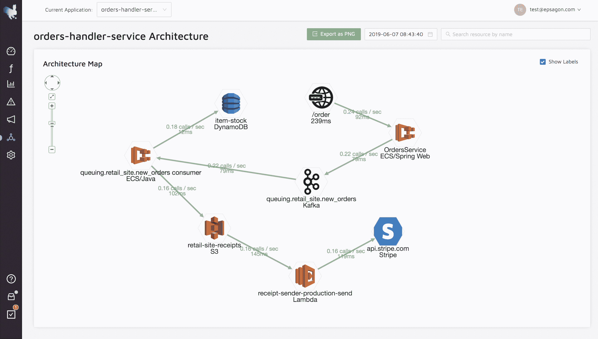

# Epsagon 演示:使用单一视图进行自动分布式跟踪

> 原文：<https://thenewstack.io/epsagon-demo-automated-distributed-tracing-with-a-single-view/>

爱普生赞助了这次演示。

[https://www.youtube.com/embed/JQbn-2Ti4TM?feature=oembed](https://www.youtube.com/embed/JQbn-2Ti4TM?feature=oembed)

视频

向云的重大转变的很大一部分是如何将每个组织成为软件公司的趋势归因于云提供商提供的广泛可能性。由于组织希望随意扩展和部署其软件，而不受客户需求的限制，他们可以依赖云提供商的节能和资源节省微服务、Kubernetes 和其他技术，而不必管理现场数据中心和 IT 运营基础设施。

[AWS Lambda](https://aws.amazon.com/lambda/) 、[Azure Kubernetes Service(AKS)](https://azure.microsoft.com/en-in/services/kubernetes-service/)、 [Google Cloud](https://cloud.google.com/) 和其他选项是允许组织直接在云上部署代码的可能性之一，当然，不必管理服务器基础设施。但是随着自由的增加，责任也随之而来。例如，DevOps 必须监控来自云上分布式应用程序的大量同步事件、消息队列和其他数据，这些数据通常分布在多个云环境中。

此外，正如 Epsagon 的联合创始人兼首席执行官 Nitzan Shapira 指出的，传统的日志是不够的。例如，传统的应用程序性能监控(APM)工具仍然过度关注单一的应用程序和代理。“因此，您最终会看到各种工具的混合和匹配，一方面，当涉及到分布式应用程序时，您的日志无法提供大量的上下文。然后是跟踪和监控，传统上由 IT 运营部门使用，但今天，开发人员和工程部门都需要它们，”Shapira 说。“工具之间没有相关性，所以结果是，今天的开发人员、公司真正关心的是速度和效率，他们现在花费大量时间将观察能力编码到他们的系统中。这是开发速度的一个主要缺点。”

Shapira 说，在这个演示中，Shapira 解释并演示了 Epsagon 如何提供一个自动化软件，该软件也是自动分布式跟踪的无代理软件。Shapira 说:“客户最终可以通过一个统一的视图自动跟踪他们所有的生产应用程序。“这是一件非常具有革命性的事情，因为传统上，这些都是独立的工具。”

在设置之前，Shapira 解释了 Epsagon 如何基于“代码级别较小的自动化代码工具”在 Lambda、Lambda to Docker 容器、 [Fargate](https://aws.amazon.com/blogs/aws/aws-fargate/) 、Kubernetes 等上运行。支持各种各样的语言。由于安装和使用可用插件不需要手动修改代码，Shapira 说安装只需要几分钟。

Shapira 说，以毫秒计，对性能的影响“非常非常低”。“因此，我们有办法根据现有的标识符将事件关联起来，或者添加我们自己的标识符，以便能够帮助我们通过系统跟踪它们，”沙皮拉说。

演示的一个关键部分是生产应用程序的可视化。比如有了这个功能。DevOps 可以实时查看生产中的内容，这些内容会自动更新。Shapira 说:“这是一个非常好的方法，可以让您对生产应用程序充满信心，并获得不同服务的性能指标。

构建在云基础上的软件公司已经有很多采用，包括电子商务行业和金融行业。“这些公司想尽快变得现代化，”沙皮拉说。“他们倾向于进入云、微服务和云服务，”同时依赖 Epsagon 进行自动分布式跟踪。

Shapira 说，最终结果是“只要在几分钟内添加 Epsagon，客户就可以获得他们使用的任何服务的几乎 100%的覆盖”。“因此，这对他们来说是一个巨大的好处，因为他们不必花费任何时间来培训、维护或实施任何类型的手动代码跟踪。”

<svg xmlns:xlink="http://www.w3.org/1999/xlink" viewBox="0 0 68 31" version="1.1"><title>Group</title> <desc>Created with Sketch.</desc></svg>