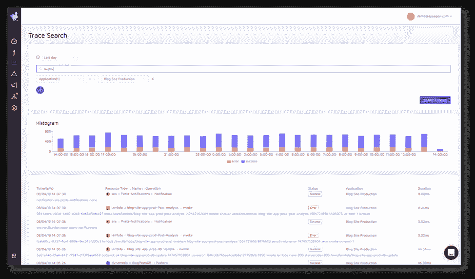

# Epsagon 推出无代理跟踪以及为什么它很重要

> 原文：<https://thenewstack.io/epsagon-launches-agentless-tracing-and-why-thats-important/>

[Epsagon](https://epsagon.com/) 赞助本帖。

今天，在[爱普生](https://epsagon.com/)，我们宣布推出面向现代应用的无代理跟踪和日志工具。我们的 SaaS 解决方案现在已经超越了 AWS Lambdas，并面向 AWS、Microsoft Azure、Google Cloud 等云环境的容器、虚拟机和功能即服务(Faas)部署，以及内部部署。

这是我们让工程和运营团队能够协同工作、采用云和微服务技术并更快地将软件投入生产的旅程中的一个重要里程碑。

 [尼赞·沙皮拉

Nitzan 是 Epsagon 的首席执行官和联合创始人。他是一名软件工程师，在编程、机器学习、网络安全和逆向工程领域拥有超过 13 年的经验。他还喜欢弹钢琴，是一个旅游爱好者，一个经验丰富的棋手，并沉迷于运动。](https://epsagon.com/) 

为什么这如此重要？

这是业界首个以自动化方式将现代应用程序的分布式跟踪和日志记录结合起来的解决方案。你可以问任何关于你的分布式系统的问题并马上得到答案，它也适用于无主机环境。

当我们两年前创办 Epsagon 时，我们看到云和微服务技术以惊人的速度迅速普及，却没有太多考虑对这些新平台进行监控和故障排除。我们还很快发现现有的跟踪和日志记录技术已经过时，不适合现代架构。

我们认为 AWS Lambda 是检验我们假设的合适技术。它缺乏任何类型的分布式跟踪技术，否则可能会给故障排除带来问题。我们的工具于 2018 年 10 月[日](https://techcrunch.com/2018/10/17/epsagon-emerges-from-stealth-with-serverless-monitoring-tool/)发布，包括一个自助服务产品，该产品已经使数百家组织能够在生产中运行无服务器工作负载，并提供端到端跟踪和日志记录，[只需花费几分钟](https://thenewstack.io/observability-takes-too-much-developer-time-so-automate-it/)即可完成设置，维护成本非常低。跟踪和日志记录的[组合](https://thenewstack.io/why-you-cant-ignore-changes-to-monitoring-and-logging-for-serverless/)被证明是非常宝贵的——不再有脱离上下文的度量和日志——相反，分布式跟踪结合日志有效地开始“讲述”这样一个复杂系统的故事。

## 现代应用开发的主要趋势

在过去的一年中，组织继续采用微服务设计模式，利用容器和无服务器等技术。我们看到了几个强劲的趋势:

**分布式微服务架构是标准**。它为团队提供了软件的可伸缩性、更快的交付和高效的开发；

**服务不再仅仅通过传统的 HTTP 方法进行通信**。最佳实践是基于消息队列或 PubSub 等服务实现**异步**设计模式，这提供了**更好的客户体验**并消除了服务和团队之间的耦合；

**服务之间的消息数量显著增长**。监控单个服务不足以解决复杂的问题；

**组织渴望使用托管服务**，使他们能够专注于自己的业务逻辑。这些服务包括托管的 Kubernetes 或 FaaS、云提供商的各种服务(存储、数据库)和各种 API(支付、通信等)。);

**要监控的指标不同了** —例如，使用托管服务时，您不再需要关心 CPU 的使用情况。

**对主机的访问不再有保证**，这意味着您不能运行持久的监控代理；

**分布式跟踪和日志记录应该在分布式应用程序的上下文中结合起来**。这使得工程和开发人员能够使用单一工具，而不是在传统解决方案之间来回切换。

## 一种不同的跟踪和记录方法

考虑到所有这些因素，我们为现代应用设计了下一代解决方案。我们所说的“现代”是什么意思？

*   微服务、分布式服务和异步服务；
*   许多常见的框架和 APIs
*   代码可以以托管方式运行—不访问主机。

考虑到这些因素，我们今天发布的产品是专为现代应用而打造的:

**分布式跟踪和记录**能够快速有效地进行监控和故障排除；

**无代理**方法非常适合任何类型的服务，无论是在容器、虚拟机还是 FaaS 中运行；

**全自动**体验为快速移动的团队提供分布式跟踪，在几分钟内完成每项服务，几乎不需要维护；

**可视化跟踪和架构图**在开发新特性时提供信心；

**搜索跟踪负载和日志**有助于在几秒钟内查明复杂问题。

自动分布式跟踪。

搜索跟踪和日志数据。

## 开始微服务监控

开始使用 Epsagon 需要几分钟时间。您现在可以[开始免费试用](https://app.epsagon.com/signup)，或者[联系爱普生](https://epsagon.com/)进行演示。

要查看爱普生展出的新解决方案，请参观他们在 2019 年 5 月 8 日伦敦 [AWS 峰会](https://epsagon.com/)上的展位(#B5)。

通过 Pixabay 的特征图像。

<svg xmlns:xlink="http://www.w3.org/1999/xlink" viewBox="0 0 68 31" version="1.1"><title>Group</title> <desc>Created with Sketch.</desc></svg>