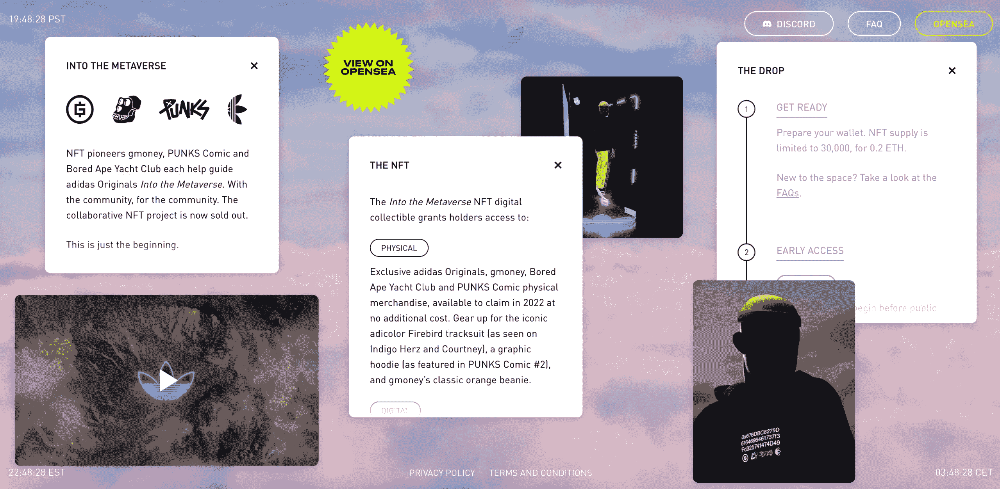
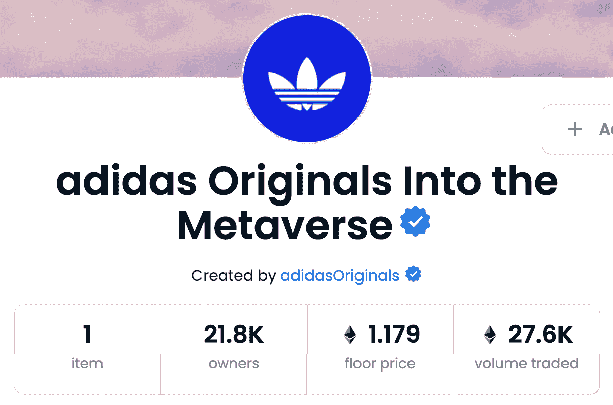

# ERC-1155:网络游戏和游戏化应用的 NFT 标准

> 原文：<https://thenewstack.io/erc-1155-an-nft-standard-for-online-games-and-gamified-apps/>

在我上一篇关于 NFTs (不可替换令牌)的专栏文章中，我讨论了这项技术目前的领先标准:ERC-721。这是大多数数字收藏品使用的一种方式——从 CryptoKitties 到 Bored Ape 游艇俱乐部。但我也提到了一个新兴的标准，ERC-1155，它已经成为区块链奥运会中 NFT 的通行标准。为了了解更多信息，我联系了《ERC 1155》的创始人之一，[维特克·拉多姆斯基](https://twitter.com/witekradomski)，他是区块链一个名为[金恩](https://enjin.io/)的游戏开发平台的联合创始人兼首席技术官。

虽然 ERC-721 是“不可替换”令牌的标准(意味着每个令牌都是唯一的)，但 ERC-1155 是“不可替换的”(意味着它涵盖了可替换的*和*不可替换的令牌)。这种灵活性使其适用于游戏——例如，游戏中的硬币可能是可替换的，而一块虚拟土地是不可替换的。

从技术上讲，ERC-1155 不一定会被用来创造一个“NFT”，因为它不会总是不可替代的。但是，与其在语义上纠缠不清，不如说 ERC-1155 和 ERC-721 正在推动 Web3 中的令牌经济学。

## 金恩从《我的世界》到区块链的演变

拉多姆斯基的公司金恩从 2009 年就开始运营了——远在 Web3 出现之前。所以我一开始就问金恩在 2009 年的目标是什么，为什么它最终转向了加密？

他回答说，它最初是“一个平台，让游戏玩家为他们的部落、公会和《我的世界》服务器创建社区网站，而无需雇佣开发者。”2009 年，金恩的付费功能之一是“集成的贝宝捐款模块”，所以即使在那时，它也在与支付调情。几年后，当区块链出现时，金恩意识到它可以通过加密货币令牌实现各种交易。

“我们看到了给游戏开发者提供新工具的机会，通过使用区块链来游戏化并为他们的游戏增加实体经济，”拉多姆斯基说。“在‘NFT’成为一个概念之前，我们就开始了这项工作(当时我们将这些代币称为‘定制硬币’。”

> “[ERC-1155]真的很像一台出售非功能性交易券和可替换代币的自动售货机，具有先进的可用性特性和批量传输等功能，可以实现高效、大规模的区块链游戏和应用。”

威泰克·拉多姆斯基，ERC-1155 的共同创造者

ERC-721 于 2018 年初发布，ERC-1155 的初稿紧随其后于 2018 年 6 月。2019 年 6 月被以太坊社区正式接纳。我问拉多姆斯基创造 ERC-1155 的最初动机是什么？

“鉴于我们在游戏方面的经验，我们希望围绕真实游戏及其物品经济创建一个令牌标准，其中包括可替代和不可替代的物品，”他说。

现有的以太坊令牌标准 ERC-20(原始标准)和 ERC-721 都不适合这个用例。

“这两个标准都不能让你用成千上万不同的资源创建一个游戏，每个资源类型有不同的供给和不同的参数，”拉多姆斯基解释道。“ERC-1155 就是为这些用例而设计的。它真的就像一台 NFT 和可替换令牌的自动售货机，具有先进的可用性特性和功能，如批量传输，以实现高效、大规模的区块链游戏和应用。”

拉多姆斯基说，ERC-1155 已经被所有主要的 NFT 市场采用，包括 OpenSea 和 Rarible。金恩还与微软合作了几个 NFT 项目——最著名的是微软的“区块链数字徽章奖励计划”

## 例如:阿迪达斯 ERC 1155 代币

我在野外搜索了另一个 ERC-1155 的例子，很快找到了一个阿迪达斯的项目，涵盖了所有热门的新技术流行语:[到元宇宙 NFTs](https://www.adidas.com/into_the_metaverse) 。

阿迪达斯的促销活动相当复杂，因为有四个不同的阶段——ERC-1155 用于第 1、2 和 3 阶段，ERC-721 用于第 4 阶段。根据你购买的 NFT 版本，它赋予你一系列实体和数字商品的权利。在撰写本文时，第一阶段还有大约一个小时的运行时间，可以用 1.179 ETH(3，277.87 美元)购买。

从技术角度来看，有趣的是只有一个令牌，却有近 22，000 个所有者(当我写这篇文章时)。所以 ERC-1155 显然被选中了，因为第一阶段的代币是可替换的——这可能意味着代币的所有者将获得完全相同的实物和/或数字奖励。据推测，第 4 阶段将是一个不可替代的令牌，因为 EWRC-721 正用于此。但是阿迪达斯还没有透露第四阶段需要什么。

## 区块链游戏

阿迪达斯 NFT 促销活动似乎使用 ERC-1155，因为第 1-3 阶段的奖励具有可替换性(也可能因为 ERC-1155 允许用户支付更少的汽油费)。

至于金恩，它对 ERC-1155 有更宏伟的计划——尽管像阿迪达斯一样，他们也涉及元宇宙。

“我们坚信元宇宙，在这个物理和虚拟融合的不断发展的空间中，非功能性网络技术对我们的数字身份至关重要，”拉多姆斯基说。他简要描述了金恩 2018 年的一个概念产品，他说这是“一个游戏多元宇宙，开发者可以分享一系列物品，玩家可以跨游戏和平台使用。”

他继续说，随着元宇宙的发展，“传统的采用者和拥有知识产权的大品牌进入这个领域，将需要互操作性和保护人民和品牌权利的标准。”他认为 ERC-1155 非常适合这个项目。

> “这是一个真正的机会，利用当代技术来发明新类型的游戏和游戏化的商业策略。”

拉多姆斯基还认为，区块链代币不仅仅是投机和权利管理，我已经指出这是 ERC-721 的关键用例。

“除了这项技术是数字身份的核心之外，还有大量尚未开发的新游戏概念和机会，可以通过 NFTs 将业务游戏化，”他说。

## Web 2.0 开发者为什么要关心？

最后，我问拉多姆斯基，他会给持怀疑态度的 Web 2.0 开发者什么建议，他们中的许多人都在关注 NFT(卡通头像、猖獗的投机行为等)的现状。)并想知道他们为什么应该关心 Web3 及其新兴标准？

“这是一个真正的机会，利用当代技术来发明新类型的游戏和游戏化的商业策略，”他回答说。“想想你的数字原生用户想要什么:他们想成为数字网络的一部分，而不是一个孤立的围墙花园的一部分。通过进入 Web3，你就进入了一个庞大的市场、钱包、探险者、游戏和区块链网络。Web3 不仅为您提供了新的工具，还提供了在世界上最强大的网络之一发展和吸引新用户的机会。”

不管你现在对 Web3 有什么看法，看到像 ERC-1155 这样的新标准出现是令人鼓舞的。类似于 [RSS3](https://thenewstack.io/rss3-syndication-feeds-web3/) 和[陶瓷公司的分散数据网络](https://thenewstack.io/ceramics-web3-composability-resurrects-web-2-0-mashups/)，这两者我今年都有描述，我们还不知道 ERC-1155 是否是一项会坚持下去的技术。但如果你的业务是在线游戏，或者你想在你的应用程序中加入游戏化，那么至少尝试一下 ERC-1155 似乎是值得的。

<svg xmlns:xlink="http://www.w3.org/1999/xlink" viewBox="0 0 68 31" version="1.1"><title>Group</title> <desc>Created with Sketch.</desc></svg>