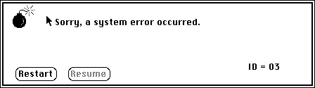
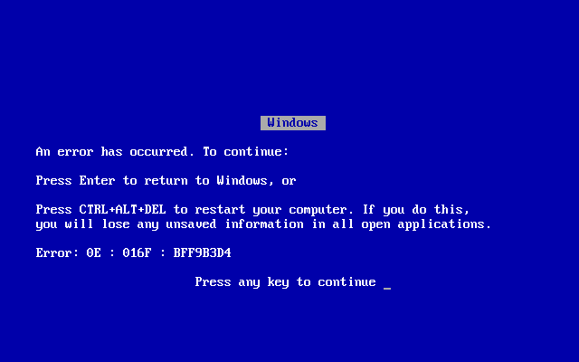

# 从后端到前端的错误处理

> 原文：<https://thenewstack.io/error-handling-from-backends-to-the-frontend/>

在 20 世纪 90 年代，我的 Mac OS 7.5.1 会产生这样一个错误:

[](https://cdn.thenewstack.io/media/2021/10/ce785234-image1.gif)

为什么我必须重启？而且这么经常！错误是不明确的，现代异常处理还不存在。在 Windows 98 中，你会得到同样模糊的“蓝屏死机”原因是因为在[受保护内存](https://en.wikipedia.org/wiki/Protected_mode)出现之前，Windows/Macintosh 使用共享内存模型，所以应用程序很容易覆盖系统内存并使内核崩溃。从那以后，操作系统不断发展，我们都为此感到高兴。

[](https://cdn.thenewstack.io/media/2021/10/d58611bc-image2.png)

在 90 年代，错误是相当频繁和恼人的，总是需要重新启动。当一个内存错误发生时，你会得到一个 **ID = -1** 或者一个*十六进制*的内存地址。这些被称为错误代码，但是除非你是专业的开发人员，否则它们不会特别有用或者对用户友好。

## **旧的错误处理方式**

 [乔纳森·凯利

Jonathan 已经做了 14 年的技术专家，其中一半时间专注于 DevOps。他目前是 LogDNA 的一名站点可靠性工程师，贡献了他在 Linux、Kubernetes、网络和云基础设施方面的专业知识。](https://www.linkedin.com/in/jonathandkelley/) 

想象一下，如果您有一个 C 函数，它将一个整数数组/列表和一个整数作为参数，然后执行搜索。它应该返回索引中第一个匹配的索引。但如果没有呢？你会返回-1 什么的。这使得错误处理变得简单，对吗？

这种方法的问题是，每个调用者都必须检查返回函数并自己处理错误。代码中的大量检查和“if else”语句会产生大量的样板文件，分散您对实际业务逻辑的注意力。代码很难阅读和维护。

返回 ID 通常是-1，这意味着“有东西坏了，但我不知道是什么。”那你会怎么做？

## **现代** **例外** **(** **试** **)化险为夷**

存在解决上述所有问题的例外情况。异常可以中断软件控制流，并向用户提供有用的数据。这很棒，但是对于大多数用户来说，这没有什么意义。

当设计你的应用程序时，总是试图捕捉你认为你会遇到的异常，然后有一个通用的通用的可以捕捉未知问题的情况。执行记录用户信息或具有其他价值的操作，以便最终用户可以对原因进行故障排除。

要使用 HTTP 请求库捕获 Python 中的异常，您可以这样做:

```
import requests
url  =  'http://www.google.com/bogus'
try:
  r  =  requests.get(url,timeout=3)
  r.raise_for_status()
except requests.exceptions.HTTPError as  e:
  print  (f'Http Error: {e}')
    exit(1)
except requests.exceptions.ConnectionError as  e:
  print  (f'Connect Error: {e}')
    exit(1)
except requests.exceptions.Timeout as  e:
  print(f'Timeout Error: {e}')
    exit(1)
except requests.exceptions.RequestException as  e:
  print(f'Unknown Error: {e}')
    exit(1)
except Exception as  e:
  print(f'Unknown Exception: {e}')
    exit(1)

```

这是你在谷歌上访问一个不存在的网址时看到的内容:

`Http Error: 404 Client Error: Not Found for url:[http://www.google.com/bogus](https://www.google.com/bogus)`

看到了吗？比 Python 的未捕获异常处理程序更有意义(如下):

```
Traceback  (most recent call last):
  File  "/tmp/fail.py",  line  4,  in  <module>
  r.raise_for_status()
  File  "/usr/local/lib/python3.9/site-packages/requests/models.py",  line  943,  in raise_for_status
  raise HTTPError(http_error_msg,  response=self)
requests.exceptions.HTTPError:  404  Client Error:  Not Found for url:  http://www.google.com/bogus

```

你想要处理所有的异常，即使只是显示一个友好的错误信息并退出程序。

好的异常处理也应该用来释放资源、文件资源、锁或其他可能中断未来执行的东西。一个超级简单的例子(在 Python 中不要这样做，你应该使用[上下文管理器](https://book.pythontips.com/en/latest/context_managers.html)来代替)是执行类似于
的事情

```
myfile  =  open('test.txt',  'w')

try:
    myfile.write('the answer to life is: ')
    myfile.write(42) # raises TypeError
except IOError as  e:
    print(f'Could not write to file: {e}')
finally:
    myfile.close() # will be executed before TypeError is propagated

```

## **始终使用最具体的例外**

异常越明确，对代码中错误的处理就越好。如果您的代码在任何地方都使用通用的 try / except 块，而没有要捕获的特定异常，则您无法控制如何处理特定异常。这也使得调用者不知道异常，如果用户或开发人员不了解库的故障模式，这是很糟糕的。您还应该调查您正在使用的库，并理解它们可能抛出的异常，以便采取措施。

同样，如果你正在开发一个应用程序，提出具体的异常。引发一般异常会使您的代码对于下游开发人员的错误处理变得脆弱。您希望您的调用函数/方法能够处理异常，并且希望没有围绕您的库函数的特定检查。

## **从不记录和重新抛出异常**

这里有一个例子，您不小心将一个长整数转换为一个字符串，并执行了“捕捉并抛出”反模式。出于某种原因，我在 Java 代码中见过很多这样的例子，所以这里是:

```
try  {
    new Long("some_string");
}  catch  (NumberFormatException  e)  {
    log.error(e);
    throw  e;
}

```

问题是你得到了同一个异常的多个错误；只是含糊不清，没有必要。额外的堆栈跟踪没有添加任何新的信息，只是暴露了调用它的整个 Java 堆栈。

```
17:44:28,945  ERROR TestExceptionHandling:65  -  java.lang.NumberFormatException:  For input string:  "some_string"
Exception in thread  "main"  java.lang.NumberFormatException:  For input string:  "some_string"
  at java.lang.NumberFormatException.forInputString(NumberFormatException.java:65)
  at java.lang.Long.parseLong(Long.java:589)
  at java.lang.Long.(Long.java:965)
  at com.stackify.example.TestExceptionHandling.logAndThrowException(TestExceptionHandling.java:63)
  at com.stackify.example.TestExceptionHandling.main(TestExceptionHandling.java:58)

```

如果您想添加一个带有错误的堆栈跟踪，抛出一个自定义异常，该异常包含对您的日志库有用的信息:

```
public void wrapException(String input)  throws  CrazyCustomException  {
    try  {
 // do something
    }  catch  (NumberFormatException  e)  {
 throw new CrazyCustomException("I think you did something bad.",  e);
    }
}

```

## **处理前端异常**

许多前端应用程序都是以乐观的方式设计的，假设后端总是工作的，但这从来不是 100%的保证。即使没有错误的后端运行在最终会失败的系统基础设施上。我曾经是一名系统工程师和站点可靠性工程师，在我的职业生涯中见过如此多的失败，以至于我认为所有的系统在其生产寿命的某个时候都会失败，至少是部分失败。

在前端处理错误对于用户体验和功能至关重要。当产品出现故障时，支持人员如何理解和支持产品？如果发生错误时没有任何东西可以显示，QA 如何制作 bug 票？

### **前端错误的类型**

以下是您将看到的常见错误:

*   **后端可用性错误:**前端使用的系统由于某种原因关闭。可能是服务器崩溃、部署或意外维护。
*   **认证/授权错误:**当用户没有权限时会出现这种情况。
*   **输入错误:**如果验证在前端丢失，但被后端捕获或抛出，就会发生这种情况。例如，可能是数据库中的输入验证或唯一约束错误。
*   **未知错误:**有时候错误就这么发生了。由于未处理的代码异常导致的 API 500 错误总是会发生，因为有时你会忘记预测后端代码失败的地方。

### **前端如何中断未处理的后端错误**

前端应用程序通常很少处理后端错误。我在 JS webapps 中见过以下几种失败模式:

*   如果错误发生在框架初始化期间，用户可能会看到一个白页。
*   框架停止工作，没有任何原因。用户再次尝试一个操作，但是要么网页被锁定，要么什么也没有发生。用户刷新网页，并希望得到一个正常工作的应用程序。
*   框架继续运行，但是意外的事情发生了。用户可能会一遍又一遍地尝试，希望得到他们想要的响应，但可能会在后端产生意想不到的副作用。一个可怕的例子是击中一个支付网关，并得到双倍或三倍收费！

### **将错误放入用户的上下文中**

你想从设计你的后端开始，尽可能优雅地处理错误，给前端一些东西呈现给用户。例如，在设计 REST API 时，不要只返回 500，而要查看 Mozilla 开发者中心中可用 HTTP 代码的[列表。](https://developer.mozilla.org/en-US/docs/Web/HTTP/Status#client_error_responses)

我还建议返回一个主体，而不是一个产生错误的空文档，这样 web 应用程序就可以向用户“冒泡”消息。类似这样的东西很棒:

```
{
  "error":  {
  "code":  500,
  "reason":  "Payment gateway timeout, try again later"
 }
}

```

像这样的错误是很棒的，因为你的应用程序可以告诉用户一些有用的东西。因此，如果他们联系您寻求支持，您将确切知道您的应用程序出了什么问题。这比经典的“哎呀！出现错误！”

### **前端错误处理至关重要**

最好告诉用户哪里出错了，并提示他们什么可以修复错误。这里有一些我用来让用户理解前端错误的关键词。

*   **无效输入**。如果后端有输入验证错误，告诉用户。
*   **稍后再试。有东西坏了，但也许以后会好起来。这让用户知道这个问题不是他们的错，可能会解决。**
*   **未知错误。请联系支持部门。有些东西损坏得很严重，所以也许你应该联系支持团队，让他们决定下一步行动。**

您应该编写前端来使用 json stringify 解析后端错误，并为用户返回有效的上下文和消息。

## **结论**

只要记住错误总是会发生，无论测试覆盖是否完美。问题是你将如何出色地处理它们？当错误发生时，您的用户能够采取措施来挽救用户体验吗？即使在应用失败时，他们也会有良好的用户体验吗？

让用户更容易创建有用的 GitHub 问题或向支持团队发送有用的消息。当你的初级开发人员阅读一个 bug 标签时，不需要仔细研究整个代码库就能清楚发生了什么吗？

恰当地处理错误会让我们的用户满意。

<svg xmlns:xlink="http://www.w3.org/1999/xlink" viewBox="0 0 68 31" version="1.1"><title>Group</title> <desc>Created with Sketch.</desc></svg>