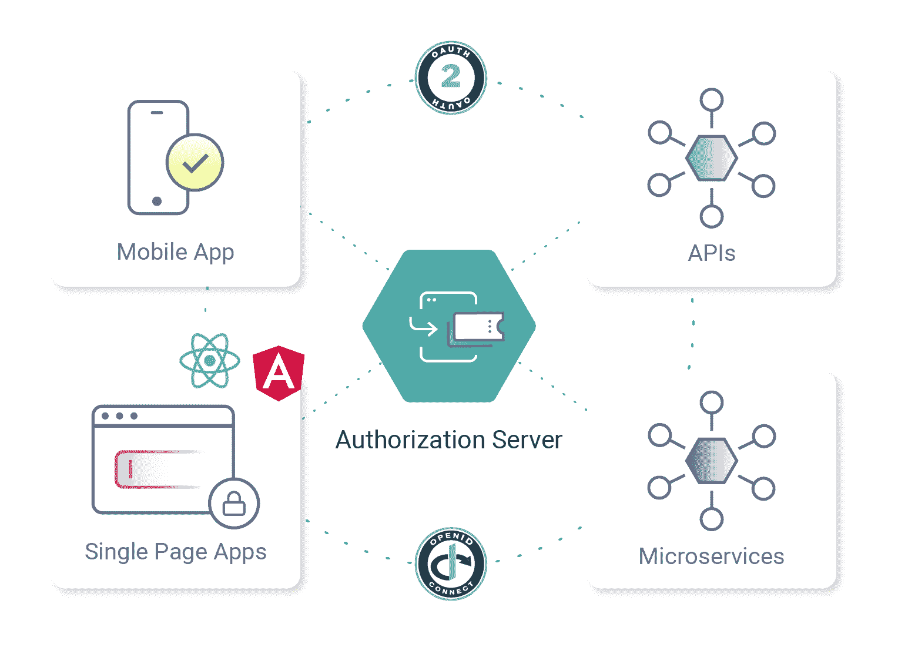
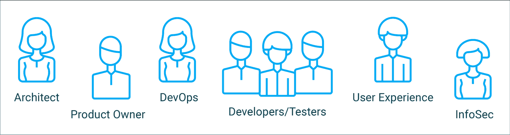

# 整合身份的要素

> 原文：<https://thenewstack.io/essentials-for-integrating-identity/>

加里·阿彻

加里是 Curity 公司的产品营销工程师。20 年来，他一直是投资银行解决方案的首席开发人员和解决方案架构师。

构建数字解决方案的企业需要保护他们的应用程序免受数据泄露，并满足困难的[数据隐私法规](https://curity.io/resources/learn/privacy-and-gdpr/)。这需要在继续提供卓越客户体验的同时完成。对于公司来说，理解如何实现这一点可能是一个挑战，尤其是对于需要扩展到许多全球团队的组织来说。

现代应用程序安全包括使用身份和访问管理(IAM)系统将困难的安全工作外部化。所有团队都需要知道如何集成 IAM 系统和技术最佳实践。本文将提供一些关于如何管理迁移到这类系统的风险的建议。

## OAuth 框架

如今，安全解决方案基于 [OAuth 系列规范](https://datatracker.ietf.org/doc/html/rfc6749)，为 web 应用、移动应用和 API 提供现代行业标准的安全功能。结果应该是，您可以跨以下组件扩展安全解决方案:

*   用一个或多个用户身份证明来认证用户
*   通过任意复杂的业务规则保护 API 中的数据

OAuth 规范中定义的授权服务器处理身份验证并启用授权，因此随着时间的推移，可以构建许多安全解决方案或“流程”。它是任何现代 IAM 系统的核心。

## 身份团队

身份是一个跨越许多学科的领域。在构建 IAM 系统时，建议定义一些角色，这些角色将协同工作来识别和管理关键需求。

通常，产品负责人、用户体验设计师和信息安全官是兼职的，而构建和操作 IAM 解决方案将是其他团队成员的全职工作，例如系统架构师和下面描述的其他人。

### 产品所有者

实施 IAM 解决方案可能非常昂贵，这个角色确保有一个项目发起人。产品负责人可以是特性和优先级的决策者。围绕公司路线图的重要业务问题也由产品负责人提供，例如公司将扩展到哪些国家以及何时扩展。

### 用户体验设计师

注册和登录通常是你的终端用户和客户对你的应用的第一印象。基于 OAuth 的解决方案使用应用程序外部的登录屏幕，因此确保它们看起来和感觉起来像应用程序本身是很重要的。

UX 团队成员将帮助确保这不会导致任何可能导致用户混淆和无法完成登录过程的阻塞问题，并可能设置如下要求:

*   用户必须能够平稳地使用你的应用程序。
*   合法用户必须能够登录，也许最初需要密码。
*   每个产品的登录屏幕上必须有不同的品牌。
*   用户必须能够在忘记密码时找回密码。
*   用户不必在小型移动键盘上不断输入密码。

### 信息安全官员

该角色将有自己的要求，其中一些可能来自业务合作伙伴，另一些可能与 UX 冲突:

*   监控合规性和数据隐私政策，如 GDPR。
*   确保安全事件(如身份验证尝试)得到审核。
*   必须提供关于谁访问或更改了哪些数据的报告。
*   密码必须轮换，并符合您公司的政策。
*   用户必须在规定的时间段后重新进行身份验证。

建议尽早与 InfoSec 利益相关方就入职和身份认证强度达成一致。这有时会导致安全且可用的登录选项激增，比如 [WebAuthn](https://curity.io/resources/learn/webauthn-overview/) 。

### 建筑师

IAM 架构师将规划更长期的 OAuth 架构。根据业务需求和现有体系结构，这可能侧重于以下功能:

*   保护 OAuth 安全微服务平台上的数据。
*   设计如何跨越法律界限管理数据。
*   确保在 web 和移动应用中使用最安全的流量。

架构师还将致力于短期目标，以确保新旧组件可以互操作，并且在诸如 UX 或遵从性等方面没有阻塞问题。

### DevOps

DevOps 角色通常可以像第二个架构师一样工作，帮助定义非功能性需求，其中一些需求涉及授权服务器:

*   它必须支持与监控系统集成所需的功能。
*   必须实现零停机升级。

DevOps 团队成员将与开发人员密切合作，部署授权服务器和 OAuth 安全应用程序。

### 开发商

OAuth 解决方案需要额外的 HTTPS 端点、数据和配置。在您的身份团队中，最好有几个在以下领域拥有技能的优秀开发人员:

*   分离关注点
*   可靠的编程
*   基础设施
*   加密和 SSL

开发人员通常首先在小型概念验证(POC)应用中实现 OAuth 流，以避免将技术风险引入您的旗舰应用。开发人员通常还会在部署管道的早期阶段操作授权服务器。

### 测试员

如今，测试本身通常是一个关注自动化的开发角色。测试人员将与其他开发人员一起签署需求:

*   一些手工测试来确保团队已经交付了一个好的 UX。
*   通过调用 API 的测试客户端验证数据是否得到了正确保护。
*   通过 UI 测试框架实现登录自动化。
*   与 DevOps 合作进行基础设施测试。
*   确保系统支持与产品负责人达成一致的预计负载。

## 阐明要求

在早期，许多公司不能准确地阐明他们的 IAM 需求，因为团队仍然在学习。建议维护一个需求列表，并避免完全依赖特定的授权服务器，直到您确定它满足您的需求。

## 选择 IAM 提供商

授权服务器是由一家专门从事安全工作的厂商开发的。有免费的开源选项，但是许多公司使用付费选项来获得商业支持和应用指导。一旦选定，系统将与 API 一起托管。这些是最常见的部署选项:

无论您选择哪个选项，需求都是相同的，并且仍然需要身份团队。部署便利性通常需要与其他因素进行权衡:

*   架构师能以首选方式保护应用程序吗？
*   信息安全官员有预期的审计吗？
*   可以根据需要定制登录 UX 吗？

基于 OAuth 标准，架构师和开发人员应该致力于保持应用程序代码的可移植性。如果您最初的选择出现问题，这将使您更容易切换到不同的提供商。

## 投放市场

身份团队可能会产生许多需求和未来工作的积压。它还将使用一个方案，如莫斯科，与产品负责人一起确定这些任务的优先级。目标是尽早针对生产 IAM 系统运行一个真正的应用程序。

## 身份团队迭代

一旦 IAM 系统上线，可能会有许多迭代，身份团队会继续提供价值:

*   单页应用程序(spa)的 OAuth
*   移动应用的 OAuth
*   将个人身份信息(PII)转移到假名替代方案
*   操作硬化

## 更广泛的采用

一旦困难的基础工作完成，身份团队必须就如何与 IAM 系统集成向其他团队提供指导。这将包括棘手领域的文档，以便其他团队可以高效地、低风险地迁移他们的应用程序。

## 安全治理

一旦 IAM 系统被广泛采用，可能就不再需要全职的身份团队，尽管他们很可能仍然是您组织内的身份专家。每当构建新型安全解决方案时，都可以咨询或通知他们。

## 结论

当第一次将你的应用与 IAM 系统集成时，有一个学习曲线来识别和满足重要的需求。由各种角色组成一个身份团队通常是有意义的，这样您的业务的所有重要问题都可以得到解决。

在 Curity，我们每天都要解决复杂的身份问题，我们知道这很难。我们开发了一系列资源来帮助您将身份融入您的组织:

<svg xmlns:xlink="http://www.w3.org/1999/xlink" viewBox="0 0 68 31" version="1.1"><title>Group</title> <desc>Created with Sketch.</desc></svg>