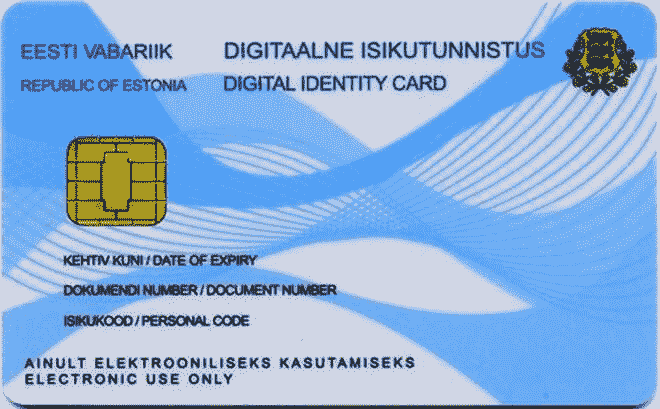

# 爱沙尼亚的电子居民是不断增长的分布式数字国家的一部分

> 原文：<https://thenewstack.io/estonias-e-residents-part-distributed-digital-nation/>

欧洲小国爱沙尼亚向任何想要申请的人提供跨国数字身份。

我们所知道的公民身份很简单:如果你出生在一个国家，或者你已经通过了入籍程序，你就是这个国家的公民。但在数字时代，这一切都在改变，技术允许人们建立多种数字身份——包括一些被海外国家官方承认的身份。

在过去的一年里，北欧国家爱沙尼亚向来自世界各地的非公民提供电子居住权。爱沙尼亚的电子居留允许国外的个人使用安全的数字签名在网上开办爱沙尼亚企业和开设银行账户，并使用爱沙尼亚公民使用的一些相同的网上政府服务。该计划是世界上唯一的同类计划，为非国民提供了获得安全的“跨国数字身份”的机会，对远程工作或经营独立于位置的在线业务的人特别有吸引力。

与在任何国家获得居民身份通常必须经历的官僚主义障碍相比，在网上申请成为爱沙尼亚电子居民相对容易，尽管最终需要亲自前往爱沙尼亚边境管制办公室或大使馆，以确认申请人的身份，提供生物数据并通过背景调查。尽管如此，该项目在过去的一年中取得了巨大的成功，成千上万的潜在候选人注册了该项目。

“到[2015 年]5 月，我们已经实现了全年[2，000 名电子居民]的目标。今年 7 月，政府制定了一个新的更高的目标:到今年年底，将有 5000 份电子居留申请，”项目负责人 Kaspar Korjus，[在 ZD 网](https://www.zdnet.com/article/estonias-plan-for-anyone-to-be-a-citizen-digitally-heres-why-thousands-are-signing-up/)的一篇文章中说。

“截至今天，来自 121 个国家的 7600 人申请了电子居留，并正在使用爱沙尼亚的电子服务，主要是为了创业。”虽然该项目是否能实现其雄心勃勃的目标(到 2025 年，T2 将有 1000 万电子居民)还有待观察，但 Korjus 很有信心:“(我们已经) 超过了我们最初目标的近四倍。”

该计划旨在吸引希望在欧盟(爱沙尼亚是欧盟成员之一)内建立业务关系并从数字基础中创造利润的企业家和公司。ZDNet 称，电子居民已经创建了 240 家新公司，另有 530 名企业家正在利用他们的电子居民身份经营现有企业。

爱沙尼亚电子居民卡样本。

## 无国界的电子政府数字社会

爱沙尼亚是第一个倡导数字居住理念的国家，这是有道理的。毕竟，这个只有 130 万人口的波罗的海小国是世界上网络最发达的国家之一，以孵化 Skype 和 TransferWise 等开创性的初创公司而闻名。在过去的几十年里，它通过正面拥抱创新的信息技术实践，包括由[电子政府](http://cacm.acm.org/magazines/2015/6/187320-estonia/fulltext)监管的无边界[数字社会](https://e-estonia.com/the-story/digital-society/)的理念，使自己与其邻国和最近的苏联历史区别开来。这一模式的核心是在开放平台和透明、开放进程的基础上，在社会各级实现权力下放和互联互通的理想。

在国内，爱沙尼亚的日常技术优势体现在公民受益于完全在线提供的大量政府服务:公民可以获得多达 600 项政府电子服务，企业可以获得 2400 项政府电子服务，从五分钟内电子申报纳税(想象一下！)到数字化投票。

## 拥有“数据大使馆”的分布式国家

这个数字社会的基础是 X-Road，它是[电子爱沙尼亚](https://e-estonia.com/)的数据“主干”,无缝、安全地连接该国所有各种在线服务和数据库，以优化数据交换。所有离开 X-Road 的数据都经过数字签名和加密，而所有进入 X-Road 的数据都经过验证和记录。

为了减少文书工作和成本，这种可扩展的跨组织数据共享中间件[建立在一个分散的分布式框架上，没有单一的所有者或控制器，其架构最好](https://en.wikipedia.org/wiki/Middleware)[描述为分布式服务总线](https://www.ria.ee/riigiarhitektuur/blog/2014/10/07/architecture-of-x-road/)。单个服务可以在准备就绪时推出，机构和企业可以只挑选他们需要的服务产品。

当然，这种一切都在线的模式也存在风险。2007 年，当一连串的拒绝服务攻击使议会、政府机构、银行和媒体的网站瘫痪时，最坏的情况变成了现实。虽然由于系统的分散设计，损害可以被最小化，但该事件引发了公众关于在这种情况下如何处理数据的讨论。爱沙尼亚政府提出的一个可能的解决方案是将所有的电子服务纳入云端，并将所有的数据库存储在盟国所谓的“数据大使馆”中。

## 首选数字签名

电子爱沙尼亚系统的一个重要的副产品是一个通用的电子身份证，它允许用户访问政府数据，以及医疗保健、银行、教育和法律事务的基本服务。这种智能身份证还有一个微型芯片，芯片上有安全认证证书和独特的数字签名，因此持有人可以用【2,048 位公开密钥加密安全地签署、核实和发送文件。这些具有法律约束力的数字签名现在在爱沙尼亚如此普遍，以至于它们现在是手写签名的首选，并且到目前为止已经为政府每年节省了大约 5 亿美元。

电子居民也可以从专为他们提供的类似智能身份证带来的便利中受益，尽管对电子居民来说，它在现实世界中还不被视为有效的旅行证件。就目前而言，电子居民身份证只允许持有者在线访问爱沙尼亚的政府服务和银行，并允许他们用数字签名合法签署文件，当然，还允许他们创业。

尽管如此，仍有计划在未来几年进一步扩大这项实验。就像在《过去的时代》中一样，有趣的是爱沙尼亚的实验是如何无意中质疑关于公民、社会和国家的旧观念的。一种政府认可的身份可以被打包，并提供给世界上任何选择数字化参与该系统的人，这种想法令人难以置信——可能会对我们日益互联的世界的其他部分产生一连串无法预见的影响。但是对于爱沙尼亚政府来说，这也是一个实际的商业问题。

“我们启动该计划才一年，目前仍处于测试阶段。这意味着我们正在鼓励人们使用这项服务，但它仍处于开发阶段，”Korjus 说。“我们的电子居民客户越多，电子居民平台对私营部门的吸引力就越大，在该平台上构建服务的兴趣也就越大。”

专题图片:[托马斯 k .跑步](https://medium.com/nomad-gate/estonian-e-residency-ultimate-guide-banking-taxes-cc27fe39c368#.sx49tcoyf)，[爱沙尼亚](https://e-estonia.com/e-residents/about/)。

<svg xmlns:xlink="http://www.w3.org/1999/xlink" viewBox="0 0 68 31" version="1.1"><title>Group</title> <desc>Created with Sketch.</desc></svg>