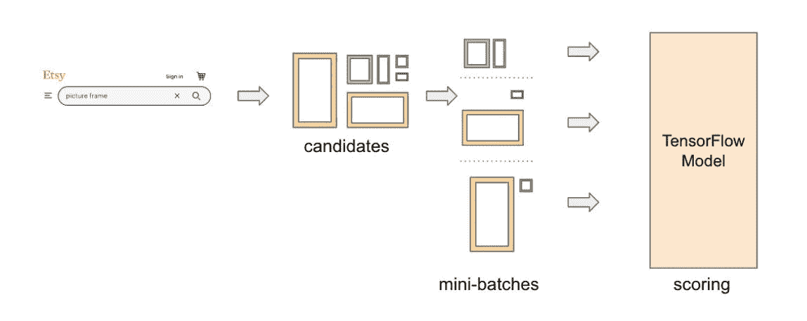
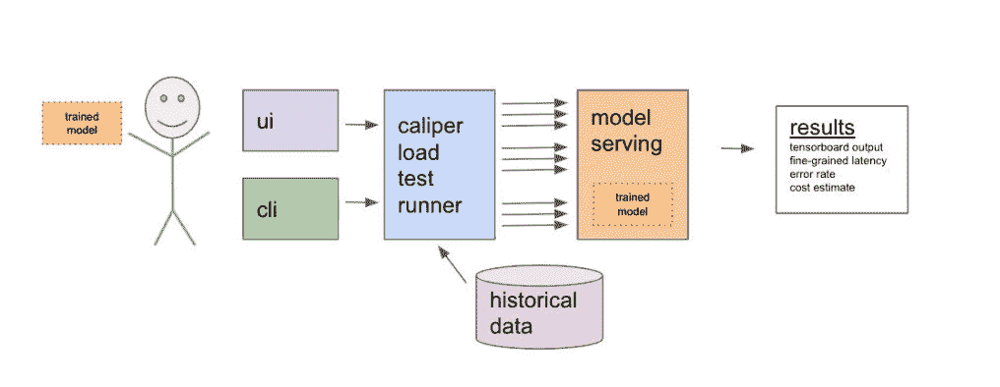
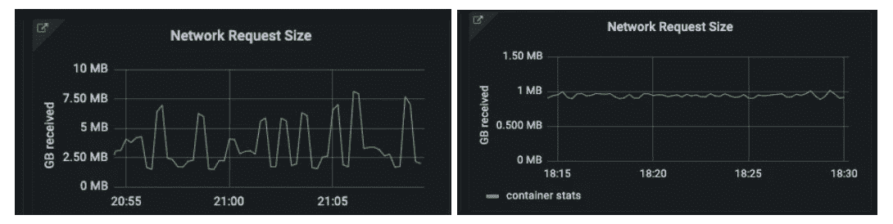
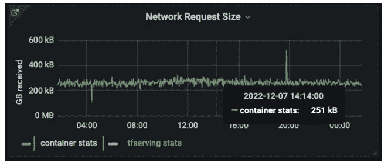

# Etsy 的压缩张量流变换延迟的工具

> 原文：<https://thenewstack.io/etsys-tool-for-squeezing-latency-from-tensorflow-transforms/>

[张量流](https://www.tensorflow.org/)变换是大多数[机器学习](https://thenewstack.io/machine-learning/)模型性能问题的主要原因。但是增加搜索批次的大小并不一定会改变服务器端的延迟。这些只是 Etsy 在部署其新的 ML 测试工具时学到的两个教训。

最初的[博文](https://www.etsy.com/codeascraft/improving-support-for-deep-learning-in-etsy39s-ml-platform)由 Etsy 的机器学习工程师[莎莉·瓦莱卡](https://www.linkedin.com/in/sallie-walecka/)和该公司负责机器学习的高级软件工程师[凯尔·加拉丁](https://www.linkedin.com/in/kylegallatin/)撰写，对这一主题进行了详细阐述。

随着全球在线市场为其搜索排名平台开发深度学习模型，工程团队不得不创建自动化测试实践来降低延迟。

为此，他们开发了一个内部自动化测试工具，卡尺。使用 Caliper，测试可以在开发过程的早期进行。早期测试揭示了更高延迟的主要原因。使用非常详细的分布式跟踪有助于消除不必要的客户端超时，并暴露由工程师认为已经解决的问题引起的瓶颈。

## **为什么搜索排名的低延迟是一个挑战？**

根据博文作者的说法，延迟从来都不容易，但对于搜索排名机器学习来说尤其困难，因为“功能的数量、请求的突发性以及严格的延迟截止”。

虽然 Etsy 没有给出具体的延迟目标，但它小于 250 毫秒，因为接下来的所有工作都发生在 250 毫秒之前(大多数在 75 毫秒之前)。

对于每个搜索请求，获取 1000 个候选列表；则从特征库中检索 300 个特征。这些数据然后被发送到 Etsy 的机器学习服务，进行评分和排名，然后再发送给用户。博客作者将这一过程描述为“突发的 cpu 负载，成本非常高。”

Etsy 搜索请求流程的图示。(来源:Etsy)

这些昂贵的 cpu 密集型工作负载很难进行故障排除和调整，因为由于高开发开销，模型测试直到发布前才执行。根据 Walecka nad Gallatin 的说法，这导致了“意外的惊喜和头痛”，这并不奇怪，因为这不是一个长期的发展战略。

## **卡尺的自动化早期测试**

Etsy 的 Caliper 可以在开发生命周期的早期自动测试。

Caliper 如何在开发过程的早期使用机器学习来辅助自动化测试。(来源:Etsy)

一旦模型工件被训练，就可以用训练数据对其进行负载测试，并自动用 [TensorBoard](https://www.tensorflow.org/tensorboard/get_started) 对其进行分析。传统的手动过程现在只是一个记忆，因为卡尺只需要五分钟就可以完成测试。它通过 web UI 显示延迟分布、模型错误和慢速 TensorFlow 操作的概况。数据选择、RPS、批量大小和模型选择都是可定制的。

Caliper 揭示了导致更高延迟的两个重要因素。首先，大多数模型性能问题是由缓慢的张量流变换引起的。

第二个来自卡尺测试不同批量的能力。批处理大小并没有导致服务器端的延迟显著增加，但是大大降低了编排层准备请求的开销。批量从 5 个增加到 25 个。

## **分布式跟踪意味着更低的延迟**

但是战争还没有结束，因为客户端仍然有 250 毫秒的超时。模型预测是在 50 毫秒时做出的，但在某个地方仍然有额外的 200 毫秒的问题。Etsy 使用分布式跟踪和[服务代理特使](https://thenewstack.io/envoy-gateway-offers-to-standardize-kubernetes-ingress/)来提高可观察性，从 [Prometheus 直方图度量](https://thenewstack.io/promcon-2022-why-prometheus-had-to-change/)中可以看出它正在使用的客户端、代理和 TF 服务容器。

分布式跟踪在单个请求级别上跨组件提供延迟的粒度样本，而不是共享 p99(第 99 百分位)延迟范围(在本例中为 100 毫秒到 250 毫秒)。Envoy 访问日志提供了延迟发生位置的详细信息，并揭示了在功能到达模型之前，将功能从客户端传输到代理所花费的 200 毫秒的时间。

Etsy 认为这个问题是工作负载特有的，因为在请求级别上,“功能传输”时间与有效负载大小不是线性的，搜索排名与这个问题无关，而广告排名则不是。总的来说，它是一个较慢的型号，有效载荷大约是它的 20 倍，功能更多。

负载大小成为瓶颈对 Etsy 来说是新闻，因为当前的 protobuf 负载是 1mb，低于决策树模型的 JSON 负载的 4mb 大小。

搜索编排尝试使用 [gRPC](https://grpc.io/) 进行压缩，产生的有效负载大约是该大小的 25%,结果反映了该解决方案。搜索模型的错误率降低了 68%，p99 延迟减少了约 50 毫秒。

## **结论**

ML 功能只会增加，模型会变得更加复杂。为了解决这个问题，Etsy 正在寻找进一步减小有效载荷大小的方法。公司工程师也在继续开发卡尺和自动化基础设施。

TensorFlow [由 Google](https://thenewstack.io/google-touts-web-based-machine-learning-with-tensorflow-js/) 开发，是机器学习和 AI 的端到端开源平台。没有提到任何未来开源的卡尺。

Etsy 去年 10 月发表了这篇[文章](https://www.etsy.com/codeascraft/deep-learning-for-search-ranking-at-etsy)；它专注于从梯度增强树到深度学习的转变。它涵盖了许多如何以及为什么要转向深度学习的内容。

<svg xmlns:xlink="http://www.w3.org/1999/xlink" viewBox="0 0 68 31" version="1.1"><title>Group</title> <desc>Created with Sketch.</desc></svg>