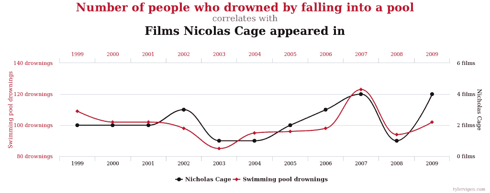

# 机器学习有助于发现异常和恶意活动

> 原文：<https://thenewstack.io/evaluating-machine-learning-security-solutions/>

随着企业为了实现更高的灵活性而对其应用和基础架构进行现代化，他们正在评估适用于他们所采用的云原生平台的安全解决方案。但是由于容器的短暂性，当任何人调查事故原因时，负责的容器可能已经消失了。与此同时，手动流程跟不上应用程序和微服务的组件相互通信的速度。

[机器学习](/category/machine-learning/) (ML)可以帮助您发现异常和恶意活动，并自动化工作流，以便运营团队和开发人员可以更快地解决问题。相比之下，传统的安全方法跟不上这些新架构的速度或规模。

不幸的是，ML 的广泛采用已经对它实际能做什么产生了过度的宣传和混淆。绝大多数企业安全解决方案(包括防病毒工具、防火墙、入侵检测和入侵防御系统)都使用或声称使用 ML 来检测传统方法无法检测的威胁。

## 谁，或者什么，从谁那里学到什么

 [罗汉·丹登

Rohan 是一名统计学家，擅长机器学习，尤其对使用高性能计算和分布式系统的图形模型和时间序列分析感兴趣。他对机器学习的安全应用非常感兴趣，尤其是恶意软件和异常检测。目前，他是 StackRox 的一名技术人员，之前曾在 Cyphort 和 Skout 担任工程职位。他拥有斯坦福大学统计学硕士学位。](https://www.stackrox.com/authors/rtandon/) 

机器学习不是万能的。仅仅在威胁检测引擎中使用它并不能保证您的安全状况得到改善。事实上，如果使用不当，ML 的结果实际上是有害的，会增加解决方案产生的噪音以及误报和误发现的比率。在安全平台的保护幌子下，机器学习可能是一把双刃剑。

尽管有这个名字，“机器学习”有点用词不当。没有机器像人类那样学习——至少现在还没有。今天，ML 是利用现代计算能力来建立解释数据模式的数学和统计模型的实践。这适用于网络安全，其工程师在安全数据上建立模型，以找到表明基础设施或操作环境内可能存在危害的模式。

ML 的许多数学基础是几十年前发展起来的。例如，贝叶斯统计(根据确定性百分比陈述命题)和神经网络(从大量印记数据中获取模式)实际上可以追溯到 20 世纪 40 年代。硬件并行化的最新进展，包括图形处理单元(GPU)和 FPGA 加速器，使系统能够处理大得多的数据集，并构建产生比以往更丰富的行为集的模型。这些机器学习模型背后的数学经受住了时间的考验，学术界最近出现了更多的改进和变化。

虽然有几种用于分类和预测威胁的 ML 算法，但基于这些算法的模型的有效性在很大程度上取决于输入其中的数据的数量和质量。换句话说，机器学习只能和你提供给它的数据一样好。

## 数据的预测能力

数据集本身需要有预测能力。例如，考虑构建一个基本模型来预测文件操作是否表现出恶意行为的任务。有哪些相关数据点可能为我们提供这种行为是否确实是恶意的信息？

*   文件是否是有效的可执行文件
*   文件是否位于受保护的系统文件夹中
*   哪些权限适用于该文件
*   文件是否引用系统库
*   文件是否有有效的数字签名

这些指标中的每一个都可能具有直接的预测能力，并且可能有助于检测特定文件操作的恶意意图。诸如文件大小的其他属性可能具有更间接的预测能力。文件大小本身并不能告诉我们文件修改是否是恶意的。但是从多个不同指标的角度来看，它可以帮助我们更好地理解恶意行为的类型。

勒索文件往往比标准二进制文件大得多。如果您的企业构建或使用合法的二进制文件，其大小与典型的勒索软件变种相似，那么仅根据文件大小扫描和过滤二进制文件并不能保护您免受此类威胁。但是文件大小加上其他信息可以提供关键的上下文，从而实现更有信心的勒索软件威胁检测。例如，[文件熵](https://isc.sans.edu/forums/diary/Using+File+Entropy+to+Identify+Ransomwared+Files/21351/)是一个文件内容与白噪声相似程度的度量，或者遵循更可预测的书写文本方式。

像[随机森林](http://blog.echen.me/2011/03/14/laymans-introduction-to-random-forests/)(基于决策树集群的二元状态预测器)这样的机器学习分类器非常适合在多维空间中操作，并且可以熟练地找到像这样的模式，并以比在每个指标上应用独立规则更低的假阳性率对它们进行分类。当指标的数量达到数千个甚至更多时，探索这些关系并围绕它们构建分类器就成了一个规模问题。在这种情况下，机器学习可以快速找到几个特征之间的相关性，否则人工几乎不可能做到这一点。

## 小心虚假的相关性

当使用机器学习来识别几个指标之间的关系时，需要考虑一个关键原则:相关性不一定意味着因果关系。

当指标的数量非常大时，这是一个必不可少的概念，其中许多指标并没有很好的预测能力。结果是一个训练有素的高精度模型，但最终只不过是用来训练它的数据集的一个方面，并不代表您试图建模的整体关系(“选择偏差”)。

作家兼统计学爱好者泰勒·维根(Tyler Vigen)维护着[一个名为虚假相关性](http://www.tylervigen.com/spurious-correlations)的网站，展示了几个这样的例子，其中两种趋势在逻辑上是独立的，但显示出高度的统计相关性。当用新数据进行测试时，这些模型几乎总是会崩溃。这里有一个例子，将一些溺水统计数据与尼古拉斯·凯奇的电影联系起来:

来源:Tyler Vigen 的《虚假关联》。

任何机器学习模型或系统都需要有可靠的数据科学工作作为支持，不仅要审查模型，还要审查训练它的数据。可以更新机器学习模型，以使用可以实时提高功效的新数据。

但是，需要注意的是，随着安全形势的不断变化，用于构建模型的底层数据源也将不断变化，某些目前是安全事件强有力指标的功能在未来可能不再如此强大。网络安全的日常发展可能会决定用于生成机器学习模型的数据需要如何改变。这样，该数据可以保持高度的准确性，同时最小化错误发现率。

[StackRox](https://www.stackrox.com/) 赞助了这个故事。

专题图片:[IBM Watson Group 高级产品经理 Avi Yaschin 在 Github 上发布的一张真实的随机森林图](https://github.com/aviyashchin/Kaggle-Project-Rossman-Stores)。

<svg xmlns:xlink="http://www.w3.org/1999/xlink" viewBox="0 0 68 31" version="1.1"><title>Group</title> <desc>Created with Sketch.</desc></svg>