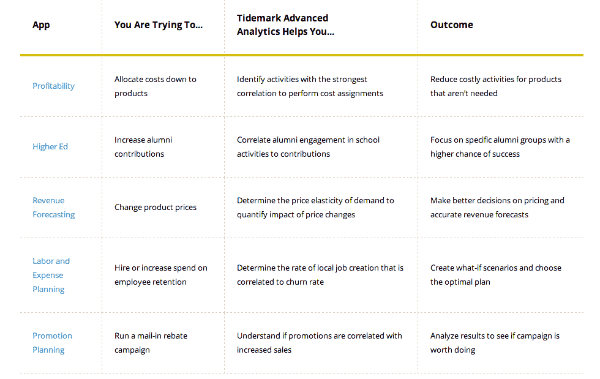

# 评估 Node.js 框架、入侵 WordPress 站点以及更多来自赞助商的内容

> 原文：<https://thenewstack.io/evaluating-node-js-frameworks-hacking-a-wordpress-site-and-more-from-the-sponsored-feed/>

Node.js 框架有哪些需要考虑的区别？黑掉一个 WordPress 网站有多容易？你如何利用分析来更好地预测收入？这些是在新的 Stack 赞助商订阅源上的帖子中探讨的问题，出现在每个帖子的底部。赞助商提要中的项目链接回赞助商的博客。赞助商发布的帖子越多，他们的帖子出现在提要顶部的就越多。

**Adallom** :我们的 BlackHat 2014 美国研讨会的回顾

我参加了黑帽的 Adallom 工作坊。我了解到黑客进行中间人式入侵是多么容易，以及为什么 SaaS 是恶意软件攻击的新热点。在研讨会上，Adallom“要求与会者在一个官方 WordPress 插件中找到一个漏洞，利用它并提升自己以获得管理权限。”

显然，人们已经要求接受挑战，所以 Adallom 在他们的网站上发布了信息。这是每个人都有机会“捕捉旗帜”，获得管理权限，并在网站上发表自己的帖子，如果他们成功了。

作为参考，Adallom 提供了研讨会的幻灯片供下载。

**Tidemark** :分析这个:介绍 Tidemark 高级分析:

Tidemark 推出了一项新服务，旨在帮助公司制定更准确的计划和风险调整预测，以纳入最有可能影响结果的数据。管理者“可以筛选出令人困惑或误导的相关性，这些相关性常常让他们淹没在数据中。”以下是一个概述:

API gee:API 的原因和方式:开放 API 模型

野生环境中的 API 就像内置了服务的广告。Apigee 的最新帖子说明了开放 API 对公司、它们开辟的市场以及如何应用它们来解决问题是如何有效的:

*   **突破性创新**:这是所有用例中最常见的，也是一个众所周知的范例，因为 Twitter、Foursquare 和脸书等公司取得了成功，这是通过利用世界各地成千上万的开发者的创造力和专业知识来利用你的 API 创建酷应用并取得重大突破的创新。
*   利基市场(Niche markets):一家公司可能有一个地理或人口上的利基市场，这代表了一个不错的新的商业价值主张。但它可能没有资源或预算来将价值主张纳入该利基市场。利用开放的 API 程序，任何开发人员都可以创建一个应用程序，为他们自己和 API 提供商创造新的价值。
*   **直接激励**:一种直接的方法可能是举办一场竞赛或黑客马拉松，激励你开发 API。例如，汽车行业已经成功地使用这种方法来解决问题。研发预算和资源延伸到业务范围之外，以刺激大范围的创新。

**新遗迹**:评估 Node.js 框架:hapi.js、Restify、Geddy

在大多数情况下，Adron Hall 使用 Node.js framework Express.js。在上周为 New Relic 发布的一篇帖子中，Adron(他也为新堆栈编写了一篇关于 hapi.js、Restify 和 Geddy 的帖子。他这样总结自己的评价:

Hapi.js、Geddy、Restify 各有优缺点。Hapi.js 为提供基础 Web 应用程序或 api 服务提供了一个很好的极简起点。Geddy 是最完整的、现成的、类似 Ruby on Rails 的框架之一，可以让 Web 应用程序快速启动。Restify 是一个可靠、完整、面向企业的 API 生成和服务器库。在这些领域中的每一个领域，各自的图书馆都做得很出色。当你在市场上开始一个应用程序，但不确定使用哪个库时，这些都是有效的竞争者。

[下载白皮书全文](http://www.kinvey.com/mobility-maturity-model)了解更多关于 Kinvey 的“企业移动成熟度模型”的信息，其中包括在公司应用开发成熟度周期的每个阶段构建的应用类型的示例。数字海洋和 Cloudosft 也有我们上周引用的帖子。数字海洋看看如何使用 OAuth 2。云软有一些最近在爱丁堡举行的 Docker meetup 的视频。

通过 Flickr 知识共享的特色图片[。](https://www.flickr.com/photos/tschiae/8417927326/in/photolist-dPS5w3-6mYWTq-iy62L-7eiuud-bnH5S-Ev4DG-bBHBD-8rzwtQ-7o5kBY-osfBUt-ec3o5Z-83sMKm-83sMKN-c8oHbJ-7YKwTt-8t6LYL-azg5Ce-bCmPef-8pWQ8P-7ZgUwT-fz5Q4R-nv828U-nMjtf8-oqthYs-5cHjrz-8sgscV-8sgsaK-8sjwkN-8sjwjb-c3mFU-i5BfXG-ecx2g1-8q11SQ-8pZZVG-8q11by-8q11Do-8pWPWk-8pWRuc-8q11p9-8q12hQ-8Sk7v5-6XgJVK-88tsPs-4YRFWv-FiksW-5DPwNq-4bKKrj-4RVund-4vQgFr-osfCer)

<svg xmlns:xlink="http://www.w3.org/1999/xlink" viewBox="0 0 68 31" version="1.1"><title>Group</title> <desc>Created with Sketch.</desc></svg>