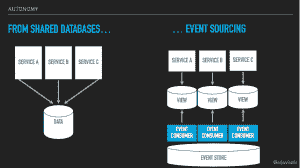
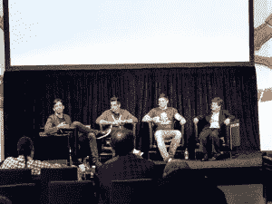
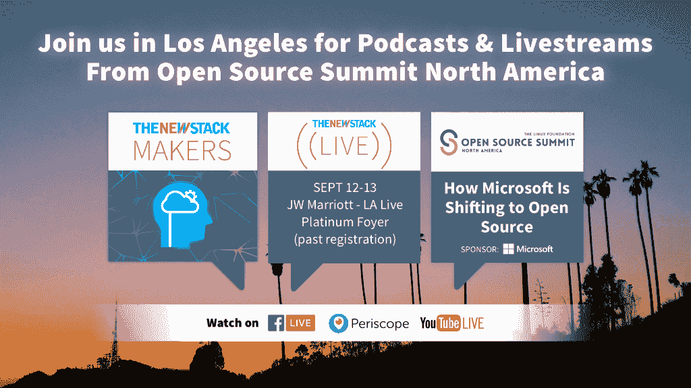

# 事件驱动架构是未来的趋势

> 原文：<https://thenewstack.io/event-driven-architecture-wave-future/>

事件驱动架构(EDA)是[微服务](/category/microservices/)和[无服务器](/category/serverless/)技术发展的最新一步。最近在三藩市举行的关于事件驱动架构的 [Emit 会议](http://www.emitconference.com)为前沿极客提供了一个了解这种数字商业工具的地方。

我们已经讨论了无服务器架构。但是 EDA 是一个不同的范例。Gartner，Inc .副总裁兼杰出分析师 Anne Thomas 在一次 Emit 专题讨论会上表示，事件驱动架构已准备好成为主流企业的优先考虑事项，但对于大多数 it 组织来说，它仍处于边缘地位，即使是那些拥有它的组织也是如此。EDA 实际上已经存在很长时间了。像 [Tuxedo](http://www.oracle.com/technetwork/middleware/tuxedo/overview/index.html) 这样的产品是事件驱动的。但是，她说，这只是外面世界的一小部分。

[Gartner 称 EDA 为一种设计范式。](http://www.gartner.com/it-glossary/eda-event-driven-architecture/)在其最高级别，软件组件或事件执行对接收一个或多个事件通知的响应。一个关键特征是发送通知的服务器组件不知道哪个组件在接收端。

根据 Pivotal Software 的高级技术总监和云本地计算基金会(T21)成员 Cornelia Davis 的说法，这需要我们重新思考。 [Davis 的演讲](https://s3-us-west-2.amazonaws.com/emit-website/2017-slides/RethinkingThinking+Emit.pdf)从技术细节上解释了 EDA 与当今最常用的客户机/服务器架构在概念上的不同。她说，在某种程度上，当事件被触发时，它需要程序员进行一次信念的跳跃。

为了理解这种转变，在她的演讲之后，我问 Davis，向 EDA 的转变是否类似于 Java 首次登场时发生的转变，程序员必须学会用面向对象编程来思考。这是同一个思路吗，只针对栈？

不完全是，她回答。

她说，面向对象编程改变了你思考代码的方式，但 EDA 远不止于此。Java 通过创建对象和对象上的方法创建了一种新的封装模型，但是它没有从根本上改变代码下面的命令式模型。

科妮莉亚·戴维斯在 Emit 大会上的 EDA 作品

但是代码仍然是按顺序处理的，戴维斯说。这是将要发生的第一件事，然后下一件，然后下一件。“仍然是‘从这里开始，在这里结束’

对于 EDA，我们谈论的是一些根本不同的东西。”在她的演讲中，她解释说 EDA 需要编码人员有一个信念上的飞跃。那是没有完成的事情。

事实上，传统的编程排除了任何信仰的跳跃。事实上，如果你依靠信仰的飞跃，你就做错了。

Nordstrom 无服务器平台团队的高级经理 Rob Gruhl(T1)在当天早些时候做了一个演示，他说，实际上，你所创造的是一种“非直觉的确定性”这实际上不是信仰的飞跃，因为每个事件都有结构和编码。这感觉像是一个信念的飞跃，因为它与开发人员以前经历过的任何事情都不一样。

“这感觉很奇怪，这太容易了，”格鲁尔说。

关于 EDA 未来的发射面板。奥斯汀·柯林斯，杰森·波利特，克里斯·安德森和安妮·托马斯。

他分解了这个过程:无服务器让你可以思考过程。EDA 将进程从堆栈中分离出来，因此现在您的 arch 更加灵活。在未来，他怀疑[无冲突复制数据类型](https://medium.com/@istanbul_techie/a-look-at-conflict-free-replicated-data-types-crdt-221a5f629e7e)(crdt)可能会在连接性方面发挥同样的作用，使连接性更具选择性，并且不再考虑网络连接性。

## 当前状态

根据包括 Gartner 的 Thomas 在内的专家组的说法，当今市场上的 EDA 是由非常简单的应用程序驱动的，这些应用程序没有复杂数量的事件或事件流；[杰森·波利特](https://www.linkedin.com/in/polites/)，他是谷歌云功能的产品经理；以及 [Chris Anderson](https://www.linkedin.com/in/christopher-anderson-983a1852/) ，微软负责 [Azure Functions](https://azure.microsoft.com/en-us/services/functions/) 的高级项目经理。

Polites 表示，谷歌看到的 EDA 用例集中在物联网和轻型提取、转换和加载作业上。此外，学术界一直在朝着采用的方向发展，因为他们处理大量的计算时间来分析大量的数据，但这并不一致。

托马斯说，他们认为这主要是为了网络和移动后端。她认为它在人工智能和机器学习分析方面有巨大的潜力。“挑战在于，”她说，“还没有工具让人们能够[发现](http://www.urbandictionary.com/define.php?term=grok)大型活动相互依赖的复杂性。”

专家小组总结道，现在需要的是框架，托马斯称之为“现在真的很原始”她说，随着我们开始重新思考我们的思考方式，开始从事件触发事件和功能模型的角度思考，系统可能会变得更容易。

## 未来

那么，我们如何利用 EDA 来解决更复杂的挑战呢？

托马斯说，基础设施真的很原始。展望未来，框架将是基础。"框架缺少很多东西，但也缺少可观察性."

“但是，”她说，“最大的挑战是让人们了解 EDA 有多大。”复杂性是巨大的，还没有完全理解。

安德森说他们今天已经看到问题了。随着事情变得越来越复杂，该行业需要开始思考这些不同的东西如何协同工作。“我们正在解决问题的不同部分，但我们是独立完成的，”他说。

他建议花时间思考如何利用我们已经拥有的工具与云供应商进行协调。“我们不需要第四种部署方式，”他说。“我们有很多方法来构建应用程序，但我们如何更好地协调并获得更好的输出。我们不想两次解决同一个问题。”

## 从哪里开始开发？

安德森建议说，一步一步解决每个问题。“现在有更多关于如何开始的好内容，比一年前有更多的答案。”他建议从马丁·福勒的博客开始。

托马斯也很实际。她说，关注数据。“这不仅仅是你的代码。这是关于数据以及如何对数据进行分区，由谁来汇总数据。”和事件模式至关重要。她说，如果你对这些数据是如何汇集在一起的没有一个合适的大规模视角，你将会遇到很多问题。

<svg xmlns:xlink="http://www.w3.org/1999/xlink" viewBox="0 0 68 31" version="1.1"><title>Group</title> <desc>Created with Sketch.</desc></svg>