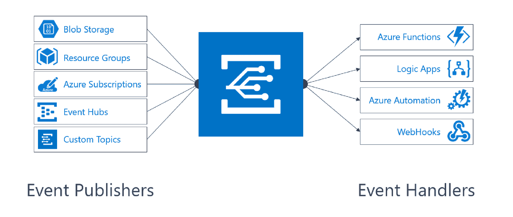
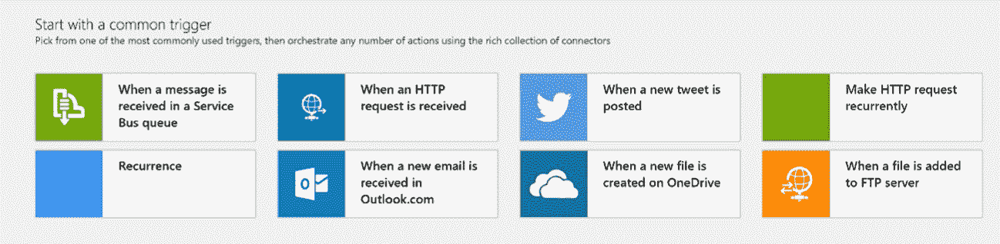
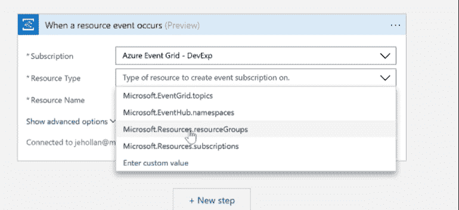
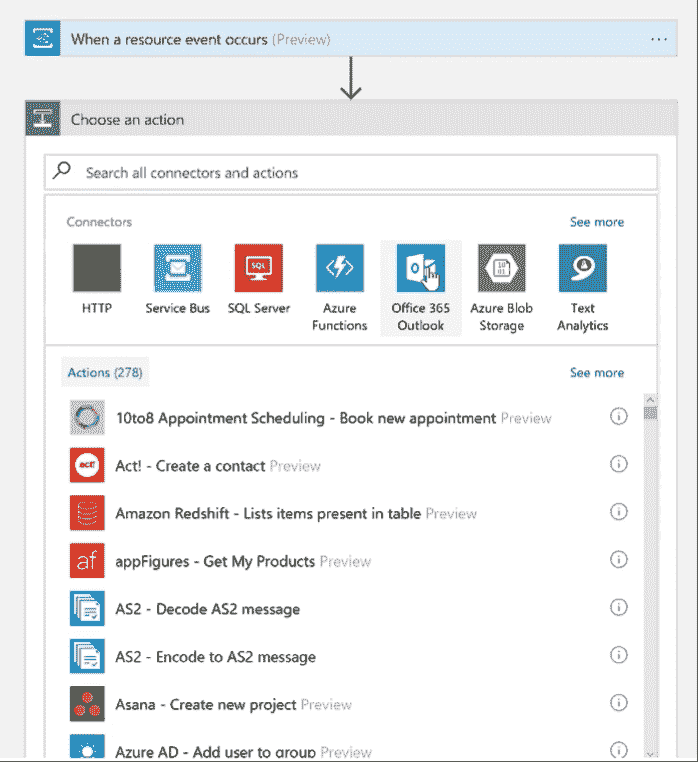

# 通过事件网格，微软提供了 Azure 无服务器计算缺少的一半

> 原文：<https://thenewstack.io/event-grid-microsoft-provides-missing-half-serverless-computing-azure/>

微软正在把 Azure 中的几乎所有东西都变成可以用无服务器代码连接在一起的事件。

无服务器计算让你专注于你正在编写的应用程序，而不是运行它的基础设施；您将应用程序编写为由事件触发的函数，这样，当有事件需要处理时，您只需付费运行代码，服务会负责处理触发代码的事件。

处理这些事件仍然意味着关心一些基础设施，比如您必须与之交互的消息队列。这就是微软的[新 Azure 事件网格服务](https://azure.microsoft.com/en-us/blog/introducing-azure-event-grid-an-event-service-for-modern-applications/)的用武之地:这是一个完全托管的事件路由服务，让你订阅——并对——其他 Azure 服务上发生的任何事件，以及你通过 webhooks 和 REST APIs 监控的来自其他服务的事件做出反应。

微软 Azure Compute 产品负责人[科里·桑德斯](https://github.com/coreysa)告诉《新堆栈》:“我们正在看到更多围绕事件构建的现代应用，无论是对物联网设备的变化做出反应，还是对用户点击移动应用或根据客户请求启动业务流程做出响应。”。

> 事件正在成为整个微软服务范围内相同的一级本地对象。

“无服务器平台，如 [Azure Functions](https://azure.microsoft.com/en-us/services/functions/) 和 [Azure Logic Apps](https://azure.microsoft.com/en-us/services/logic-apps/) ，允许您使用基于事件的按需应用模型，而没有任何基础架构的负担。但随着我们看到越来越多的客户以这种方式部署应用程序，我们看到应用程序模型的其他方面面临越来越多的挑战，主要是在管理和响应跨许多不同平台发起的事件方面，”桑德斯说。“事件来自过多的来源，直到今天，它们都必须用大量额外的代码来管理。事件网格完成了故事；这是一个单一的托管服务，用于管理从任何来源到任何目的地的所有事件，旨在实现高可用性并动态处理大规模事件。这是无服务器应用程序真正需要的第二部分—一个可靠的全球事件解决方案。”

Azure 已经有各种方式来使用事件:在功能和逻辑应用程序中，在用于构建定制业务应用程序的 [Power 应用程序](https://powerapps.microsoft.com/en-us/tutorials/connections-list/)中，在用于记录来自应用程序和站点的遥测数据的 Azure Event Hubs 中，在用于来自物联网资产的事件的 Azure IoT Hub 中，甚至在带有新的[变更反馈处理器](https://azure.microsoft.com/en-us/blog/introducing-the-azure-cosmosdb-change-feed-processor-library/)的 Cosmos DB 中。事件网格为您提供了一个管理这些事件路由的中心位置，使用过滤器将特定事件路由到不同的端点(甚至多播到多个端点)。

它建立在 [Azure 服务架构](https://azure.microsoft.com/en-us/services/service-fabric/)之上，该架构为从 SQL DB 到 Power BI 的关键微软服务提供支持，这意味着从 Azure 开始，事件正在成为整个微软服务范围内相同的一级原生对象(并且该服务可以处理非常大规模的事件)。这使得它与其他处理事件的服务非常不同，其他服务只是通过 REST APIs 和 webhooks 来处理事件。

“这些事件与应用平台完全无关，”桑德斯解释道。“Event Grid 不仅仅是一个标准的发布-订阅系统，因为该平台涵盖了广泛的服务，还因为事件是头等大事，这意味着您可以直接控制它们，包括根据前缀或事件类型进行过滤。您可以控制和配置一组过滤器，这样您就可以轻松地决定在代码中监听哪些事件并对其做出反应。过滤是在服务器端完成的，这意味着您需要决定对哪些事件做出反应和响应的代码的复杂性大大降低。”

通过按事件类型和前缀过滤，您可以精确地隔离要响应的事件，即使是从非常大的事件流中。

## 事件穿越 Azure

事件网格的明显用途是在不同的 Azure 服务之间路由；上传一个图像文件到 Azure 存储器会触发一个 Azure 函数来调整图像的大小或者在上面运行图像识别。“想象一下，从基于物联网的解决方案中触发一个自定义事件，并启动一个功能或第三方事件服务，”桑德斯建议道。

事件网格是 Azure 功能的完美匹配，但它不仅仅适用于无服务器服务。他解释说:“我们的目标是让它成为开发者和系统管理员管理所有事件的中心点，并从 Azure 中运行的每个服务中管理，这样客户就不必管理多个服务、多个来源、多个不同类型的平台，并且可以通过一种简单的方式实现所有这些。”

“我们计划整合广泛的服务，包括 Cosmos DB、Azure AD、SQL DB、Postgres 和 MySQL。我们将提供直接的物联网中心和事件中心与事件网格的集成，以便能够获取这些消息、存储和管理这些消息，并能够将它们转换为这些一流的事件对象，然后将其正确路由到您想要执行的服务或场景。”

在预览版中，您可以从 Azure 资源组和 Azure 订阅(用于管理操作)、事件中心和您自己创建的自定义主题中收集事件。Blob 存储和 Azure 自动化支持即将推出，Azure Active Directory、API 管理、Logic Apps、IoT Hub、服务总线、Azure Data Lake Store 和 Cosmos DB 将在“今年晚些时候”加入该列表。

最初，你可以将事件发送到 Azure Functions，Logic Apps(涵盖 Power Apps 和 Microsoft Dynamics，以及 Salesforce 等第三方服务)，Azure Automation 和 webhooks 发送到外部服务。稍后，您将能够将事件路由到服务总线、事件中心、Azure 数据工厂和存储队列。

您还可以将事件网格用于操作和自动化；当它启动时，该服务将支持来自 Azure 运营管理套件的 Azure 自动化。“你将能够从任何来源获取事件，并能够运行脚本或响应作为其中的一部分，警报和监控系统将随着时间的推移而集成，”桑德斯告诉我们。

这意味着你可以跟踪你如何使用虚拟机和 SQL DB 等 Azure 服务，通过将元数据放入操作工具或创建工作项来执行策略或自动化管理。“只需几行代码，正在创建的虚拟机就可以生成一个完整的应用程序工作流，该工作流会添加计费标签并发送通知，告知虚拟机已创建。这种端到端功能对于管理对环境的控制和访问非常强大，在未来，除了 API 的变化之外，可能还包括 Azure Active Directory 的变化。”

## 活动中的事件网格

事件网格是为大规模设计的。“当涉及到基于事件的管理和通信时，我们会以百万计，”他说。微软已经在一个地区每秒测试了数百万次事件，持续了几天，这就是该服务的定价——每百万次操作 0.60 美元(预览期间 0.30 美元)，预览期间每月前 10 万次操作免费。操作被定义为事件进入、高级匹配、交付尝试和管理调用。

预览期间还有其他限制:管理操作被限制为每秒 10 次，每个帐户可以订阅 1，000 个事件。当该服务推出时，预计每个地区将有 1000 万个事件，并支持 1 亿个事件侦听器。桑德斯解释说:“我们的目标是通过系统真正提供快速的事件传输。

如果你使用过 Azure Logic Apps，用触发器和动作定义事件的可视化编程界面看起来会很熟悉(尽管可以选择翻转到代码视图，从你的 Azure 订阅中提取细节)。

事件网格有预定义的通用触发器，您也可以定义自己的触发器。

事件有共同的信息，如事件源、发生时间和唯一标识符，以及事件的特定信息。保存到 Azure 存储中的文件的元数据，或者如果事件是虚拟机重新启动，它将包括虚拟机名称和重新启动的原因。

每个事件中的信息模式来自事件主题，创建自定义主题是定义事件发布到的端点的方式。事件网格主题是 Azure 资源，您可以在 Azure 资源组中创建它们。订阅主题是您告诉 Event Grid 您想要跟踪哪些事件的方式；订阅是事件网格路由和过滤事件的方式。

事件处理程序(Event Grid 称之为订户)是事件的最终目的地，也是处理该事件所要采取的行动——包括以指数补偿时间重试最多 24 小时，直到目的地服务确认该事件已被接受。

订阅是事件网格过滤和路由事件的方式

Azure 已经为无服务器计算提供了许多连接器，事件的长动作列表就是建立在这些连接器上的。

事件网格可能看起来像是现有 Azure 事件处理的扩展，在 Azure 中有一个单一的中心点来处理所有事件当然很方便；但事实上，它是建立在服务结构上的，因此深入到 Azure 服务的构建方式中，这使得它比这更有意义。微软正在采用事件驱动的无服务器计算的一些核心原则，并使用它们来互连不同的 Azure 服务——以及任何你想从中接收事件和向其发送事件的东西，给你一种简单但非常可扩展的方式来创建跨服务和平台的无服务器应用。

通过 Pixabay 的特征图像。

<svg xmlns:xlink="http://www.w3.org/1999/xlink" viewBox="0 0 68 31" version="1.1"><title>Group</title> <desc>Created with Sketch.</desc></svg>