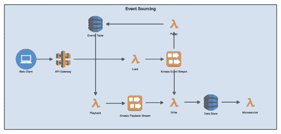

# 亚马逊网络服务的事件源设计

> 原文：<https://thenewstack.io/event-sourcing-design-with-amazon-web-services/>

事件源是一个软件架构概念，它基于将每个状态更改保存到应用程序的思想，使您能够使用事件回放从头开始重建应用程序状态。这类似于银行分类账，其中不是存储每个账户在任何给定时间的当前值并更新这些值，而是存储每个交易(事件)，账户中的值只是这些事件的净和。虽然事件源增加了应用程序架构的额外复杂性，并且对于某些用例来说可能是多余的，但它也可以增加很多价值。

在本文中，我将探索事件源的用例，围绕这个架构的一些考虑，并提供一个利用 Amazon Web Services (AWS)的事件源设计。

## 活动采购适合你吗？

 [保罗·布尔德尔

Paul Bourdel 是 Slalom Build 的解决方案负责人。Paul 作为架构师、团队领导和经理拥有超过 16 年的经验。Paul 拥有丰富的经验，在组建团队和参与交付之前，他会与利益相关者一起发现项目的范围、方向、时间表和风险。最近，Paul 一直在领导云原生系统项目，重点关注无服务器微服务和开发运维。](https://www.slalombuild.com/) 

在我们讨论事件源的用例之前，我认为概述这种架构的主要优势是很重要的。它归结为三个核心功能:

*   **完全重建**:使用事件日志从事件中完全重建应用程序状态。
*   **事件重放**:用更新的应用逻辑重放系统中的事件，纠正错误的事件处理。
*   **事件反转**:反转特定的事件，而不必从干净的应用程序状态进行重放。

本质上，事件源揭示了一个新的方向，我们不再需要保持应用程序状态，而是可以派生它。因此，除了简单地了解应用程序的当前状态之外，您还需要了解如何到达当前状态的所有附加环境。这带来了许多好处，包括能够从事件日志创建测试环境，修复代码中的错误，然后重放以纠正数据并准确跟踪帐户是如何进入危害状态的。

## 处理外部系统和代码变更

如前所述，事件源具有一定的架构复杂性。根据您部署它的方式，事件源可能会导致更高的磁盘空间和内存使用，有时甚至会导致更长的启动时间。构建基于事件的应用程序时，一些更棘手的元素包括设置与外部系统的交互和处理代码更改——这两者都增加了复杂性，并且需要特定的方法。

不是为事件源设计的外部系统在重放期间接收重复的更新消息时，可能会以意想不到的方式运行。这是因为外部系统不知道真实处理和重放之间的区别。您可以通过在网关中包装与外部系统的交互来处理这个问题，这在任何情况下都可能是一个好主意。网关应该包含关于外部系统的逻辑，并且在重放期间不转发事件。

外部系统的另一个问题来自执行事件重放时处理外部查询。无论如何，如果您查询一个不支持基于时间的查询的外部系统，那么外部数据将是错误的。您将获得外部数据的当前状态，而不是原始事件被处理时的状态。避免这种情况的一种方法是在事件重放期间记录所有外部查询的响应，这可以确保您的外部系统网关使用记录的值来准确地表示交互。

> 事件源揭示了一个新的方向，我们不再需要保持应用程序状态，而是可以派生它。

你需要准备的另一件事是代码变更。通常，有两种主要类型的代码更改会影响事件的重新处理:新功能和错误修复。当你用新特性执行事件重放时，你会想要禁用外部网关。这将防止外部系统更新事件生成时不存在的功能。唯一的例外是，如果新特性涉及到这些网关，在这种情况下，您需要考虑对旧事件的第一次重新处理进行一些特殊处理。

处理错误修复时，通常最好部署代码修复并重新处理事件。这对于没有任何外部交互的事件来说很简单，也是事件源的主要好处之一。对于外部系统，网关需要知道它是否可以简单地发送由固定代码处理的事件，或者在调用外部系统之前是否存在需要计算的差异。这种差异对于逆转先前已经发送到外部系统的原始错误事件是必要的。任何对时间敏感的逻辑，比如在某个日期之前做一件事，在该日期之后做另一件事，都需要包含在事件的域模型中。对时间敏感的逻辑会很快变得混乱，所以你应该尽可能地避免它。

## 利用 AWS 进行事件采购

虽然事件源引入的额外复杂性可能有些令人望而生畏，但利用诸如 Kinesis、API Gateway 和 DynamoDB 等 AWS 服务可以帮助简化开发。下面是一个 AWS 事件源设计示例的快速概述。

第一步是设置 API Gateway 来接收面向 web 的 URL 上的传入请求，并将其配置为将请求转发给 AWS Lambda——它将用于将传入请求从 API Gateway 加载到 Kinesis 事件流中。我们还需要设置 Pump Lambda 来接收来自传入流的事件并将它们放入事件存储 DB，并编写 Lambda 来接收来自流的事件并将最新状态存储在数据存储 DB 中。在写入数据库之前，可以在这里应用任何业务逻辑，就像在常规应用程序中一样。Playback Lambda 可以手动触发，以从 events 表中读取所有事件或事件的子集，并将它们发送到 Kinesis 播放流。它不直接写入数据存储的原因是，以后随着应用程序需求的发展，您可以将额外的订阅者附加到 Kinesis 回放流。微服务 Lambda 将用于包含您的应用程序的业务逻辑，并处理传入的事件。

为了存储事件，我们将使用 DynamoDB。每个服务有两个表:事件表和数据存储。events 表(顾名思义)将存储提交给系统的每个事件。这将作为应用程序的不可变记录系统。另一方面，数据存储将存储最新状态以供应用程序快速访问。这不是记录系统，必要时可以从事件表中清除和重建。

希望这有助于正确看待事情，并表明活动采购不需要像听起来那样令人生畏。虽然这种架构有一些固有的复杂性，但是在变更的可追溯性非常重要的用例中，它是非常有价值的。

<svg xmlns:xlink="http://www.w3.org/1999/xlink" viewBox="0 0 68 31" version="1.1"><title>Group</title> <desc>Created with Sketch.</desc></svg>