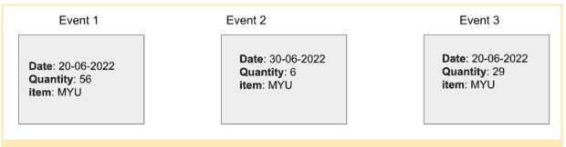

# 事件流和事件源:主要区别

> 原文：<https://thenewstack.io/event-streaming-and-event-sourcing-the-key-differences/>

客户喜欢在事件发生时知道它们。在客户订购了一双新鞋并收到购买的货物已经发货的通知后，在货物到达之前获得最新的发货状态更新可以改善整体客户体验。

 [大卫·迪鲁夫

David 是 DataStax 的流媒体开发者倡导者。在他的职业生涯中，他致力于企业销售、开发者宣传和开源支持。在肯塔基州的路易斯维尔，他是一个被马和威士忌包围的父亲和丈夫。](https://www.linkedin.com/in/ddieruf/) 

关于订单的更新是在[事件驱动架构](https://thenewstack.io/unified-event-driven-architecture-for-the-cloud-native-enterprise/) (EDA)中触发响应的事件。EDA 是一种软件设计，它对状态(事件)的变化做出反应，并使用去耦架构传输这些事件。

这种解耦的架构可以采用多种设计模式，如发布-订阅(pub-sub)模式，在这种模式下，生产者发布事件，订阅者观察事件，但两者都不依赖于对方。

事件流和事件源代表了组织支持其 EDA 的两种方式。

通过事件流，系统之间会有连续的数据流流动，数据表示使用发布-订阅模式广播的事件的新状态。另一方面，事件源将每个新事件存储在附加日志中。这作为包含事件和背景的时间顺序的真理的来源。

在 EDAs 中，事件源和事件流经常一起使用，但是区分这两者很重要，因为它们的工作方式非常不同。虽然事件流促进了系统之间更易访问的通信，但事件源通过在只附加日志中存储新事件来提供事件历史。

在这里，我们将讨论这两种事件协调方法，并为每种方法提供一些用例。

## 事件流:解耦您的服务

事件流采用发布-订阅方法来实现系统间更易访问的通信。在发布订阅架构模式中，消费者订阅一个主题或事件，生产者发布这些主题供消费者消费。发布-订阅设计将发布者和订阅者系统解耦，使得单独扩展每个系统更加容易。

发布者和订阅者系统通过像 [Apache Pulsar](https://dtsx.io/3KgIWl4) 这样的消息代理进行通信。当状态改变或事件发生时，生产者将数据(数据源包括 web 应用程序、社交媒体和物联网设备)发送给经纪人，之后经纪人将事件关联到订户，订户然后消费该事件。

事件流包括来自应用程序、数据库、传感器和物联网设备等来源的连续数据流。事件流采用流处理，其中数据在生成期间经过处理和分析。这种快速处理转化为更快的结果，这对于采取行动的时间窗口有限的企业来说是有价值的，就像任何实时应用程序一样。

事件流为企业提供了几个优势；以下是一些例子:

### 改善客户体验

事件流和处理为组织提供了丰富客户体验的能力。例如，下晚餐订单的客户可以获得即时状态更新，通知他们送货车辆何时正在前往他们的位置，或者是否已经到达。这种增强的客户体验转化为更多的信任、更好的评论和更高的收入。

### 风险缓解

PayPal 等应用程序和其他金融技术应用程序可以利用事件流来提供在线欺诈检测，从而通过实时监控来增强安全性。欺诈算法使用预测分析来测试事件(购买或交易)的环境，以检测与标准的偏差(异常值)。如果系统检测到异常或异常事件，它会停止交易或阻止卡完成交易。

### 降低运营成本

通过分析事件流，工业工具可以记录性能和健康指标，以评估设备健康状况。这一特性使组织能够在机器完全损坏之前对其进行预测性维护，因为这将增加维修成本。例如，在制造业中，组织可以使用 Pulsar 流来聚集和处理来自机器参数(如温度或压力)的数据。工程师可以设置机器的最高温度，并在超过该温度时发出警报。机器操作员可以在更昂贵的问题发生之前进行检查和维护。

## 如何使用事件流？

事件流对于传输大量数据并依赖快速、可操作的洞察的企业和应用至关重要。这些应用包括电子商务、金融交易和物联网设备。

金融交易应用程序使用事件流来发布客户希望立即采取行动的时间敏感事件。例如，用户可以订阅后端服务，发送特定事件的更新，如股票价格的变化，以便及时做出决策。

事件流在处理支付和其他交易(以及阻止欺诈交易)的金融系统中也有风险和欺诈检测应用。定义的欺诈算法可以通过在数据生成后立即分析数据来阻止可疑交易。

## 事件来源:有序历史记录

事件源将数据作为事件存储在附加日志中。该过程在事件对象中捕获应用程序状态的每一个变化，并将这些事件对象按时间顺序存储为日志。通过事件源，事件存储将业务实体的状态编译为序列中的一个事件，状态的变化(如新订单或订单的取消)会将最新的状态附加到事件列表中。

为了使事件源有效工作并消耗最少的资源，每个事件对象应该只包含必要的细节。这样可以最小化存储空间，并防止在处理数据时使用宝贵的资源，从而导致不可操作的见解。

事件存储编译业务事件和上下文；将长流附加到事件日志会快速消耗数据库存储。仅将必要的事件上下文作为事件对象的一部分，有助于释放存储空间，以添加多个事件日志，从而推动可操作的洞察。

在这种情况下，组织可以选择使用“快照”来帮助优化性能。快照支持存储实体的当前状态。了解当前状态可能只涉及提取快照和重新创建时间线来了解最新状态。

让我们来说明这一点。假设我们有一个数据库，它记录了电子商务商店中最近的商品:

大多数数据库只存储当前状态。如果我们要解释我们是如何得出 91 美元的最终股票价值的，那么我们就无法确定或清楚地知道我们是如何得出这一价格的。Event sourcing 在日志中记录每一个状态变化，使得跟踪事件历史以进行根本原因分析和审计成为可能。

上图说明了事件源，并显示了三个事件，每个事件都包含数据库的日期、数量和项目类型。在这种情况下，我们可以追溯我们是如何得出最终金额 91 的。

上图说明了事件源，并显示了三个事件，每个事件都包含数据库的日期、数量和项目类型。在这种情况下，我们可以追溯我们是如何得出最终金额 91 的。

医疗保健组织是监管最严格的行业之一，不断变化的法规保护着客户信息。他们需要灵活的存储解决方案，能够适应不断增长的数据需求，同时保持从传统系统到新技术的轻松迁移。

通过采用事件存储作为其唯一的真实来源，医疗保健系统可以依靠事件日志的不变状态来了解其数据的实际状态，并通过采用实时流处理来做出有价值的预测。零售和电子商务企业可以通过分析大型、持久的活动商店来更好地了解他们的客户，这有助于他们创造更个性化的客户体验。

## 事件流和事件源之间的差异

事件流和事件源之间有一些相似之处。首先，每种事件协调方法都采用了解耦的微服务架构，这有助于提高可伸缩性和性能。

尽管事件存储和流在状态持久性方面有所不同，但它们在提供应用程序的当前事件状态以用于分析和推动业务决策方面是必不可少的。此外，这两种事件协调方法都拥有持久存储能力，尽管事件存储通常比事件流提供更长的扩展存储。

在这里，让我们更深入地研究事件流和事件源之间的一些关键差异。

## 最佳化

通过将发布者与订阅者分离，并使高性能发布数百万条消息变得容易，事件流最适合于在动态数据之间进行更易访问的通信。另一方面，事件源通过将实体的每个新状态存储在仅附加日志中来帮助建立事件历史。

## 数据传送

对于事件源，数据是静态的，因为事件是不可变的。然而，事件流涉及的数据总是在传输中，在数据库、传感器和应用程序等多个存储系统之间传递。

## 包扎

事件流和事件源有助于在事件驱动的架构中协调事件。尽管它们的用途和价值不同，但它们可以很好地协同工作，帮助构建一个持久的高性能应用程序。

事件流使用解耦的发布-订阅模式从各种来源连续传输数据，这有助于推动业务决策。不幸的是，尽管事件流工具可能拥有持久存储，但它们并不是为长时间存储消息而设计的，因为持久存储功能只能持续足够长的时间，以使它们具有容错性和弹性。

人们可以将事件源视为事件流的子集或组件。事件源以有序的方式将新事件添加到当前事件列表中。它还可以作为可靠审计的事实来源，并随时获取事件的当前状态。事件源对于具有严格监管和审计要求的金融行业以及用于跟踪和构建事件当前状态的可靠存储来说至关重要。相比之下，事件流在金融交易应用程序中至关重要，在这些应用程序中，操作有时间限制窗口，并且需要立即操作。

埃达不一定是目的地。这是一条可以遵循的道路，推动某些系统性能和特征。例如，事件源分离了一组微服务，因此它们变得不那么相互依赖。这推动了弹性和更容易的迭代，以及其他好处。通过与事件源相结合，微服务获得了重放事件的能力，以及对给定功能(如用户档案)的更改的完整日志。这种架构在现有系统中开辟了新的可能性。

<svg xmlns:xlink="http://www.w3.org/1999/xlink" viewBox="0 0 68 31" version="1.1"><title>Group</title> <desc>Created with Sketch.</desc></svg>