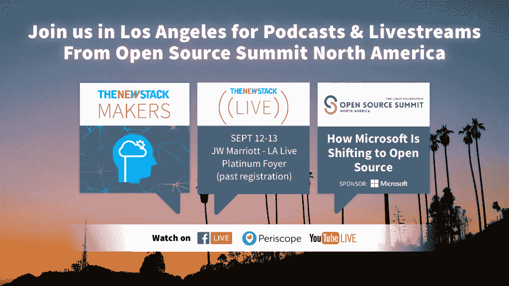

# Eventador 应用实时数据定位飓风哈维的受害者

> 原文：<https://thenewstack.io/eventador-applies-real-time-data-locating-victims-hurricane-harvey/>

在将数据应用于紧迫问题的一个及时的例子中，总部位于德克萨斯州奥斯汀的 Eventador 建立了一个基于其平台的实时系统，提供实时地理定位，以帮助飓风哈维的受害者，飓风哈维上个月底在德克萨斯州和美国南部其他州造成了巨大损失。

该公司的处理系统捕捉人们在 Twitter 上输入地址的求助电话，并在地图上为公民响应者或其他人绘制他们的位置。该系统考虑到重复，映射地址，并可以为人们提供一种被标记为“安全”的方式这一切都在几秒钟内完成。

联合创始人兼首席执行官[肯尼·戈尔曼解释说:“基本上，人们被困在没有帮助的情况下，我们很生气，不知道我们能做什么。](https://github.com/kgorman)

“我们工作了几天，只是为了停下来，真正去那里帮助人们使用链锯和手工工具。公平地说，在这一点上，它确实是概念验证的质量，但它确实有效。只是需要更多的能量让它成为人们依赖的东西。…这是全球规模的，是像我们这样的流数据平台的强大力量的一个很好的例子。”

该公司计划很快开源一些组件，比如地图生成器。

戈尔曼和联合创始人[埃里克·毕比](https://twitter.com/erikbeebe?lang=en)在将他们的公司 [Object Rocket](http://www.objectrocket.com) 出售给 Rackspace 后，看到大数据项目的客户仍在苦苦挣扎。

戈尔曼说:“我们在 2015 年年中左右有了这种顿悟，当时我们还在 Object Rocket 和 Rackspace，我们看到客户试图或未能通过 iOS 应用程序、桌面应用程序、仪表盘、物联网或传感器快速向他们的客户提供数据。”

因此，他们在去年创建了 Eventador，其理念是他们可以提供更好的方式来交付企业越来越多地使用的实时流工作负载。早在 21 世纪初，两人就曾在 PayPal 和易贝共事。Object Rocket 提供托管的 MongoDB 和 ElasticsearchRackspace 在 2013 年收购了它。

“我们在这些巨大的工作量上取得了成功，”戈尔曼说。Beebe 为合作伙伴带来了存储专业知识和 Gorman 数据库知识。

他描述了他们冒险背后的“啊哈”时刻:

“我在伦敦与一群首席技术官讨论数据问题。我认为[问题]是 Hadoop 没有这个。或者这个数据库没有那个。

“但问题是，他们知道他们的竞争对手正在构建比他们更能实时传递数据的系统。他们担心(竞争对手的)应用会因此对客户更具吸引力，”他表示。

“这完全是关于交付时间，而不是关于您有多少数据，或者您是否存储了来自日志的所有数据，或者其他什么数据。关键是你能以多快的速度获得有意义的数据，从而打造出比竞争对手更具吸引力的产品。”

他们很早就决定，LinkedIn 开源的技术 Apache Kafka 必须成为他们服务的支柱。

在一本关于卡夫卡的[初级读本](https://thenewstack.io/apache-kafka-primer/)中，分析师[贾纳基拉姆·MSV](https://thenewstack.io/author/janakiram/)说:

*“Kafka 的设计初衷是处理数百万个快速连续生成的消防水管式事件。它保证了低延迟，向消费者“至少一次”传递消息。Kafka 还支持为离线消费者保留数据，这意味着数据可以实时或离线处理。”*

戈尔曼说，卡夫卡可以为人们服务，只需对它进行修补，就能让系统处理数百万条信息。

“如果您接受一个包检查类型的工作负载或制造工作负载，从传感器中提取数据，这些东西可能以 10 赫兹的速度运行，实际上每秒钟有数千条消息。我们的目标是提供一个更具可扩展性和健壮性的企业级平台。我们希望迎合构建大、大、大数据基础设施的人们。”

大约在同一时期，雷德蒙克注意到卡夫卡越来越受欢迎:

“随着物联网、移动和游戏等领域的新工作负载产生大量且不断增加的数据流，开发人员一直在寻找一种能够以一致和连贯的方式轻松消费数据的机制。这正是卡夫卡适合的地方。”

但是戈尔曼承认卡夫卡不是全部的答案。因此，该公司正在为计算添加实时处理技术 [Apache Flink](https://thenewstack.io/apache-flink-addresses-continuous-stream-processing/) 。它允许客户构建实时处理、过滤和聚合数据的应用程序。这方面仍处于测试阶段，预计将很快正式发布。

Eventador 提供托管服务——戈尔曼说，这个五人团队高度重视支持——“但这不仅仅是安装软件和说，‘如果你有问题，打电话给我们’，”他说。云服务必须为客户提供比他们自己安装更多的东西。

它使用户只需点击几下鼠标就可以构建和部署管道到 AWS。加入 Azure 和谷歌云的计划也在进行中。Jupyter 笔记本允许简单的分析和实验，它使用 [Presto](https://prestodb.io/) 分布式 SQL 引擎进行实时分析、汇总、过滤和报告。

他说，Eventador 提供了完整的指标和监控基础设施，Kafka 提供的安全增强功能，云和可扩展性增强功能。

戈尔曼说，Flink 已经包装了一个“酷”的 GitHub 集成。

他描述了[项目](https://maven.apache.org/)组件，该组件允许开发人员通过 Github 轻松地将现有的软件开发工作流集成到 Flink 项目中。Eventador 处理构建过程(通常是 [Maven](https://maven.apache.org/) )和部署过程的所有复杂性。

该公司的客户包括网络供应商 [Mantis Networks](http://www.mantisnet.com/) 和 [NewKnowledgeAI](http://newknowledge.io/) ，这是一家总部位于奥斯汀的公司，将人工智能应用于认知安全和其他用例。

戈尔曼承认他的小公司面临着激烈的竞争。有 Databricks 和 IBM 支持的整个 Hadoop/Spark 生态系统。有 Cloudera 和 Hortonworks。

还有亚马逊的 [Kenesis](https://aws.amazon.com/kinesis/) 。不要忘记[汇合](https://www.confluent.io/)，来自最初写卡夫卡的一些人。戈尔曼说，Confluent 既是合作伙伴，也是竞争对手，尽管 Eventador 正在增加卡夫卡之外的技术。

另一家从事企业级实时数据处理的初创公司 Streamlio 由 Twitter 和雅虎的资深人士创建，雇佣了 [Apache Pulsar](https://github.com/apache/incubator-pulsar) (孵化)、Heron 和 [Apache 簿记员](http://bookkeeper.apache.org/)。

特写图片由美国陆军第一上尉·扎卡里西 [CC0](https://creativecommons.org/publicdomain/zero/1.0/) 授权。

<svg xmlns:xlink="http://www.w3.org/1999/xlink" viewBox="0 0 68 31" version="1.1"><title>Group</title> <desc>Created with Sketch.</desc></svg>