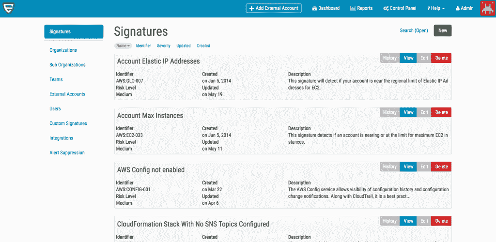

# Evident.io 专注于配置检查，以自动化云安全、合规性

> 原文：<https://thenewstack.io/evident-io-zeros-configuration-checks-automate-cloud-security-compliance/>

在为 Adobe Systems 建立了云之后，Evident.io 的联合创始人 Tim Prendergast 和 Justin Lundy 开始创建一个各种规模的公司都可以访问的云原生安全平台。

Evident 首席执行官普伦德加斯特在接受关注安全的 [IT-Harvest](http://it-harvest.com/) 首席研究分析师 [Richard Stiennon](https://twitter.com/stiennon) 采访时解释说，这不可能仅仅是阻止不熟悉的 IP 地址或使用基于网络的代理来监控流量。

“您拥有这些丰富的服务，包括存储、数据仓库、工作流管理、实时流处理，但这些服务都没有 IP 地址。因此，你不能在它们上面放置一个基于主机的代理，你不能在它们前面放置一个 IDS 类型的产品，你需要一些东西通过 API 接口并带来这些功能，这些服务在那里生存和管理，并以同样的方式提供安全上下文，”Prendergast 说。

目前，Evident 只专注于支持 Amazon Web Services 上的客户端，它提供持续的监控和安全自动化，同时执行安全性和合规性策略。Evident 客户解决方案副总裁 John Martinez 表示，其对控制平面的关注是 Evident 的最大优势。

当时市场上没有关于云安全标准的共识，该公司于 2013 年成立，基于 [AWS 安全最佳实践](https://aws.amazon.com/whitepapers/aws-security-best-practices/)白皮书。马丁内斯说，他是 AWS 和互联网安全中心的委员会成员，该中心在一年多前发布了 CIS AWS 基础基准，这是 AWS 的一套安全配置最佳实践。

"没有要安装的代理。不需要打开任何网络端口。没有要安装的边车设备。它完全由 API 驱动。我们使用云提供商的 API 数据，并分析其安全配置，”他说。

通过持续监控，Evident 可以评估超过 50 项 AWS 服务的风险，并将数据汇总到一个仪表盘或数据流中，该仪表盘或数据流可轻松传输给合作伙伴，如 [Splunk](http://www.splunk.com) 或 [Sumo Logic](https://www.sumologic.com/) 进行进一步分析。总之，它执行了 110 多项安全最佳实践检查。马丁内斯表示，这些分析基本上是配置检查。

配置错误被认为是越来越多备受瞩目的漏洞的原因，包括 MongoDB 错误[暴露了 9340 万墨西哥选民的个人信息](http://www.csoonline.com/article/3060204/security/mongodb-configuration-error-exposed-93-million-mexican-voter-records.html)，以及[HealthCare.gov](http://www.csoonline.com/article/2602964/data-protection/configuration-errors-lead-to-healthcare-gov-breach.html)的漏洞，以及[凯蒂猫母公司三丽鸥](http://www.csoonline.com/article/3155528/security/hello-kitty-database-leaked-to-the-web-3-3-million-fans-affected.html)的数据库维护。

Martinez 解释说，Evident 要求客户提供对其 AWS 环境的访问权限。客户在其帐户中创建了一个第三方角色，并承担了这个角色

“我们要求客户给我们一个 AWS 管理的安全审计政策，这样我们就可以要求 AWS 提供我们需要的权限，”他说。

使用 API 元数据，它列出并描述在客户帐户中发现的每个资源，然后在此基础上运行其安全分析引擎。

除了实时监控之外，它还构建了每小时报告，这些报告进入 SaaS 平台内置的仪表板。

“在我们生成的警报中，我们实际上做了相当多的艰苦研究，”马丁内斯说。“我们不仅会研究我们需要检查什么，还会提供有指导的补救措施。这里是要检查的内容，这里是如何解决这个问题，我们也给他们 API 元数据作为其中的一部分。但是，这些警报可以传输到外部系统。”

它与 Splunk 和 Sumo Logic 上的逻辑、 [Slack](https://slack.com/) 上的聊天、以及 [JIRA](https://www.atlassian.com/software/jira) 和[page duty](https://www.pagerduty.com/)集成。马丁内斯说，它也可以用于 CI/CD 应用。

该技术的一个用例是 AWS 中的模板化部署。用户可以部署模板，创建基础设施的子集，运行明显的报告，然后以编程方式检查安全设置是否正确。

在持续方面，它提供了安全标准的实施。例如，通过集成，客户可以使用 AWS Lambda 来自动修复特定问题。

例如，在合规性方面，它可以帮助客户测试 [AWS 客户责任合规性文档中针对 PCI 合规性](https://aws.amazon.com/compliance/pci-dss-level-1-faqs/)规定的客户责任控制。然而，马丁内斯指出，这些只是合规性的基础设施测试。

根据 [RightScale 的 2016 年云状况报告](https://www.rightscale.com/lp/state-of-the-cloud)，即使企业工作负载正在向云转移，私有云的使用也比公共云增长得更快。调查发现，57%的受访者使用 AWS。它发现，平均而言，公司使用三个公共云和三个私有云，并且对管理混合云的兴趣越来越大。

https://youtu.be/Nj6Qepg_JBk

马丁内斯说，许多企业都有特定的业务线或工作集，这些业务线或工作集原本就在云中，与数据中心或遗留系统无关，在这些情况下，Evident 很快就赢得了客户。它还提供了该平台的自托管版本，组织可以在自己的安全 AWS 环境中部署和管理该版本。

然而，在过去的一年中，金融部门一直在推动与遗留系统和数据中心的联系，因此它也一直在混合环境中工作。

考虑到拓展业务的需要，Evident 计划在 2017 年上半年将其服务扩展到 Azure 环境，随后是谷歌和其他云。它最近通过 [AWS Cloud Trail](https://aws.amazon.com/cloudtrail/) 增加了用户属性功能，这是一种记录 API 调用的服务，因此它不仅可以揭示环境中的问题，还可以揭示谁做了这件事，他们从哪里做的等等。

马丁内斯说:“我们认为这就像一场猜谜游戏。

他说，该公司还计划进一步深入分析和自动化领域。

451 Research 在一份关于该公司的报告中表示，管理平面或“云控制台”的安全性“不能低估”。

虽然使用代理的云安全方法提供了与云和架构无关的优势，但有大量外部因素可能会影响这些实例的安全状况以及它们用于通信的虚拟网络。

“这些元素只能通过管理层来监控和解决，这可以说是云基础架构的关键特性之一，使其对企业如此灵活和有吸引力，”它说。

它将 AWS 值得信赖的顾问列为可能是 Evident 的主要竞争对手，而[的助手也在竞争之列。它说，其他供应商如](https://dome9.com/) [CloudCheckr](http://cloudcheckr.com/) 、 [New Relic](https://newrelic.com/) 、Cloudyn、 [Datapipe](https://www.datapipe.com/) 和许多其他供应商都有不同程度的重叠。

通过 Pixabay 的特征图像。

<svg xmlns:xlink="http://www.w3.org/1999/xlink" viewBox="0 0 68 31" version="1.1"><title>Group</title> <desc>Created with Sketch.</desc></svg>