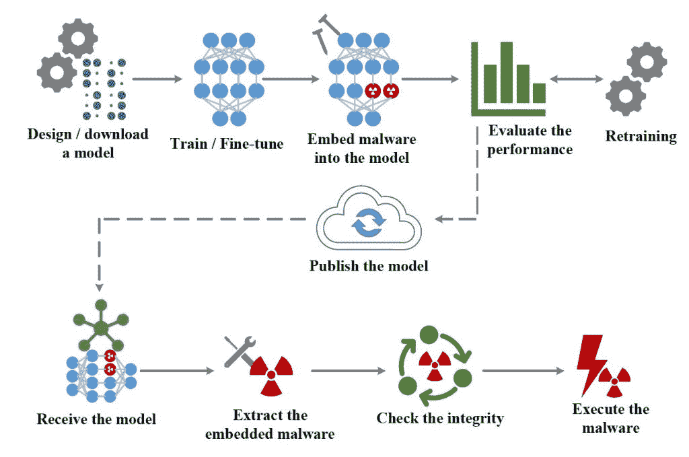

# EvilModel:隐藏在深度学习模型中未被检测到的恶意软件

> 原文：<https://thenewstack.io/evilmodel-malware-that-hides-undetected-inside-deep-learning-models/>

来自加州大学圣地亚哥分校和伊利诺伊大学 T2 分校的一组研究人员发现，也有可能将恶意软件隐藏在深度学习神经网络中，并将其发送给毫无防备的目标，而传统的反恶意软件不会检测到它。

毫不奇怪，这项新工作强调了需要更好的网络安全措施来抵消和保护用户免受人工智能辅助攻击的真实可能性，特别是在个人和企业在日常活动中越来越依赖人工智能的情况下。

在一篇概述 [EvilModel](https://arxiv.org/pdf/2107.08590.pdf) 的预印论文中——该团队在深度学习神经网络中嵌入恶意软件的不祥命名方法——该团队发现，可以用恶意软件感染深度学习模型，并让它欺骗反恶意软件检测器，而不会显著影响模型的性能。

为了实现这一点，该团队使用了一种被称为[隐写术](https://en.wikipedia.org/wiki/Steganography)的方法，即系统中的数据片段被替换为可能具有隐藏信息或功能的其他数据片段。为了隐藏他们的恶意软件样本，该团队首先将恶意软件解构为更小的片段，以便每个片段只有 3 个字节——小到足以逃避检测。

检测模型的这些改变部分变得更加困难，因为深度学习人工智能模型是使用多层人工神经元构建的，而这些人工神经元又可以由数百万个层间互连的参数组成。一般像 PyTorch 和 TensorFlow 这样的主流深度学习框架都是用 4 字节长的浮点数来存储参数值。正如该团队发现的那样，可以用一段恶意代码替换 3 个字节的参数，这样恶意的有效载荷就可以被嵌入，而不会显著影响模型的性能。

“当神经元被恶意软件字节取代时，模型的结构保持不变，”该团队指出。“随着恶意软件在神经元中被分解，其特征不再可用，这可以逃避普通反病毒引擎的检测。由于神经网络模型对变化具有鲁棒性，因此在性能上没有显著损失。”

EvilModel 的工作流

该团队的实验表明，在其深度学习模型中可能隐藏至少 36.9 兆字节的恶意软件，准确率仅下降 1%。特别是，该团队的实验专注于[卷积神经网络](https://towardsdatascience.com/a-comprehensive-guide-to-convolutional-neural-networks-t)(CNN)，这是一种深度学习模型，用于[的广泛应用](https://thenewstack.io/facial-recognition-aigorithm-re-trained-to-recognize-faraway-galaxies/)，包括图像分类、图像处理和图像识别。

在这项研究中，该团队在一系列流行的 CNN 上测试了他们的方法，包括[、AlexNet](https://towardsdatascience.com/alexnet-the-architecture-that-challenged-cnns-e406d5297951) 、VGG、Resnet、Inception 和 Mobilenet。CNN 是恶意软件秘密传送的理想选择，因为它们包含许多不同类型的层，以及数百万个参数。此外，许多 CNN 是预先训练好的，这意味着一些用户可能在不知道模型中嵌入了什么的情况下下载它们。

“事实上，我们发现由于网络层中的冗余神经元，一些神经元的变化对神经网络的性能几乎没有影响，”该团队解释道。此外，由于模型的结构不变，隐藏的恶意软件可以逃避反病毒引擎的检测。因此，恶意软件可以通过修改神经元来隐蔽和逃避地嵌入和传递到目标设备。”

虽然这种情况足够令人担忧，但该团队指出，攻击者也可以选择在 GitHub 等在线公共存储库上发布受感染的神经网络，在那里可以大规模下载。此外，攻击者还可以通过所谓的[供应链攻击](https://thenewstack.io/the-challenges-of-securing-the-open-source-supply-chain/)，或价值链或第三方攻击，部署更复杂的交付形式。这种方法包括将嵌入恶意软件的模型伪装成自动更新，然后下载并安装到目标设备上。这是毁灭性的，而且奏效了:正是这种攻击方法导致了 2020 年美国政府大规模数据泄露。

然而，研究小组指出，只要受感染的神经网络层没有“冻结”，即在下一轮微调期间这些冻结层中的参数没有更新，让嵌入的恶意软件完好无损，就有可能在下载后通过重新训练和微调模型来摧毁嵌入的恶意软件。

“对于专业人员来说，可以通过微调、修剪、模型压缩或其他操作来改变神经元的参数，从而打破恶意软件的结构，防止恶意软件正常恢复，”该团队说。

此外，另一种确保深度学习模型完整性的可能方法是仅从可信来源下载它们，并实施改进的系统来验证更新，以避免供应链攻击。最终，该团队指出，围绕机器学习开发管道，对提高安全性和更好的实践的需求越来越大。

“这篇论文证明了神经网络也可以被恶意利用。随着 AI 的普及，AI 辅助攻击将会出现，并为计算机安全带来新的挑战。网络攻防是相互依存的。我们相信对抗人工智能辅助攻击的对策将在未来得到应用，因此我们希望提出的场景将有助于未来的保护工作。”

<svg xmlns:xlink="http://www.w3.org/1999/xlink" viewBox="0 0 68 31" version="1.1"><title>Group</title> <desc>Created with Sketch.</desc></svg>